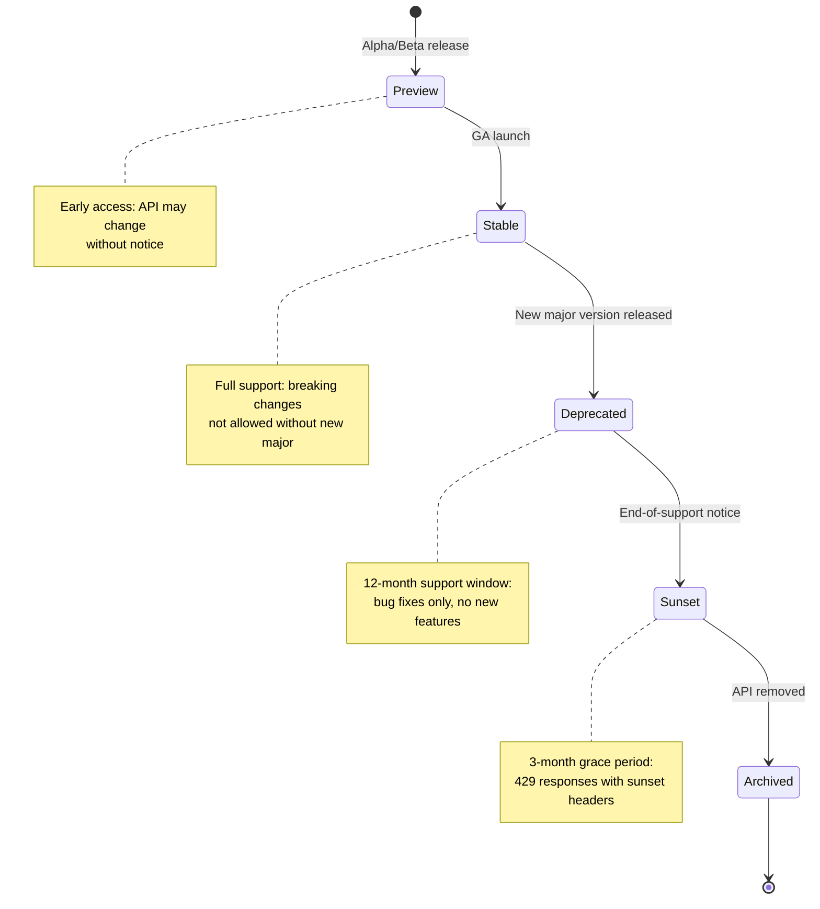
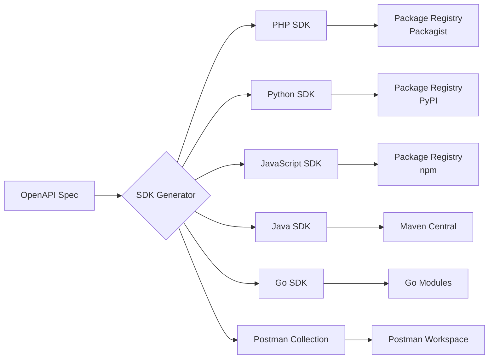

# API Versioning Strategy

> **Navigation:** [Rate Limiting Strategy](rate-limiting-strategy.md) | [Developer Portal](developer-portal.md)
>
> **Applies To:** BRIDGE-01 (External API — All Endpoints)
>
> **Cross-Reference:** [ADR-004 Routing Strategy](../architecture/decisions/ADR-004-routing-strategy.md) | [Developer Portal](developer-portal.md)
>
> **Status:** 🔧 Design

---

## 1. Architecture Decision Record: Versioning Strategy

### ADR-006: API Versioning Approach

#### Status
**Accepted**

#### Context
DGLab's external API requires a versioning strategy that:
- Allows introducing breaking changes without disrupting existing consumers
- Provides clear communication about version lifecycle
- Integrates with OpenAPI documentation and SDK generation
- Minimises complexity for both API maintainers and consumers

The evaluation identified that without an explicit versioning strategy, consumers cannot determine expected support windows or migration paths between versions.

#### Decision
**URL path versioning (`/api/v1/`, `/api/v2/`) is adopted** as the primary versioning mechanism.

Key implementation details:
- Version is embedded in the URL path as `/api/v{major}/`
- Each version has its own OpenAPI specification at `/api/v{major}/openapi.yaml`
- A `/api/versions` discovery endpoint lists all active versions and their statuses
- Internal routing dispatches to version-specific controllers via the Bridge

#### Rationale
| Criterion | URL Path | Header (`Accept: vnd.dglab.v1+json`) | Query Param (`?version=1`) | SemVer API |
|-----------|----------|--------------------------------------|---------------------------|------------|
| **Discoverability** | Excellent — visible in every request log | Poor — hidden in headers | Good — visible in URLs | Good |
| **Caching simplicity** | Excellent — cache key includes path | Good — varies by header | Excellent | Excellent |
| **Client implementation** | Trivial — just change path | Moderate — custom header parsing | Trivial | Moderate |
| **API gateway support** | Universal | Varies by gateway | Universal | Limited |
| **Documentation clarity** | Excellent — versioned docs are separate | Poor — one doc with version variance | Good | Good |
| **OpenAPI integration** | Native — separate spec per version | Custom — header variance | Native | Complex |

URL path versioning wins on discoverability, simplicity, and universal tooling support.

#### Consequences
- **Positive:** Consumers can immediately see which version they're using from any request log
- **Positive:** CDN and caching layers work naturally without header-based vary rules
- **Negative:** URL pollution — all endpoints carry a version prefix
- **Negative:** Older versions must maintain separate controller code paths
- **Mitigation:** API version adapter layer minimises code duplication between versions

#### Alternatives Considered
1. **Header-based versioning** (`Accept: application/vnd.dglab.v2+json`) — Rejected because version is not visible in request logs, proxies, or browser dev tools; increases debugging friction
2. **Query parameter versioning** (`?version=2`) — Rejected because it conflicts with application query parameters and is easily omitted accidentally
3. **SemVer API (URL + header)** — Rejected due to complexity; consumers only care about major version compatibility

---

## 2. Version Lifecycle

### 2.1 Version Stages



### 2.2 Version Timeline

```
Version  Timeline
────────────────────────────────────────────────────────────────────
v0       ─────Preview─────┐
v1       ██████████████████████████████████████████████████████████
                          │                  │                    │
                          │                  │                    │
v2                         ───Preview───████████████████████████████
                                         │        │              │
                                         │        │              │
v3                                            ──Preview───████████
                                                       │
                                                       │
         ────────┬───────┬───────┬───────┬───────┬───────┬───────►
         Q1 2025 Q2 2025 Q3 2025 Q4 2025 Q1 2026 Q2 2026 Q3 2026

Legend:
████ = Stable
──── = Preview/Deprecated/Sunset
```

### 2.3 Deprecation Policy

| Stage | Duration | Actions |
|-------|----------|---------|
| **Stable** | Indefinite (minimum 12 months after successor's stable release) | Full support: features, bug fixes, security patches |
| **Deprecated** | 12 months | Bug fixes only; deprecation headers added to all responses; migration guide published |
| **Sunset** | 3 months | 429 responses contain `X-API-Deprecated: true` and `Sunset: <date>` headers; no functional changes |
| **Archived** | Permanent | API returns 410 Gone; documentation archived at `/docs/archived/` |

### 2.4 Version Status Endpoint

```php
<?php
namespace Sovereign\Bridge\Versioning;

class VersionDiscoveryController
{
    /**
     * GET /api/versions — list all API versions and their status.
     */
    public function index(): array
    {
        $versions = [];

        foreach (app('bridge')->getActiveVersions() as $version) {
            $versions[] = [
                'version' => $version->label,
                'status' => $version->status->value,     // preview | stable | deprecated | sunset
                'base_url' => "/api/{$version->label}",
                'openapi_url' => "/api/{$version->label}/openapi.yaml",
                'release_date' => $version->releaseDate->format('c'),
                'stable_since' => $version->stableSince?->format('c'),
                'deprecated_at' => $version->deprecatedAt?->format('c'),
                'sunset_at' => $version->sunsetAt?->format('c'),
                'archived_at' => $version->archivedAt?->format('c'),
                'changelog_url' => "/docs/changelog/v{$version->label}",
                'migration_url' => $version->isDeprecated()
                    ? "/docs/migrations/v{$version->label}-to-v{$version->next->label}"
                    : null,
            ];
        }

        return ['data' => $versions];
    }
}
```

### 2.5 Response Headers for Deprecation Communication

```php
<?php
namespace Sovereign\Bridge\Versioning;

class VersionDeprecationHeaders
{
    /**
     * Attach deprecation headers to every response for deprecated versions.
     */
    public function attachDeprecationHeaders(Response $response, string $apiVersion): Response
    {
        $version = app(VersionRegistry::class)->find($apiVersion);

        if (!$version || $version->status === VersionStatus::Stable) {
            return $response;
        }

        if ($version->status === VersionStatus::Deprecated) {
            $response->headers->set('X-API-Deprecated', 'true');
            $response->headers->set('X-API-Deprecated-Reason',
                "Version {$version->label} is deprecated. " .
                "Please migrate to v{$version->next->label}. " .
                "Support ends: {$version->sunsetAt->format('Y-m-d')}"
            );
            $response->headers->set('Sunset', $version->sunsetAt->format('D, d M Y H:i:s T'));
            $response->headers->set('Link',
                "</docs/migrations/v{$version->label}-to-v{$version->next->label}>; rel=\"migration\""
            );
        }

        if ($version->status === VersionStatus::Sunset) {
            $response->headers->set('X-API-Deprecated', 'true');
            $response->headers->set('X-API-Sunset', 'true');
            $response->headers->set('Sunset', $version->sunsetAt->format('D, d M Y H:i:s T'));
            $response->headers->set('Retry-After',
                $version->sunsetAt->diffInSeconds(now())
            );
        }

        return $response;
    }
}
```

---

## 3. Migration Guides

### 3.1 v1 → v2 Migration

#### Breaking Changes

| Change | v1 | v2 | Rationale |
|--------|----|----|-----------|
| Pagination format | `{ "page": 1, "per_page": 25, "total": 100 }` | `{ "meta": { "page": 1, "perPage": 25, "total": 100, "totalPages": 4 } }` | Consistent pagination across all endpoints (similar to JSON:API) |
| Error response format | `{ "error": "message" }` | `{ "error": { "code": "VALIDATION_ERROR", "message": "...", "details": [...] } }` | Structured errors with machine-readable codes |
| Rate limit headers | `X-Rate-Limit-*` | `X-RateLimit-*` (standardised) | Industry-standard naming (GitHub, Stripe compatible) |
| Date/time format | ISO 8601 with timezone | ISO 8601 UTC (Z suffix required) | Simplifies client parsing |
| Webhook payload format | Flat JSON | Envelope `{ "id": "evt_...", "type": "...", "data": {...}, "created": ... }` | Standardised webhook structure |
| Sorting parameter | `sort=field` | `sort[field]=asc\|desc` | Allows multi-field sorting |

#### Upgrade Script

```php
<?php
namespace Sovereign\Bridge\Versioning\Migrations;

/**
 * Utility to help consumers migrate pagination handling.
 */
class V1ToV2MigrationHelper
{
    /**
     * Transform v1-style paginated response to v2 format.
     * Useful during migration when consumers want to dual-read.
     */
    public static function paginationV1toV2(array $v1Response): array
    {
        return [
            'data' => $v1Response['data'],
            'meta' => [
                'page' => $v1Response['page'],
                'perPage' => $v1Response['per_page'],
                'total' => $v1Response['total'],
                'totalPages' => (int) ceil(
                    $v1Response['total'] / $v1Response['per_page']
                ),
            ],
            'links' => [
                'first' => self::buildPageLink(1, $v1Response['per_page']),
                'prev' => self::buildPageLink(
                    max(1, $v1Response['page'] - 1), $v1Response['per_page']
                ),
                'next' => self::buildPageLink(
                    min(self::totalPages($v1Response), $v1Response['page'] + 1),
                    $v1Response['per_page']
                ),
                'last' => self::buildPageLink(
                    self::totalPages($v1Response), $v1Response['per_page']
                ),
            ],
        ];
    }
}
```

### 3.2 Migration Timeline Template

| Date | Milestone | Consumer Action |
|------|-----------|----------------|
| 2025-Q1 | v2 stable released | Start planning migration; v1 still fully supported |
| 2025-Q2 | v2 GA; deprecation headers added to v1 | Begin migration to v2; test against v2 sandbox |
| 2025-Q3 | v1 enters Deprecated stage | Complete migration to v2; v1 receives bug fixes only |
| 2026-Q1 | v1 enters Sunset stage | All v1 requests get Sunset headers; v1 may return 429 under load |
| 2026-Q2 | v1 archived; returns 410 Gone | Verify no remaining v1 dependencies |

### 3.3 Migration Checker Tool

```php
<?php
namespace Sovereign\Bridge\Versioning\Migrations;

class MigrationChecker
{
    /**
     * Check if a consumer is still using deprecated API features.
     * Returns a report showing which deprecated patterns are in use.
     */
    public function checkConsumerUsage(string $apiKey): array
    {
        $usage = app('audit.log')
            ->query()
            ->where('api_key', $apiKey)
            ->where('created_at', '>', now()->subDays(30))
            ->selectRaw('api_version, endpoint, method, count(*) as count')
            ->groupBy('api_version', 'endpoint', 'method')
            ->get();

        $issues = [];
        $deprecations = app(VersionRegistry::class)->getDeprecationMap();

        foreach ($usage as $row) {
            $issuesForEndpoint = [];

            if ($row['api_version'] === 'v1') {
                $issuesForEndpoint[] = 'End-of-life version — migrate to v2';
            }

            if (isset($deprecations[$row['endpoint']])) {
                $issuesForEndpoint[] = $deprecations[$row['endpoint']];
            }

            if (!empty($issuesForEndpoint)) {
                $issues[] = [
                    'endpoint' => "{$row['method']} {$row['endpoint']}",
                    'version' => $row['api_version'],
                    'request_count' => $row['count'],
                    'issues' => $issuesForEndpoint,
                ];
            }
        }

        return [
            'api_key' => $apiKey,
            'total_requests_analyzed' => $usage->sum('count'),
            'version' => app(VersionRegistry::class)->getCurrentStable()->label,
            'issues_found' => count($issues),
            'issues' => $issues,
            'migration_url' => 'https://docs.dglab.io/migrations/v1-to-v2',
        ];
    }
}
```

---

## 4. OpenAPI Integration

### 4.1 Versioned OpenAPI Specification Structure

```
api/
  v1/
    openapi.yaml
    paths/
      users.yaml
      content.yaml
      webhooks.yaml
    components/
      schemas.yaml
      parameters.yaml
      headers.yaml
  v2/
    openapi.yaml
    paths/
      users.yaml
      content.yaml
      webhooks.yaml
    components/
      schemas.yaml
      parameters.yaml
      headers.yaml
```

### 4.2 OpenAPI Spec Generation

```php
<?php
namespace Sovereign\Bridge\Versioning\OpenAPI;

class OpenAPIGenerator
{
    /**
     * Generate OpenAPI 3.1 spec for a given API version.
     * Called at deploy time to produce versioned API docs.
     */
    public function generate(string $version): array
    {
        $routes = app('bridge')->getVersionRoutes($version);
        $spec = $this->createBaseSpec($version);

        foreach ($routes as $route) {
            $pathItem = $this->routeToPathItem($route);
            $spec['paths'][$route->uri] = $pathItem;
        }

        // Add version-specific components
        $spec['components'] = $this->getComponents($version);

        // Add webhooks if available
        $webhooks = app('webhook.registry')->getWebhooksForVersion($version);
        if (!empty($webhooks)) {
            $spec['webhooks'] = $webhooks;
        }

        return $spec;
    }

    private function createBaseSpec(string $version): array
    {
        return [
            'openapi' => '3.1.0',
            'info' => [
                'title' => "DGLab API v{$version}",
                'version' => $version,
                'description' => "DGLab external API — version {$version}. " .
                    "See https://docs.dglab.io/versions for lifecycle information.",
                'contact' => [
                    'name' => 'API Support',
                    'url' => 'https://docs.dglab.io/support',
                    'email' => 'api@dglab.io',
                ],
            ],
            'servers' => [
                ['url' => "https://api.dglab.io/api/v{$version}", 'description' => 'Production'],
                ['url' => "https://sandbox.dglab.io/api/v{$version}", 'description' => 'Sandbox'],
            ],
            'security' => [
                ['ApiKeyAuth' => []],
            ],
            'tags' => [
                ['name' => 'Users', 'description' => 'User management'],
                ['name' => 'Content', 'description' => 'Content operations'],
                ['name' => 'Webhooks', 'description' => 'Webhook management'],
            ],
        ];
    }
}
```

### 4.3 SDK Generation Pipeline



### 4.4 API Version Router

The Bridge dispatches requests to version-specific controllers:

```php
<?php
namespace Sovereign\Bridge\Versioning;

class VersionRouter
{
    /**
     * Resolve the API version from the request path and route to the correct handler.
     */
    public function resolve(Request $request): array
    {
        $path = $request->path();

        // Match version prefix: /api/v{major}/...
        if (!preg_match('#^api/v(\d+)/#', $path, $matches)) {
            // Default to latest stable version for root /api
            $version = app(VersionRegistry::class)->getCurrentStable()->label;
            $newPath = str_replace('/api/', "/api/v{$version}/", $path);
            return ['redirect' => $newPath];
        }

        $requestedVersion = $matches[1];
        $version = app(VersionRegistry::class)->find("v{$requestedVersion}");

        if (!$version) {
            abort(404, "API version v{$requestedVersion} not found. " .
                "See /api/versions for available versions.");
        }

        if ($version->status === VersionStatus::Archived) {
            abort(410, "API version v{$requestedVersion} is archived. " .
                "See /docs/archived/v{$requestedVersion} for reference.");
        }

        // Attach version to request for downstream handler use
        $request->attributes->set('api_version', "v{$requestedVersion}");

        return ['version' => $version];
    }
}
```

---

## 5. Configuration Reference

```php
<?php
// config/apiversioning.php
return [
    'default_version' => env('API_DEFAULT_VERSION', 'v2'),

    'versions' => [
        'v0' => [
            'status' => 'archived',
            'release_date' => '2024-06-01',
            'archived_at' => '2025-06-01',
            'openapi_path' => base_path('api/v0/openapi.yaml'),
        ],
        'v1' => [
            'status' => 'deprecated',      // preview | stable | deprecated | sunset | archived
            'release_date' => '2025-01-15',
            'stable_since' => '2025-03-01',
            'deprecated_at' => '2025-09-01',
            'sunset_at' => '2026-06-01',
            'openapi_path' => base_path('api/v1/openapi.yaml'),
            'migration_guide' => '/docs/migrations/v1-to-v2',
            'next_version' => 'v2',
        ],
        'v2' => [
            'status' => 'stable',
            'release_date' => '2025-06-01',
            'stable_since' => '2025-09-01',
            'openapi_path' => base_path('api/v2/openapi.yaml'),
        ],
    ],

    'headers' => [
        'deprecated' => 'X-API-Deprecated',
        'sunset' => 'Sunset',
        'migration_link' => 'Link',
    ],

    'migration' => [
        'checker_enabled' => env('MIGRATION_CHECKER_ENABLED', true),
        'checker_window_days' => env('MIGRATION_CHECK_WINDOW', 30),
    ],
];
```

---

## 6. Monitoring & Alerting

### 6.1 Key Metrics

| Metric | Description | Alert Threshold |
|--------|-------------|----------------|
| `api.version.v1.requests` | Request count to deprecated v1 | Monitor trend for migration progress |
| `api.version.v2.requests` | Request count to stable v2 | Should increase over time |
| `api.version.error_410` | 410 responses for archived versions | > 0 indicates consumers need migration help |
| `api.migration_checker.issues` | Consumers with unaddressed deprecation issues | Per-consumer outreach triggered |
| `api.version.deprecation_header_hit` | How often deprecation headers are served | Expected to decrease as migration progresses |

### 6.2 Sample Prometheus Queries

```promql
# Deprecation header delivery rate
rate(api_version_deprecation_header_total[5m])

# Version migration progress (v1 → v2)
sum(rate(api_request_total{version="v1"}[7d])) /
sum(rate(api_request_total{version=~"v[12]"}[7d])) * 100

# Archived version access attempts (410 errors)
rate(api_request_total{status="410"}[5m])
```

---

## 7. Success Metrics

| Metric | Target | Verification Method |
|--------|--------|---------------------|
| Version support window | Minimum 12 months after successor stable release | Deprecation schedule compliance |
| Migration adoption | 90% of consumers on latest stable within 6 months | Version-based request metrics |
| Version confusion tickets | Zero — no support tickets about version selection | Support ticket tracking |
| OpenAPI spec availability | 100% of active versions have published specs | CI validation at deploy time |
| Deprecation notice delivery | 100% of deprecated version responses include headers | Random sampling in CI |

---

## 8. Related Blueprints

| Blueprint | Role in Versioning |
|-----------|-------------------|
| [BRIDGE-01](../../../blueprints/External/BRIDGE-01.md) | API Gateway — request routing and version dispatch |
| [HUB-06](../../../blueprints/Hub/HUB-06.md) | Audit logging — tracking version usage |
| [HUB-08](../../../blueprints/Hub/HUB-08.md) | Routing — version-based route configuration |

---

> **Document Version:** 1.0
> **Last Updated:** Current Session
> **Status:** 🔧 Design
> **Review Cycle:** Quarterly