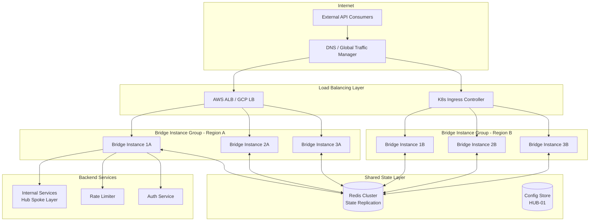
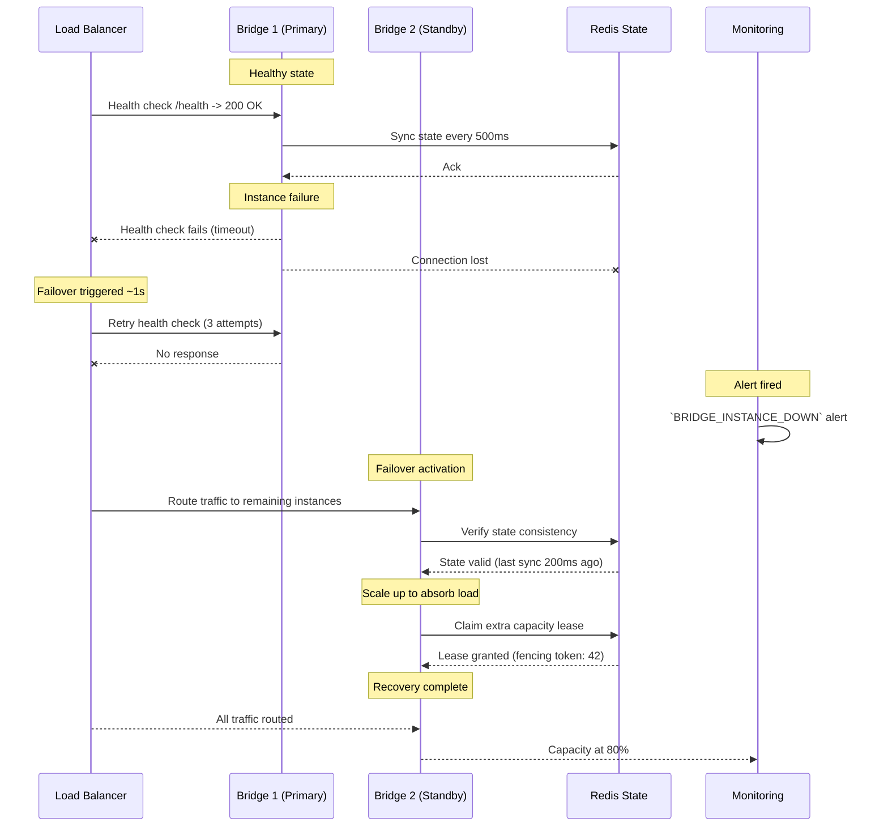

# Bridge High Availability & Active-Active Replication

> **Navigation:** [Rate Limiting Strategy](rate-limiting-strategy.md) | [API Versioning Strategy](api-versioning-strategy.md)
>
> **Applies To:** BRIDGE-01 (API Gateway — External Spoke)
>
> **Cross-Reference:** [Hub Scale Guide](../operations/hub-scale-guide.md) | [Failure Recovery Runbook](../operations/runbooks/failure-recovery.md) | [Cache Patterns](../cache-patterns/distributed-cache-consistency.md)
>
> **Status:** 🔧 Design

---

## 1. Architecture Overview

The Bridge (BRIDGE-01) is DGLab's sole external API gateway — the single point of contact for all external consumers. Without redundancy, a Bridge failure would render all public APIs unavailable. This document defines an **Active-Active** replication architecture eliminating the single point of failure while maintaining sub-100ms request routing and sub-2-second automatic failover.

### 1.1 Active-Active Topology



### 1.2 Instance Group Configuration

| Parameter | Value | Rationale |
|-----------|-------|-----------|
| Instances per region | 3 (minimum) | N+2 redundancy within region |
| Regions | 2 (primary + secondary) | Cross-region failover capability |
| Min healthy instances | 2 per region | Tolerate single-instance failure |
| Instance capacity | 10K req/s per instance | Headroom for burst + failover load |
| Total system capacity | 60K req/s (6 instances) | 3× projected peak load |

---

## 2. State Replication

Bridge instances are **stateless for request processing** but share ephemeral state for rate-limiting counters and routing rule caches. State is synchronised through a Redis cluster with the following architecture.

### 2.1 Shared State Catalog

| State Type | Storage | Consistency Model | Replication Latency Target |
|------------|---------|-------------------|---------------------------|
| Routing rules | Redis Hash | Strong (single-writer) | <50ms |
| Rate-limit counters | Redis Sorted Set | Eventually consistent (CRDT merge) | <100ms |
| Rate-limit configurations | Config Store HUB-01 | Strong (source of truth) | <200ms |
| Active consumer sessions | Redis String with TTL | Eventually consistent | <100ms |
| API key cache | Redis Hash | Strong (TTL-based refresh) | <500ms |
| Health state | In-memory + LB probe | Local (no replication needed) | N/A |

### 2.2 Routing Rule Propagation

```php
<?php
namespace Sovereign\Bridge\Replication;

class RoutingRuleReplicator
{
    private \Redis $redis;
    private ConfigStoreClient $configStore;
    private string $instanceId;

    private const ROUTING_HASH_KEY = 'bridge:routing:rules';
    private const ROUTING_VERSION_KEY = 'bridge:routing:version';
    private const ROUTING_CHANNEL = 'bridge:routing:update';

    /**
     * Publish routing rules to all Bridge instances.
     * Called when rules are added/updated/removed via admin API.
     */
    public function publishRules(array $rules): void
    {
        // Store in Redis hash for fast per-rule access
        $this->redis->hMSet(self::ROUTING_HASH_KEY, $rules);
        
        // Increment version for change detection
        $version = $this->redis->incr(self::ROUTING_VERSION_KEY);
        
        // Publish update event for real-time propagation
        $this->redis->publish(self::ROUTING_CHANNEL, json_encode([
            'version' => $version,
            'updated_at' => now()->toIso8601String(),
            'rule_count' => count($rules),
        ]));

        // Persist to config store for durability
        $this->configStore->set('routing_rules', $rules);
    }

    /**
     * Subscribe to routing rule updates.
     * Called once per Bridge instance at startup and continuously.
     */
    public function subscribeToUpdates(): void
    {
        $this->redis->subscribe([self::ROUTING_CHANNEL], function ($redis, $channel, $message) {
            $update = json_decode($message, true);
            $currentVersion = (int) $this->redis->get(self::ROUTING_VERSION_KEY);

            if ($update['version'] > $currentVersion) {
                $this->refreshLocalRules();
            }
        });
    }

    /**
     * Load routing rules from shared Redis on startup.
     */
    public function warmLocalCache(): void
    {
        $rules = $this->redis->hGetAll(self::ROUTING_HASH_KEY);
        if (empty($rules)) {
            // Fallback to config store
            $rules = $this->configStore->get('routing_rules', []);
        }
        $this->localCache = $rules;
    }
}
```

### 2.3 Rate-Limit Counter Synchronisation (CRDT Approach)

Rate-limit counters use a **CRDT-inspired merge strategy** to avoid the need for distributed locking on every API request. Each instance maintains local counters and periodically pushes deltas to Redis.

```php
<?php
namespace Sovereign\Bridge\Replication;

class RateLimitCounterSync
{
    private \Redis $redis;
    private string $instanceId;
    private array $localDeltas = [];
    private int $lastSyncAt = 0;

    private const SYNC_INTERVAL_MS = 500; // Sync every 500ms
    private const COUNTER_PREFIX = 'bridge:ratelimit:';
    private const INSTANCE_PREFIX = 'bridge:ratelimit:instance:';

    /**
     * Record a request against a rate-limit counter locally.
     */
    public function recordRequest(string $consumerKey, int $weight = 1): void
    {
        $windowKey = $this->getCurrentWindowKey($consumerKey);
        $this->localDeltas[$windowKey] = ($this->localDeltas[$windowKey] ?? 0) + $weight;
    }

    /**
     * Sync local deltas to global Redis counters.
     * Called every SYNC_INTERVAL_MS by a scheduler.
     */
    public function syncDeltas(): void
    {
        if (empty($this->localDeltas)) {
            return;
        }

        $deltas = $this->localDeltas;
        $this->localDeltas = [];
        $this->lastSyncAt = microtime(true) * 1000;

        $this->redis->multi();
        foreach ($deltas as $windowKey => $count) {
            // Instance-local counter (for monitoring)
            $instanceKey = self::INSTANCE_PREFIX . $this->instanceId . ':' . $windowKey;
            $this->redis->incrBy($instanceKey, $count);
            $this->redis->expire($instanceKey, 120);

            // Global merged counter
            $globalKey = self::COUNTER_PREFIX . $windowKey;
            $this->redis->incrBy($globalKey, $count);
            $this->redis->expire($globalKey, 120);
        }
        $this->redis->exec();
    }

    /**
     * Read the effective counter value (local + global merged).
     */
    public function getEffectiveCount(string $consumerKey): int
    {
        $windowKey = $this->getCurrentWindowKey($consumerKey);
        $global = (int) $this->redis->get(self::COUNTER_PREFIX . $windowKey);
        $local = $this->localDeltas[$windowKey] ?? 0;
        return $global + $local;
    }

    private function getCurrentWindowKey(string $consumerKey): string
    {
        // 1-minute sliding window
        $window = intdiv(now()->timestamp, 60);
        return "{$consumerKey}:{$window}";
    }
}
```

---

## 3. Failover Strategy

### 3.1 Failover Sequence



### 3.2 Health Checking

#### Passive Health Check (Load Balancer)

| Parameter | Value | Description |
|-----------|-------|-------------|
| Path | `/health` | Bridge health endpoint |
| Interval | 5 seconds | Time between probes |
| Timeout | 3 seconds | Max wait for response |
| Healthy threshold | 2 | Consecutive successes |
| Unhealthy threshold | 3 | Consecutive failures |

#### Active Health Probe (Bridge-to-Bridge)

```php
<?php
namespace Sovereign\Bridge\Health;

class InstanceHealthProbe
{
    private \Redis $redis;
    private string $instanceId;
    private array $peerInstances;

    private const HEARTBEAT_PREFIX = 'bridge:heartbeat:';
    private const HEARTBEAT_TTL = 15; // seconds

    /**
     * Send heartbeat to shared Redis.
     * Called every 5 seconds by a scheduler.
     */
    public function heartbeat(): void
    {
        $this->redis->setEx(
            self::HEARTBEAT_PREFIX . $this->instanceId,
            self::HEARTBEAT_TTL,
            json_encode([
                'instance_id' => $this->instanceId,
                'timestamp' => now()->toIso8601String(),
                'uptime' => $this->getUptime(),
                'request_count' => $this->getRequestCount(),
                'cpu_load' => sys_getloadavg()[0],
                'memory_usage' => memory_get_usage(true),
            ])
        );
    }

    /**
     * Discover healthy peer instances.
     */
    public function getHealthyPeers(): array
    {
        $keys = $this->redis->keys(self::HEARTBEAT_PREFIX . '*');
        $peers = [];

        foreach ($keys as $key) {
            $data = json_decode($this->redis->get($key), true);
            if ($data && $data['instance_id'] !== $this->instanceId) {
                $peers[] = $data;
            }
        }

        return $peers;
    }

    /**
     * Check if the cluster has enough healthy instances.
     */
    public function isClusterHealthy(int $minimumInstances = 2): bool
    {
        return count($this->getHealthyPeers()) + 1 >= $minimumInstances;
    }
}
```

### 3.3 Recovery Procedures

| Failure Scenario | Detection | Automatic Recovery | Manual Recovery |
|-----------------|-----------|-------------------|-----------------|
| Single Bridge crash | Heartbeat timeout (15s) | Traffic redistributed to peers; auto-restart via orchestrator | Investigate crash logs; fix and redeploy |
| Bridge process hang | HTTP timeout on health check | Instance removed from LB rotation; process killed | Capture thread dump; restart process |
| Redis state cluster unavailable | Connection errors | Bridge enters degraded mode using local-only state; rate limits become per-instance | Restore Redis cluster; sync accumulated deltas |
| Network partition (Bridge isolated) | No heartbeat received; peer health checks fail | Remaining instances continue; isolated instance stops accepting traffic | Resolve network issue; instance rejoins |
| Full region failure | All instances in region unhealthy | DNS failover to secondary region via traffic manager | Investigate region-level cause; initiate DR plan |

### 3.4 Degraded Mode Operation

When Redis state store is unavailable, Bridge instances operate in **degraded mode**:

```php
<?php
namespace Sovereign\Bridge\Health;

class DegradedModeController
{
    private bool $degradedMode = false;
    private \Redis $redis;

    /**
     * Detect Redis state store outage and enter/exit degraded mode.
     */
    public function evaluateMode(): string
    {
        try {
            $this->redis->ping();
            if ($this->degradedMode) {
                $this->exitDegradedMode();
            }
            return 'normal';
        } catch (\RedisException $e) {
            if (!$this->degradedMode) {
                $this->enterDegradedMode();
            }
            return 'degraded';
        }
    }

    private function enterDegradedMode(): void
    {
        $this->degradedMode = true;

        // Use in-memory rate-limit counters (per-instance only)
        // This means rate limits are ~2× looser than normal
        // since each instance counts independently
        logger()->warning('Bridge entered degraded mode — Redis unavailable');
    }

    private function exitDegradedMode(): void
    {
        $this->degradedMode = false;

        // Sync accumulated local counters to Redis
        // Merge is safe since counters are additive
        logger()->info('Bridge exited degraded mode — Redis restored');
    }

    /**
     * Adjust rate-limit enforcement in degraded mode.
     * In degraded mode, divide the global limit by the expected
     * number of instances to approximate fair sharing.
     */
    public function getEffectiveRateLimit(int $globalLimit, int $expectedInstances): int
    {
        if ($this->degradedMode) {
            return intval($globalLimit / $expectedInstances);
        }
        return $globalLimit;
    }
}
```

---

## 4. External Load Balancer Configuration

### 4.1 AWS ALB (Application Load Balancer)

```hcl
# terraform/alb.tf
resource "aws_lb" "bridge" {
  name               = "dglab-bridge-alb"
  internal           = false
  load_balancer_type = "application"
  security_groups    = [aws_security_group.bridge_alb.id]
  subnets           = var.public_subnet_ids

  enable_deletion_protection = true
  idle_timeout               = 60

  tags = {
    Name        = "DGLab Bridge ALB"
    Environment = var.environment
  }
}

resource "aws_lb_target_group" "bridge" {
  name        = "dglab-bridge-tg"
  port        = 443
  protocol    = "HTTPS"
  vpc_id      = var.vpc_id
  target_type = "ip"

  health_check {
    enabled             = true
    path                = "/health"
    port                = "traffic-port"
    protocol            = "HTTPS"
    interval            = 5
    timeout             = 3
    healthy_threshold   = 2
    unhealthy_threshold = 3
    matcher             = "200"
  }

  stickiness {
    type    = "lb_cookie"
    enabled = true
    cookie_duration = 60
  }

  deregistration_delay = 10
}

resource "aws_lb_listener" "bridge_443" {
  load_balancer_arn = aws_lb.bridge.arn
  port              = "443"
  protocol          = "HTTPS"
  ssl_policy        = "ELBSecurityPolicy-TLS-1-2-2017-01"
  certificate_arn   = var.ssl_certificate_arn

  default_action {
    type             = "forward"
    target_group_arn = aws_lb_target_group.bridge.arn
  }
}
```

### 4.2 GCP Load Balancer

```yaml
# gcp/lb.yaml
name: dglab-bridge-lb
project: ${PROJECT_ID}
region: ${REGION}

backendServices:
  - name: bridge-backend
    protocol: HTTPS
    portName: https
    healthChecks:
      - name: bridge-health
        type: HTTP
        requestPath: /health
        port: 443
        checkIntervalSec: 5
        timeoutSec: 3
        healthyThreshold: 2
        unhealthyThreshold: 3
    
    backends:
      - group: ${INSTANCE_GROUP_REGION_A}
        balancingMode: RATE
        maxRatePerInstance: 10000
      - group: ${INSTANCE_GROUP_REGION_B}
        balancingMode: RATE
        maxRatePerInstance: 10000

    iap:
      enabled: false  # IAP disabled for Bridge (public-facing)

    cdnPolicy:
      enabled: false  # CDN not used for API gateway
```

### 4.3 Kubernetes Ingress

```yaml
# k8s/bridge-ingress.yaml
apiVersion: networking.k8s.io/v1
kind: Ingress
metadata:
  name: dglab-bridge-ingress
  namespace: dglab
  annotations:
    nginx.ingress.kubernetes.io/ssl-redirect: "true"
    nginx.ingress.kubernetes.io/proxy-read-timeout: "30"
    nginx.ingress.kubernetes.io/proxy-send-timeout: "30"
    nginx.ingress.kubernetes.io/upstream-keepalive: "32"
    nginx.ingress.kubernetes.io/health-check-path: "/health"
    nginx.ingress.kubernetes.io/health-check-interval-seconds: "5"
    nginx.ingress.kubernetes.io/health-check-timeout-seconds: "3"
    nginx.ingress.kubernetes.io/health-check-healthy-threshold: "2"
    nginx.ingress.kubernetes.io/health-check-unhealthy-threshold: "3"
spec:
  ingressClassName: nginx
  tls:
    - hosts:
        - api.dglab.io
      secretName: dglab-api-tls
  rules:
    - host: api.dglab.io
      http:
        paths:
          - path: /
            pathType: Prefix
            backend:
              service:
                name: bridge-service
                port:
                  number: 443
---
apiVersion: v1
kind: Service
metadata:
  name: bridge-service
  namespace: dglab
spec:
  selector:
    app: bridge
  ports:
    - port: 443
      targetPort: 443
      protocol: TCP
      name: https
  type: NodePort
  sessionAffinity: ClientIP
  sessionAffinityConfig:
    clientIP:
      timeoutSeconds: 60
```

---

## 5. Split-Brain Prevention

To prevent simultaneous processing of the same request by multiple Bridge instances during a partition event, a **fencing token** mechanism is used.

```php
<?php
namespace Sovereign\Bridge\Replication;

class FencingTokenManager
{
    private \Redis $redis;

    /**
     * Acquire a fencing token before processing a state-mutating request.
     * Returns null if another instance has a higher token (split-brain detected).
     */
    public function acquireToken(string $requestId): ?FencingToken
    {
        $lockKey = "bridge:fencing:{$requestId}";
        $tokenId = uniqid('', true);

        // Attempt to acquire a lock with TTL
        $acquired = $this->redis->set($lockKey, $tokenId, ['NX', 'EX' => 10]);

        if (!$acquired) {
            // Another instance already holds the token
            return null;
        }

        return new FencingToken($requestId, $tokenId, now()->addSeconds(10));
    }

    /**
     * Verify and release a fencing token after processing.
     */
    public function releaseToken(FencingToken $token): void
    {
        // Lua script: delete only if we own the token
        $script = <<<'LUA'
            if redis.call("get", KEYS[1]) == ARGV[1] then
                return redis.call("del", KEYS[1])
            end
            return 0
        LUA;

        $this->redis->eval($script, ["bridge:fencing:{$token->requestId}"], [$token->tokenId]);
    }
}
```

---

## 6. Monitoring & Alerting

### 6.1 Key Metrics

| Metric | Description | Collection | Alert Threshold |
|--------|-------------|------------|-----------------|
| `bridge.healthy_instances` | Number of healthy Bridge instances | Heartbeat gauge | < 2 |
| `bridge.request_latency.p50` | Median request latency | Histogram | > 200ms |
| `bridge.request_latency.p99` | P99 request latency | Histogram | > 1000ms |
| `bridge.error_rate` | 5xx responses per second | Counter | > 1% of total |
| `bridge.state_sync_lag` | Redis state replication lag | Gauge | > 500ms |
| `bridge.degraded_mode` | Whether Bridge is in degraded mode | Bool gauge | True for > 60s |
| `bridge.health_check_failures` | Consecutive health check failures | Gauge | > 2 |
| `redis.connection_state` | Redis cluster connectivity | Bool gauge | False |

### 6.2 Prometheus Metric Definitions

```php
<?php
namespace Sovereign\Bridge\Monitoring;

class BridgeMetrics
{
    private Gauge $healthyInstances;
    private Histogram $requestLatency;
    private Counter $errorCount;
    private Gauge $stateSyncLag;
    private Gauge $degradedMode;

    public function recordRequest(float $durationMs, int $statusCode, string $method, string $path): void
    {
        $this->requestLatency->observe($durationMs / 1000, [
            'method' => $method,
            'path' => $path,
        ]);

        if ($statusCode >= 500) {
            $this->errorCount->inc(['status_code' => (string) $statusCode]);
        }
    }

    public function evaluateAlerts(): array
    {
        $alerts = [];

        if ($this->healthyInstances->value() < 2) {
            $alerts[] = new Alert(
                name: 'BridgeInsufficientInstances',
                severity: AlertSeverity::Critical,
                message: 'Fewer than 2 healthy Bridge instances available',
            );
        }

        $p99 = $this->requestLatency->quantile(0.99);
        if ($p99 > 1.0) {
            $alerts[] = new Alert(
                name: 'BridgeHighLatency',
                severity: AlertSeverity::Warning,
                message: "P99 latency is {$p99}s (threshold: 1.0s)",
            );
        }

        return $alerts;
    }
}
```

### 6.3 Dashboard Panels

| Panel | Type | Metrics |
|-------|------|---------|
| Bridge Instance Health | Stat grid | Healthy / unhealthy count per instance |
| Request Rate & Latency | Time series | RPS, P50/P95/P99 latency |
| Error Rate by Status | Time series | 4xx, 5xx rate |
| State Sync Health | Time series | Redis connection state, sync lag |
| Degraded Mode Indicator | Stat | Boolean + duration |
| Load Balancer Status | Stat | Active targets, health check pass rate |

---

## 7. Configuration Reference

```php
<?php
// config/bridge.php
return [
    'high_availability' => [
        'expected_instances' => env('BRIDGE_EXPECTED_INSTANCES', 6),
        'minimum_healthy' => env('BRIDGE_MIN_HEALTHY', 2),
        'degraded_mode_enabled' => env('BRIDGE_DEGRADED_MODE', true),
    ],

    'state_replication' => [
        'driver' => env('BRIDGE_STATE_DRIVER', 'redis'),
        'redis' => [
            'cluster' => env('REDIS_CLUSTER', 'bridge-state:6379'),
            'prefix' => 'bridge:',
            'sync_interval_ms' => env('BRIDGE_SYNC_INTERVAL', 500),
        ],
        'crdt' => [
            'merge_interval_ms' => env('BRIDGE_CRDT_MERGE_INTERVAL', 1000),
            'local_delta_ttl' => env('BRIDGE_DELTA_TTL', 120),
        ],
    ],

    'health' => [
        'endpoint' => '/health',
        'heartbeat_interval' => env('BRIDGE_HEARTBEAT_INTERVAL', 5),
        'heartbeat_ttl' => env('BRIDGE_HEARTBEAT_TTL', 15),
    ],

    'load_balancer' => [
        'health_check_path' => '/health',
        'deregistration_delay' => env('BRIDGE_DEREG_DELAY', 10),
        'sticky_session_ttl' => env('BRIDGE_STICKY_TTL', 60),
    ],

    'monitoring' => [
        'metrics_enabled' => env('BRIDGE_METRICS', true),
        'latency_histogram_buckets' => [5, 10, 25, 50, 100, 200, 500, 1000, 2500],
        'alert_webhook' => env('BRIDGE_ALERT_WEBHOOK'),
    ],
];
```

---

## 8. Success Metrics

| Metric | Target | Verification Method |
|--------|--------|---------------------|
| Automatic failover time | < 2 seconds | Synthetic monitoring (health check failure → traffic rerouted) |
| State replication lag | < 100ms (P99) | Redis INFO command / custom metric |
| Request routing added by failover | < 50ms | Latency histogram |
| Degraded mode recovery time | < 30 seconds | Time from Redis restore → full capability |
| Bridge uptime (per instance) | > 99.95% | Health check pass rate |
| Zero data consistency issues | Always | Audit log review + integration tests |

---

## 9. Related Blueprints

| Blueprint | Role in High Availability |
|-----------|--------------------------|
| [BRIDGE-01](../../../ApprovedBlueprints/External/BRIDGE-01.md) | API Gateway — primary subject of this document |
| [HUB-02](../../../ApprovedBlueprints/Hub/HUB-02.md) | Cache/Redis — state replication backend |
| [HUB-08](../../../ApprovedBlueprints/Hub/HUB-08.md) | Load Balancer integration |
| [HUB-15](../../../ApprovedBlueprints/Hub/HUB-15.md) | Health monitoring and alerting |
| [CORE-05](../../../ApprovedBlueprints/Core/CORE-05.md) | Configuration management |

---

> **Document Version:** 1.0
> **Last Updated:** Current Session
> **Status:** 🔧 Design
> **Review Cycle:** Quarterly