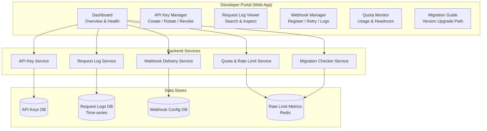
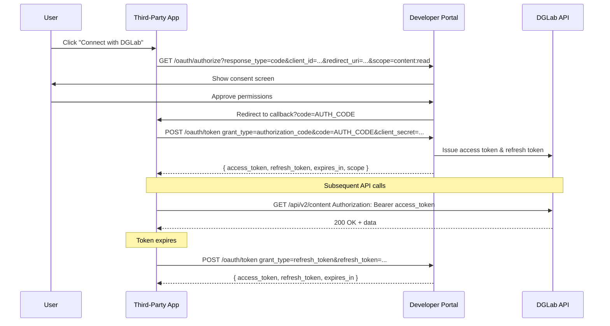
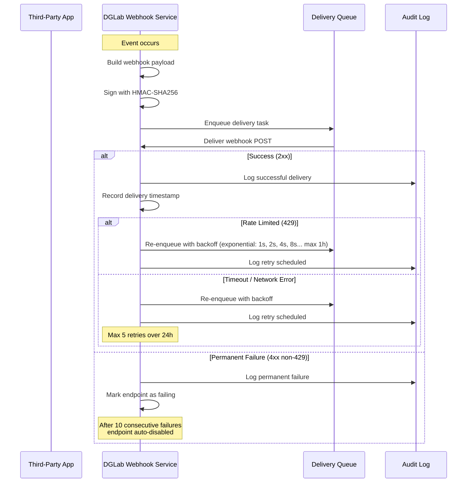
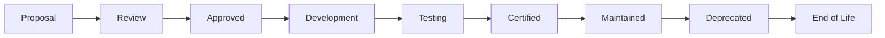

# Developer Portal & Third-Party Integration Framework

> **Navigation:** [API Versioning Strategy](api-versioning-strategy.md) | [SEO Optimization](seo-optimization.md)
>
> **Applies To:** BRIDGE-01 (External API — Consumer Self-Service)
>
> **Cross-Reference:** [Rate Limiting Strategy](rate-limiting-strategy.md) | [API Versioning Strategy](api-versioning-strategy.md) | [Adapter Library](../integration/adapter-library.md)
>
> **Status:** 🔧 Design

---

## 1. Portal Architecture

The Developer Portal is the self-service hub where API consumers manage their integration — API keys, webhooks, request logs, and quota monitoring. It reduces support burden by empowering consumers to diagnose and resolve issues independently.

### 1.1 Portal Component Architecture



### 1.2 Portal Features Summary

| Feature | Description | Self-Service? | API Available? |
|---------|-------------|---------------|----------------|
| API Key Management | Create, list, rotate, revoke API keys with labels and permissions | Yes | Yes |
| Request Log Viewer | Search and inspect recent API requests (up to 30 days) | Yes | Yes |
| Webhook Manager | Register webhook endpoints, view delivery logs, retry failed | Yes | Yes |
| Quota Monitor | Real-time rate limit usage, headroom, and burst activity | Yes | Yes |
| Migration Guide | See current version status, deprecated features, migration path | Yes | No (read-only) |
| API Documentation | Interactive OpenAPI explorer | Yes | No |

---

## 2. API Key Management

### 2.1 Key Lifecycle

```mermaid
stateDiagram-v2
    [*] --> Active: Created
    Active --> Expired: TTL reached
    Active --> Revoked: Manual revoke
    Expired --> Active: Reactivated
    Revoked --> [*]
    
    state Active {
        [*] --> Rotating: Rotation requested
        Rotating --> Active: New key active<br/>Old key cooldown
    }
```

### 2.2 Key Management Service

```php
<?php
namespace Sovereign\Portal\ApiKeys;

class ApiKeyManager
{
    private string $keyStore;
    private int $hashCost = 12;

    /**
     * Create a new API key for a consumer.
     *
     * @param string $consumerId Consumer identifier
     * @param string $label Human-readable label for the key
     * @param array $permissions Scope of permissions
     * @param int|null $ttlSeconds Optional key expiration
     * @return ApiKeyCreated
     */
    public function create(
        string $consumerId,
        string $label,
        array $permissions = ['*'],
        ?int $ttlSeconds = null,
    ): ApiKeyCreated {
        // Generate a cryptographically secure random key
        $rawKey = bin2hex(random_bytes(32));
        $prefix = 'dg_' . substr($rawKey, 0, 8);  // e.g., dg_a1b2c3d4
        $fullKey = $prefix . '_' . substr($rawKey, 8);

        // Hash the full key for storage (never store raw keys)
        $hash = password_hash($fullKey, PASSWORD_BCRYPT, ['cost' => $this->hashCost]);

        $keyRecord = [
            'id' => (string) \Str::uuid(),
            'consumer_id' => $consumerId,
            'label' => $label,
            'hash' => $hash,
            'prefix' => $prefix,
            'permissions' => json_encode($permissions),
            'status' => 'active',
            'created_at' => now(),
            'expires_at' => $ttlSeconds ? now()->addSeconds($ttlSeconds) : null,
            'last_used_at' => null,
            'rotated_from' => null,
        ];

        app('db')->table('api_keys')->insert($keyRecord);

        // Return the full key only once (one-time display)
        return new ApiKeyCreated(
            keyId: $keyRecord['id'],
            fullKey: $fullKey,
            prefix: $prefix,
            createdAt: $keyRecord['created_at'],
            expiresAt: $keyRecord['expires_at'],
        );
    }

    /**
     * Rotate an API key — creates a new key and marks the old one as rotating.
     * Old key continues working for a 24-hour cooldown period.
     */
    public function rotate(string $keyId): ApiKeyCreated
    {
        $oldKey = app('db')->table('api_keys')->where('id', $keyId)->first();
        if (!$oldKey || $oldKey->status !== 'active') {
            throw new InvalidKeyException('Key not found or not active');
        }

        // Mark old key as rotating (with 24h cooldown)
        app('db')->table('api_keys')
            ->where('id', $keyId)
            ->update([
                'status' => 'rotating',
                'rotated_at' => now(),
            ]);

        // Schedule automatic revoke after 24 hours
        app('queue')->later(now()->addHours(24), new RevokeRotatedKey($keyId));

        // Create new key with same settings
        return $this->create(
            consumerId: $oldKey->consumer_id,
            label: $oldKey->label,
            permissions: json_decode($oldKey->permissions, true),
            ttlSeconds: $oldKey->expires_at
                ? now()->diffInSeconds($oldKey->expires_at)
                : null,
        );
    }

    /**
     * Validate an API key and return the associated consumer.
     */
    public function validate(string $key): ?ApiKeyRecord
    {
        $prefix = substr($key, 0, 11); // "dg_a1b2c3d4"

        // Find by prefix (fast lookup without full hash comparison)
        $candidates = app('db')->table('api_keys')
            ->where('prefix', $prefix)
            ->whereIn('status', ['active', 'rotating'])
            ->get();

        foreach ($candidates as $candidate) {
            if (password_verify($key, $candidate->hash)) {
                // Update last used timestamp (throttled to once per 5 min)
                app('db')->table('api_keys')
                    ->where('id', $candidate->id)
                    ->where('last_used_at', '<', now()->subMinutes(5))
                    ->update(['last_used_at' => now()]);

                return new ApiKeyRecord(
                    id: $candidate->id,
                    consumerId: $candidate->consumer_id,
                    label: $candidate->label,
                    permissions: json_decode($candidate->permissions, true),
                    status: $candidate->status,
                );
            }
        }

        return null;
    }
}
```

### 2.3 Key Permissions Scope

```php
<?php
namespace Sovereign\Portal\ApiKeys;

enum Permission: string
{
    // Content operations
    case ContentRead = 'content:read';
    case ContentWrite = 'content:write';
    case ContentDelete = 'content:delete';

    // User operations
    case UserRead = 'user:read';
    case UserWrite = 'user:write';

    // Webhook management
    case WebhookRead = 'webhook:read';
    case WebhookWrite = 'webhook:write';

    // Administrative
    case QuotaRead = 'quota:read';
    case LogsRead = 'logs:read';

    // Wildcard
    case All = '*';
}
```

---

## 3. Integration Framework

### 3.1 OAuth 2.0 Flows

The Developer Portal supports two OAuth 2.0 grant types for third-party integrations.

#### Authorization Code Flow (for apps acting on behalf of users)



#### Client Credentials Flow (for server-to-server integrations)

```php
<?php
namespace Sovereign\Portal\OAuth;

class OAuthTokenController
{
    /**
     * POST /oauth/token — issue tokens for client_credentials and auth_code grants.
     */
    public function issueToken(Request $request): JsonResponse
    {
        $grantType = $request->input('grant_type');

        return match ($grantType) {
            'authorization_code' => $this->handleAuthCodeGrant($request),
            'client_credentials' => $this->handleClientCredentials($request),
            'refresh_token' => $this->handleRefreshToken($request),
            default => response()->json([
                'error' => 'unsupported_grant_type',
                'error_description' => "Grant type '{$grantType}' is not supported. " .
                    "Supported types: authorization_code, client_credentials, refresh_token",
            ], 400),
        };
    }

    private function handleClientCredentials(Request $request): JsonResponse
    {
        $clientId = $request->input('client_id');
        $clientSecret = $request->input('client_secret');
        $scope = $request->input('scope', 'content:read');

        // Validate client credentials
        $client = app(OAuthClientService::class)->authenticate($clientId, $clientSecret);
        if (!$client) {
            return response()->json([
                'error' => 'invalid_client',
                'error_description' => 'Client authentication failed',
            ], 401);
        }

        // Generate access token
        $token = app(TokenService::class)->createAccessToken(
            clientId: $client->id,
            consumerId: $client->consumer_id,
            scopes: explode(' ', $scope),
            ttl: 3600, // 1 hour
        );

        return response()->json([
            'access_token' => $token->token,
            'token_type' => 'Bearer',
            'expires_in' => 3600,
            'scope' => $scope,
        ]);
    }
}
```

### 3.2 Webhook Signature Validation

All webhook payloads are signed with HMAC-SHA256 to guarantee authenticity and integrity.

```php
<?php
namespace Sovereign\Portal\Webhooks;

class WebhookSigner
{
    /**
     * Sign a webhook payload with the consumer's shared secret.
     *
     * @param array $payload The webhook payload (will be JSON-encoded)
     * @param string $secret Consumer's webhook secret (configured in portal)
     * @return string The HMAC-SHA256 signature (hex-encoded)
     */
    public function sign(array $payload, string $secret): string
    {
        $json = json_encode($payload, JSON_UNESCAPED_SLASHES | JSON_UNESCAPED_UNICODE);
        return hash_hmac('sha256', $json, $secret);
    }

    /**
     * Verify a webhook signature.
     * Consumers should use this to validate incoming webhooks.
     */
    public function verify(string $payload, string $signature, string $secret): bool
    {
        $expected = hash_hmac('sha256', $payload, $secret);
        return hash_equals($expected, $signature);
    }

    /**
     * Generate webhook delivery headers for an outgoing webhook.
     */
    public function buildHeaders(array $payload, string $secret): array
    {
        $timestamp = time();
        $signature = $this->sign($payload, $secret);

        return [
            'Content-Type' => 'application/json',
            'X-DGLab-Webhook-ID' => $payload['id'] ?? '',
            'X-DGLab-Webhook-Timestamp' => (string) $timestamp,
            'X-DGLab-Webhook-Signature' => $signature,
            'X-DGLab-Webhook-Version' => '2',
            'User-Agent' => 'DGLab-Webhook/1.0',
        ];
    }
}
```

### 3.3 Webhook Delivery Lifecycle



### 3.4 Idempotency Keys

To safely retry API requests without duplicate side effects, consumers can send an `Idempotency-Key` header.

```php
<?php
namespace Sovereign\Portal\Integration;

class IdempotencyMiddleware
{
    private \Redis $redis;

    private const IDEMPOTENCY_TTL = 86400; // 24 hours

    /**
     * Handle idempotent requests.
     * If an Idempotency-Key header is provided, deduplicate on the server side.
     */
    public function handle(Request $request, callable $next): Response
    {
        $idempotencyKey = $request->header('Idempotency-Key');

        if (!$idempotencyKey) {
            // No idempotency key — process normally
            return $next($request);
        }

        // Validate key format (UUID v4)
        if (!\Illuminate\Support\Str::isUuid($idempotencyKey)) {
            return response()->json([
                'error' => [
                    'code' => 'INVALID_IDEMPOTENCY_KEY',
                    'message' => 'Idempotency-Key must be a valid UUID v4',
                ],
            ], 400);
        }

        $cacheKey = "idempotency:{$idempotencyKey}";

        // Check if we've already processed this key
        $cached = $this->redis->get($cacheKey);
        if ($cached) {
            $previous = json_decode($cached, true);
            return response()->json(
                $previous['body'],
                $previous['status'],
            );
        }

        // Process the request
        $response = $next($request);

        // Cache the response for future idempotent retries
        if ($response->getStatusCode() >= 200 && $response->getStatusCode() < 500) {
            $this->redis->setEx(
                $cacheKey,
                self::IDEMPOTENCY_TTL,
                json_encode([
                    'status' => $response->getStatusCode(),
                    'body' => json_decode($response->getContent(), true),
                ])
            );
        }

        return $response;
    }
}
```

---

## 4. Starter Kits for Popular Integrations

### 4.1 Available Starter Kits

| Platform | Type | Setup Time | Documentation |
|----------|------|------------|---------------|
| **Zapier** | No-code integration | 15 minutes | `integrations/zapier/README.md` |
| **IFTTT** | No-code applet | 10 minutes | `integrations/ifttt/README.md` |
| **Slack** | Slash command + webhook | 30 minutes | `integrations/slack/README.md` |
| **Discord** | Bot + webhook | 30 minutes | `integrations/discord/README.md` |
| **Webhook.site** | Debug endpoint | 5 minutes | `integrations/webhook-site/README.md` |
| **Custom REST Client** | cURL / Postman collection | 10 minutes | `integrations/rest-client/README.md` |

### 4.2 Slack Integration Starter Kit

```json
{
  "name": "DGLab Slack Integration",
  "description": "Receive DGLab webhook notifications directly in your Slack workspace.",
  "setup_steps": [
    {
      "step": 1,
      "title": "Create a Slack App",
      "instruction": "Go to https://api.slack.com/apps and click 'Create New App'. Choose 'From manifest' and paste the manifest below.",
      "manifest": {
        "_metadata": {
          "major_version": 1,
          "minor_version": 1
        },
        "display_information": {
          "name": "DGLab Notifier",
          "description": "Receive DGLab API webhook notifications"
        },
        "features": {
          "bot_user": {
            "display_name": "DGLab Notifier",
            "always_online": false
          }
        },
        "oauth_config": {
          "scopes": {
            "bot": ["chat:write", "incoming-webhook"]
          }
        },
        "settings": {
          "event_subscriptions": {
            "request_url": "https://your-server.com/slack/events",
            "bot_events": []
          }
        }
      }
    },
    {
      "step": 2,
      "title": "Configure Webhook in DGLab Portal",
      "instruction": "In the DGLab Developer Portal, go to Webhooks and add a new endpoint pointing to your Slack integration server.",
      "endpoint_url": "https://your-server.com/webhooks/dglab"
    },
    {
      "step": 3,
      "title": "Install the Integration",
      "instruction": "Run the provided Docker Compose file that contains the webhook-to-Slack bridge."
    }
  ],
  "compose_file": "integrations/slack/docker-compose.yml",
  "webhook_format": {
    "sample_payload": {
      "id": "evt_f9a8b7c6",
      "type": "content.published",
      "created": "2025-04-01T12:00:00Z",
      "data": {
        "content_id": "cnt_12345",
        "title": "New Chapter Published"
      }
    }
  }
}
```

### 4.3 Zapier Integration

```php
<?php
namespace Sovereign\Portal\Integrations;

class ZapierWebhookTransformer
{
    /**
     * Transform a DGLab webhook payload into Zapier's expected format.
     * Zapier receives webhooks and maps fields to triggers.
     */
    public function toZapierPayload(array $dglabPayload): array
    {
        return [
            'id' => $dglabPayload['id'],
            'event' => $dglabPayload['type'],
            'timestamp' => $dglabPayload['created'],
            'data' => $dglabPayload['data'],
            // Zapier expects flat fields for mapping
            'content_id' => $dglabPayload['data']['content_id'] ?? null,
            'title' => $dglabPayload['data']['title'] ?? null,
            'status' => $dglabPayload['data']['status'] ?? null,
        ];
    }
}
```

---

## 5. Community Integration Governance

### 5.1 Integration Lifecycle



### 5.2 SLA Tiers for Community Integrations

| Tier | Support Response | Maintenance Commitment | Verification |
|------|-----------------|----------------------|--------------|
| **Certified** | < 4 hours (business hours) | Security patches within 7 days; feature parity within 30 days | Full automated test suite; manual security review |
| **Community** | Best-effort | Security patches within 30 days | Automated smoke tests |
| **Experimental** | No guarantee | No commitment | None (use at own risk) |

### 5.3 Integration Review Checklist

- [ ] Integration is stateless — no consumer data stored by the integration middleware
- [ ] OAuth 2.0 flow follows the standard DGLab pattern (see [section 3.1](#31-oauth-20-flows))
- [ ] Webhook signature validation is implemented (HMAC-SHA256)
- [ ] Idempotency key handling is implemented for write operations
- [ ] Rate limit errors are handled with exponential backoff
- [ ] Integration is packaged as a reusable Docker Compose or Helm chart
- [ ] Documentation includes: setup steps, configuration reference, troubleshooting guide
- [ ] Integration has automated CI tests that pass against DGLab sandbox

### 5.4 Deprecation Policy for Community Integrations

| Phase | Duration | Actions |
|-------|----------|---------|
| **Notice** | 90 days | Published deprecation notice; repository archived; README updated with migration advice |
| **Sunset** | 30 days | Integration still functional but no support provided |
| **EOL** | Permanent | Repository set to read-only; documentation removed from portal |

---

## 6. Request Log Viewer

### 6.1 Log Retention & Query

```php
<?php
namespace Sovereign\Portal\Logs;

class RequestLogViewer
{
    /**
     * Search recent API requests for a consumer.
     *
     * @param string $consumerId
     * @param array $filters status, method, endpoint, date_from, date_to
     * @param int $page
     * @param int $perPage
     * @return array
     */
    public function search(string $consumerId, array $filters, int $page = 1, int $perPage = 25): array
    {
        $query = app('db')->table('api_request_logs')
            ->where('consumer_id', $consumerId)
            ->orderBy('created_at', 'desc');

        if (!empty($filters['status'])) {
            $query->where('response_status', (int) $filters['status']);
        }
        if (!empty($filters['method'])) {
            $query->where('method', strtoupper($filters['method']));
        }
        if (!empty($filters['endpoint'])) {
            $query->where('endpoint', 'like', "%{$filters['endpoint']}%");
        }
        if (!empty($filters['date_from'])) {
            $query->where('created_at', '>=', $filters['date_from']);
        }
        if (!empty($filters['date_to'])) {
            $query->where('created_at', '<=', $filters['date_to']);
        }

        $total = $query->count();
        $logs = $query->forPage($page, $perPage)->get();

        return [
            'data' => $logs->map(fn ($log) => [
                'id' => $log->id,
                'timestamp' => $log->created_at,
                'method' => $log->method,
                'endpoint' => $log->endpoint,
                'status' => $log->response_status,
                'latency_ms' => $log->latency_ms,
                'api_version' => $log->api_version,
                'rate_limit_remaining' => $log->rate_limit_remaining,
                'ip_address' => $this->maskIp($log->ip_address),
            ]),
            'meta' => [
                'page' => $page,
                'perPage' => $perPage,
                'total' => $total,
                'totalPages' => (int) ceil($total / $perPage),
            ],
        ];
    }

    /**
     * Get a single request detail with full request/response bodies.
     */
    public function detail(string $logId, string $consumerId): ?array
    {
        $log = app('db')->table('api_request_logs')
            ->where('id', $logId)
            ->where('consumer_id', $consumerId)
            ->first();

        if (!$log) {
            return null;
        }

        return [
            'id' => $log->id,
            'timestamp' => $log->created_at,
            'method' => $log->method,
            'endpoint' => $log->endpoint,
            'status' => $log->response_status,
            'latency_ms' => $log->latency_ms,
            'api_version' => $log->api_version,
            'request' => [
                'headers' => json_decode($log->request_headers, true),
                'body' => json_decode($log->request_body, true),
                'query' => json_decode($log->request_query, true),
            ],
            'response' => [
                'headers' => json_decode($log->response_headers, true),
                'body' => json_decode($log->response_body, true),
            ],
            'rate_limit' => [
                'limit' => $log->rate_limit_limit,
                'remaining' => $log->rate_limit_remaining,
                'reset' => $log->rate_limit_reset,
            ],
        ];
    }
}
```

### 6.2 Log Retention Policy

| Environment | Retention | Storage | Access API |
|-------------|-----------|---------|------------|
| Production | 30 days | Time-series DB (ClickHouse / PostgreSQL) | Portal UI + API |
| Sandbox | 7 days | Same as production | Portal UI + API |
| Long-term | 12 months | Object storage (cold, S3) | Admin request only |

---

## 7. Configuration Reference

```php
<?php
// config/developer-portal.php
return [
    'enabled' => env('DEVELOPER_PORTAL_ENABLED', true),

    'api_keys' => [
        'hash_cost' => env('API_KEY_HASH_COST', 12),
        'rotation_cooldown_hours' => env('API_KEY_ROTATION_COOLDOWN', 24),
        'prefix' => 'dg_',
        'key_length_bytes' => 32,
    ],

    'oauth' => [
        'access_token_ttl' => env('OAUTH_ACCESS_TOKEN_TTL', 3600),
        'refresh_token_ttl' => env('OAUTH_REFRESH_TOKEN_TTL', 2592000), // 30 days
        'authorization_code_ttl' => env('OAUTH_AUTH_CODE_TTL', 300),    // 5 minutes
    ],

    'webhooks' => [
        'signature_header' => 'X-DGLab-Webhook-Signature',
        'max_retries' => env('WEBHOOK_MAX_RETRIES', 5),
        'retry_backoff_base' => env('WEBHOOK_RETRY_BACKOFF', 1),  // exponential: 1s, 2s, 4s...
        'max_backoff_seconds' => env('WEBHOOK_MAX_BACKOFF', 3600),
        'max_consecutive_failures' => env('WEBHOOK_MAX_FAILURES', 10),
        'payload_max_size_kb' => env('WEBHOOK_MAX_SIZE', 256),
    ],

    'idempotency' => [
        'enabled' => env('IDEMPOTENCY_ENABLED', true),
        'ttl_seconds' => env('IDEMPOTENCY_TTL', 86400),
    ],

    'logs' => [
        'retention_days' => env('API_LOG_RETENTION', 30),
        'sandbox_retention_days' => env('API_LOG_SANDBOX_RETENTION', 7),
        'long_term_retention_months' => env('API_LOG_LONG_TERM', 12),
        'max_body_size_bytes' => env('API_LOG_MAX_BODY', 65536), // Truncate bodies >64KB
    ],

    'integrations' => [
        'directory' => base_path('integrations'),
        'max_setup_minutes' => 30, // Target setup time for certified integrations
    ],
];
```

---

## 8. Monitoring & Alerting

### 8.1 Key Metrics

| Metric | Description | Alert Threshold |
|--------|-------------|----------------|
| `portal.api_keys.created` | API key creation rate | Monitor for anomaly detection |
| `portal.webhook.delivery_success` | Webhook delivery success rate | < 95% over 5 min |
| `portal.webhook.delivery_latency` | P99 webhook delivery latency | > 5 seconds |
| `portal.webhook.endpoint_failures` | Endpoint consecutive failures | > 10 (auto-disable) |
| `portal.oauth.token_errors` | OAuth token issuance failures | > 1% of attempts |
| `portal.logs.query_time` | Request log search latency | > 2 seconds P99 |
| `portal.integration.setup_time` | Time to complete integration setup | > 30 minutes trend |

### 8.2 Dashboard Panels

| Panel | Type | Description |
|-------|------|-------------|
| API Key Distribution | Pie chart | Active / Rotating / Expired / Revoked |
| Webhook Delivery Health | Time series | Success rate, retry rate, failure rate |
| Webhook Latency | Heatmap | Delivery latency distribution |
| Top Failed Webhooks | Table | Endpoints with highest failure count |
| OAuth Token Issuance | Time series | Token issuance rate by grant type |
| Request Log Queries | Time series | Search query volume and latency |
| Integration Setup Funnel | Funnel | Views → Started → Completed setup |

---

## 9. Success Metrics

| Metric | Target | Verification Method |
|--------|--------|---------------------|
| New integration setup time | < 50% custom implementation using starter kits | Measure time from registration to first successful API call |
| Self-service resolution rate | > 80% of support issues resolvable via portal | Support ticket deflection analysis |
| Webhook delivery reliability | > 99.9% delivery within 60 seconds | Delivery success metrics |
| API key rotation adoption | > 90% of enterprise consumers rotate keys quarterly | Key rotation audit logs |
| Community integration count | > 5 certified integrations within 6 months | Integration registry count |

---

## 10. Related Blueprints

| Blueprint | Role in Developer Portal |
|-----------|--------------------------|
| [BRIDGE-01](../../../ApprovedBlueprints/External/BRIDGE-01.md) | API Gateway — base for portal backend services |
| [HUB-06](../../../ApprovedBlueprints/Hub/HUB-06.md) | Audit logging — request log storage |
| [HUB-08](../../../ApprovedBlueprints/Hub/HUB-08.md) | Routing — API key authentication middleware |
| [HUB-30](../../../ApprovedBlueprints/Hub/HUB-30.md) | CLI — portal management commands |

---

> **Document Version:** 1.0
> **Last Updated:** Current Session
> **Status:** 🔧 Design
> **Review Cycle:** Quarterly