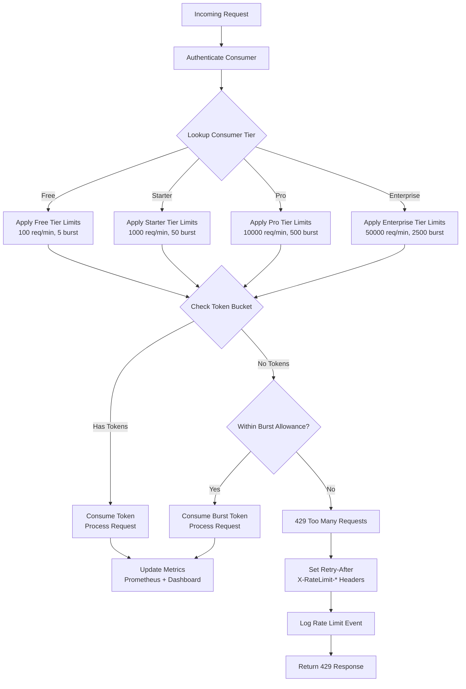
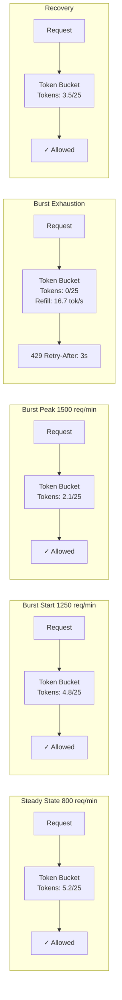

# Rate Limiting Strategy

> **Navigation:** [Bridge High Availability](bridge-high-availability.md) | [API Versioning Strategy](api-versioning-strategy.md)
>
> **Applies To:** BRIDGE-01 (API Gateway — Rate Limiting Subsystem)
>
> **Cross-Reference:** [Queue Backpressure Runbook](../operations/runbooks/queue-backpressure.md) | [Hub Scale Guide](../operations/hub-scale-guide.md)
>
> **Status:** 🔧 Design

---

## 1. Architecture Overview

Rate limiting protects DGLab's external API from abuse while ensuring legitimate high-volume consumers are not unfairly throttled. This strategy replaces a flat per-IP rate limit with a **tiered, burst-aware, backpressure-signalling** system that differentiates between premium and standard consumers.

### 1.1 Rate Limiting Decision Flow



---

## 2. Tiered Rate Limits

### 2.1 Tier Definitions

| Tier | Sustained Limit | Burst Allowance | Burst Window | Price Point | Target Audience |
|------|----------------|-----------------|-------------|-------------|-----------------|
| **Free** | 100 req/min | +25 req (25% burst) | 2 seconds | Free | Evaluation / hobby projects |
| **Starter** | 1,000 req/min | +250 req (25% burst) | 2 seconds | $29/mo | Small businesses, indie devs |
| **Pro** | 10,000 req/min | +2,500 req (25% burst) | 2 seconds | $199/mo | Growing teams, SaaS integrations |
| **Enterprise** | 50,000 req/min | +12,500 req (25% burst) | 2 seconds | Custom pricing | Large-scale, mission-critical |

### 2.2 Per-Consumer Configuration

```php
<?php
namespace Sovereign\Bridge\RateLimit;

class ConsumerRateLimitConfig
{
    /**
     * Load and cache rate limit configuration for a consumer.
     * Configuration is stored per API key in the Config Store (HUB-01).
     */
    public function getConfig(string $apiKey): RateLimitTier
    {
        $cacheKey = "ratelimit:config:{$apiKey}";
        $cached = cache()->get($cacheKey);

        if ($cached) {
            return new RateLimitTier($cached);
        }

        // Fetch from configuration store
        $config = app('config.store')->get("consumers.rate_limits.{$apiKey}");

        if (!$config) {
            // Fall back to tier-based configuration
            $tier = $this->getConsumerTier($apiKey);
            $config = $this->getTierDefaults($tier);
        }

        // Cache for 5 minutes
        cache()->set($cacheKey, $config, 300);

        return new RateLimitTier($config);
    }

    /**
     * Determine the consumer's pricing tier from their subscription.
     */
    private function getConsumerTier(string $apiKey): string
    {
        return app('subscription.service')
            ->getSubscription($apiKey)
            ->tier ?? 'free';
    }

    /**
     * Default configuration for each tier.
     */
    private function getTierDefaults(string $tier): array
    {
        return match ($tier) {
            'enterprise' => [
                'requests_per_minute' => 50000,
                'burst_capacity' => 12500,
                'concurrent_limit' => 500,
                'rate_limit_window' => 60,
            ],
            'pro' => [
                'requests_per_minute' => 10000,
                'burst_capacity' => 2500,
                'concurrent_limit' => 100,
                'rate_limit_window' => 60,
            ],
            'starter' => [
                'requests_per_minute' => 1000,
                'burst_capacity' => 250,
                'concurrent_limit' => 25,
                'rate_limit_window' => 60,
            ],
            default => [
                'requests_per_minute' => 100,
                'burst_capacity' => 25,
                'concurrent_limit' => 5,
                'rate_limit_window' => 60,
            ],
        };
    }
}
```

---

## 3. Burst Allowance (Token Bucket Algorithm)

The token bucket algorithm allows short bursts above the sustained limit while enforcing the long-term average rate. Each consumer has a bucket that refills at the sustained rate and can accumulate up to the burst capacity.

### 3.1 Token Bucket Implementation

```php
<?php
namespace Sovereign\Bridge\RateLimit;

class TokenBucket
{
    private \Redis $redis;
    private string $consumerKey;

    private const BUCKET_PREFIX = 'ratelimit:bucket:';
    private const LOCK_PREFIX = 'ratelimit:lock:';

    /**
     * Try to consume tokens from the bucket.
     *
     * @param int $tokens Number of tokens to consume (1 per request by default)
     * @return array{allowed: bool, remaining: int, retryAfter: int}
     */
    public function consume(int $tokens = 1): array
    {
        $bucketKey = self::BUCKET_PREFIX . $this->consumerKey;
        $lockKey = self::LOCK_PREFIX . $this->consumerKey;

        // Acquire a short-lived lock to prevent race conditions
        $lock = $this->redis->set($lockKey, 1, ['NX', 'EX' => 2]);

        if (!$lock) {
            // Contention — allow the request to proceed but log a warning
            logger()->warning('Rate limit lock contention', ['consumer' => $this->consumerKey]);
            return ['allowed' => true, 'remaining' => 0, 'retryAfter' => 0];
        }

        try {
            $bucket = $this->redis->hGetAll($bucketKey);

            if (!$bucket) {
                // Initialize bucket
                $config = app(ConsumerRateLimitConfig::class)->getConfig($this->consumerKey);
                $bucket = [
                    'tokens' => $config['burst_capacity'],
                    'last_refill' => time(),
                    'burst_capacity' => $config['burst_capacity'],
                    'refill_rate' => $config['requests_per_minute'] / 60, // per second
                ];
            }

            // Refill tokens based on elapsed time
            $now = time();
            $elapsed = $now - (int) $bucket['last_refill'];
            $refill = (float) $bucket['refill_rate'] * $elapsed;

            $bucket['tokens'] = min(
                (float) $bucket['burst_capacity'],
                (float) $bucket['tokens'] + $refill
            );
            $bucket['last_refill'] = $now;

            // Check if enough tokens available
            if ($bucket['tokens'] >= $tokens) {
                $bucket['tokens'] -= $tokens;
                $remaining = (int) floor($bucket['tokens']);

                $this->redis->hMSet($bucketKey, $bucket);
                $this->redis->expire($bucketKey, 120); // 2-minute TTL

                return [
                    'allowed' => true,
                    'remaining' => $remaining,
                    'retryAfter' => 0,
                ];
            }

            // Not enough tokens — calculate retry delay
            $deficit = $tokens - $bucket['tokens'];
            $retryAfter = (int) ceil($deficit / (float) $bucket['refill_rate']);

            return [
                'allowed' => false,
                'remaining' => 0,
                'retryAfter' => $retryAfter,
            ];
        } finally {
            $this->redis->del($lockKey);
        }
    }

    /**
     * Get current bucket state without consuming tokens (for status endpoints).
     */
    public function peek(): array
    {
        $bucketKey = self::BUCKET_PREFIX . $this->consumerKey;
        $bucket = $this->redis->hGetAll($bucketKey);

        if (!$bucket) {
            return ['remaining' => 0, 'reset' => 0, 'limit' => 0];
        }

        $now = time();
        $elapsed = $now - (int) $bucket['last_refill'];
        $refill = (float) $bucket['refill_rate'] * $elapsed;

        $currentTokens = min(
            (float) $bucket['burst_capacity'],
            (float) $bucket['tokens'] + $refill
        );

        return [
            'remaining' => (int) floor($currentTokens),
            'reset' => $now + (int) ceil(
                ((float) $bucket['burst_capacity'] - $currentTokens) / (float) $bucket['refill_rate']
            ),
            'limit' => (int) $bucket['burst_capacity'],
        ];
    }
}
```

### 3.2 Burst Performance Characteristic



### 3.3 Concurrent Request Limiting

In addition to rate limiting, each consumer has a **concurrent request limit** to prevent a single consumer from exhausting the connection pool:

```php
<?php
namespace Sovereign\Bridge\RateLimit;

class ConcurrentRequestLimiter
{
    private \Redis $redis;

    private const CONCURRENT_PREFIX = 'ratelimit:concurrent:';

    /**
     * Attempt to acquire a concurrent request slot.
     */
    public function acquire(string $consumerKey, int $maxConcurrent): bool
    {
        $key = self::CONCURRENT_PREFIX . $consumerKey;
        $current = $this->redis->incr($key);
        
        if ($current > $maxConcurrent) {
            $this->redis->decr($key);
            return false;
        }

        // Set TTL to auto-release if request never completes
        $this->redis->expire($key, 30);
        return true;
    }

    /**
     * Release a concurrent request slot.
     */
    public function release(string $consumerKey): void
    {
        $this->redis->decr(self::CONCURRENT_PREFIX . $consumerKey);
    }
}
```

---

## 4. Backpressure Signaling

When a request is rate-limited, the 429 response must provide actionable information for the consumer to retry successfully.

### 4.1 Response Headers

```php
<?php
namespace Sovereign\Bridge\RateLimit;

class RateLimitResponseHeaders
{
    /**
     * Attach rate limit headers to the response.
     *
     * Standard headers:
     * - X-RateLimit-Limit: Maximum requests per window
     * - X-RateLimit-Remaining: Requests remaining in current window
     * - X-RateLimit-Reset: Unix timestamp when the limit resets
     * - Retry-After: Seconds to wait before retrying (on 429 only)
     * - X-RateLimit-Burst-Capacity: Maximum burst capacity
     * - X-RateLimit-Consumer-Tier: The consumer's pricing tier
     */
    public function attachHeaders(
        Response $response,
        RateLimitResult $result,
        RateLimitTier $config,
    ): Response {
        $response->headers->set('X-RateLimit-Limit', $config->burstCapacity);
        $response->headers->set('X-RateLimit-Remaining', $result->remaining);
        $response->headers->set('X-RateLimit-Reset', $result->reset);
        $response->headers->set('X-RateLimit-Burst-Capacity', $config->burstCapacity);
        $response->headers->set('X-RateLimit-Consumer-Tier', $config->tier);

        if (!$result->allowed) {
            $response->headers->set('Retry-After', $result->retryAfter);
            $response->headers->set('X-RateLimit-Retry-At', time() + $result->retryAfter);
        }

        return $response;
    }

    /**
     * Build a structured 429 response body with guidance.
     */
    public function build429Response(RateLimitResult $result): array
    {
        return [
            'error' => [
                'code' => 'RATE_LIMIT_EXCEEDED',
                'message' => 'Too many requests. Please retry after the specified delay.',
                'details' => [
                    'retry_after_seconds' => $result->retryAfter,
                    'retry_at' => gmdate('c', time() + $result->retryAfter),
                    'current_limit' => $result->limit,
                    'quota_reset' => gmdate('c', $result->reset),
                ],
                'documentation_url' => 'https://docs.dglab.io/api-rate-limits',
            ],
        ];
    }
}
```

### 4.2 429 Response Example

```
HTTP/1.1 429 Too Many Requests
Content-Type: application/json
X-RateLimit-Limit: 25
X-RateLimit-Remaining: 0
X-RateLimit-Reset: 1680000000
X-RateLimit-Burst-Capacity: 25
X-RateLimit-Consumer-Tier: free
Retry-After: 3
X-RateLimit-Retry-At: 1680000003

{
  "error": {
    "code": "RATE_LIMIT_EXCEEDED",
    "message": "Too many requests. Please retry after the specified delay.",
    "details": {
      "retry_after_seconds": 3,
      "retry_at": "2025-04-01T12:00:03+00:00",
      "current_limit": 25,
      "quota_reset": "2025-04-01T12:01:00+00:00"
    },
    "documentation_url": "https://docs.dglab.io/api-rate-limits"
  }
}
```

### 4.3 Backpressure Middleware

```php
<?php
namespace Sovereign\Bridge\RateLimit;

class RateLimitMiddleware
{
    public function handle(Request $request, callable $next): Response
    {
        $apiKey = $request->header('X-API-Key');
        if (!$apiKey) {
            return response()->json([
                'error' => ['code' => 'MISSING_API_KEY', 'message' => 'X-API-Key header required'],
            ], 401);
        }

        // Get consumer configuration
        $configService = app(ConsumerRateLimitConfig::class);
        $config = $configService->getConfig($apiKey);

        // Apply token bucket
        $bucket = new TokenBucket($apiKey);
        $rateResult = $bucket->consume();

        // Apply concurrent request limiter
        $concurrentLimiter = new ConcurrentRequestLimiter();
        $concurrentAllowed = $concurrentLimiter->acquire($apiKey, $config->concurrentLimit);

        if (!$rateResult['allowed'] || !$concurrentAllowed) {
            // Release concurrent slot if token bucket failed
            if ($concurrentAllowed) {
                $concurrentLimiter->release($apiKey);
            }

            $response = response()->json(
                app(RateLimitResponseHeaders::class)->build429Response($rateResult),
                429
            );

            return app(RateLimitResponseHeaders::class)->attachHeaders(
                $response, $rateResult, $config
            );
        }

        // Process the request
        $response = $next($request);

        // Release concurrent slot
        $concurrentLimiter->release($apiKey);

        // Attach rate limit headers to the response
        return app(RateLimitResponseHeaders::class)->attachHeaders(
            $response, $rateResult, $config
        );
    }
}
```

---

## 5. Rate Limit Dashboard

### 5.1 Prometheus Metrics

```php
<?php
namespace Sovereign\Bridge\RateLimit\Monitoring;

class RateLimitMetrics
{
    private Counter $requestsTotal;
    private Counter $throttledRequests;
    private Gauge $tokenBucketLevel;
    private Gauge $concurrentRequests;
    private Histogram $burstUtilization;

    /**
     * Record a rate-limited request outcome.
     */
    public function recordRequest(
        string $consumerKey,
        string $tier,
        bool $allowed,
        float $tokenLevel,
        float $burstUtilizationPercent,
    ): void {
        $labels = [
            'consumer' => $consumerKey,
            'tier' => $tier,
        ];

        $this->requestsTotal->inc($labels);

        if (!$allowed) {
            $this->throttledRequests->inc($labels);
        }

        $this->tokenBucketLevel->set($tokenLevel, $labels);
        $this->burstUtilization->observe($burstUtilizationPercent / 100, $labels);
    }

    /**
     * Record concurrent request count.
     */
    public function setConcurrentRequests(string $consumerKey, int $count): void
    {
        $this->concurrentRequests->set($count, ['consumer' => $consumerKey]);
    }
}
```

### 5.2 Grafana Dashboard Panels

| Panel | Type | Description |
|-------|------|-------------|
| Requests per Consumer | Time series | RPS by consumer, coloured by tier |
| Throttle Rate | Time series | % of requests throttled per consumer |
| Token Bucket Levels | Gauge | Current token level vs capacity (per consumer) |
| Burst Utilization | Heatmap | How often consumers burst above sustained limit |
| Concurrent Requests | Time series | Active concurrent requests per consumer |
| Headroom Overview | Stat | Available capacity before hitting limits |
| 429 Rate by Endpoint | Time series | Which endpoints trigger the most rate limits |
| Top Throttled Consumers | Table | Ranking of most-throttled consumers |

### 5.3 Headroom Computation

```php
<?php
namespace Sovereign\Bridge\RateLimit\Monitoring;

class HeadroomCalculator
{
    /**
     * Calculate headroom for a consumer.
     * Headroom = burst_capacity - current_token_level (expressed as %).
     *
     * @return array{headroom_percent: float, estimated_burst_duration_ms: int}
     */
    public function calculateHeadroom(string $apiKey): array
    {
        $bucket = new TokenBucket($apiKey);
        $state = $bucket->peek();

        $config = app(ConsumerRateLimitConfig::class)->getConfig($apiKey);
        $headroomPercent = ($state['remaining'] / $config->burstCapacity) * 100;

        // Estimate how long the current burst allowance would last
        // at 125% of the sustained rate (typical burst amount)
        $burstRate = ($config->requestsPerMinute / 60) * 1.25;
        $estimatedBurstMs = $burstRate > 0
            ? (int) (($state['remaining'] / $burstRate) * 1000)
            : 0;

        return [
            'headroom_percent' => round($headroomPercent, 1),
            'estimated_burst_duration_ms' => $estimatedBurstMs,
            'remaining_requests' => $state['remaining'],
            'reset_timestamp' => $state['reset'],
        ];
    }
}
```

---

## 6. Configuration Reference

```php
<?php
// config/ratelimit.php
return [
    'enabled' => env('RATE_LIMIT_ENABLED', true),

    'tiers' => [
        'free' => [
            'requests_per_minute' => 100,
            'burst_capacity' => 125,
            'concurrent_limit' => 5,
            'rate_limit_window' => 60,
        ],
        'starter' => [
            'requests_per_minute' => 1000,
            'burst_capacity' => 1250,
            'concurrent_limit' => 25,
            'rate_limit_window' => 60,
        ],
        'pro' => [
            'requests_per_minute' => 10000,
            'burst_capacity' => 12500,
            'concurrent_limit' => 100,
            'rate_limit_window' => 60,
        ],
        'enterprise' => [
            'requests_per_minute' => 50000,
            'burst_capacity' => 62500,
            'concurrent_limit' => 500,
            'rate_limit_window' => 60,
        ],
    ],

    'algorithm' => [
        'driver' => env('RATE_LIMIT_DRIVER', 'token_bucket'),
        'refill_rate_per_second' => null, // computed from requests_per_minute / 60
        'bucket_ttl' => env('RATE_LIMIT_BUCKET_TTL', 120),
        'lock_timeout' => env('RATE_LIMIT_LOCK_TIMEOUT', 2),
    ],

    'headers' => [
        'limit' => 'X-RateLimit-Limit',
        'remaining' => 'X-RateLimit-Remaining',
        'reset' => 'X-RateLimit-Reset',
        'retry_after' => 'Retry-After',
        'burst_capacity' => 'X-RateLimit-Burst-Capacity',
        'consumer_tier' => 'X-RateLimit-Consumer-Tier',
    ],

    'monitoring' => [
        'metrics_enabled' => env('RATE_LIMIT_METRICS', true),
        'track_per_consumer' => env('RATE_LIMIT_PER_CONSUMER', true),
        'headroom_alert_threshold' => env('RATE_LIMIT_HEADROOM_ALERT', 10), // %
    ],
];
```

---

## 7. Monitoring & Alerting

### 7.1 Key Alerts

| Alert Name | Condition | Severity | Response |
|------------|-----------|----------|----------|
| `HighThrottleRate` | > 5% of requests throttled for a consumer | Warning | Investigate consumer usage pattern |
| `SustainedBurst` | Consumer at > 90% burst capacity for > 5 min | Warning | Contact consumer about upgrade options |
| `RateLimitLockContention` | > 10 lock acquisition failures / min | Warning | Check Redis performance; scale if needed |
| `HeadroomCritical` | System-wide headroom < 10% | Critical | Scale Bridge instances immediately |
| `FreeTierAbuse` | Single free-tier consumer > 80% of limit for > 1 hour | Info | Review; may need blocking |

### 7.2 Sample Alert Notification

```json
{
  "alert": "SustainedBurst",
  "consumer": "acmecorp-prod",
  "tier": "pro",
  "current_burst": 94,
  "sustained_rpm": 9800,
  "limit_rpm": 10000,
  "recommendation": "Consider upgrading to Enterprise tier for headroom",
  "duration": "8 minutes",
  "severity": "warning"
}
```

---

## 8. Testing Strategy

### 8.1 Unit Tests

| Scenario | Test | Assertion |
|----------|------|-----------|
| Token bucket refill | Create bucket at 0 tokens; wait 1s | Tokens increase by refill rate |
| Burst consumption | Consume 30 tokens from 25-capacity bucket | First 25 allowed, next 5 denied |
| Concurrent limit | Acquire N+1 concurrent slots | N+1th acquire returns false |
| Header construction | Build response for allowed request | Headers contain all `X-RateLimit-*` keys |

### 8.2 Integration Tests

| Scenario | Description |
|----------|-------------|
| Full pipeline | Send 100 requests at 2 req/s; verify 0 throttled |
| Burst scenario | Send 30 requests in 1s to 25-capacity bucket; verify 25 OK, 5 x 429 |
| Concurrent pressure | Send 10 simultaneous requests to 5-concurrent consumer; verify 5 OK, 5 x 429 |
| Cross-instance sync | Verify counters merge correctly across 2 Bridge instances (see [Bridge HA](bridge-high-availability.md#23-rate-limit-counter-synchronisation-crdt-approach)) |

---

## 9. Success Metrics

| Metric | Target | Verification Method |
|--------|--------|---------------------|
| Legitimate burst tolerance | ±25% above sustained limit | Load test with burst pattern |
| 429 response completeness | 100% include Retry-After header | Header verification in CI |
| False positive throttle rate | < 0.1% of legitimate requests | Audit log analysis |
| Tier upgrade adoption | 20% of consumers on paid tiers within 6 months | Billing data |
| Rate limit lock contention | < 0.01% of requests | Lock acquisition metrics |

---

> **Document Version:** 1.0
> **Last Updated:** Current Session
> **Status:** 🔧 Design
> **Review Cycle:** Quarterly