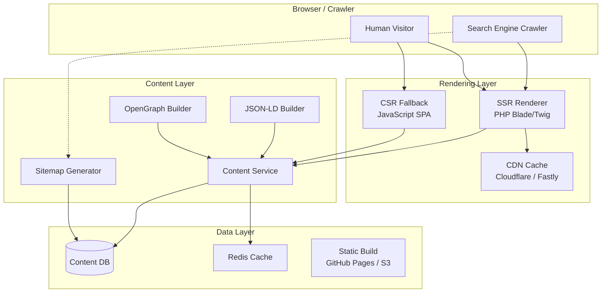
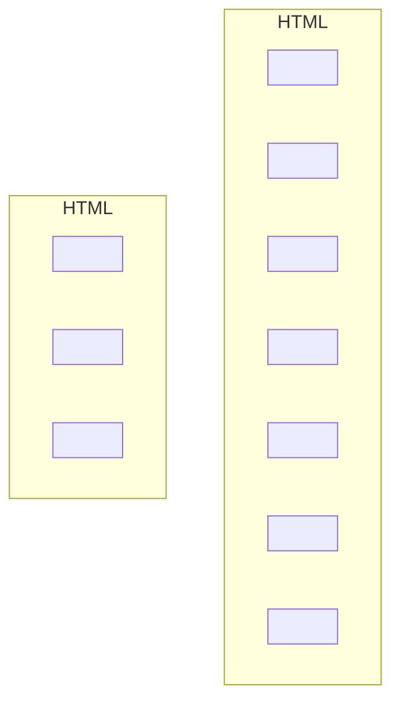
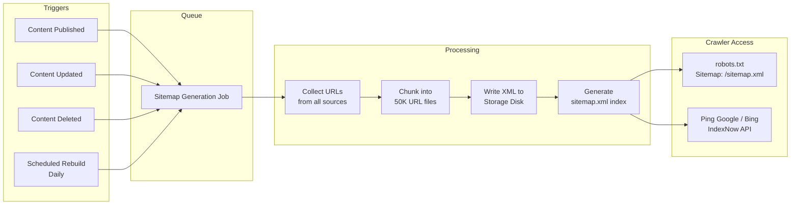

# SEO Optimization Strategy

> **Navigation:** [Developer Portal](developer-portal.md) | [Rate Limiting Strategy](rate-limiting-strategy.md)
>
> **Applies To:** BRIDGE-01 (Public Content Endpoints)
>
> **Cross-Reference:** [Hub Scale Guide](../operations/hub-scale-guide.md) | [Cache Invalidation Strategies](../cache-patterns/cache-invalidation-strategies.md)
>
> **Status:** 🔧 Design

---

## 1. Architecture Overview

SEO effectiveness directly impacts DGLab's discoverability through organic search. This strategy addresses the weakness of relying on perfect client-side markup by implementing **server-side rendering** for critical content paths, **structured data** for rich snippets, **dynamic sitemaps** for crawler guidance, and **Core Web Vitals monitoring** for ranking performance.

### 1.1 SEO Pipeline



### 1.2 Rendering Decision Matrix

| Content Type | Render Strategy | Cache Strategy | Crawlability |
|-------------|----------------|----------------|--------------|
| Public landing pages | **SSR** (PHP Blade) | CDN edge cache (TTL: 1 hour) | ✅ 100% |
| Public content pages | **SSR** (PHP Blade) | CDN edge cache (TTL: 1 hour) | ✅ 100% |
| Public listing pages | **SSR** (PHP Blade) | CDN edge cache (TTL: 15 min) | ✅ 100% |
| Static pages (About, TOS) | **SSR** (static build) | CDN edge cache (TTL: 24 hours) | ✅ 100% |
| Authenticated pages | **CSR** (SPA) | CDN cache: private, no-store | ⚠️ Blocked by robots.txt |
| Admin dashboard | **CSR** (SPA) | CDN cache: private, no-store | ❌ Blocked |

---

## 2. Server-Side Rendering

### 2.1 SSR Middleware

```php
<?php
namespace Sovereign\External\SEO;

class SSRMiddleware
{
    private array $publicPaths = [
        '/',
        '/content/*',
        '/series/*',
        '/author/*',
        '/search',
        '/about',
        '/terms',
        '/privacy',
        '/contact',
    ];

    /**
     * Determine if the request should be server-side rendered.
     * Returns the rendered HTML or passes through to the SPA.
     */
    public function handle(Request $request, callable $next): Response
    {
        // Only SSR for GET requests to public paths
        if (!$request->isMethod('GET') || !$this->isPublicPath($request->path())) {
            return $next($request);
        }

        // Check CDN cache first
        $cached = $this->checkEdgeCache($request);
        if ($cached) {
            return $cached->withHeaders(['X-Cache' => 'HIT', 'X-SSR' => '1']);
        }

        // Detect crawler user-agent
        $isCrawler = $this->isSearchCrawler($request->userAgent());
        $acceptsHtml = str_contains($request->header('Accept'), 'text/html');

        if ($isCrawler || $acceptsHtml) {
            return $this->renderServerSide($request);
        }

        // Default: let SPA handle it
        return $next($request);
    }

    /**
     * Render a page server-side and return full HTML.
     */
    private function renderServerSide(Request $request): Response
    {
        $startTime = microtime(true);

        // Fetch data from content service
        $contentService = app(ContentService::class);
        $content = $contentService->forPath($request->path());

        // Render Blade template with content
        $html = view('ssr.layout', [
            'title' => $content->metaTitle,
            'description' => $content->metaDescription,
            'content' => $content->body,
            'jsonLd' => $this->buildJsonLd($content),
            'openGraph' => $this->buildOpenGraph($content),
            'canonical' => $request->url(),
        ])->render();

        $durationMs = (microtime(true) - $startTime) * 1000;

        // Record SSR performance metric
        app(SEOMetrics::class)->recordSsrDuration($durationMs);

        return response($html)
            ->header('Content-Type', 'text/html; charset=UTF-8')
            ->header('X-SSR', '1')
            ->header('X-SSR-Duration-Ms', (string) round($durationMs, 1));
    }

    private function isPublicPath(string $path): bool
    {
        foreach ($this->publicPaths as $pattern) {
            if (fnmatch($pattern, $path)) {
                return true;
            }
        }
        return false;
    }

    /**
     * Detect known search engine crawlers by user-agent.
     */
    private function isSearchCrawler(?string $userAgent): bool
    {
        if (empty($userAgent)) {
            return false;
        }

        $crawlerPatterns = [
            'Googlebot', 'Bingbot', 'Slurp', 'DuckDuckBot',
            'Baiduspider', 'YandexBot', 'facebot', 'facebookexternalhit',
            'Twitterbot', 'LinkedInBot', 'Pinterestbot',
            'SemrushBot', 'AhrefsBot', 'MozBot',
        ];

        foreach ($crawlerPatterns as $pattern) {
            if (str_contains($userAgent, $pattern)) {
                return true;
            }
        }

        return false;
    }
}
```

### 2.2 SSR Performance Targets

| Metric | Target | Measurement |
|--------|--------|-------------|
| SSR render time (P50) | < 50ms | `X-SSR-Duration-Ms` header |
| SSR render time (P99) | < 200ms | `X-SSR-Duration-Ms` header |
| CDN cache hit ratio | > 90% | CDN analytics |
| First Byte Time (TTFB) | < 200ms | Lighthouse / CrUX |
| SSR availability | > 99.99% | Health check endpoint |

### 2.3 CDN Cache Configuration

```php
<?php
namespace Sovereign\External\SEO;

class CDNCacheConfig
{
    /**
     * Get cache TTL configuration per content type.
     */
    public function getCacheHeaders(string $contentType): array
    {
        return match ($contentType) {
            'landing_page' => [
                'Cache-Control' => 'public, max-age=3600, s-maxage=3600, stale-while-revalidate=86400',
                'CDN-TTL' => '3600',
            ],
            'content_page' => [
                'Cache-Control' => 'public, max-age=3600, s-maxage=3600, stale-while-revalidate=86400',
                'CDN-TTL' => '3600',
            ],
            'listing_page' => [
                'Cache-Control' => 'public, max-age=900, s-maxage=900, stale-while-revalidate=3600',
                'CDN-TTL' => '900',
            ],
            'static_page' => [
                'Cache-Control' => 'public, max-age=86400, s-maxage=86400, immutable',
                'CDN-TTL' => '86400',
            ],
            'api_response' => [
                'Cache-Control' => 'no-cache, private',
                'CDN-TTL' => '0',
            ],
            default => [
                'Cache-Control' => 'public, max-age=300',
                'CDN-TTL' => '300',
            ],
        };
    }

    /**
     * Purge CDN cache for a specific URL when content changes.
     */
    public function purgeUrl(string $url): void
    {
        // Cloudflare API example
        $cfApi = app(CloudflareClient::class);
        $cfApi->purgeCache([
            'files' => [$url],
        ]);
    }

    /**
     * Purge CDN cache by tag pattern (e.g., all content/* pages).
     */
    public function purgeByTag(string $tag): void
    {
        // Fastly / Cloudflare surrogate-key based purge
        $cfApi = app(CloudflareClient::class);
        $cfApi->purgeCacheByTag($tag);
    }
}
```

---

## 3. Structured Data

### 3.1 JSON-LD Schema.org Integration

```php
<?php
namespace Sovereign\External\SEO;

class JsonLdBuilder
{
    /**
     * Build JSON-LD structured data for a content page.
     * Returns a <script type="application/ld+json"> block.
     */
    public function buildForContent(Content $content): string
    {
        $jsonLd = match ($content->type) {
            'article' => $this->buildArticle($content),
            'series' => $this->buildSeries($content),
            'author' => $this->buildAuthor($content),
            'page' => $this->buildWebPage($content),
            default => $this->buildWebPage($content),
        };

        return sprintf(
            '<script type="application/ld+json">%s</script>',
            json_encode($jsonLd, JSON_UNESCAPED_SLASHES | JSON_UNESCAPED_UNICODE)
        );
    }

    /**
     * Article schema — for individual content pieces.
     */
    private function buildArticle(Content $content): array
    {
        return [
            '@context' => 'https://schema.org',
            '@type' => 'Article',
            'headline' => $content->title,
            'description' => $content->excerpt,
            'image' => $content->featuredImage,
            'datePublished' => $content->publishedAt->format('c'),
            'dateModified' => $content->updatedAt->format('c'),
            'author' => [
                '@type' => 'Person',
                'name' => $content->author->name,
                'url' => $content->author->url,
            ],
            'publisher' => [
                '@type' => 'Organization',
                'name' => config('app.name'),
                'logo' => [
                    '@type' => 'ImageObject',
                    'url' => config('app.url') . '/logo.png',
                    'width' => 600,
                    'height' => 60,
                ],
            ],
            'mainEntityOfPage' => [
                '@type' => 'WebPage',
                '@id' => $content->url,
            ],
            'wordCount' => $content->wordCount,
            'inLanguage' => $content->language ?? 'en',
        ];
    }

    /**
     * BreadcrumbList — for every page to show hierarchy.
     */
    public function buildBreadcrumbs(array $crumbs): string
    {
        $items = [];
        $position = 1;

        foreach ($crumbs as $crumb) {
            $items[] = [
                '@type' => 'ListItem',
                'position' => $position++,
                'name' => $crumb['label'],
                'item' => $crumb['url'],
            ];
        }

        $jsonLd = [
            '@context' => 'https://schema.org',
            '@type' => 'BreadcrumbList',
            'itemListElement' => $items,
        ];

        return sprintf(
            '<script type="application/ld+json">%s</script>',
            json_encode($jsonLd, JSON_UNESCAPED_SLASHES)
        );
    }

    /**
     * Organization schema — for homepage.
     */
    public function buildOrganization(): string
    {
        $jsonLd = [
            '@context' => 'https://schema.org',
            '@type' => 'Organization',
            'name' => config('app.name'),
            'url' => config('app.url'),
            'logo' => config('app.url') . '/logo.png',
            'sameAs' => [
                'https://twitter.com/dglab',
                'https://github.com/dglab',
                'https://linkedin.com/company/dglab',
            ],
        ];

        return sprintf(
            '<script type="application/ld+json">%s</script>',
            json_encode($jsonLd, JSON_UNESCAPED_SLASHES)
        );
    }
}
```

### 3.2 OpenGraph & Twitter Card Integration

```php
<?php
namespace Sovereign\External\SEO;

class OpenGraphBuilder
{
    /**
     * Build OpenGraph meta tags for social sharing previews.
     *
     * @return array<string, string> Key-value pairs of meta tag properties/content
     */
    public function buildForContent(Content $content): array
    {
        return [
            'og:title' => $content->ogTitle ?? $content->title,
            'og:description' => $content->ogDescription ?? $content->excerpt,
            'og:image' => $content->ogImage ?? $content->featuredImage,
            'og:image:width' => '1200',
            'og:image:height' => '630',
            'og:url' => $content->url,
            'og:type' => $content->type === 'article' ? 'article' : 'website',
            'og:site_name' => config('app.name'),
            'og:locale' => $content->language ?? 'en_US',
            'og:updated_time' => $content->updatedAt->format('c'),
            'article:published_time' => $content->publishedAt?->format('c'),
            'article:modified_time' => $content->updatedAt->format('c'),
            'article:author' => $content->author?->url,
            // Twitter Card
            'twitter:card' => 'summary_large_image',
            'twitter:title' => $content->ogTitle ?? $content->title,
            'twitter:description' => $content->ogDescription ?? $content->excerpt,
            'twitter:image' => $content->ogImage ?? $content->featuredImage,
            'twitter:site' => '@dglab',
            'twitter:creator' => $content->author?->twitter ?? '@dglab',
        ];
    }

    /**
     * Render OpenGraph meta tags as HTML.
     */
    public function renderMetaTags(Content $content): string
    {
        $tags = $this->buildForContent($content);
        $html = '';

        foreach ($tags as $property => $value) {
            if (empty($value)) {
                continue;
            }

            $prefix = str_starts_with($property, 'twitter:') ? 'name' : 'property';
            $html .= sprintf(
                '<meta %s="%s" content="%s">' . "\n",
                $prefix,
                e($property),
                e($value),
            );
        }

        return $html;
    }
}
```

### 3.3 Structured Data Placement



### 3.4 Canonical URL & Hreflang

```php
<?php
namespace Sovereign\External\SEO;

class CanonicalUrlBuilder
{
    /**
     * Build canonical URL and hreflang tags for multi-language content.
     */
    public function buildAlternateLinks(Content $content): array
    {
        $links = [];

        foreach ($content->translations as $translation) {
            $links[] = sprintf(
                '<link rel="alternate" hreflang="%s" href="%s">',
                e($translation->language),
                e($translation->url),
            );
        }

        // Default x-default (usually English)
        $links[] = sprintf(
            '<link rel="alternate" hreflang="x-default" href="%s">',
            e($content->defaultUrl),
        );

        return $links;
    }
}
```

---

## 4. Dynamic Sitemap Generation

### 4.1 Sitemap Generator

```php
<?php
namespace Sovereign\External\SEO;

class SitemapGenerator
{
    const MAX_URLS_PER_SITEMAP = 50000;
    const MAX_SITEMAP_SIZE_BYTES = 52428800; // 50MB

    /**
     * Generate all sitemaps and a sitemap index.
     * Called on content changes via a queued job.
     */
    public function generateAll(): void
    {
        // Collect all URL sources
        $urlSets = [
            'static' => $this->getStaticUrls(),
            'content' => $this->getContentUrls(),
            'authors' => $this->getAuthorUrls(),
            'series' => $this->getSeriesUrls(),
        ];

        $sitemapFiles = [];

        foreach ($urlSets as $type => $urls) {
            $chunks = array_chunk($urls, self::MAX_URLS_PER_SITEMAP);

            foreach ($chunks as $i => $chunk) {
                $filename = "sitemap-{$type}" . ($i > 0 ? "-{$i}" : '') . '.xml';
                $this->writeSitemap($filename, $chunk);
                $sitemapFiles[] = [
                    'loc' => config('app.url') . "/{$filename}",
                    'lastmod' => now()->format('c'),
                ];
            }
        }

        // Generate sitemap index
        $this->writeSitemapIndex($sitemapFiles);
    }

    /**
     * Write a single sitemap XML file.
     */
    private function writeSitemap(string $filename, array $urls): void
    {
        $xml = '<?xml version="1.0" encoding="UTF-8"?>' . "\n";
        $xml .= '<urlset xmlns="http://www.sitemaps.org/schemas/sitemap/0.9">' . "\n";

        foreach ($urls as $url) {
            $xml .= "  <url>\n";
            $xml .= "    <loc>" . e($url['loc']) . "</loc>\n";
            $xml .= "    <lastmod>" . e($url['lastmod'] ?? now()->format('c')) . "</lastmod>\n";
            $xml .= "    <changefreq>" . e($url['changefreq'] ?? 'weekly') . "</changefreq>\n";
            $xml .= "    <priority>" . e((string) ($url['priority'] ?? '0.5')) . "</priority>\n";
            $xml .= "  </url>\n";
        }

        $xml .= '</urlset>';

        Storage::disk('public')->put("sitemaps/{$filename}", $xml);
    }

    /**
     * Write the sitemap index file.
     */
    private function writeSitemapIndex(array $sitemaps): void
    {
        $xml = '<?xml version="1.0" encoding="UTF-8"?>' . "\n";
        $xml .= '<sitemapindex xmlns="http://www.sitemaps.org/schemas/sitemap/0.9">' . "\n";

        foreach ($sitemaps as $sitemap) {
            $xml .= "  <sitemap>\n";
            $xml .= "    <loc>" . e($sitemap['loc']) . "</loc>\n";
            $xml .= "    <lastmod>" . e($sitemap['lastmod']) . "</lastmod>\n";
            $xml .= "  </sitemap>\n";
        }

        $xml .= '</sitemapindex>';

        Storage::disk('public')->put('sitemap.xml', $xml);
    }

    /**
     * Get static page URLs with fixed priority.
     */
    private function getStaticUrls(): array
    {
        return [
            ['loc' => route('home'), 'changefreq' => 'weekly', 'priority' => '1.0'],
            ['loc' => route('about'), 'changefreq' => 'monthly', 'priority' => '0.6'],
            ['loc' => route('terms'), 'changefreq' => 'monthly', 'priority' => '0.3'],
            ['loc' => route('privacy'), 'changefreq' => 'monthly', 'priority' => '0.3'],
            ['loc' => route('contact'), 'changefreq' => 'yearly', 'priority' => '0.4'],
        ];
    }

    /**
     * Get all published content URLs from the database.
     */
    private function getContentUrls(): array
    {
        return app('db')->table('contents')
            ->where('status', 'published')
            ->where('visibility', 'public')
            ->orderBy('updated_at', 'desc')
            ->get()
            ->map(fn ($item) => [
                'loc' => route('content.show', $item->slug),
                'lastmod' => $item->updated_at,
                'changefreq' => 'weekly',
                'priority' => $this->computePriority($item),
            ])
            ->toArray();
    }

    /**
     * Compute priority based on content engagement metrics.
     */
    private function computePriority($content): string
    {
        // Older content gets lower priority
        $daysSinceUpdate = now()->diffInDays($content->updated_at);

        return match (true) {
            $daysSinceUpdate < 7 => '0.9',
            $daysSinceUpdate < 30 => '0.8',
            $daysSinceUpdate < 90 => '0.7',
            $daysSinceUpdate < 180 => '0.6',
            default => '0.5',
        };
    }
}
```

### 4.2 Sitemap Generation Pipeline



### 4.3 Robots.txt Configuration

```
# robots.txt for dglab.io

User-agent: *
Allow: /
Disallow: /api/
Disallow: /admin/
Disallow: /auth/
Disallow: /dashboard/
Disallow: /_debug/
Disallow: /storage/tmp/

Sitemap: https://dglab.io/sitemap.xml

# Crawl rate: respect Google's Crawl Rate Limit
# Target: 10 requests per second
```

### 4.4 IndexNow Integration

```php
<?php
namespace Sovereign\External\SEO;

class IndexNowClient
{
    private string $apiKey;
    private string $endpoint = 'https://api.indexnow.org/indexnow';

    /**
     * Submit URLs to IndexNow for immediate indexing.
     * Called when content is published or significantly updated.
     */
    public function submitUrls(array $urls): bool
    {
        $chunks = array_chunk($urls, 10000);

        foreach ($chunks as $chunk) {
            $payload = [
                'host' => parse_url(config('app.url'), PHP_URL_HOST),
                'key' => $this->apiKey,
                'keyLocation' => config('app.url') . '/' . $this->apiKey . '.txt',
                'urlList' => $chunk,
            ];

            $response = Http::post($this->endpoint, $payload);

            if (!$response->successful()) {
                logger()->error('IndexNow submission failed', [
                    'status' => $response->status(),
                    'response' => $response->body(),
                ]);
                return false;
            }
        }

        return true;
    }
}
```

---

## 5. Core Web Vitals Monitoring

### 5.1 Real User Monitoring (RUM)

```php
<?php
namespace Sovereign\External\SEO;

class WebVitalsRUM
{
    /**
     * Capture Core Web Vitals from real user browsers.
     * Sent via navigator.sendBeacon() from the frontend.
     *
     * POST /_vitals
     */
    public function capture(Request $request): JsonResponse
    {
        $data = $request->validate([
            'lcp' => 'required|numeric',       // Largest Contentful Paint (ms)
            'fid' => 'required|numeric',       // First Input Delay (ms)
            'cls' => 'required|numeric',       // Cumulative Layout Shift (score)
            'inp' => 'nullable|numeric',       // Interaction to Next Paint (ms)
            'ttfb' => 'nullable|numeric',      // Time to First Byte (ms)
            'fcp' => 'nullable|numeric',       // First Contentful Paint (ms)
            'url' => 'required|string',        // Page URL
            'device' => 'required|string',      // mobile | desktop | tablet
            'connection' => 'nullable|string',  // 4g | 3g | 2g | slow-2g
        ]);

        // Store in time-series database
        app('db')->table('web_vitals')->insert([
            'url' => $data['url'],
            'device' => $data['device'],
            'connection' => $data['connection'] ?? 'unknown',
            'lcp' => $data['lcp'],
            'fid' => $data['fid'],
            'cls' => $data['cls'],
            'inp' => $data['inp'] ?? null,
            'ttfb' => $data['ttfb'] ?? null,
            'fcp' => $data['fcp'] ?? null,
            'recorded_at' => now(),
            'project' => config('app.name'),
        ]);

        // Update Prometheus metrics
        app(SEOMetrics::class)->recordWebVital(
            $data['url'],
            $data['lcp'],
            $data['fid'],
            $data['cls'],
        );

        return response()->json(['status' => 'ok']);
    }
}
```

### 5.2 Core Web Vitals Targets

| Metric | Good | Needs Improvement | Poor | Measurement Method |
|--------|------|-------------------|------|-------------------|
| **LCP** (Largest Contentful Paint) | < 2.5s | 2.5s - 4.0s | > 4.0s | Chrome UX Report + RUM |
| **FID** (First Input Delay) | < 100ms | 100ms - 300ms | > 300ms | Chrome UX Report + RUM |
| **INP** (Interaction to Next Paint) | < 200ms | 200ms - 500ms | > 500ms | Chrome UX Report + RUM |
| **CLS** (Cumulative Layout Shift) | < 0.1 | 0.1 - 0.25 | > 0.25 | Chrome UX Report + RUM |

### 5.3 Optimization Strategies

```php
<?php
namespace Sovereign\External\SEO;

class WebVitalOptimizer
{
    /**
     * Strategies for improving LCP.
     */
    public function optimizeLCP(): array
    {
        return [
            'compress_images' => [
                'action' => 'Enable WebP/AVIF with responsive srcset',
                'impact' => 'High',
                'effort' => 'Low',
            ],
            'preload_hero' => [
                'action' => 'Add <link rel="preload"> for hero image',
                'impact' => 'High',
                'effort' => 'Low',
            ],
            'minimize_css_blocking' => [
                'action' => 'Inline critical CSS, defer non-critical',
                'impact' => 'Medium',
                'effort' => 'Medium',
            ],
            'server_response_time' => [
                'action' => 'Optimize SSR templates, use CDN cache',
                'impact' => 'Medium',
                'effort' => 'Medium',
            ],
            'remove_render_blocking_js' => [
                'action' => 'Defer non-critical JS with async/defer',
                'impact' => 'Medium',
                'effort' => 'Low',
            ],
        ];
    }

    /**
     * Strategies for improving FID/INP.
     */
    public function optimizeFID(): array
    {
        return [
            'code_splitting' => [
                'action' => 'Split JavaScript into route-based chunks',
                'impact' => 'High',
                'effort' => 'High',
            ],
            'long_tasks_breakup' => [
                'action' => 'Break long JS tasks (>50ms) into yield points',
                'impact' => 'High',
                'effort' => 'Medium',
            ],
            'web_worker_offload' => [
                'action' => 'Move heavy computation to Web Workers',
                'impact' => 'Medium',
                'effort' => 'High',
            ],
            'preconnect_origins' => [
                'action' => 'Add <link rel="preconnect"> for third-party origins',
                'impact' => 'Low',
                'effort' => 'Low',
            ],
        ];
    }

    /**
     * Strategies for improving CLS.
     */
    public function optimizeCLS(): array
    {
        return [
            'image_dimensions' => [
                'action' => 'Always set width/height attributes on images',
                'impact' => 'High',
                'effort' => 'Low',
            ],
            'font_display' => [
                'action' => 'Use font-display: swap with preload',
                'impact' => 'High',
                'effort' => 'Low',
            ],
            'ad_placeholders' => [
                'action' => 'Reserve space for dynamic content (ads, embeds)',
                'impact' => 'Medium',
                'effort' => 'Medium',
            ],
            'avoid_dynamic_injections' => [
                'action' => 'Avoid inserting content above existing content after paint',
                'impact' => 'Medium',
                'effort' => 'Low',
            ],
            'aspect_ratio_containers' => [
                'action' => 'Use aspect-ratio CSS for video/iframe embeds',
                'impact' => 'Medium',
                'effort' => 'Low',
            ],
        ];
    }
}
```

### 5.4 Prometheus Metrics for Web Vitals

```php
<?php
namespace Sovereign\External\SEO;

class SEOMetrics
{
    private Histogram $lcpHistogram;
    private Histogram $fidHistogram;
    private Histogram $clsHistogram;
    private Histogram $ssrDuration;
    private Counter $ssrRequestCount;

    /**
     * Record a Core Web Vital from real user monitoring.
     */
    public function recordWebVital(string $url, float $lcp, float $fid, float $cls): void
    {
        $labels = [
            'url' => $this->sanitizeUrl($url),
            'device' => $this->getDeviceType(),
        ];

        $this->lcpHistogram->observe($lcp / 1000, $labels);    // Convert to seconds
        $this->fidHistogram->observe($fid / 1000, $labels);
        $this->clsHistogram->observe($cls, $labels);
    }

    /**
     * Record SSR rendering duration.
     */
    public function recordSsrDuration(float $durationMs): void
    {
        $this->ssrDuration->observe($durationMs / 1000);
        $this->ssrRequestCount->inc();
    }

    private function sanitizeUrl(string $url): string
    {
        // Strip query parameters and hash for aggregation
        return strtok($url, '?') ?? $url;
    }
}
```

### 5.5 Dashboard Panels

| Panel | Type | Description |
|-------|------|-------------|
| LCP Distribution | Histogram | % Good / Needs Improvement / Poor over time |
| FID Distribution | Histogram | % Good / Needs Improvement / Poor over time |
| CLS Distribution | Histogram | % Good / Needs Improvement / Poor over time |
| Web Vitals by URL | Table | Top 20 URLs ranked by passing rate |
| Web Vitals by Device | Stacked bar | Mobile vs Desktop performance |
| SSR Duration | Time series | P50 / P95 / P99 render time |
| Cache Hit Ratio | Time series | CDN cache effectiveness |
| Crawl Budget Usage | Time series | Crawl requests per day |

---

## 6. Configuration Reference

```php
<?php
// config/seo.php
return [
    'ssr' => [
        'enabled' => env('SSR_ENABLED', true),
        'crawler_detection' => env('SSR_CRAWLER_DETECTION', true),
        'cache_ttl' => [
            'landing' => env('SSR_CACHE_LANDING_TTL', 3600),
            'content' => env('SSR_CACHE_CONTENT_TTL', 3600),
            'listing' => env('SSR_CACHE_LISTING_TTL', 900),
            'static' => env('SSR_CACHE_STATIC_TTL', 86400),
        ],
        'public_paths' => [
            '/', '/content/*', '/series/*', '/author/*',
            '/search', '/about', '/terms', '/privacy', '/contact',
        ],
    ],

    'structured_data' => [
        'jsonld' => env('SEO_JSONLD_ENABLED', true),
        'opengraph' => env('SEO_OPENGRAPH_ENABLED', true),
        'twitter_cards' => env('SEO_TWITTER_CARDS_ENABLED', true),
        'organization_name' => env('APP_NAME', 'DGLab'),
        'organization_logo' => '/logo.png',
        'social_profiles' => [
            'https://twitter.com/dglab',
            'https://github.com/dglab',
        ],
    ],

    'sitemap' => [
        'max_urls_per_file' => env('SITEMAP_MAX_URLS', 50000),
        'auto_generate' => env('SITEMAP_AUTO_GENERATE', true),
        'generation_schedule' => env('SITEMAP_CRON', '0 3 * * *'), // Daily at 3 AM
        'indexnow_enabled' => env('SITEMAP_INDEXNOW_ENABLED', true),
        'priority_calculation' => env('SITEMAP_PRIORITY_AGE_BASED', true),
    ],

    'web_vitals' => [
        'rum_enabled' => env('WEB_VITALS_RUM_ENABLED', true),
        'rum_sample_rate' => env('WEB_VITALS_RUM_SAMPLE_RATE', 0.1), // 10% of visitors
        'targets' => [
            'lcp_good' => 2500,    // ms
            'lcp_poor' => 4000,    // ms
            'fid_good' => 100,     // ms
            'fid_poor' => 300,     // ms
            'cls_good' => 0.1,
            'cls_poor' => 0.25,
        ],
        'dashboard_refresh' => env('WEB_VITALS_DASHBOARD_REFRESH', 300), // 5 min
    ],
];
```

---

## 7. Monitoring & Alerting

### 7.1 Key Alerts

| Alert Name | Condition | Severity | Response |
|------------|-----------|----------|----------|
| `LCPDegraded` | LCP > 2.5s for > 10% of visits in 1 hour | Warning | Investigate SSR performance, CDN cache hit ratio |
| `CLSDegraded` | CLS > 0.1 for > 10% of visits | Warning | Check layout shifts from dynamic content |
| `SsrDurationHigh` | P99 SSR render time > 500ms over 5 min | Warning | Optimize content service queries, scale SSR workers |
| `SitemapGenerationFailed` | Sitemap generation job failed | Warning | Check storage, disk space, content service availability |
| `CrawlBudgetExceeded` | Crawl requests > 1000/s for > 10 min | Info | Review robots.txt crawl-delay; may indicate bot attack |
| `IndexNowSubmissionFailed` | IndexNow API returns errors | Info | Check API key, rate limits |

### 7.2 CrUX API Integration

```php
<?php
namespace Sovereign\External\SEO;

class CrUXClient
{
    /**
     * Fetch Chrome User Experience Report data for a URL.
     * Used to cross-reference RUM data with Google's own metrics.
     */
    public function getUrlVitals(string $url): ?array
    {
        $response = Http::post('https://chromeuxreport.googleapis.com/v1/records:queryRecord', [
            'key' => config('services.crux.api_key'),
            'url' => $url,
            'formFactor' => 'DESKTOP', // or PHONE
        ]);

        if (!$response->successful()) {
            return null;
        }

        $data = $response->json();
        $record = $data['record']['metrics'] ?? [];

        return [
            'lcp' => $this->extractPercentile($record, 'largest_contentful_paint'),
            'fid' => $this->extractPercentile($record, 'first_input_delay'),
            'cls' => $this->extractPercentile($record, 'cumulative_layout_shift'),
        ];
    }

    private function extractPercentile(array $metrics, string $name): ?array
    {
        $metric = $metrics[$name] ?? null;
        if (!$metric || !isset($metric['percentiles']['p75'])) {
            return null;
        }

        return [
            'p75' => $metric['percentiles']['p75'],
            'good_proportion' => $metric['histogram'][0]['density'] ?? 0,
            'ni_proportion' => $metric['histogram'][1]['density'] ?? 0,
            'poor_proportion' => $metric['histogram'][2]['density'] ?? 0,
        ];
    }
}
```

---

## 8. Testing Strategy

| Test | Description | Tool |
|------|-------------|------|
| SSR HTML validation | Verify SSR output includes all required meta tags | PHPUnit + DOM crawler |
| JSON-LD validation | Verify JSON-LD is valid and matches schema.org specs | Google Rich Results Test |
| Sitemap validation | Verify sitemap XML meets protocol standards | XSD validation |
| Web Vitals regression | Verify Core Web Vitals stay within thresholds | Lighthouse CI |
| Crawl simulation | Verify Googlebot can discover all public content | Google Search Console |
| CDN cache test | Verify correct Cache-Control headers for each content type | curl + header inspection |

---

## 9. Success Metrics

| Metric | Target | Verification Method |
|--------|--------|---------------------|
| Public content indexability | 100% of public URLs indexable | Search Console index coverage report |
| LCP (Good rate) | > 90% of visits | CrUX API + RUM |
| FID (Good rate) | > 95% of visits | CrUX API + RUM |
| CLS (Good rate) | > 90% of visits | CrUX API + RUM |
| Organic search traffic increase | +25% within 3 months | Google Analytics / Search Console |
| Sitemap generation reliability | 99.9% of scheduled runs succeed | Monitoring + alerting |
| Structured data coverage | 100% of content pages have JSON-LD | Automated audit |

---

## 10. Related Blueprints

| Blueprint | Role in SEO |
|-----------|-------------|
| [BRIDGE-01](../../../blueprints/External/BRIDGE-01.md) | API Gateway — serves SSR content to crawlers |
| [HUB-02](../../../blueprints/Hub/HUB-02.md) | Cache — CDN edge cache configuration |
| [HUB-06](../../../blueprints/Hub/HUB-06.md) | Audit logging — content change tracking for sitemap generation |
| [HUB-08](../../../blueprints/Hub/HUB-08.md) | Routing — SSR path routing and middleware |
| [HUB-15](../../../blueprints/Hub/HUB-15.md) | Monitoring — Web Vitals dashboard and alerting |

---

> **Document Version:** 1.0
> **Last Updated:** Current Session
> **Status:** 🔧 Design
> **Review Cycle:** Quarterly