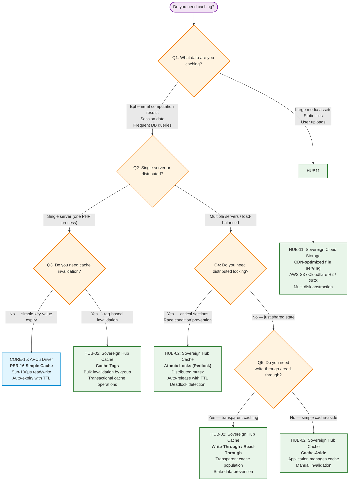

# Choosing the Right Cache Solution

> **Navigation:** [Hub Categories](hub-categories.md) | [Blueprint Taxonomy](hub-blueprint-taxonomy.md) | [Dependency Graph](hub-dependency-graph.md)
>
> **Other Decision Trees:** [Persistence Selector](persistence-pattern-selector.md) | [Queue Selector](queue-solution-selector.md)

---

## Decision Tree Flowchart



---

## Detailed Decision Matrix

### Scenario-Based Guide

| Your Need | Recommended Solution | Blueprint | Why |
|-----------|---------------------|-----------|-----|
| **Single-server session storage** | APCu driver (PSR-16) | [CORE-15](../blueprints/Core/CORE-15.md) | Sub-100μs reads, shared memory, no network overhead |
| **Multi-server session sharing** | Redis-backed cache (PSR-16) | [HUB-02](../blueprints/Hub/HUB-02.md) | All servers share the same Redis instance |
| **Cache a user's permission set** | Cache Tags | [HUB-02](../blueprints/Hub/HUB-02.md) | Tag permissions by role; invalidate all users when role changes |
| **Prevent duplicate job processing** | Atomic Lock (Redlock) | [HUB-02](../blueprints/Hub/HUB-02.md) | Ensures only one worker processes a job |
| **Transparent DB query caching** | Read-Through Cache | [HUB-02](../blueprints/Hub/HUB-02.md) | Automatically populates cache on miss; writes update cache |
| **Rate limiting counters** | Cache Tags with Atomic Locks | [HUB-02](../blueprints/Hub/HUB-02.md) + [HUB-07](../blueprints/Hub/HUB-07.md) | Atomic increment + tag-based reset; sub-millisecond |
| **Serve optimized images** | CDN + Cloud Storage | [HUB-11](../blueprints/Hub/HUB-11.md) | File-level caching at edge; no application cache needed |
| **HTML fragment caching** | Write-Through Cache | [HUB-02](../blueprints/Hub/HUB-02.md) + [HUB-03](../blueprints/Hub/HUB-03.md) | Cache rendered fragments; invalidate on asset change |

---

## Cache Pattern Comparison

| Pattern | Use Case | Consistency | Complexity | Performance |
|---------|----------|-------------|------------|-------------|
| **Cache-Aside** | General purpose | Eventual | Low | <1ms (Redis) |
| **Read-Through** | DB query results | Strong with write-through | Medium | <1ms (Redis) |
| **Write-Through** | Data that must stay fresh | Strong | Medium | <2ms (write penalty) |
| **Cache Tags** | Bulk invalidation | Eventual | Medium | <1ms lookup + O(n) invalidation |
| **Atomic Locks** | Distributed mutex | Strong | Low | <5ms acquire/release |
| **APCu Simple** | Single-server ephemeral | Process-local | Minimal | <100μs |

---

## Common Anti-Patterns to Avoid

| Anti-Pattern | Why It's Wrong | Correct Approach |
|--------------|---------------|------------------|
| **Caching user sessions in APCu with load balancer** | Sessions lost when request goes to different server | Use HUB-02 with Redis |
| **Using cache-aside for rate limiting counters** | Race conditions on concurrent requests | Use HUB-02 Atomic Locks with HUB-07 |
| **Manual cache invalidation loops** | Error-prone, hard to maintain | Use HUB-02 Cache Tags for bulk invalidation |
| **Caching large media files in Redis** | Wastes memory, evicts useful keys | Use HUB-11 Cloud Storage with CDN |
| **No TTL on cached items** | Memory leak, stale data | Always set appropriate TTL |

---

## Quick Decision Card

```text
┌─────────────────────────────────────────────────────────────────────┐
│                    CACHE SOLUTION QUICK CARD                         │
├─────────────────────────────────────────────────────────────────────┤
│                                                                      │
│  NEED SINGLE-SERVER?  ───> CORE-15 (APCu) — sub-100μs              │
│  NEED DISTRIBUTED?    ───> HUB-02 (Redis) — sub-1ms                 │
│  NEED LOCKING?        ───> HUB-02 (Atomic Locks) — Redlock         │
│  NEED TAG INVALID?    ───> HUB-02 (Cache Tags) — bulk               │
│  NEED FILE CACHE?     ───> HUB-11 (Cloud Storage) — CDN edge       │
│                                                                      │
│  ALWAYS SET TTL. NEVER CACHE LARGE FILES IN REDIS.                  │
└─────────────────────────────────────────────────────────────────────┘
```

---

## Related Blueprints

| Blueprint | Role in Caching |
|-----------|----------------|
| [CORE-15](../blueprints/Core/CORE-15.md) | Foundation: PSR-16 Simple Cache abstraction, APCu driver |
| [HUB-02](../blueprints/Hub/HUB-02.md) | Shared cache coordination, Cache Tags, Atomic Locks |
| [HUB-07](../blueprints/Hub/HUB-07.md) | Rate limiting using cache counters |
| [HUB-09](../blueprints/Hub/HUB-09.md) | Event Bus — triggers cache invalidation on data changes |
| [HUB-11](../blueprints/Hub/HUB-11.md) | File/cloud storage for large assets |

---

**Implementation Sequence:** CORE-15 → HUB-02 → HUB-07 → HUB-09 → HUB-11