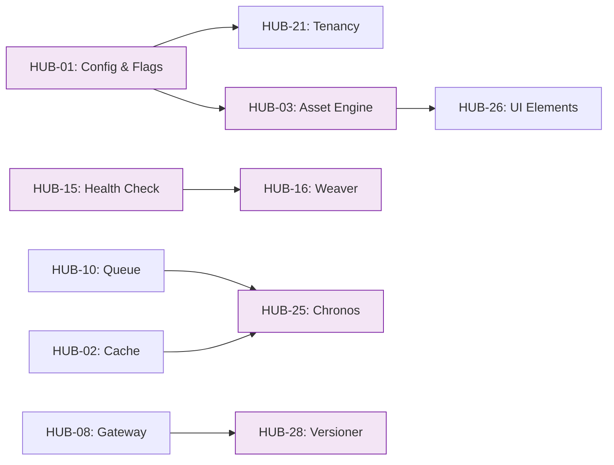
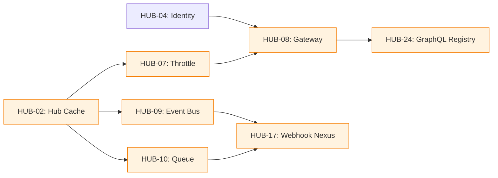
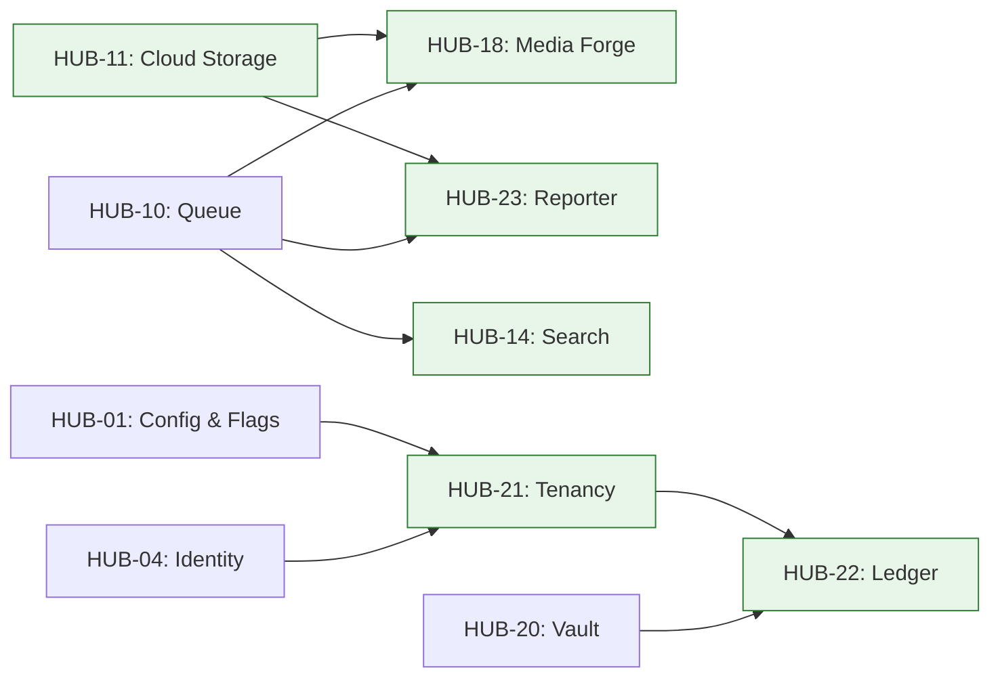
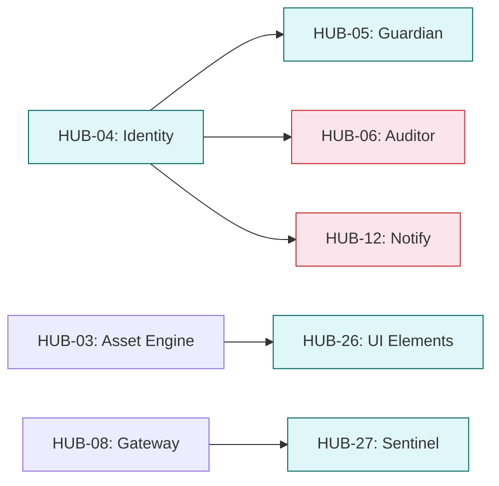

# Hub Blueprint Dependency Graph

> **Navigation:** [Hub Categories](hub-categories.md) | [Blueprint Taxonomy](hub-blueprint-taxonomy.md) | [Hub Navigation Guide](hub-navigation-guide.md)
>
> **Decision Trees:** [Cache Selector](cache-solution-selector.md) | [Persistence Selector](persistence-pattern-selector.md) | [Queue Selector](queue-solution-selector.md)

---

## Overview

This document visualizes the prerequisite relationships between Hub-tier blueprints. Understanding these dependencies is critical for:

- **Implementation planning** — knowing which blueprints must exist before others
- **Impact analysis** — understanding which services are affected when a blueprint changes
- **Onboarding** — new architects can see the "big picture" of how Hub components relate

The dependency graph is organized into **5 logical layers**, reflecting the natural build order from foundational services to high-level features.

---

## Layer 0: Core Tier Foundation

All Hub blueprints depend on Core-tier foundations. The key Core dependencies are:

```
CORE-01 (Polyrepo Orchestrator)  CORE-10 (Config)         CORE-11 (SuperPHP Compiler)
CORE-02 (DI Container)           CORE-12 (SuperPHP Runtime)
CORE-03 (Event Dispatcher)       CORE-14 (Filesystem)
CORE-04 (HTTP Message)           CORE-15 (Cache Abstraction)
CORE-06 (Router)                 CORE-16 (Encryption)
CORE-07 (Middleware Pipeline)    CORE-19 (DBAL)
CORE-08 (Error Handling)         CORE-20 (Forge CLI)
```

### Core → Hub Dependency Mapping

| Core Blueprint | Used By Hub Blueprints |
|---------------|----------------------|
| CORE-01 (Polyrepo Orchestrator) | HUB-16 (Weaver) |
| CORE-02 (DI Container) | HUB-01, HUB-02 |
| CORE-03 (Event Dispatcher) | HUB-06 (Auditor), HUB-09 (Event Bus) |
| CORE-04 (HTTP Message) | HUB-07 (Throttle), HUB-08 (Gateway), HUB-27 (Sentinel) |
| CORE-06 (Router) | HUB-08 (Gateway), HUB-28 (Versioner) |
| CORE-10 (Config) | HUB-01 (Config & Flags), HUB-03 (Asset Engine), HUB-11 (Cloud Storage), HUB-13 (Translator), HUB-15 (Health), HUB-19 (Guard) |
| CORE-11/CORE-12 (SuperPHP) | HUB-12 (Notify), HUB-26 (UI Elements) |
| CORE-14 (Filesystem) | HUB-03 (Asset Engine), HUB-11 (Cloud Storage), HUB-15 (Health) |
| CORE-15 (Cache Abstraction) | HUB-02 (Hub Cache) |
| CORE-16 (Encryption) | HUB-04 (Identity), HUB-20 (Vault) |
| CORE-19 (DBAL) | HUB-04, HUB-05, HUB-06, HUB-10, HUB-14, HUB-19, HUB-20, HUB-21 |
| CORE-20 (Forge CLI) | HUB-29 (Hub Spec), HUB-30 (Hub-CLI) |

---

## Full Dependency Graph (Mermaid)

```mermaid
graph TB
    subgraph Layer0["Layer 0: Core Foundation"]
        C01[CORE-01: Polyrepo]
        C02[CORE-02: DI Container]
        C03[CORE-03: Event Dispatcher]
        C04[CORE-04: HTTP Message]
        C06[CORE-06: Router]
        C07[CORE-07: Middleware]
        C10[CORE-10: Config]
        C11[CORE-11: SuperPHP Compiler]
        C12[CORE-12: SuperPHP Runtime]
        C14[CORE-14: Filesystem]
        C15[CORE-15: Cache Abstraction]
        C16[CORE-16: Encryption]
        C19[CORE-19: DBAL]
        C20[CORE-20: Forge CLI]
    end

    subgraph Layer1["Layer 1: Infrastructure"]
        H01[HUB-01: Config & Flags]
        H03[HUB-03: Asset Engine]
        H15[HUB-15: Health Check]
        H16[HUB-16: Weaver]
        H25[HUB-25: Chronos]
        H28[HUB-28: Versioner]
        H30[HUB-30: Hub-CLI]
        H29[HUB-29: Hub Spec]
    end

    subgraph Layer2["Layer 2: Integration"]
        H02[HUB-02: Hub Cache]
        H07[HUB-07: Throttle]
        H08[HUB-08: Gateway]
        H09[HUB-09: Event Bus]
        H10[HUB-10: Queue]
        H17[HUB-17: Webhook Nexus]
        H24[HUB-24: GraphQL Registry]
    end

    subgraph Layer3["Layer 3: Data"]
        H11[HUB-11: Cloud Storage]
        H13[HUB-13: Translator]
        H14[HUB-14: Search]
        H18[HUB-18: Media Forge]
        H19[HUB-19: Guard]
        H21[HUB-21: Tenancy]
        H22[HUB-22: Ledger]
        H23[HUB-23: Reporter]
    end

    subgraph Layer4["Layer 4: Observability & Security"]
        H04[HUB-04: Identity]
        H05[HUB-05: Guardian]
        H06[HUB-06: Auditor]
        H12[HUB-12: Notify]
        H20[HUB-20: Vault]
        H26[HUB-26: UI Elements]
        H27[HUB-27: Sentinel]
    end

    subgraph Layer5["Layer 5: Spoke Consumers"]
        SPOKES[Spoke Applications]
    end

    %% Core → Infrastructure
    C02 --> H01
    C10 --> H01
    C10 --> H03
    C14 --> H03
    C10 --> H15
    C14 --> H15
    C01 --> H16
    H15 --> H16
    H10 --> H25
    H02 --> H25
    H08 --> H28
    C06 --> H28
    C20 --> H29
    C20 --> H30

    %% Core → Integration
    C15 --> H02
    C02 --> H02
    H02 --> H07
    C04 --> H07
    C06 --> H08
    H04 --> H08
    H07 --> H08
    C04 --> H08
    C03 --> H09
    H02 --> H09
    H10 --> H09
    C19 --> H10
    H02 --> H10
    H09 --> H17
    H10 --> H17
    H06 --> H17
    H08 --> H24
    H04 --> H24

    %% Core → Data
    C14 --> H11
    C10 --> H11
    C10 --> H13
    H02 --> H13
    C19 --> H14
    H10 --> H14
    H11 --> H18
    H10 --> H18
    C19 --> H19
    C10 --> H19
    H01 --> H21
    H04 --> H21
    H21 --> H22
    H20 --> H22
    H11 --> H23
    H10 --> H23

    %% Core → Observability & Security
    C19 --> H04
    C16 --> H04
    H02 --> H04
    H04 --> H05
    C19 --> H05
    H02 --> H05
    C19 --> H06
    H04 --> H06
    C03 --> H06
    H04 --> H12
    H10 --> H12
    C12 --> H12
    C16 --> H20
    C19 --> H20
    H03 --> H26
    C11 --> H26
    H08 --> H27
    C04 --> H27

    %% All Hub → Spokes
    H01 -.-> SPOKES
    H02 -.-> SPOKES
    H04 -.-> SPOKES
    H05 -.-> SPOKES
    H08 -.-> SPOKES
    H09 -.-> SPOKES
    H10 -.-> SPOKES
    H11 -.-> SPOKES
    H14 -.-> SPOKES
    H19 -.-> SPOKES
    H21 -.-> SPOKES
    H26 -.-> SPOKES
    H27 -.-> SPOKES

    classDef core fill:#e1f5fe,stroke:#0288d1,stroke-width:2px
    classDef infra fill:#f3e5f5,stroke:#7b1fa2,stroke-width:2px
    classDef integration fill:#fff3e0,stroke:#f57c00,stroke-width:2px
    classDef data fill:#e8f5e9,stroke:#2e7d32,stroke-width:2px
    classDef observability fill:#fce4ec,stroke:#c62828,stroke-width:2px
    classDef security fill:#e0f7fa,stroke:#00695c,stroke-width:2px
    classDef spokes fill:#f5f5f5,stroke:#9e9e9e,stroke-width:1px,stroke-dasharray: 5 5

    class C01,C02,C03,C04,C06,C07,C10,C11,C12,C14,C15,C16,C19,C20 core
    class H01,H03,H15,H16,H25,H28,H29,H30 infra
    class H02,H07,H08,H09,H10,H17,H24 integration
    class H11,H13,H14,H18,H19,H21,H22,H23 data
    class H06,H12 observability
    class H04,H05,H20,H26,H27 security
    class SPOKES spokes
```



---

## Critical Path Analysis

### Must-Implement-First Path

The following blueprints form the **critical path** — they must be implemented before any others, as they have the highest number of downstream dependents:

```text
CORE-10 (Config)
  └── HUB-01 (Config & Flags) ─── HUB-21 (Tenancy) ─── HUB-22 (Ledger)
  └── HUB-03 (Asset Engine) ─── HUB-26 (UI Elements)
  └── HUB-15 (Health) ─── HUB-16 (Weaver)
  └── HUB-11 (Cloud Storage) ─── HUB-18 (Media Forge) ─── HUB-23 (Reporter)
  └── HUB-13 (Translator)
  └── HUB-19 (Guard)

CORE-19 (DBAL)
  └── HUB-04 (Identity) ─── HUB-05 (Guardian) ─── HUB-08 (Gateway)
  └── HUB-06 (Auditor)
  └── HUB-10 (Queue) ─── HUB-09 (Event Bus) ─── HUB-17 (Webhook)
  └── HUB-14 (Search)
  └── HUB-19 (Guard)
  └── HUB-20 (Vault)
  └── HUB-21 (Tenancy)

CORE-15 (Cache)
  └── HUB-02 (Hub Cache) ─── HUB-04, HUB-05, HUB-07, HUB-09, HUB-10, HUB-13, HUB-15, HUB-25
```

### Highest Impact (Most Dependents)

| Blueprint | Direct Dependents | Total Downstream Impact |
|-----------|------------------|------------------------|
| CORE-19 (DBAL) | 9 Hub blueprints | ~20+ services |
| HUB-02 (Hub Cache) | 8 Hub blueprints | ~15 services |
| HUB-04 (Identity) | 5 Hub blueprints | ~10 services |
| CORE-10 (Config) | 7 Hub blueprints | ~15 services |
| HUB-10 (Queue) | 5 Hub blueprints | ~10 services |

---

## Dependency by Category

### Infrastructure Blueprint Dependencies



### Integration Blueprint Dependencies



### Data Blueprint Dependencies



### Observability & Security Blueprint Dependencies



---

## Implementation Sequence (Recommended Build Order)

Based on dependency analysis, the recommended implementation sequence is:

### Phase 1: Foundation (Core + Infrastructure)
```
CORE-19 (DBAL) → CORE-10 (Config) → HUB-01 (Config & Flags) → HUB-02 (Hub Cache)
```

### Phase 2: Core Services
```
HUB-04 (Identity) → HUB-19 (Guard) → HUB-03 (Asset Engine) → HUB-15 (Health)
```

### Phase 3: Integration
```
HUB-05 (Guardian) → HUB-07 (Throttle) → HUB-08 (Gateway) → HUB-10 (Queue)
```

### Phase 4: Advanced Services
```
HUB-09 (Event Bus) → HUB-11 (Cloud Storage) → HUB-14 (Search) → HUB-06 (Auditor)
```

### Phase 5: Feature Services
```
HUB-21 (Tenancy) → HUB-20 (Vault) → HUB-17 (Webhook Nexus) → HUB-13 (Translator)
```

### Phase 6: Media & Reporting
```
HUB-18 (Media Forge) → HUB-23 (Reporter) → HUB-22 (Ledger) → HUB-12 (Notify)
```

### Phase 7: UI & Tooling
```
HUB-26 (UI Elements) → HUB-24 (GraphQL Registry) → HUB-25 (Chronos) → HUB-27 (Sentinel)
```

### Phase 8: Finalization
```
HUB-28 (Versioner) → HUB-29 (Hub Spec) → HUB-30 (Hub-CLI)
```

---

## Legend

| Color | Layer | Meaning |
|-------|-------|---------|
| Blue | Core Foundation | Provided by Core tier |
| Purple | Infrastructure | Foundation services for Hub |
| Orange | Integration | Service-to-service communication |
| Green | Data | Persistence and storage |
| Red | Observability | Monitoring and logging |
| Teal | Security | Auth, encryption, and protection |
| Gray (dashed) | Spokes | Consumers of Hub services |

---

**Related Documents:**
- [Hub Categories](hub-categories.md) — category definitions and blueprint mapping
- [Blueprint Taxonomy](hub-blueprint-taxonomy.md) — classification tags for all blueprints
- [Hub Navigation Guide](hub-navigation-guide.md) — quick-reference summary table
- [Cache Solution Selector](cache-solution-selector.md) — choosing the right cache pattern
- [Persistence Pattern Selector](persistence-pattern-selector.md) — choosing persistence strategies
- [Queue Solution Selector](queue-solution-selector.md) — choosing message queue solutions