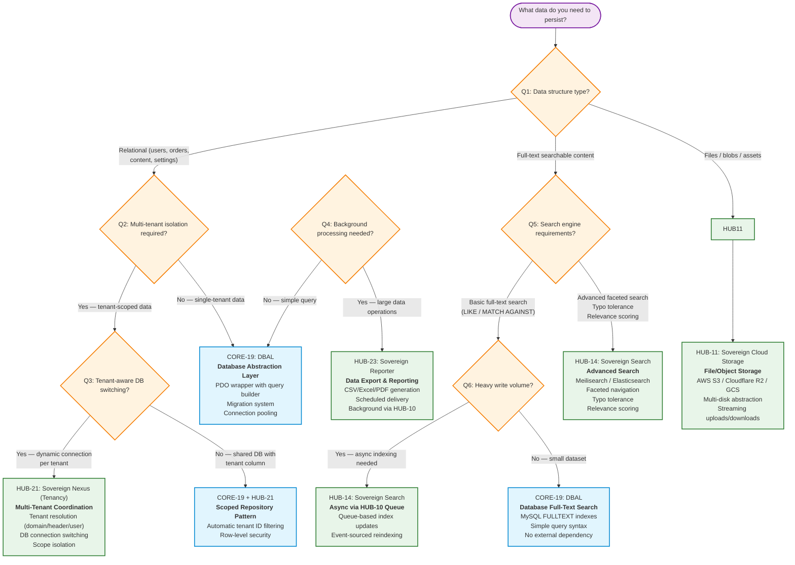

# Persistence Pattern Selector

> **Navigation:** [Hub Categories](hub-categories.md) | [Blueprint Taxonomy](hub-blueprint-taxonomy.md) | [Dependency Graph](hub-dependency-graph.md)
>
> **Other Decision Trees:** [Cache Selector](cache-solution-selector.md) | [Queue Selector](queue-solution-selector.md)

---

## Decision Tree Flowchart



---

## Detailed Decision Matrix

### Data Type → Solution Mapping

| Your Data Type | Recommended Solution | Primary Blueprint | Key Considerations |
|---------------|---------------------|-------------------|--------------------|
| **Relational (CRUD)** | Database Abstraction Layer | [CORE-19](../ApprovedBlueprints/Core/CORE-19.md) | PDO wrapper, migration system, query builder |
| **Multi-tenant relational** | Scoped Repository + Tenancy | [CORE-19](../ApprovedBlueprints/Core/CORE-19.md) + [HUB-21](../ApprovedBlueprints/Hub/HUB-21.md) | Tenant ID filtering, connection switching, scope isolation |
| **User-uploaded files** | Cloud Storage | [HUB-11](../ApprovedBlueprints/Hub/HUB-11.md) | S3-compatible, multi-disk, transparent local/cloud switching |
| **Media assets (images/video)** | Cloud Storage + Media Processing | [HUB-11](../ApprovedBlueprints/Hub/HUB-11.md) + [HUB-18](../ApprovedBlueprints/Hub/HUB-18.md) | Thumbnail generation, optimization, transcoding |
| **Full-text search (basic)** | DBAL + FULLTEXT indexes | [CORE-19](../ApprovedBlueprints/Core/CORE-19.md) | No external dependencies, MySQL native |
| **Full-text search (advanced)** | Search Abstraction | [HUB-14](../ApprovedBlueprints/Hub/HUB-14.md) | Meilisearch/Elasticsearch, faceted search, typo tolerance |
| **Search with high write volume** | Async Search Indexing | [HUB-14](../ApprovedBlueprints/Hub/HUB-14.md) + [HUB-10](../ApprovedBlueprints/Hub/HUB-10.md) | Queue-based index updates, event-sourced reindexing |
| **Data validation rules** | Validation Engine | [HUB-19](../ApprovedBlueprints/Hub/HUB-19.md) | Complex rule-sets, recursive validation, XSS prevention |
| **Large-scale reports** | Reporting Service | [HUB-23](../ApprovedBlueprints/Hub/HUB-23.md) | CSV/Excel/PDF, background generation, scheduled delivery |
| **Billing/subscription data** | Billing Abstraction | [HUB-22](../ApprovedBlueprints/Hub/HUB-22.md) | Provider-agnostic, Stripe/Paddle/custom, plans/invoices |
| **I18n translations** | I18n Service | [HUB-13](../ApprovedBlueprints/Hub/HUB-13.md) | BCP 47, CLDR formatting, array-based lookups |

---

## Persistence Stack Layers

```text
┌─────────────────────────────────────────────────────────────────────┐
│                         APPLICATION LAYER                            │
├─────────────────────────────────────────────────────────────────────┤
│  HUB-19 (Validation)  HUB-23 (Reporting)  HUB-22 (Billing)          │
├─────────────────────────────────────────────────────────────────────┤
│                        SERVICE ABSTRACTION                           │
├─────────────────────────────────────────────────────────────────────┤
│  HUB-14 (Search)      HUB-18 (Media)      HUB-13 (I18n)             │
│  HUB-21 (Tenancy)                                                      │
├─────────────────────────────────────────────────────────────────────┤
│                        STORAGE ABSTRACTION                           │
├───────────────────────────┬─────────────────────────────────────────┤
│  CORE-19 (DBAL)          │  HUB-11 (Cloud Storage)                   │
│  • PDO wrapper            │  • S3 / R2 / GCS drivers                 │
│  • Query builder          │  • Multi-disk management                 │
│  • Migrations             │  • Transparent local/cloud               │
│  • Connection pooling     │                                         │
└───────────────────────────┴─────────────────────────────────────────┘
```

---

## Common Anti-Patterns to Avoid

| Anti-Pattern | Why It's Wrong | Correct Approach |
|--------------|---------------|------------------|
| **Storing binary files in DB** | Blows up DB size, slow backups, poor CDN integration | Store in HUB-11, reference by URL in CORE-19 |
| **Database full-text search on large datasets** | Poor performance, no relevance scoring | Use HUB-14 with Meilisearch/Elasticsearch |
| **Hard-coded tenant ID filtering** | Error-prone, easy to forget in new queries | Use HUB-21 automatic scoped repositories |
| **Skipping validation at Hub level** | Inconsistent validation across Spokes | Centralize rules in HUB-19 |
| **Direct file system access instead of HUB-11** | Coupling to local storage, hard to migrate to cloud | Always use HUB-11 abstraction |

---

## Quick Decision Card

```text
┌─────────────────────────────────────────────────────────────────────┐
│                  PERSISTENCE SOLUTION QUICK CARD                      │
├─────────────────────────────────────────────────────────────────────┤
│                                                                      │
│  RELATIONAL?      ───> CORE-19 (DBAL) + optional HUB-21 (Tenancy)   │
│  BLOB/FILES?      ───> HUB-11 (Cloud Storage) + HUB-18 (Media)     │
│  FULL-TEXT?       ───> CORE-19 (basic) or HUB-14 (advanced)        │
│  VALIDATION?      ───> HUB-19 (Guard)                              │
│  REPORTS?         ───> HUB-23 (Reporter) + HUB-10 (Queue)          │
│  BILLING?         ───> HUB-22 (Ledger)                             │
│  I18N?            ───> HUB-13 (Translator)                         │
│                                                                      │
│  START WITH CORE-19. ADD LAYERS AS NEEDED.                          │
└─────────────────────────────────────────────────────────────────────┘
```

---

## Related Blueprints

| Blueprint | Role in Persistence |
|-----------|-------------------|
| [CORE-19](../ApprovedBlueprints/Core/CORE-19.md) | Foundation: DBAL, migrations, connection management, query builder |
| [HUB-11](../ApprovedBlueprints/Hub/HUB-11.md) | Cloud file storage abstraction (S3/R2/GCS) |
| [HUB-13](../ApprovedBlueprints/Hub/HUB-13.md) | Internationalization and localization service |
| [HUB-14](../ApprovedBlueprints/Hub/HUB-14.md) | Full-text search abstraction (Meilisearch/Elasticsearch) |
| [HUB-18](../ApprovedBlueprints/Hub/HUB-18.md) | Media processing coordination (thumbnails, transcoding) |
| [HUB-19](../ApprovedBlueprints/Hub/HUB-19.md) | Centralized validation and sanitization engine |
| [HUB-21](../ApprovedBlueprints/Hub/HUB-21.md) | Multi-tenant coordination layer |
| [HUB-22](../ApprovedBlueprints/Hub/HUB-22.md) | Billing and subscription abstraction |
| [HUB-23](../ApprovedBlueprints/Hub/HUB-23.md) | Data export and reporting service |

---

**Implementation Sequence:** CORE-19 → HUB-11 → HUB-19 → HUB-21 → HUB-14 → HUB-13 → HUB-18 → HUB-23 → HUB-22