# Message Queue Solution Selector

> **Navigation:** [Hub Categories](hub-categories.md) | [Blueprint Taxonomy](hub-blueprint-taxonomy.md) | [Dependency Graph](hub-dependency-graph.md)
>
> **Other Decision Trees:** [Cache Selector](cache-solution-selector.md) | [Persistence Selector](persistence-pattern-selector.md)

---

## Decision Tree Flowchart

```mermaid
flowchart TD
    Start(["Do you need asynchronous communication?"]) --> Q1
    
    Q1{"Q1: Communication pattern?"}
    Q1 -->|"One-to-many broadcast<br/>Domain events<br/>Real-time notifications"| Q2
    Q1 -->|"One-to-one job dispatch<br/>Background processing"| Q4
    Q1 -->|"External service triggers<br/>Third-party callbacks"| HUB17
    
    Q2{"Q2: Event ordering requirements?"}
    Q2 -->|"Strict ordering required<br/>(e.g., audit trail)"| Q3
    Q2 -->|"No ordering needed<br/>(fire-and-forget)"| HUB09_Fan["HUB-09: Sovereign Pulse (Event Bus)<br/><b>Fan-Out / Pub-Sub</b><br/>Multiple subscribers per event<br/>Redis Pub/Sub (real-time)<br/>Database store (persistent)"]
    
    Q3{"Q3: Need event persistence?"}
    Q3 -->|"Yes — durable event store<br/>Replay capability"| HUB09_Persist["HUB-09: Sovereign Pulse (Event Bus)<br/><b>Persistent Event Store</b><br/>Database-backed event log<br/>Event replay for new subscribers<br/>Audit-compatible"]
    Q3 -->|"No — real-time only"| HUB09_Redis["HUB-09: Sovereign Pulse (Event Bus)<br/><b>Redis Pub/Sub</b><br/>Sub-millisecond delivery<br/>In-memory (no persistence)<br/>Best for live notifications"]
    
    Q4{"Q4: Job characteristics?"}
    Q4 -->|"Long-running tasks<br/>Email sending, reports<br/>Image processing"| Q5
    Q4 -->|"Scheduled/recurring tasks<br/>Cron replacement"| HUB25["HUB-25: Sovereign Chronos<br/><b>Background Scheduler</b><br/>PHP-driven cron replacement<br/>Task overlap management<br/>Execution logs & dashboard"]
    Q4 -->|"Delayed/retry tasks<br/>Future execution"| HUB10_Delayed["HUB-10: Sovereign Queue<br/><b>Delayed Jobs & Retries</b><br/>Delayed job dispatch<br/>Configurable retry limits<br/>Dead-letter queue"]
    
    Q5{"Q5: Job priority required?"}
    Q5 -->|"Yes — priority queuing"| HUB10_Priority["HUB-10: Sovereign Queue<br/><b>Priority Queue</b><br/>Multiple priority levels<br/>High-priority processed first<br/>Fair scheduling"]
    Q5 -->|"No — FIFO processing"| HUB10_FIFO["HUB-10: Sovereign Queue<br/><b>Standard Queue</b><br/>FIFO (best-effort)<br/>Competing consumers<br/>Multiple drivers"]
    
    HUB17 --> HUB17_Detail["HUB-17: Sovereign Webhook Nexus<br/><b>Webhook Ingestion & Dispatch</b><br/>Signature verification (HMAC)<br/>Idempotent processing<br/>Retry with backoff<br/>Audit trail for all activity"]
    
    classDef hub fill:#e8f5e9,stroke:#2e7d32,stroke-width:2px
    classDef decision fill:#fff3e0,stroke:#f57c00,stroke-width:2px
    classDef start fill:#f3e5f5,stroke:#7b1fa2,stroke-width:2px
    
    class HUB09_Fan,HUB09_Persist,HUB09_Redis,HUB10_Delayed,HUB10_Priority,HUB10_FIFO,HUB17,HUB17_Detail,HUB25 hub
    class Q1,Q2,Q3,Q4,Q5 decision
    class Start start
```



---

## Detailed Decision Matrix

### Scenario-Based Guide

| Your Need | Recommended Solution | Primary Blueprint | Why |
|-----------|---------------------|-------------------|-----|
| **Domain event broadcast** (e.g., "UserRegistered") | Event Bus (Pub/Sub) | [HUB-09](../ApprovedBlueprints/Hub/HUB-09.md) | Fan-out to multiple subscribers; loosely coupled |
| **Real-time live notifications** | Redis Pub/Sub | [HUB-09](../ApprovedBlueprints/Hub/HUB-09.md) | Sub-millisecond delivery; in-memory |
| **Durable event store with replay** | Persistent Event Store | [HUB-09](../ApprovedBlueprints/Hub/HUB-09.md) | Database-backed; audit-compatible; new subscribers can replay |
| **Email sending (offloaded from request)** | Standard Queue | [HUB-10](../ApprovedBlueprints/Hub/HUB-10.md) | FIFO processing; competing consumers |
| **Image processing (long-running)** | Priority Queue | [HUB-10](../ApprovedBlueprints/Hub/HUB-10.md) | Can prioritize by user tier or urgency |
| **Delayed job (e.g., reminder email)** | Delayed Jobs | [HUB-10](../ApprovedBlueprints/Hub/HUB-10.md) | Schedule future execution; retry on failure |
| **Scheduled backup every 6 hours** | Scheduler | [HUB-25](../ApprovedBlueprints/Hub/HUB-25.md) | PHP-driven cron; overlap protection; execution logs |
| **Stripe payment webhook** | Webhook Engine | [HUB-17](../ApprovedBlueprints/Hub/HUB-17.md) | Signature verification; idempotent; retry with backoff |
| **GitHub push webhook → CI trigger** | Webhook Engine | [HUB-17](../ApprovedBlueprints/Hub/HUB-17.md) | Audit trail; dispatching to internal services |
| **Report generation every Monday** | Scheduler + Queue | [HUB-25](../ApprovedBlueprints/Hub/HUB-25.md) + [HUB-10](../ApprovedBlueprints/Hub/HUB-10.md) | Chronos triggers; Queue processes |

---

## Communication Pattern Comparison

| Pattern | Blueprint | Delivery Guarantee | Ordering | Complexity | Use Case |
|---------|-----------|-------------------|----------|------------|----------|
| **Event Bus (Pub/Sub)** | HUB-09 | At-least-once | Best-effort | Medium | Domain events, broadcasts |
| **Event Bus (Redis)** | HUB-09 | At-most-once | Redis ordering | Low | Live notifications |
| **Event Bus (Persistent)** | HUB-09 | Exactly-once | Strict by partition | High | Audit trails, event sourcing |
| **Standard Queue** | HUB-10 | At-least-once | FIFO best-effort | Medium | Background jobs |
| **Priority Queue** | HUB-10 | At-least-once | By priority | Medium | Tiered processing |
| **Delayed Queue** | HUB-10 | At-least-once | By scheduled time | Medium | Future execution |
| **Scheduler** | HUB-25 | At-least-once | By cron schedule | Medium | Recurring tasks |
| **Webhook Engine** | HUB-17 | At-least-once | Idempotent key | High | External events |

---

## Architecture: Event-Driven Stack

```text
┌─────────────────────────────────────────────────────────────────────┐
│                       EXTERNAL EVENTS                                │
│  Stripe Webhooks  GitHub Webhooks  Custom HTTP Callbacks             │
└───────────────────────────┬─────────────────────────────────────────┘
                            │
                    ┌───────▼───────┐
                    │  HUB-17       │
                    │  Webhook      │
                    │  Nexus        │
                    └───────┬───────┘
                            │
┌───────────────────────────┼─────────────────────────────────────────┐
│                    ┌──────▼──────┐                                   │
│                    │  HUB-09     │                                   │
│                    │  Event Bus  │                                   │
│                    └──────┬──────┘                                   │
│                           │                                         │
│              ┌────────────┼────────────┐                            │
│              ▼                         ▼                            │
│  ┌──────────────────┐   ┌────────────────────┐                      │
│  │  HUB-10 Queue    │   │  Spoke Subscribers  │                     │
│  │  (Background)    │   │  (Real-time)        │                     │
│  └──────┬───────────┘   └────────────────────┘                      │
│         │                                                            │
│  ┌──────▼───────┐                                                   │
│  │ HUB-25       │                                                   │
│  │ Chronos      │                                                   │
│  │ (Scheduler)  │                                                   │
│  └──────────────┘                                                   │
└─────────────────────────────────────────────────────────────────────┘
```

---

## Common Anti-Patterns to Avoid

| Anti-Pattern | Why It's Wrong | Correct Approach |
|--------------|---------------|------------------|
| **Using Event Bus for background job processing** | No retries, no priority, no delayed execution | Use HUB-10 Queue for jobs |
| **Using Queue for pub/sub broadcast** | Only one consumer can process each message | Use HUB-09 Event Bus for fan-out |
| **Processing webhooks synchronously** | Blocks request; external latency affects API | Use HUB-17 + HUB-10 for async processing |
| **Skipping idempotency for webhooks** | Duplicate events cause data corruption | HUB-17 has built-in idempotent key handling |
| **Using cron for all scheduled tasks** | No overlap protection, no monitoring | Use HUB-25 Chronos |
| **No dead-letter queue for failed jobs** | Jobs silently lost on failure | Configure HUB-10 dead-letter queue |

---

## Quick Decision Card

```text
┌─────────────────────────────────────────────────────────────────────┐
│                    QUEUE SOLUTION QUICK CARD                          │
├─────────────────────────────────────────────────────────────────────┤
│                                                                      │
│  BROADCAST EVENTS?     ───> HUB-09 Event Bus (Pub/Sub)              │
│  BACKGROUND JOBS?      ───> HUB-10 Queue (Standard/Priority)        │
│  SCHEDULED TASKS?      ───> HUB-25 Chronos (Cron replacement)       │
│  EXTERNAL WEBHOOKS?    ───> HUB-17 Webhook Nexus                    │
│  DELAYED EXECUTION?    ───> HUB-10 Queue (Delayed Jobs)             │
│                                                                      │
│  EVENTS → HUB-09. JOBS → HUB-10. BOTH → HUB-09 + HUB-10.            │
└─────────────────────────────────────────────────────────────────────┘
```

---

## Related Blueprints

| Blueprint | Role in Messaging |
|-----------|------------------|
| [CORE-03](../ApprovedBlueprints/Core/CORE-03.md) | Foundation: Event Dispatcher (PSR-14) |
| [HUB-06](../ApprovedBlueprints/Hub/HUB-06.md) | Audit logging for all event and queue activity |
| [HUB-09](../ApprovedBlueprints/Hub/HUB-09.md) | Event Bus — distributed pub/sub messaging |
| [HUB-10](../ApprovedBlueprints/Hub/HUB-10.md) | Queue — async job processing with retries |
| [HUB-12](../ApprovedBlueprints/Hub/HUB-12.md) | Notification service consuming events |
| [HUB-17](../ApprovedBlueprints/Hub/HUB-17.md) | Webhook ingestion and dispatch engine |
| [HUB-25](../ApprovedBlueprints/Hub/HUB-25.md) | Background scheduler (cron replacement) |

---

**Implementation Sequence:** CORE-03 → HUB-10 → HUB-09 → HUB-25 → HUB-17 → HUB-12