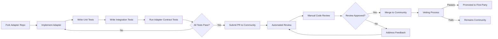

# Adapter Library Documentation

## Overview
The Adapter Library is a community-driven collection of first-party and third-party adapters implementing the [Ecosystem Adapter Pattern](./adapter-pattern.md). Each adapter bridges a specific third-party tool with the Sovereign Stack framework while maintaining strict isolation boundaries to prevent core coupling.

## Directory Structure

```
/adapters/
├── README.md                           # Library overview and contribution guide
├── first-party/                        # Sovereign-maintained adapters
│   ├── dg-monolog/                     # Logging: Monolog adapter
│   ├── dg-graylog/                     # Logging: Graylog GELF adapter
│   ├── dg-sentry/                      # Error tracking: Sentry adapter
│   ├── dg-datadog/                     # Monitoring: Datadog adapter
│   ├── dg-prometheus/                  # Monitoring: Prometheus adapter
│   ├── dg-newrelic/                    # Monitoring: NewRelic adapter
│   ├── dg-jaeger/                      # Tracing: Jaeger adapter
│   ├── dg-opentelemetry/               # Tracing: OpenTelemetry adapter
│   ├── dg-kubernetes/                  # Container: Kubernetes adapter
│   ├── dg-docker/                      # Container: Docker adapter
│   ├── dg-redis-cache/                 # Cache: Redis adapter
│   ├── dg-memcache/                    # Cache: Memcache adapter
│   ├── dg-rabbitmq/                    # Queue: RabbitMQ adapter
│   ├── dg-kafka/                       # Queue: Apache Kafka adapter
│   ├── dg-sqs/                         # Queue: AWS SQS adapter
│   ├── dg-oauth2/                      # Auth: OAuth2 adapter
│   ├── dg-ldap/                        # Auth: LDAP adapter
│   ├── dg-saml/                        # Auth: SAML 2.0 adapter
│   ├── dg-s3/                          # Storage: AWS S3 adapter
│   ├── dg-gcs/                         # Storage: Google Cloud Storage adapter
│   ├── dg-azure-blob/                  # Storage: Azure Blob Storage adapter
│   ├── dg-vault/                       # Encryption: HashiCorp Vault adapter
│   ├── dg-aws-kms/                     # Encryption: AWS KMS adapter
│   ├── dg-elasticsearch/               # Search: Elasticsearch adapter
│   ├── dg-algolia/                     # Search: Algolia adapter
│   ├── dg-meilisearch/                 # Search: Meilisearch adapter
│   ├── dg-sendgrid/                    # Notification: SendGrid adapter
│   ├── dg-twilio/                      # Notification: Twilio adapter
│   ├── dg-slack/                       # Notification: Slack adapter
│   └── dg-rate-limiter-redis/          # Rate Limiting: Redis-backed adapter
├── community/                          # Community-contributed adapters
│   ├── README.md                       # Community contribution guidelines
│   └── ...                             # Community adapters follow same structure
├── testing/                            # Testing utilities for adapters
│   ├── AdapterTestCase.php             # Base test case for all adapters
│   ├── MockAdapterRegistry.php         # Mock registry for unit tests
│   ├── AdapterIntegrationTest.php      # Integration test scaffolding
│   └── fixtures/                       # Test fixtures (config samples, certs)
└── docs/                               # Library documentation
    ├── CONTRIBUTING.md                 # How to contribute an adapter
    ├── REVIEW_CHECKLIST.md             # Code review criteria for adapter PRs
    ├── COMPATIBILITY_MATRIX.md         # Framework version compatibility
    └── MIGRATION_GUIDE.md              # Upgrading adapters across versions
```

## Adapter Package Convention

Every adapter package follows a consistent structure:

```
dg-{provider-name}/
├── composer.json                       # Package metadata + dependencies
├── README.md                           # Adapter-specific documentation
├── src/
│   ├── {Provider}Adapter.php           # Main adapter class
│   ├── {Provider}ServiceProvider.php   # ServiceProvider for registration
│   ├── Config/
│   │   └── {provider}.php              # Default configuration
│   └── Exception/
│       └── {Provider}Exception.php     # Adapter-specific exceptions
├── config/
│   └── {provider}.php                  # Published config (after install)
└── tests/
    ├── Unit/
    │   └── {Provider}AdapterTest.php   # Unit tests with mock SDK
    ├── Integration/
    │   └── {Provider}AdapterTest.php   # Integration tests (requires service)
    └── TestDouble/
        └── Fake{Provider}Client.php    # Test double for dependency injection
```

### composer.json Template

```json
{
    "name": "dg/adapter-{provider}",
    "type": "sovereign-stack-adapter",
    "description": "Sovereign Stack adapter for {Provider}",
    "keywords": ["sovereign-stack", "adapter", "{category}"],
    "license": "MIT",
    "require": {
        "php": ">=8.2",
        "sovereign/core": "^2.0",
        "sovereign/adapter-contracts": "^1.0"
    },
    "require-dev": {
        "sovereign/test-utils": "^1.0",
        "phpunit/phpunit": "^11.0"
    },
    "autoload": {
        "psr-4": {
            "Sovereign\\Adapter\\{Provider}\\": "src/"
        }
    },
    "extra": {
        "sovereign-stack": {
            "type": "adapter",
            "category": "{category}",
            "target-blueprints": ["{blueprint-id}"],
            "min-core-version": "2.0.0"
        }
    }
}
```

## First-Party Adapter Catalog

### 1. Logging Adapters

| Adapter | Package | Target Blueprint | Status | Coverage |
|---------|---------|-----------------|--------|----------|
| Monolog | `dg/adapter-monolog` | CORE-09 | Stable | >=90% |
| Graylog (GELF) | `dg/adapter-graylog` | CORE-09 | Stable | >=90% |
| Sentry | `dg/adapter-sentry` | CORE-09, CORE-08 | Beta | >=85% |

### 2. Monitoring / Metrics Adapters

| Adapter | Package | Target Blueprint | Status | Coverage |
|---------|---------|-----------------|--------|----------|
| Datadog | `dg/adapter-datadog` | HUB-05 | Stable | >=90% |
| Prometheus | `dg/adapter-prometheus` | HUB-05 | Stable | >=90% |
| NewRelic | `dg/adapter-newrelic` | HUB-05 | Beta | >=85% |

### 3. Distributed Tracing Adapters

| Adapter | Package | Target Blueprint | Status | Coverage |
|---------|---------|-----------------|--------|----------|
| Jaeger | `dg/adapter-jaeger` | HUB-06 | Stable | >=90% |
| OpenTelemetry | `dg/adapter-opentelemetry` | HUB-06 | Beta | >=85% |

### 4. Container Orchestration Adapters

| Adapter | Package | Target Blueprint | Status | Coverage |
|---------|---------|-----------------|--------|----------|
| Kubernetes | `dg/adapter-kubernetes` | DEPLOY-01 | Beta | >=85% |
| Docker | `dg/adapter-docker` | DEPLOY-01 | Beta | >=80% |

### 5. Caching Adapters

| Adapter | Package | Target Blueprint | Status | Coverage |
|---------|---------|-----------------|--------|----------|
| Redis | `dg/adapter-redis-cache` | HUB-02 | Stable | >=95% |
| Memcache | `dg/adapter-memcache` | HUB-02 | Stable | >=90% |

### 6. Queue / Messaging Adapters

| Adapter | Package | Target Blueprint | Status | Coverage |
|---------|---------|-----------------|--------|----------|
| RabbitMQ | `dg/adapter-rabbitmq` | HUB-11 | Stable | >=90% |
| Apache Kafka | `dg/adapter-kafka` | HUB-11 | Beta | >=85% |
| AWS SQS | `dg/adapter-sqs` | HUB-11 | Stable | >=90% |

### 7. Authentication / SSO Adapters

| Adapter | Package | Target Blueprint | Status | Coverage |
|---------|---------|-----------------|--------|----------|
| OAuth2 | `dg/adapter-oauth2` | CORE-11 | Stable | >=90% |
| LDAP | `dg/adapter-ldap` | CORE-11 | Stable | >=90% |
| SAML 2.0 | `dg/adapter-saml` | CORE-11 | Beta | >=85% |

### 8. File Storage Adapters

| Adapter | Package | Target Blueprint | Status | Coverage |
|---------|---------|-----------------|--------|----------|
| AWS S3 | `dg/adapter-s3` | CORE-14 | Stable | >=95% |
| Google Cloud Storage | `dg/adapter-gcs` | CORE-14 | Beta | >=85% |
| Azure Blob Storage | `dg/adapter-azure-blob` | CORE-14 | Beta | >=85% |

### 9. Encryption / KMS Adapters

| Adapter | Package | Target Blueprint | Status | Coverage |
|---------|---------|-----------------|--------|----------|
| HashiCorp Vault | `dg/adapter-vault` | CORE-16 | Beta | >=85% |
| AWS KMS | `dg/adapter-aws-kms` | CORE-16 | Beta | >=85% |

### 10. Search Adapters

| Adapter | Package | Target Blueprint | Status | Coverage |
|---------|---------|-----------------|--------|----------|
| Elasticsearch | `dg/adapter-elasticsearch` | HUB-07 | Stable | >=90% |
| Algolia | `dg/adapter-algolia` | HUB-07 | Beta | >=85% |
| Meilisearch | `dg/adapter-meilisearch` | HUB-07 | Stable | >=90% |

### 11. Notification Adapters

| Adapter | Package | Target Blueprint | Status | Coverage |
|---------|---------|-----------------|--------|----------|
| SendGrid | `dg/adapter-sendgrid` | HUB-08 | Stable | >=90% |
| Twilio | `dg/adapter-twilio` | HUB-08 | Stable | >=90% |
| Slack | `dg/adapter-slack` | HUB-08 | Stable | >=90% |

### 12. Rate Limiting Adapters

| Adapter | Package | Target Blueprint | Status | Coverage |
|---------|---------|-----------------|--------|----------|
| Redis Rate Limiter | `dg/adapter-rate-limiter-redis` | CORE-12 | Stable | >=90% |

## Testing Utilities

### AdapterTestCase

Base class providing common testing infrastructure for all adapters:

```php
<?php
namespace Sovereign\Adapter\Testing;

use PHPUnit\Framework\TestCase;
use Sovereign\Adapter\Contracts\AdapterInterface;

abstract class AdapterTestCase extends TestCase
{
    protected ?AdapterInterface $adapter = null;

    /**
     * Subclasses must instantiate their adapter here.
     * This method is called fresh for each test.
     */
    abstract protected function createAdapter(): AdapterInterface;

    /**
     * Return mock configuration for the adapter.
     */
    abstract protected function getMockConfig(): array;

    protected function setUp(): void
    {
        parent::setUp();
        $this->adapter = $this->createAdapter();
    }

    // --- Built-in Contract Tests ---

    public function test_adapter_implements_interface(): void
    {
        $this->assertInstanceOf(AdapterInterface::class, $this->adapter);
    }

    public function test_adapter_has_valid_id(): void
    {
        $id = $this->adapter->getId();
        $this->assertNotEmpty($id);
        $this->assertMatchesRegularExpression('/^[a-z]+\.[a-z0-9_-]+$/', $id);
    }

    public function test_adapter_has_semver_version(): void
    {
        $version = $this->adapter->getVersion();
        $this->assertMatchesRegularExpression(
            '/^\d+\.\d+\.\d+$/',
            $version
        );
    }

    public function test_adapter_has_framework_constraint(): void
    {
        $constraint = $this->adapter->getFrameworkConstraint();
        $this->assertNotEmpty($constraint);
    }

    public function test_adapter_health_check_returns_bool(): void
    {
        $result = $this->adapter->healthCheck();
        $this->assertIsBool($result);
    }

    public function test_adapter_boot_and_shutdown_cycle(): void
    {
        // Should not throw
        $this->adapter->boot();
        $this->adapter->shutdown();
    }
}
```

### MockAdapterRegistry

```php
<?php
namespace Sovereign\Adapter\Testing;

use Sovereign\Adapter\Contracts\AdapterInterface;
use Sovereign\Adapter\Contracts\AdapterRegistryInterface;

class MockAdapterRegistry implements AdapterRegistryInterface
{
    private array $adapters = [];

    public function register(AdapterInterface $adapter): void
    {
        $this->adapters[$adapter->getId()] = $adapter;
    }

    public function get(string $id): AdapterInterface
    {
        if (!isset($this->adapters[$id])) {
            throw new \RuntimeException("Adapter not found: $id");
        }
        return $this->adapters[$id];
    }

    public function findByBlueprint(string $blueprintId): array
    {
        return array_filter(
            $this->adapters,
            fn(AdapterInterface $a) => in_array($blueprintId, $a->getTargetBlueprints())
        );
    }

    public function findByCategory(string $category): array
    {
        return array_filter(
            $this->adapters,
            fn(AdapterInterface $a) => str_starts_with($a->getId(), $category . '.')
        );
    }

    public function has(string $id): bool
    {
        return isset($this->adapters[$id]);
    }

    public function all(): array
    {
        return array_values($this->adapters);
    }

    public function bootAll(): void
    {
        foreach ($this->adapters as $adapter) {
            $adapter->boot();
        }
    }

    public function shutdownAll(): void
    {
        foreach ($this->adapters as $adapter) {
            $adapter->shutdown();
        }
    }
}
```

## Compatibility Matrix

| Core Version | Adapter Contracts | Supported Adapter Status |
|-------------|-------------------|------------------------|
| 2.0.x | 1.0.x | All stable adapters |
| 2.1.x | 1.0.x | All stable adapters + new beta |
| 2.2.x | 1.1.x | All adapters |
| 3.0.x | 2.0.x | Migration required (see guide) |

## Contribution Workflow



## Related Documents

- [Integration Bridge Pattern](./adapter-pattern.md) - Architecture and contract definitions
- [Interoperability Standards](./interoperability-standards.md) - Standard interface contracts
- [Adapter Templates](./templates/) - Reference implementations
- [Marketplace Concept](./marketplace-concept.md) - Curated registry and vetting process
- [Extension Points Map](/docs/extensibility/extension-points-map.md) - Core integration hooks