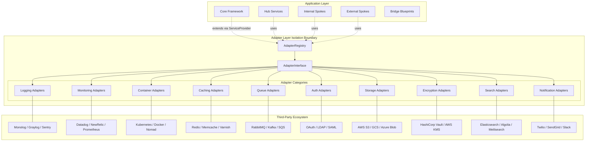
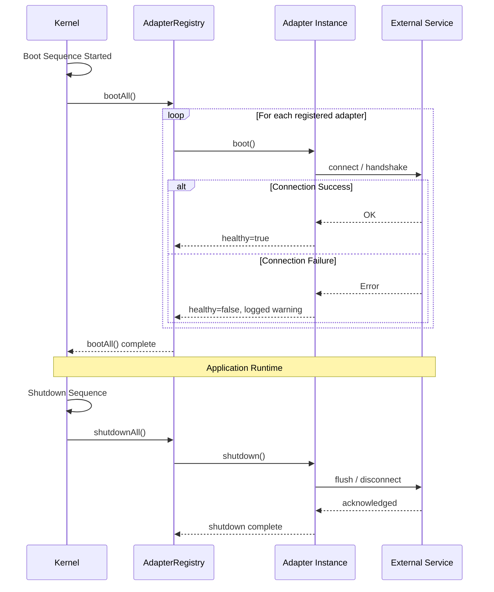

# Integration Bridge Pattern: Ecosystem Adapters

## Purpose
Define the explicit integration layer ("Ecosystem Adapters") that bridges third-party tools with the Sovereign Stack core framework without creating core coupling. This pattern ensures the framework's zero-dependency mandate while enabling rich ecosystem integration.

## Problem Statement
The Sovereign Stack Core intentionally minimizes third-party dependencies (score: 91/100), avoiding vendor lock-in and dependency hell. However, real-world applications require integration with logging providers, monitoring systems, container orchestration, auth providers, caching backends, queue systems, and more. Without an explicit integration layer, teams resort to:

- Forking core code to add third-party hooks
- Creating ad-hoc wrapper classes without consistent contracts
- Duplicating integration logic across multiple blueprints
- Violating isolation boundaries by coupling third-party SDKs directly to core services

## The Ecosystem Adapter Pattern

```
┌─────────────────────────────────────────────────────────────────┐
│                    APPLICATION LAYER                            │
│  ┌─────────┐ ┌──────────┐ ┌──────────┐ ┌───────────────────┐  │
│  │ Hub     │ │ Internal │ │ External │ │ Bridge            │  │
│  │ Services│ │ Spokes   │ │ Spokes   │ │ Blueprints        │  │
│  └────┬────┘ └────┬─────┘ └────┬─────┘ └────────┬──────────┘  │
│       │           │            │                 │             │
├───────┴───────────┴────────────┴─────────────────┴───────────┤
│                    ADAPTER LAYER (Isolation Boundary)          │
│  ┌────────────────────────────────────────────────────────┐   │
│  │  AdapterRegistry ─── AdapterInterface                  │   │
│  │       │                                                │   │
│  │  ┌────┴─────┐ ┌──────────┐ ┌───────────┐ ┌─────────┐  │   │
│  │  │Logging   │ │Monitoring│ │Container  │ │Caching  │  │   │
│  │  │Adapters  │ │Adapters  │ │Adapters   │ │Adapters │  │   │
│  │  └────┬─────┘ └────┬─────┘ └─────┬─────┘ └────┬────┘  │   │
│  └───────┴────────────┴─────────────┴────────────┴───────┘   │
├───────────┴────────────────┴─────────────────┴─────────────┤
│                    THIRD-PARTY ECOSYSTEM                      │
│  ┌─────────┐ ┌──────────┐ ┌──────────┐ ┌────────────────┐  │
│  │Monolog  │ │Datadog   │ │Kubernetes│ │Redis / Memcache│  │
│  │Graylog  │ │NewRelic  │ │Docker    │ │Varnish         │  │
│  │Sentry   │ │Prometheus│ │Nomad     │ │CloudFront      │  │
│  └─────────┘ └──────────┘ └──────────┘ └────────────────┘  │
└─────────────────────────────────────────────────────────────────┘
```

### Architecture Diagram (Mermaid)



## Isolation Boundaries

The adapter layer enforces strict isolation between the core framework and third-party code:

| Boundary | Rule | Enforcement |
|----------|------|-------------|
| **Dependency Direction** | Third-party SDKs MUST NOT be required by core container | Composer `require` vs `require-dev` separation |
| **Interface Ownership** | Adapter interfaces are owned by the Sovereign Stack, NOT by third-party vendors | All interfaces in `Sovereign\Adapter\Contracts\` namespace |
| **Packaging** | Each adapter is a standalone Composer package with its own `composer.json` | `dg-adapter/{name}` naming convention |
| **Exception Isolation** | Adapters MUST wrap third-party exceptions in `AdapterException` | Catch `\Throwable` from SDK calls |
| **Configuration** | Adapters read config from their own namespace, never from core config keys | `config/adapters/{name}.php` |
| **Lifecycle** | Adapters register via ServiceProvider pattern, never via core modification | Extend `AdapterServiceProvider` |
| **Testing** | Adapters provide test doubles and integration test suites | `src/Testing/` in each adapter package |

## Contract Interfaces

### Core Adapter Interface

```php
<?php
namespace Sovereign\Adapter\Contracts;

/**
 * Every adapter MUST implement this contract.
 * It defines the lifecycle hooks the framework calls.
 */
interface AdapterInterface
{
    /**
     * Unique adapter identifier (vendor.name format).
     * Example: "dg.monolog", "dg.datadog", "community.sentry"
     */
    public function getId(): string;

    /**
     * Human-readable adapter name.
     */
    public function getName(): string;

    /**
     * Adapter version (semver).
     */
    public function getVersion(): string;

    /**
     * Framework compatibility constraint.
     * Example: ">=2.0.0 <3.0.0"
     */
    public function getFrameworkConstraint(): string;

    /**
     * List of Sovereign Stack blueprint IDs this adapter integrates with.
     * Example: ["CORE-09", "HUB-05"]
     */
    public function getTargetBlueprints(): array;

    /**
     * Health check: returns true if the adapter can connect to its external service.
     */
    public function healthCheck(): bool;

    /**
     * Boot the adapter: establish connections, register handlers.
     * Called after dependency injection is complete.
     */
    public function boot(): void;

    /**
     * Shutdown the adapter: release connections, flush buffers.
     */
    public function shutdown(): void;
}
```

### AdapterRegistry Interface

```php
<?php
namespace Sovereign\Adapter\Contracts;

interface AdapterRegistryInterface
{
    /**
     * Register an adapter in the registry.
     */
    public function register(AdapterInterface $adapter): void;

    /**
     * Resolve an adapter by its ID.
     * @throws AdapterNotFoundException
     */
    public function get(string $id): AdapterInterface;

    /**
     * Find all adapters targeting a specific blueprint.
     * @return AdapterInterface[]
     */
    public function findByBlueprint(string $blueprintId): array;

    /**
     * Find all adapters of a specific category.
     * @return AdapterInterface[]
     */
    public function findByCategory(string $category): array;

    /**
     * Check if an adapter is registered.
     */
    public function has(string $id): bool;

    /**
     * List all registered adapters.
     * @return AdapterInterface[]
     */
    public function all(): array;

    /**
     * Boot all registered adapters (called by Kernel lifecycle).
     */
    public function bootAll(): void;

    /**
     * Shutdown all registered adapters (called by Kernel lifecycle).
     */
    public function shutdownAll(): void;
}
```

### AdapterServiceProvider Base

```php
<?php
namespace Sovereign\Adapter;

use Sovereign\Core\Container\ServiceProvider;
use Sovereign\Adapter\Contracts\AdapterRegistryInterface;

/**
 * Base ServiceProvider for all adapters.
 * Extend this instead of ServiceProvider directly to ensure
 * automatic registration with the AdapterRegistry.
 */
abstract class AdapterServiceProvider extends ServiceProvider
{
    /**
     * Subclasses MUST return their adapter instance here.
     * It will be automatically registered with the registry during boot().
     */
    abstract protected function createAdapter(): AdapterInterface;

    final public function register(): void
    {
        // Let subclasses bind any additional services
        $this->registerServices();
    }

    final public function boot(): void
    {
        $registry = $this->app->make(AdapterRegistryInterface::class);
        $adapter = $this->createAdapter();
        $registry->register($adapter);

        // Let subclasses perform additional boot logic
        $this->bootServices();
    }

    protected function registerServices(): void {}
    protected function bootServices(): void {}
}
```

## Adapter Categories Reference

The following categories define the integration domains covered by the adapter layer:

| # | Category | AdapterInterface | Typical Third-Party Targets | Blueprint Reference |
|---|----------|-----------------|----------------------------|-------------------|
| 1 | Logging | `LoggerAdapterInterface` | Monolog, Graylog, Sentry, Logstash | CORE-09 |
| 2 | Monitoring / Metrics | `MetricsAdapterInterface` | Datadog, NewRelic, Prometheus, Grafana | HUB-05 |
| 3 | Distributed Tracing | `TracingAdapterInterface` | Jaeger, Zipkin, OpenTelemetry | HUB-06 |
| 4 | Container Orchestration | `ContainerAdapterInterface` | Kubernetes, Docker, Nomad | DEPLOY-01 |
| 5 | Caching | `CacheAdapterInterface` | Redis, Memcache, Varnish, CloudFront | HUB-02 |
| 6 | Queue / Messaging | `QueueAdapterInterface` | RabbitMQ, Kafka, SQS, ZeroMQ | HUB-11 |
| 7 | Authentication / SSO | `AuthProviderAdapterInterface` | OAuth2, LDAP, SAML, Social Login | CORE-11 |
| 8 | File Storage | `StorageAdapterInterface` | AWS S3, GCS, Azure Blob, MinIO | CORE-14 |
| 9 | Encryption / KMS | `EncryptionAdapterInterface` | HashiCorp Vault, AWS KMS, Azure Key Vault | CORE-16 |
| 10 | Search | `SearchAdapterInterface` | Elasticsearch, Algolia, Meilisearch | HUB-07 |
| 11 | Notification | `NotificationAdapterInterface` | Twilio, SendGrid, Slack, Pushover | HUB-08 |
| 12 | Rate Limiting | `RateLimiterAdapterInterface` | Redis-based, DynamoDB-based, in-memory | CORE-12 |

## Adapter Lifecycle



## Success Metrics

| Metric | Target | Measurement |
|--------|--------|-------------|
| First-party adapters documented | >=10 | Count of adapter specifications in catalog |
| Enterprise stack coverage | >=80% | Percentage of typical enterprise tools with adapter path |
| Core framework modifications | 0 | Zero changes to core for new adapter integration |
| Adapter test coverage | >=90% | Unit + integration tests per adapter |
| Adapter registration time | <1ms | Time to register 20 adapters in the registry |

## Related Documents

- [Adapter Library Documentation](./adapter-library.md) - Complete adapter catalog and directory structure
- [Interoperability Standards](./interoperability-standards.md) - Standard interfaces for each integration domain
- [Adapter Templates](./templates/) - Reference implementations for common patterns
- [Marketplace Concept](./marketplace-concept.md) - Curated registry for community adapters
- [Extension Points Map](/docs/extensibility/extension-points-map.md) - Core integration hooks
- [Plugin System ADR](/docs/architecture/decisions/ADR-002-plugin-system-architecture.md) - Service Provider pattern