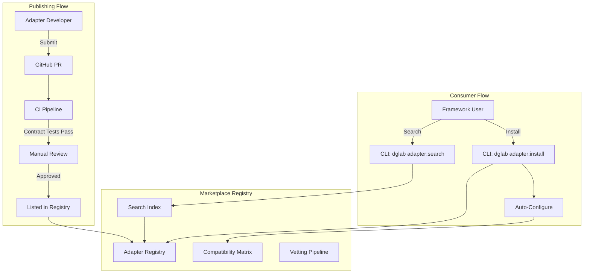
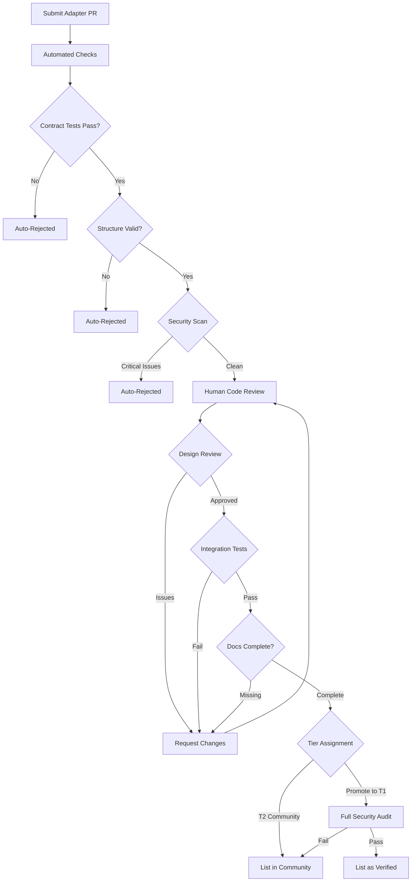
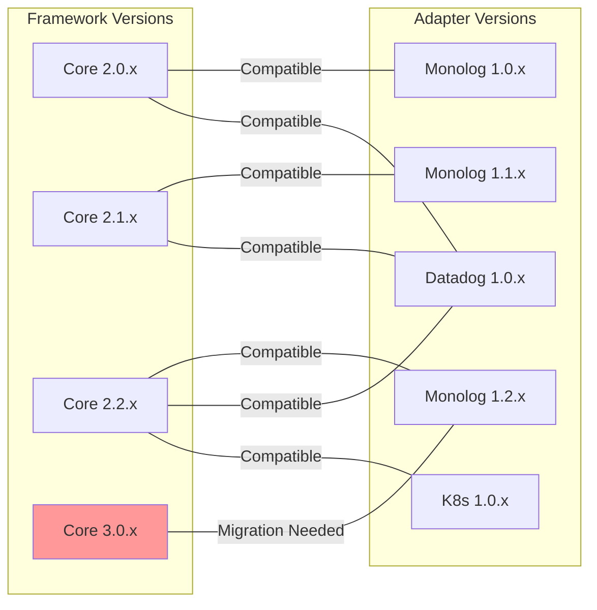

# Plugin Marketplace Concept

## Overview
The Sovereign Stack Plugin Marketplace is a curated registry where teams can discover, publish, and manage ecosystem adapters. It provides a compatibility matrix, vetting process, and discovery mechanism to ensure adapters meet quality standards and work correctly with target framework versions.

## Marketplace Architecture



## Adapter Classification System

Every adapter in the marketplace is classified along three dimensions:

### 1. Tier Classification

| Tier | Label | Description | Vetting Level |
|------|-------|-------------|---------------|
| T1 | **Verified** | Sovereign-maintained, full test coverage, compatibility tested | Full audit |
| T2 | **Community** | Community-contributed, contract-tested, basic review | Contract tests |
| T3 | **Experimental** | Early-stage, partial coverage, contribution in progress | Minimal |
| T4 | **Archived** | Deprecated or unmaintained, no longer updated | N/A |

### 2. Maturity Indicators

```
🟢 Stable   - Production-ready, full test coverage, documentation complete
🟡 Beta     - Feature-complete but awaiting production feedback
🟠 Alpha    - Initial implementation, API may change
🔴 Deprecated - Replaced or no longer maintained
```

### 3. Category Classification

```
logging      - Log aggregation and management
monitoring   - Metrics, dashboards, alerting
tracing      - Distributed tracing and observability
container    - Container orchestration and scheduling
cache        - In-memory and distributed caching
queue        - Message queuing and event streaming
auth         - Authentication and identity providers
storage      - File and object storage
encryption   - Key management and encryption services
search       - Full-text and vector search
notification - Email, SMS, push notifications
ratelimiter  - Rate limiting and throttling
audit        - Audit logging and compliance
config       - External configuration providers
```

## Registry Structure

The marketplace registry is a structured metadata repository:

```
marketplace.sovereign-stack.dev/
├── api/
│   ├── v1/
│   │   ├── adapters                # List all adapters
│   │   ├── adapters/{id}           # Adapter details
│   │   ├── adapters/{id}/versions  # Version history
│   │   ├── adapters/{id}/install   # Install instructions
│   │   ├── search                  # Search adapters
│   │   └── compatibility           # Compatibility matrix
├── registry.json                    # Full registry index
├── categories.json                  # Category definitions
└── requirements.json                # Minimum requirements per tier
```

### registry.json Schema

```json
{
  "$schema": "https://marketplace.sovereign-stack.dev/schemas/registry-v1.json",
  "schemaVersion": "1.0",
  "registry": {
    "lastUpdated": "2026-06-01T00:00:00Z",
    "totalAdapters": 28,
    "totalVerified": 18,
    "totalCommunity": 8,
    "totalExperimental": 2
  },
  "adapters": [
    {
      "id": "dg.monolog",
      "name": "Monolog Adapter",
      "description": "PSR-3 compliant logging via Monolog with Stream, Rotating File, Syslog, and Slack handlers",
      "tier": "verified",
      "maturity": "stable",
      "category": "logging",
      "publisher": {
        "name": "Sovereign Stack Team",
        "url": "https://github.com/sovereign-stack"
      },
      "repository": "https://github.com/sovereign-stack/dg-adapter-monolog",
      "latestVersion": "1.2.0",
      "versions": {
        "1.0.0": {
          "compatibility": { "sovereign/core": ">=2.0.0 <2.1.0" },
          "published": "2026-01-15",
          "changelog": "Initial release"
        },
        "1.1.0": {
          "compatibility": { "sovereign/core": ">=2.0.0 <2.2.0" },
          "published": "2026-03-01",
          "changelog": "Added buffered log flush, withContext support"
        },
        "1.2.0": {
          "compatibility": { "sovereign/core": ">=2.0.0 <3.0.0" },
          "published": "2026-05-15",
          "changelog": "Added JSON formatter, configurable channel name"
        }
      },
      "targetBlueprints": ["CORE-09"],
      "testCoverage": 94,
      "installCount": 127,
      "rating": 4.8,
      "tags": ["psr-3", "logging", "monolog", "php"]
    }
  ]
}
```

## CLI Integration

The marketplace is accessible via the Sovereign Stack CLI, providing discovery and installation without leaving the terminal.

### Search Command

```bash
# Search for logging adapters
dglab adapter:search --category=logging

# Output:
# ┌────────────┬──────────┬────────┬──────────┬──────────┐
# │ ID         │ Name     │ Tier   │ Maturity │ Coverage │
# ├────────────┼──────────┼────────┼──────────┼──────────┤
# │ dg.monolog │ Monolog  │ T1     │ 🟢 stable│ 94%      │
# │ dg.graylog │ Graylog  │ T1     │ 🟢 stable│ 92%      │
# │ dg.sentry  │ Sentry   │ T2     │ 🟡 beta  │ 87%      │
# └────────────┴──────────┴────────┴──────────┴──────────┘

# Search with full-text query
dglab adapter:search "kubernetes deployment"

# Filter by tier
dglab adapter:search --tier=verified

# Show details
dglab adapter:show dg.kubernetes
```

### Install Command

```bash
# Install an adapter via Composer
dglab adapter:install dg.monolog

# This performs:
# 1. Resolves latest compatible version
# 2. Runs: composer require dg/adapter-monolog
# 3. Publishes config: vendor/dg/adapter-monolog/config/ -> config/adapters/
# 4. Registers ServiceProvider in config/app.php
# 5. Runs adapter health check
# 6. Reports installation summary

# Install with specific version
dglab adapter:install dg.kubernetes:1.1.0

# Install and configure
dglab adapter:install dg.datadog --set host=dd-agent.prod.internal --set default=true
```

### Compatibility Check Command

```bash
# Check current framework compatibility
dglab adapter:compatibility

# Output:
# Adapter               Installed  Compatible  Latest  Action
# dg.monolog            1.1.0      ✅          1.2.0   upgrade available
# dg.datadog            1.0.0      ✅          1.0.0   up to date
# dg.kubernetes         -          ❌          -       not installed

# Check specific adapter compatibility
dglab adapter:compatibility dg.kubernetes
```

## Vetting Process

Every adapter submitted to the marketplace undergoes a multi-stage vetting process:



### Vetting Criteria

| Criteria | T1 Verified | T2 Community | T3 Experimental |
|----------|-------------|--------------|-----------------|
| Contract tests pass | Required | Required | Recommended |
| Unit test coverage >= 80% | Required | Required | - |
| Integration tests exist | Required | Recommended | - |
| Security audit passed | Required | - | - |
| Documentation complete | Required | Required | Basic |
| Configuration schema | Required | Required | - |
| Code style compliant | Required | Required | Recommended |
| Semantic versioning | Required | Required | Required |
| No core modifications | Required | Required | Required |
| Maintenance commitment | 12 months | 6 months | - |

## Compatibility Matrix



### Compatibility Rules

1. **Semantic Versioning**: Breaking changes in adapters require a major version bump
2. **Framework Constraints**: Each adapter declares `getFrameworkConstraint()` for automatic compatibility resolution
3. **Backward Compatibility**: T1 adapters must support the current minor and the previous minor framework version
4. **Deprecation Policy**: Adapters enter T4 (Archived) after 6 months without updates and are delisted after 12 months

## Adapter Submission Requirements

### Package Requirements

1. **Valid `composer.json`** with `sovereign-stack` type in `extra` metadata
2. **Contract tests** extending `AdapterContractTest` for the implemented interface
3. **Unit tests** with minimum 80% coverage
4. **Integration tests** that can detect external service availability and skip gracefully
5. **README.md** with installation, configuration, and usage documentation
6. **Configuration file** with documented defaults

### Submission Process

```bash
# Step 1: Package your adapter
# Ensure all tests pass:
vendor/bin/phpunit --coverage-text

# Step 2: Validate your adapter
dglab adapter:validate ./path/to/adapter

# Step 3: Submit to marketplace
dglab adapter:submit ./path/to/adapter \
  --publisher="Your Name" \
  --repository="https://github.com/you/dg-adapter-xyz"
```

## Governance Model

### Roles

| Role | Responsibility | Appointment |
|------|----------------|-------------|
| **Marketplace Admin** | Approve T1 promotions, manage registry | Sovereign Stack core team |
| **Reviewer** | Code review, vetting process | Experienced community members |
| **Publisher** | Submit and maintain adapters | Any community member |
| **Consumer** | Use adapters, report issues | Any framework user |

### Review SLA

| Tier | Initial Review | Re-review |
|------|----------------|-----------|
| T1 Verified | Within 5 business days | Within 3 business days |
| T2 Community | Within 10 business days | Within 5 business days |
| T3 Experimental | Within 15 business days | Within 7 business days |

### Dispute Resolution

1. Consumer reports issue with adapter
2. Publisher has 14 days to respond and address
3. If unresolved, Marketplace Admin reviews and may:
   - Downgrade tier (T1 -> T2, T2 -> T3)
   - Archive adapter (T4) if unmaintained
   - Remove from registry if security issue

## Success Metrics

| Metric | Current | Target (6 months) | Target (12 months) |
|--------|---------|-------------------|--------------------|
| Total adapters | 28 | 50+ | 100+ |
| T1 Verified adapters | 18 | 30+ | 50+ |
| Community contributors | 5 | 20+ | 50+ |
| Adapter installations | 500+ | 2,000+ | 10,000+ |
| Enterprise stack coverage | 80% | 85% | 90% |
| Average test coverage | 90% | 92% | 95% |
| Average rating | 4.5/5 | 4.6/5 | 4.7/5 |

## Related Documents

- [Integration Bridge Pattern](./adapter-pattern.md) - Architecture and contract definitions
- [Adapter Library Documentation](./adapter-library.md) - Complete adapter catalog
- [Interoperability Standards](./interoperability-standards.md) - Standard interface contracts
- [Adapter Templates](./templates/) - Reference implementations
- [Extension Points Map](/docs/extensibility/extension-points-map.md) - Core integration hooks