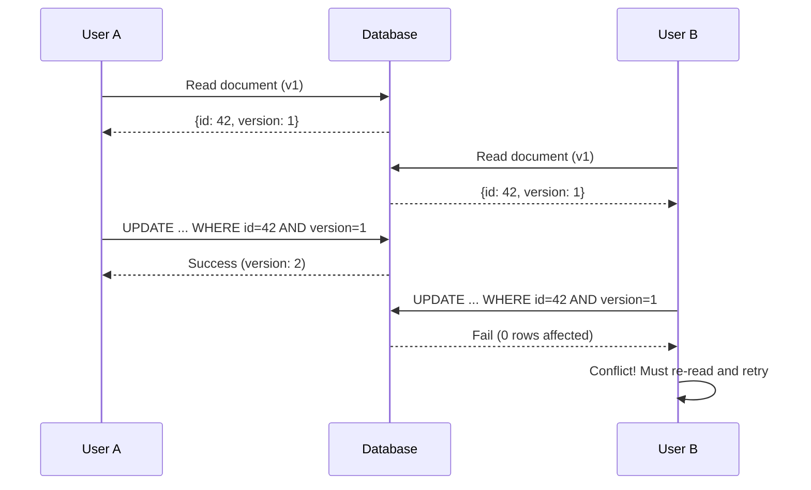
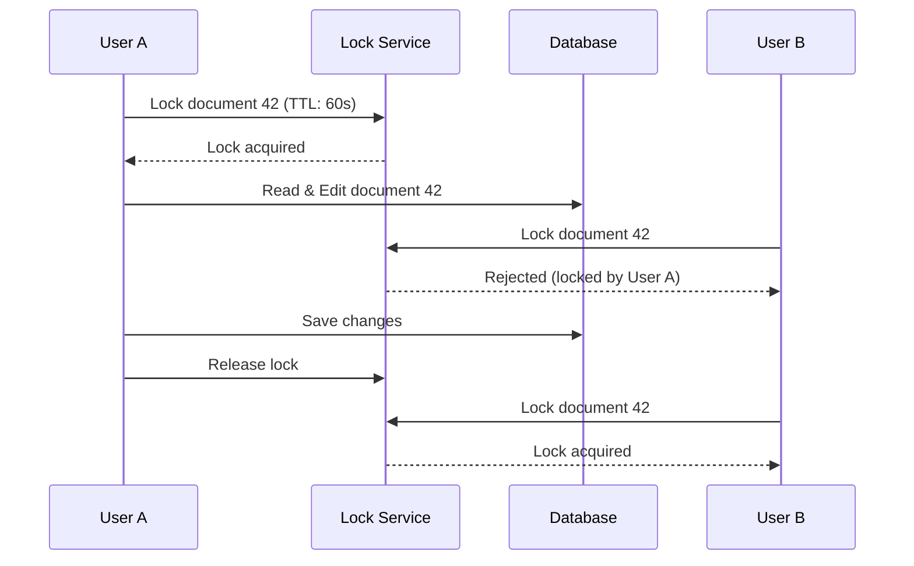
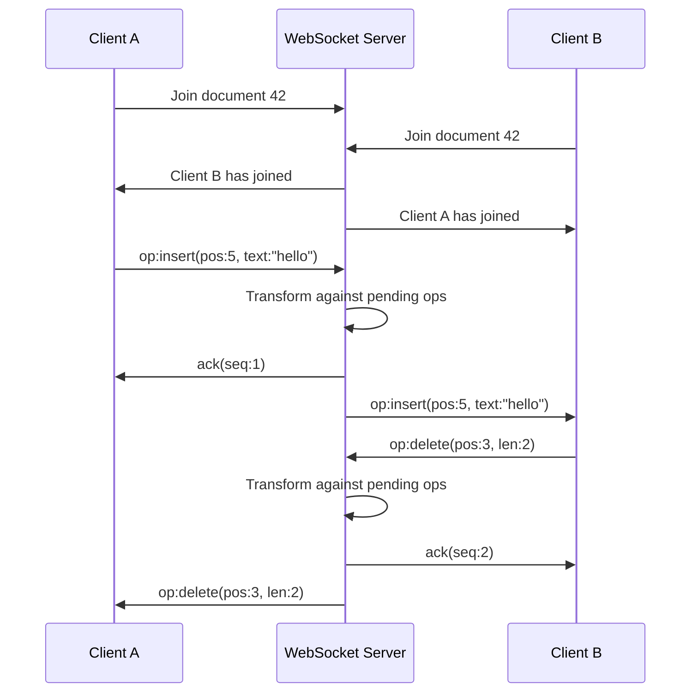

# Concurrent Editing & Conflict Resolution

> **Navigation:** [Role Delegation Patterns](role-delegation-patterns.md) | [Workflow Scalability](workflow-scalability.md)
>
> **Cross-Reference:** [CRUD Specialization — Event Sourcing](crud-specialization.md#event-sourcing) | [Cache Patterns — Distributed Consistency](../cache-patterns/distributed-cache-consistency.md)
>
> **Status:** 🟢 Active

---

## Overview

Concurrent editing occurs when multiple users modify the same resource simultaneously. Without explicit conflict resolution, the last writer's changes silently overwrite previous work (data loss), or the system enters an inconsistent state.

This document provides **four concurrency patterns**, **four conflict resolution strategies**, **real-time collaboration patterns**, and **testing utilities** for verifying conflict scenarios.

---

## 1. Concurrency Patterns

### Pattern Selection Matrix

| Pattern | Latency Impact | Conflict Probability | Consistency Model | Use Case |
|---------|---------------|--------------------|--------------------|---------|
| **Optimistic Locking** | Low (no lock) | Low | Strong | Document editing, config changes |
| **Pessimistic Locking** | High (acquire lock) | High | Strongest | Financial transactions, resource allocation |
| **CRDT** | Medium (merge) | High | Eventual | Real-time collaboration, distributed systems |
| **Operational Transformation** | Medium (transform) | Medium | Strong (with server) | Collaborative text editing, Google Docs-style |

---

### 1.1 Optimistic Locking

Uses a version field. Each update checks the version hasn't changed since last read.



```php
<?php
class OptimisticLockingRepository
{
    public function update(string $id, array $data, int $expectedVersion): Entity
    {
        $data['version'] = $expectedVersion + 1;  // Increment version
        $data['updated_at'] = now();

        $affected = $this->db->table('documents')
            ->where('id', $id)
            ->where('version', $expectedVersion)
            ->update($data);

        if ($affected === 0) {
            // Either the document doesn't exist or version mismatch
            $current = $this->db->table('documents')->where('id', $id)->first();
            if (!$current) {
                throw new NotFoundException("Document {$id} not found");
            }
            throw new ConcurrencyException(
                "Document {$id} was modified by another user. " .
                "Expected version {$expectedVersion}, current version {$current['version']}"
            );
        }

        return $this->find($id);
    }

    /**
     * Retry logic with automatic merge attempt.
     */
    public function updateWithRetry(string $id, array $data, int $maxRetries = 3): Entity
    {
        for ($attempt = 1; $attempt <= $maxRetries; $attempt++) {
            $current = $this->find($id);
            try {
                return $this->update($id, $data, $current['version']);
            } catch (ConcurrencyException $e) {
                if ($attempt === $maxRetries) {
                    throw $e;  // Give up after max retries
                }
                usleep(100_000 * $attempt);  // Exponential back-off: 100ms, 200ms, 300ms
            }
        }

        throw new \RuntimeException('Unreachable');
    }
}
```

### 1.2 Pessimistic Locking

Acquire a distributed lock before editing. Other users must wait or are rejected.



```php
<?php
class PessimisticLockManager
{
    public function __construct(
        private LockServiceInterface $lockService,
        private int $defaultTtl = 60,
    ) {}

    /**
     * Acquire a lock before editing. Throws if lock cannot be acquired.
     */
    public function acquireLock(string $resourceId, string $userId, ?int $ttl = null): LockToken
    {
        $lockKey = "resource:lock:{$resourceId}";
        $lockTtl = $ttl ?? $this->defaultTtl;

        $token = $this->lockService->acquire($lockKey, $userId, $lockTtl);

        if (!$token) {
            $currentHolder = $this->lockService->getHolder($lockKey);
            throw new LockAcquisitionException(
                "Resource {$resourceId} is locked by user {$currentHolder}",
                currentHolder: $currentHolder,
                retryAfter: $lockTtl,
            );
        }

        return $token;
    }

    /**
     * Release an acquired lock.
     */
    public function releaseLock(LockToken $token): void
    {
        $this->lockService->release($token);
    }

    /**
     * Execute an operation within a lock context (auto-release).
     */
    public function withLock(string $resourceId, string $userId, callable $operation, ?int $ttl = null): mixed
    {
        $token = $this->acquireLock($resourceId, $userId, $ttl);
        try {
            return $operation($token);
        } finally {
            $this->releaseLock($token);
        }
    }
}
```

#### Deadlock Prevention

```php
<?php
class DeadlockPrevention
{
    /**
     * Always acquire locks in the same global order to prevent deadlocks.
     * Resources are sorted by ID before locking.
     */
    public function withOrderedLocks(array $resourceIds, string $userId, callable $operation): mixed
    {
        sort($resourceIds);  // Consistent ordering

        $tokens = [];
        try {
            foreach ($resourceIds as $id) {
                $tokens[] = $this->lockManager->acquireLock($id, $userId, ttl: 10);
            }
            return $operation();
        } finally {
            // Release in reverse order
            foreach (array_reverse($tokens) as $token) {
                $this->lockManager->releaseLock($token);
            }
        }
    }
}
```

### 1.3 CRDT (Conflict-Free Replicated Data Types)

CRDTs allow concurrent edits without coordination. Conflicts are resolved automatically via merge rules.

```php
<?php
/**
 * Last-Writer-Wins Register — the simplest CRDT.
 * On merge, the value with the latest timestamp wins.
 */
class LWWRegister
{
    private array $state = [];

    /**
     * Assign a value with the current wall-clock time.
     */
    public function assign(string $key, mixed $value): void
    {
        $timestamp = now()->getTimestamp();
        $this->state[$key] = [
            'value' => $value,
            'timestamp' => $timestamp,
            'node_id' => $this->nodeId,
        ];
    }

    /**
     * Merge state from another replica.
     * On conflict, highest (timestamp, node_id) wins.
     */
    public function merge(array $remoteState): void
    {
        foreach ($remoteState as $key => $remote) {
            $local = $this->state[$key] ?? null;

            if ($local === null) {
                $this->state[$key] = $remote;
            } elseif ($remote['timestamp'] > $local['timestamp']) {
                $this->state[$key] = $remote;  // Remote is newer
            } elseif ($remote['timestamp'] === $local['timestamp'] && $remote['node_id'] > $local['node_id']) {
                $this->state[$key] = $remote;  // Tie-break by node ID
            }
            // Otherwise, local wins
        }
    }

    /**
     * Get the current value for a key.
     */
    public function get(string $key): mixed
    {
        return $this->state[$key]['value'] ?? null;
    }

    /**
     * Export state for replication.
     */
    public function getState(): array
    {
        return $this->state;
    }
}

/**
 * Grow-Only Set — elements can only be added, never removed.
 * Useful for tracking which users have seen a notification.
 */
class GSet
{
    private array $elements = [];

    public function add(string $element): void
    {
        $this->elements[$element] = true;
    }

    public function merge(GSet $other): void
    {
        foreach ($other->elements as $element => $_) {
            $this->elements[$element] = true;
        }
    }

    public function has(string $element): bool
    {
        return isset($this->elements[$element]);
    }

    public function values(): array
    {
        return array_keys($this->elements);
    }
}

/**
 * Observed-Remove Set — supports both add and remove.
 * Uses tombstones for removed elements.
 */
class ORSet
{
    private array $additions = [];   // element -> {tag, node_id}
    private array $removals = [];    // element -> {tag, node_id}

    public function add(string $element, string $tag): void
    {
        $this->additions[$element][] = ['tag' => $tag, 'node_id' => $this->nodeId];
    }

    public function remove(string $element): void
    {
        if (isset($this->additions[$element])) {
            // Move all observed additions to removals
            foreach ($this->additions[$element] as $obs) {
                $this->removals[$element][] = $obs;
            }
            unset($this->additions[$element]);
        }
    }

    public function merge(ORSet $other): void
    {
        // Merge additions
        foreach ($other->additions as $element => $obs) {
            $this->additions[$element] = array_merge(
                $this->additions[$element] ?? [],
                $obs,
            );
        }

        // Merge removals
        foreach ($other->removals as $element => $obs) {
            $this->removals[$element] = array_merge(
                $this->removals[$element] ?? [],
                $obs,
            );
        }

        // Prune: remove additions that have been observed-removed
        foreach ($this->additions as $element => $addObs) {
            $remObs = $this->removals[$element] ?? [];
            $this->additions[$element] = array_udiff(
                $addObs,
                $remObs,
                fn($a, $b) => ($a['tag'] <=> $b['tag']) ?: ($a['node_id'] <=> $b['node_id']),
            );
        }
    }

    public function has(string $element): bool
    {
        return !empty($this->additions[$element]);
    }

    public function values(): array
    {
        return array_keys(array_filter($this->additions, fn($v) => !empty($v)));
    }
}
```

### 1.4 Operational Transformation (OT)

OT transforms concurrent operations against each other so they converge to the same state.

```php
<?php
/**
 * Simple operational transformation for text editing operations.
 * Supports insert and delete operations.
 */
class OperationalTransform
{
    /**
     * Transform operation 'a' against operation 'b' so they can be applied
     * in any order and produce the same result.
     */
    public function transform(Operation $a, Operation $b): Operation
    {
        if ($a->type === 'insert' && $b->type === 'insert') {
            // Both inserts at same position: use client ID to order
            if ($a->position < $b->position) {
                return $a;  // No change needed
            } elseif ($a->position > $b->position) {
                return new Operation('insert', $a->position + strlen($b->text), $a->text, $a->clientId);
            } else {
                // Same position — deterministic tie-break by client ID
                if ($a->clientId < $b->clientId) {
                    return $a;
                } else {
                    return new Operation('insert', $a->position + strlen($b->text), $a->text, $a->clientId);
                }
            }
        }

        if ($a->type === 'delete' && $b->type === 'insert') {
            // Delete after insert: adjust position
            if ($a->position >= $b->position) {
                return new Operation('delete', $a->position + strlen($b->text), $a->length, $a->clientId);
            }
            return $a;
        }

        if ($a->type === 'insert' && $b->type === 'delete') {
            // Insert after delete: adjust position
            if ($a->position > $b->position) {
                return new Operation('insert', max($a->position - $b->length, $b->position), $a->text, $a->clientId);
            }
            return $a;
        }

        if ($a->type === 'delete' && $b->type === 'delete') {
            // Both delete overlapping ranges
            $overlapStart = max($a->position, $b->position);
            $overlapEnd = min($a->position + $a->length, $b->position + $b->length);
            $overlapLength = max(0, $overlapEnd - $overlapStart);

            $newPosition = $a->position;
            $newLength = $a->length;

            if ($b->position <= $a->position) {
                $newPosition = $a->position - $b->length;
            }
            if ($b->position + $b->length > $a->position) {
                $newLength = $a->length - $overlapLength;
            }

            return new Operation('delete', max(0, $newPosition), max(0, $newLength), $a->clientId);
        }

        return $a;  // Fallback: no transformation
    }
}

class Operation
{
    public function __construct(
        public readonly string $type,      // 'insert' | 'delete'
        public readonly int $position,
        public readonly string|int $text,  // Text for insert, length for delete
        public readonly string $clientId,
    ) {}
}
```

---

## 2. Conflict Resolution Strategies

### Strategy Selection

| Strategy | Data Loss Risk | User Effort | Implementation Complexity | Best For |
|----------|---------------|-------------|--------------------------|----------|
| **Last-Write-Wins** | High | None | Low | Logs, counters, non-critical metadata |
| **Manual Merge** | Low | High | Medium | Documents, config files, source code |
| **Automatic Merge** | Medium | Low | High | Collaborative editing, CRDT scenarios |
| **Conflict Prevention** | None | Medium (locking UX) | Medium | Financial transactions, critical resources |

### Last-Write-Wins (LWW)

```php
<?php
class LastWriteWinsResolver
{
    /**
     * Simple LWW: the latest write timestamp wins.
     * Use vector clocks for distributed scenarios.
     */
    public function resolve(array $local, array $remote): array
    {
        $merged = [];
        $allKeys = array_unique(array_merge(array_keys($local), array_keys($remote)));

        foreach ($allKeys as $key) {
            $l = $local[$key] ?? null;
            $r = $remote[$key] ?? null;

            if ($l === null) {
                $merged[$key] = $r;
            } elseif ($r === null) {
                $merged[$key] = $l;
            } else {
                // Latest timestamp wins
                $merged[$key] = ($l['updated_at'] >= $r['updated_at']) ? $l : $r;
            }
        }

        return $merged;
    }
}
```

### Manual Merge (Three-Way Diff)

```php
<?php
class ThreeWayMergeResolver
{
    /**
     * Generate a merge conflict that requires manual resolution.
     * Returns the base, local, and remote versions for diff display.
     */
    public function resolve(array $base, array $local, array $remote): MergeResult
    {
        $conflicts = [];
        $merged = [];

        $allKeys = array_unique(array_merge(
            array_keys($base),
            array_keys($local),
            array_keys($remote),
        ));

        foreach ($allKeys as $key) {
            $b = $base[$key] ?? null;
            $l = $local[$key] ?? null;
            $r = $remote[$key] ?? null;

            if ($b === $l || $r === null) {
                // No local change — take remote (or base if remote unchanged)
                $merged[$key] = $r ?? $b;
            } elseif ($b === $r || $l === null) {
                // No remote change — take local
                $merged[$key] = $l ?? $b;
            } elseif ($l === $r) {
                // Both made same change — take either
                $merged[$key] = $l;
            } else {
                // Both changed differently — conflict!
                $conflicts[$key] = [
                    'base' => $b,
                    'local' => $l,
                    'remote' => $r,
                ];
                $merged[$key] = null;  // Placeholder for manual resolution
            }
        }

        return new MergeResult($merged, $conflicts);
    }
}

class MergeResult
{
    public function __construct(
        public readonly array $merged,
        public readonly array $conflicts,
    ) {
        $this->hasConflicts = !empty($conflicts);
    }

    public readonly bool $hasConflicts;
}
```

### Automatic Merge (Field-Level)

```php
<?php
class FieldLevelAutoMerge
{
    /**
     * Automatically merge fields that don't conflict.
     * If a field was only changed by one side, take that change.
     * Only flag as conflict if both sides changed the same field differently.
     */
    public function resolve(array $local, array $remote, array $base): array
    {
        $merged = [];
        $conflicts = [];

        $allFields = array_unique(array_merge(
            array_keys($base),
            array_keys($local),
            array_keys($remote),
        ));

        foreach ($allFields as $field) {
            $b = $base[$field] ?? null;
            $l = $local[$field] ?? null;
            $r = $remote[$field] ?? null;

            // Field was deleted by both
            if ($l === null && $r === null && $b !== null) {
                $merged[$field] = null;
                continue;
            }

            // Only local changed
            if ($l !== $b && $r === $b) {
                $merged[$field] = $l;
                continue;
            }

            // Only remote changed
            if ($r !== $b && $l === $b) {
                $merged[$field] = $r;
                continue;
            }

            // Both changed to the same value
            if ($l === $r && $l !== $b) {
                $merged[$field] = $l;
                continue;
            }

            // Both changed differently OR neither changed
            if ($l === $r) {
                $merged[$field] = $l;
            } else {
                $conflicts[$field] = ['local' => $l, 'remote' => $r, 'base' => $b];
                $merged[$field] = $l;  // Tentatively take local; user must verify
            }
        }

        return ['merged' => $merged, 'conflicts' => $conflicts];
    }
}
```

### Conflict Prevention (Reservation System)

```php
<?php
class ReservationConflictPrevention
{
    /**
     * Allow users to "check out" a resource, preventing concurrent edits.
     * Similar to pessimistic locking but with a user-friendly UX.
     */
    public function checkout(string $resourceId, string $userId, int $durationMinutes = 30): CheckoutToken
    {
        $existing = $this->checkoutStore->findByResource($resourceId);

        if ($existing && !$existing->isExpired() && $existing->userId !== $userId) {
            throw new ResourceCheckedOutException(
                resourceId: $resourceId,
                checkedOutBy: $existing->userId,
                checkedOutAt: $existing->checkedOutAt,
                expiresAt: $existing->expiresAt,
            );
        }

        $token = new CheckoutToken(
            resourceId: $resourceId,
            userId: $userId,
            checkedOutAt: now(),
            expiresAt: (new \DateTimeImmutable())->modify("+{$durationMinutes} minutes"),
        );

        $this->checkoutStore->save($token);
        return $token;
    }

    /**
     * Extend an existing checkout (if no one else is waiting).
     */
    public function extendCheckout(string $resourceId, string $userId, int $additionalMinutes = 30): void
    {
        $existing = $this->checkoutStore->findByResource($resourceId);

        if (!$existing || $existing->userId !== $userId) {
            throw new \RuntimeException("Resource not checked out by you");
        }

        $existing->extend($additionalMinutes);
        $this->checkoutStore->save($existing);
    }

    /**
     * Release a checkout so others can edit.
     */
    public function checkin(string $resourceId, string $userId): void
    {
        $this->checkoutStore->delete($resourceId, $userId);
    }
}
```

---

## 3. Real-Time Collaboration Patterns

### WebSocket Synchronization



```php
<?php
class CollaborationServer
{
    private array $documents = [];  // documentId => DocumentState

    /**
     * Handle an incoming operation from a client.
     * Transform against concurrent operations before broadcasting.
     */
    public function handleOperation(string $documentId, Operation $op, string $clientId): void
    {
        $doc = $this->documents[$documentId] ?? throw new \RuntimeException("Document not found");

        // Causal ordering: apply received operation
        $transformed = $op;
        foreach ($doc->getPendingOperations($clientId) as $pending) {
            $transformed = $this->ot->transform($transformed, $pending);
        }

        // Apply to document state
        $doc->apply($transformed);

        // Store operation for late-joiners
        $doc->appendOperation($transformed);

        // Broadcast to all other clients
        $this->broadcast($documentId, $transformed, excludeClient: $clientId);
    }

    /**
     * Send current document state + operation history to a new joiner.
     */
    public function joinDocument(string $documentId, string $clientId): void
    {
        $doc = $this->documents[$documentId];

        // Send all operations for state reconstruction
        $this->sendToClient($clientId, [
            'type' => 'snapshot',
            'state' => $doc->getState(),
            'operations' => $doc->getOperationHistory(),
        ]);
    }
}
```

### Operational Log for Audit

Every concurrent edit operation should be recorded for audit and replay:

```sql
CREATE TABLE operation_log (
    id              BIGINT UNSIGNED AUTO_INCREMENT PRIMARY KEY,
    document_id     VARCHAR(64) NOT NULL,
    operation_type  VARCHAR(16) NOT NULL,       -- 'insert', 'delete', 'update'
    operation_data  JSON NOT NULL,
    client_id       VARCHAR(64) NOT NULL,
    client_version  INT UNSIGNED NOT NULL,
    server_version  INT UNSIGNED NOT NULL,
    applied_at      DATETIME(3) NOT NULL,
    INDEX idx_document_version (document_id, server_version),
    INDEX idx_document_time (document_id, applied_at)
);
```

---

## 4. Testing Patterns for Conflict Scenarios

### Concurrent Request Simulation

```php
<?php
class ConcurrentEditSimulator
{
    /**
     * Simulate N concurrent edits to the same resource.
     * Returns the final state and any conflicts that occurred.
     */
    public function simulateConcurrentEdits(
        string $resourceId,
        array $edits,       // [[userId, data], [userId, data], ...]
        ConcurrencyPattern $pattern = new OptimisticLocking(),
    ): SimulationResult {

        $results = [];
        $exceptions = [];

        // Use parallel execution (real implementation uses pthreads/parallel/async)
        foreach ($edits as [$userId, $data]) {
            try {
                $result = match (true) {
                    $pattern instanceof OptimisticLocking => $this->simulateOptimistic($resourceId, $userId, $data),
                    $pattern instanceof PessimisticLocking => $this->simulatePessimistic($resourceId, $userId, $data),
                    $pattern instanceof CRDTPattern => $this->simulateCRDT($resourceId, $userId, $data),
                    default => throw new \InvalidArgumentException('Unknown pattern'),
                };
                $results[] = $result;
            } catch (ConcurrencyException $e) {
                $exceptions[] = ['user' => $userId, 'error' => $e->getMessage()];
            }
        }

        return new SimulationResult(
            finalState: $this->resourceStore->find($resourceId),
            successfulEdits: $results,
            conflicts: $exceptions,
        );
    }
}
```

### Conflict Scenario Factory

```php
<?php
class ConflictScenarioFactory
{
    /**
     * Scenario 1: Two users edit the same field at the same time.
     */
    public static function sameFieldConflict(): array
    {
        return [
            'base' => ['title' => 'Original', 'content' => 'Hello world'],
            'user_a' => ['title' => 'User A Title', 'content' => 'Hello world'],
            'user_b' => ['title' => 'User B Title', 'content' => 'Hello world'],
            'expected_conflict' => ['title'],
        ];
    }

    /**
     * Scenario 2: Users edit different fields — should merge automatically.
     */
    public static function differentFieldNoConflict(): array
    {
        return [
            'base' => ['title' => 'Original', 'content' => 'Hello', 'status' => 'draft'],
            'user_a' => ['title' => 'Updated Title', 'content' => 'Hello', 'status' => 'draft'],
            'user_b' => ['title' => 'Original', 'content' => 'Hello World', 'status' => 'published'],
            'expected_no_conflict' => true,
        ];
    }

    /**
     * Scenario 3: One user deletes, another edits — delete should win.
     */
    public static function deleteVsEditConflict(): array
    {
        return [
            'base' => ['title' => 'Original', 'content' => 'Important data'],
            'user_a' => null,  // Delete
            'user_b' => ['title' => 'Original', 'content' => 'Modified data'],
            'expected_resolution' => 'delete_wins',
        ];
    }

    /**
     * Scenario 4: Network partition — both sides make changes, then merge.
     */
    public static function partitionThenMerge(): array
    {
        return [
            'base' => ['items' => ['a', 'b']],
            'side_a_changes' => ['items' => ['a', 'b', 'c']],
            'side_b_changes' => ['items' => ['a', 'b', 'd']],
            'expected_merged' => ['items' => ['a', 'b', 'c', 'd']],  // OR-Set merge
        ];
    }
}
```

### Determinism Verification

```php
<?php
class ConcurrencyDeterminismTest extends TestCase
{
    /**
     * Verify that applying operations in different orders produces the same result.
     */
    public function test_operational_transform_is_deterministic(): void
    {
        $ot = new OperationalTransform();
        $op1 = new Operation('insert', 0, 'AB', 'client_1');
        $op2 = new Operation('insert', 0, 'XY', 'client_2');

        // Apply op1 then op2
        $stateA = '';
        $stateA = $this->applyWithTransform($stateA, $op1, $ot, []);
        $stateA = $this->applyWithTransform($stateA, $op2, $ot, [$op1]);

        // Apply op2 then op1
        $stateB = '';
        $stateB = $this->applyWithTransform($stateB, $op2, $ot, []);
        $stateB = $this->applyWithTransform($stateB, $op1, $ot, [$op2]);

        $this->assertEquals($stateA, $stateB, 'OT must be commutative');
    }

    private function applyWithTransform(string $state, Operation $op, OperationalTransform $ot, array $pending): string
    {
        $transformed = $op;
        foreach ($pending as $p) {
            $transformed = $ot->transform($transformed, $p);
        }

        if ($transformed->type === 'insert') {
            return substr_replace($state, $transformed->text, $transformed->position, 0);
        } else {
            return substr_replace($state, '', $transformed->position, $transformed->text);
        }
    }

    /**
     * Test that CRDT merge is idempotent (applying the same merge twice
     * produces the same result as applying it once).
     */
    public function test_crdt_merge_is_idempotent(): void
    {
        $replicaA = new LWWRegister();
        $replicaA->assign('key1', 'value from A');

        $replicaB = new LWWRegister();
        $replicaB->assign('key1', 'value from B');
        $replicaB->assign('key2', 'value from B');

        // Merge A -> B
        $replicaB->merge($replicaA->getState());

        // Merge A -> B again (idempotent)
        $stateAfterFirstMerge = $replicaB->getState();
        $replicaB->merge($replicaA->getState());

        $this->assertEquals(
            $stateAfterFirstMerge,
            $replicaB->getState(),
            'CRDT merge must be idempotent',
        );
    }
}
```

### Network Partition Simulation

```php
<?php
class NetworkPartitionSimulation
{
    /**
     * Split nodes into two partitions, let them operate independently,
     * then heal the partition and verify convergence.
     */
    public function simulatePartition(array $nodes, callable $operation): void
    {
        $partitionA = array_slice($nodes, 0, intdiv(count($nodes), 2));
        $partitionB = array_slice($nodes, count($partitionA));

        // Cut communication between partitions
        $this->network->isolate($partitionA, $partitionB);

        // Each partition operates independently
        $operation($partitionA);
        $operation($partitionB);

        // Heal the partition
        $this->network->heal();

        // Verify convergence
        $states = array_map(fn($node) => $node->getState(), $nodes);
        $firstState = serialize($states[0]);

        foreach ($states as $i => $state) {
            assert(
                serialize($state) === $firstState,
                "Node {$i} state does not match after partition heal"
            );
        }
    }
}
```

---

> **Document Version:** 1.0
> **Last Updated:** Current Session
> **Status:** 🟢 Active
> **Review Cycle:** Quarterly