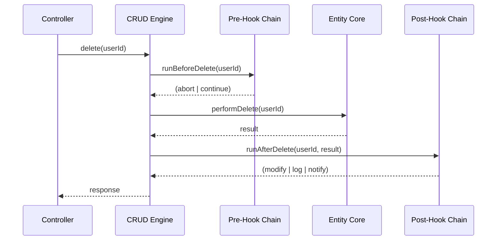
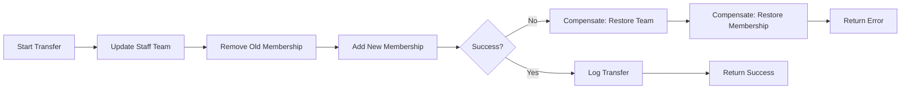
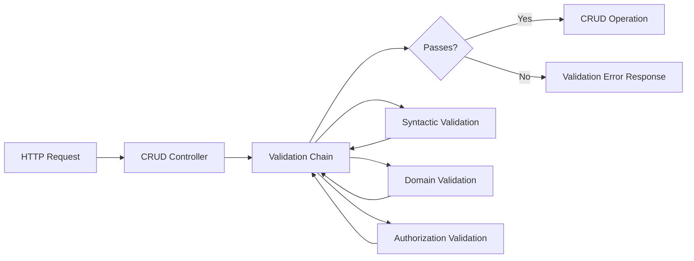

# CRUD Specialization Patterns

> **Navigation:** [CRUD Anti-Patterns](crud-anti-patterns.md) | [Role Delegation Patterns](role-delegation-patterns.md) | [Extension Points Map](../extensibility/extension-points-map.md)
>
> **Applies To:** ISPOKE-01 (Admin Panel & CRUD Engine)
>
> **Status:** 🟢 Active

---

## Overview

The generic CRUD engine (ISPOKE-01) provides standard Create, Read, Update, Delete operations for all entities. However, real-world domains require specialized behaviour that generic CRUD cannot express without becoming over-generalized. This document defines:

1. **Extension points** — hooks where CRUD behaviour can be customized
2. **Alternative patterns** — when generic CRUD is the wrong abstraction
3. **Validation delegation** — how to enforce domain rules without coupling them to the CRUD engine

---

## 1. Extension Points

### CRUD Lifecycle Hooks

Every CRUD operation exposes a pre- and post-hook that can intercept the operation. Hooks are registered in the Service Provider and receive the current operation context.



#### Hook Definitions

| Hook Point | Signature | Use Case |
|------------|-----------|----------|
| `beforeCreate` | `(array $data, Context $ctx) => array` | Default values, data sanitization, authorization checks |
| `afterCreate` | `(Entity $entity, Context $ctx) => void` | Domain event publishing, cache invalidation |
| `beforeUpdate` | `(string $id, array $data, Context $ctx) => array` | Field-level permission checks, audit snapshots |
| `afterUpdate` | `(Entity $old, Entity $new, Context $ctx) => void` | Change log generation, webhook dispatch |
| `beforeDelete` | `(string $id, Context $ctx) => bool` | Soft-delete conversion, referential integrity checks |
| `afterDelete` | `(string $id, Context $ctx) => void` | Cleanup cascade, notification |
| `beforeRead` | `(Query $query, Context $ctx) => Query` | Tenant filtering, soft-delete filtering |
| `afterRead` | `(Collection $results, Context $ctx) => Collection` | Data masking, enrichment |

#### Hook Registration

```php
<?php
// In SpokeServiceProvider::boot()
$crudEngine = $this->container->get(CrudEngineInterface::class);

$crudEngine->registerHook('beforeCreate', 'users', function (array $data, Context $ctx): array {
    // Enforce default role for new staff users
    if (!isset($data['role'])) {
        $data['role'] = 'team_member';
    }
    return $data;
});

$crudEngine->registerHook('afterCreate', 'users', function (Entity $entity, Context $ctx): void {
    // Dispatch domain event — new staff member onboarded
    $this->events->dispatch(new StaffOnboardedEvent($entity->getId()));
});
```

### Nested Resources

For parent-child entity relationships, CRUD must support nested resource operations without breaking the generic interface.

#### Up-sert Patterns

```php
<?php
// Deep create with nested children
$crudEngine->create('invoice', [
    'tenant_id' => $tenantId,
    'total' => 100.00,
    'line_items' => [
        ['description' => 'Service A', 'amount' => 60.00],
        ['description' => 'Service B', 'amount' => 40.00],
    ],
], [
    'nested' => ['line_items' => ['relation' => 'hasMany', 'foreign_key' => 'invoice_id']],
]);
```

#### Cascading Operations

| Operation | Behaviour | Use Case |
|-----------|-----------|----------|
| **Cascade Create** | Create parent + children in single transaction | Invoice with line items |
| **Cascade Delete** | Delete parent + all children | Remove tenant and all associated data |
| **Cascade Update** | Update parent + children matching condition | Bulk status change |
| **Restrict** | Block delete if children exist | Prevent orphan data |

### Composite Operations

Complex business operations often span multiple entities. These should be expressed as **composite operations** — a single API call that triggers multiple CRUD operations in a transaction.

```php
<?php
// Composite operation: staff member transfer between teams
class TransferStaffOperation implements CompositeOperationInterface
{
    public function execute(array $params, Context $ctx): CompositeResult
    {
        // 1. Update staff member's team_id
        $this->crud->update('staff_members', $params['staff_id'], [
            'team_id' => $params['target_team_id'],
        ]);

        // 2. Remove from old team's member list
        $this->crud->delete('team_memberships', $params['old_membership_id']);

        // 3. Add to new team's member list
        $this->crud->create('team_memberships', [
            'team_id' => $params['target_team_id'],
            'staff_id' => $params['staff_id'],
            'role' => $params['new_role'],
        ]);

        // 4. Log the transfer
        $this->audit->log('staff.transferred', $params);

        return new CompositeResult(true, ['staff_id' => $params['staff_id']]);
    }

    public function compensate(array $params): void
    {
        // Saga compensation — rollback the transfer
        $this->crud->update('staff_members', $params['staff_id'], [
            'team_id' => $params['original_team_id'],
        ]);
        // ... restore original state
    }
}
```

#### Saga Pattern for Distributed Operations



### Domain Events from CRUD Lifecycle

Domain events should be **explicitly declared** in spoke configuration, not implicitly generated from every CRUD operation.

```php
<?php
// config/domain-events.php
return [
    'staff_members' => [
        'events' => [
            'afterCreate' => StaffOnboardedEvent::class,
            'afterUpdate' => [
                'conditions' => ['role', 'team_id', 'status'],
                'event' => StaffRoleChangedEvent::class,
            ],
        ],
    ],
    'invoices' => [
        'events' => [
            'afterUpdate' => [
                'conditions' => ['status' => 'paid'],
                'event' => InvoicePaidEvent::class,
            ],
        ],
    ],
];
```

---

## 2. Alternative CRUD Patterns

When domain requirements exceed what generic CRUD can express, adopt one of these alternative patterns.

### Pattern Selection Guide

| Domain Characteristic | Recommended Pattern | When to Avoid |
|----------------------|-------------------|---------------|
| Audit trail required for all changes | **Event Sourcing** | Simple CRUD with no history needs |
| Read/write workloads differ significantly | **CQRS** | Simple entities with symmetric R/W |
| Complex nested mutations | **GraphQL Mutations** | REST-only API constraints |
| High write throughput | **Event Sourcing + CQRS** | Simple reads that could be cached |
| Strong consistency required | **Generic CRUD + Hooks** | Eventual consistency unacceptable |

### Event Sourcing

```php
<?php
// Event-sourced entity
class WorkflowEventStore
{
    /**
     * Append a domain event to the event stream.
     */
    public function append(string $streamId, DomainEvent $event, int $expectedVersion): void
    {
        // Optimistic concurrency check on version
        $this->db->transaction(function () use ($streamId, $event, $expectedVersion) {
            $currentVersion = $this->getCurrentVersion($streamId);
            if ($currentVersion !== $expectedVersion) {
                throw new ConcurrencyException("Stream {$streamId} version mismatch");
            }
            $this->db->insert('event_store', [
                'stream_id' => $streamId,
                'version' => $expectedVersion + 1,
                'event_type' => get_class($event),
                'event_data' => json_encode($event),
                'occurred_at' => now(),
            ]);
        });
    }

    /**
     * Rebuild aggregate state by replaying events.
     */
    public function rebuildAggregate(string $streamId): Aggregate
    {
        $events = $this->db->where('stream_id', $streamId)
            ->orderBy('version')
            ->get('event_store');

        $aggregate = new WorkflowAggregate();
        foreach ($events as $event) {
            $aggregate->apply($event);  // Event -> state mutation
        }
        return $aggregate;
    }
}
```

#### Event Store Schema

```sql
CREATE TABLE event_store (
    id          BIGINT UNSIGNED AUTO_INCREMENT PRIMARY KEY,
    stream_id   VARCHAR(64)     NOT NULL,
    version     INT UNSIGNED    NOT NULL,
    event_type  VARCHAR(255)    NOT NULL,
    event_data  JSON            NOT NULL,
    occurred_at DATETIME(3)     NOT NULL,
    UNIQUE INDEX idx_stream_version (stream_id, version),
    INDEX idx_event_type (event_type)
);
```

### CQRS (Command Query Responsibility Segregation)

```php
<?php
// Command side — handles mutations
class StaffCommandHandler
{
    public function handle(OnboardStaffCommand $command): void
    {
        $this->db->transaction(function () use ($command) {
            // Write-optimized model
            $this->db->insert('staff_write', [
                'id' => $command->staffId,
                'name' => $command->name,
                'email' => $command->email,
                'role' => $command->role,
                'version' => 1,
            ]);
            $this->events->dispatch(new StaffOnboardedEvent($command->staffId));
        });
    }
}

// Query side — handles reads
class StaffQueryHandler
{
    public function handle(GetStaffProfileQuery $query): array
    {
        // Read-optimized model (possibly denormalised)
        return $this->db->table('staff_read_v')
            ->where('id', $query->staffId)
            ->first();
    }
}

// Projection — synchronises read model from events
class StaffProjection
{
    public function onStaffOnboarded(StaffOnboardedEvent $event): void
    {
        // Rebuild read model from event data
        $this->db->upsert('staff_read_v', [
            'id' => $event->staffId,
            'name' => $event->name,
            'email' => $event->email,
            'role' => $event->role,
            'team_name' => $this->getTeamName($event->teamId),
            'updated_at' => now(),
        ]);
    }
}
```

### GraphQL Mutations

```php
<?php
// GraphQL field-level mutation for nested updates
class UpdateStaffProfileMutation
{
    public function resolve(array $rootValue, array $args, Context $context): array
    {
        // Atomic field-level update with validation per field
        $staffId = $args['staff_id'];
        $updates = [];

        if (isset($args['name'])) {
            $this->validateName($args['name']);
            $updates['name'] = $args['name'];
        }
        if (isset($args['email'])) {
            $this->validateEmail($args['email']);
            $updates['email'] = $args['email'];
        }
        if (isset($args['role'])) {
            $this->authorizeRoleChange($staffId, $args['role'], $context);
            $updates['role'] = $args['role'];
        }

        if (!empty($updates)) {
            $this->crud->update('staff_members', $staffId, $updates);
        }

        return $this->crud->read('staff_members', $staffId);
    }
}
```

---

## 3. Domain Validation Framework Delegation

Domain validation should **never** live inside the generic CRUD engine. Instead, delegate to domain-specific validators.

### Validator Interface

```php
<?php
namespace Sovereign\Validation\Contracts;

interface DomainValidatorInterface
{
    /**
     * Validate operation before CRUD execution.
     *
     * @throws ValidationException
     */
    public function validate(string $operation, string $entityType, array $data, Context $ctx): void;
}
```

### Domain Validator Registration

```php
<?php
// In SpokeServiceProvider::boot()
$validatorRegistry = $this->container->get(ValidatorRegistry::class);

// Register a domain validator for staff member operations
$validatorRegistry->register('staff_members', new StaffMemberValidator([
    'create' => [AuthorizeStaffCreate::class, ValidateEmailUniqueness::class],
    'update' => [AuthorizeStaffUpdate::class, ValidateRoleTransition::class],
    'delete' => [AuthorizeStaffDelete::class, ValidateNoActiveAssignments::class],
]));
```

### Cross-Entity Validation

```php
<?php
class ValidateNoActiveAssignments implements ValidationRuleInterface
{
    public function validate(string $operation, string $entityType, array $data, Context $ctx): void
    {
        // This validator spans multiple entities
        $activeAssignments = $this->db->table('workflow_tasks')
            ->where('assignee_id', $data['id'])
            ->whereIn('status', ['pending', 'in_progress'])
            ->count();

        if ($activeAssignments > 0) {
            throw new ValidationException(
                "Cannot delete staff member with {$activeAssignments} active assignments"
            );
        }
    }
}
```

### Validation Pipeline



---

## 4. Extension Point Registration Reference

### Configuration-Based Registration

All extension points can also be registered declaratively via configuration:

```php
<?php
// config/crud-extensions.php
return [
    'staff_members' => [
        'nested' => [
            'assignments' => ['relation' => 'hasMany', 'foreign_key' => 'staff_id'],
            'documents' => ['relation' => 'morphMany', 'morph_type' => 'staff'],
        ],
        'hooks' => [
            'beforeCreate' => ['App\Hooks\DefaultRoleHook'],
            'afterUpdate' => ['App\Hooks\StaffChangeAuditHook'],
        ],
        'events' => [
            'afterCreate' => 'App\Events\StaffOnboardedEvent',
        ],
        'validators' => [
            'App\Validators\EmailUniquenessValidator',
            'App\Validators\RoleTransitionValidator',
        ],
    ],
];
```

### Extension Point Summary

| Hook | Nested Resources | Composite Ops | Event Sourcing | CQRS | GraphQL |
|------|-----------------|---------------|----------------|------|---------|
| `beforeCreate` | ✅ Pre-children | ✅ | ❌ | ❌ | ❌ |
| `afterCreate` | ✅ Post-children | ✅ | ✅ Append event | ✅ Dispatch command | ✅ |
| `beforeUpdate` | ✅ | ✅ | ❌ | ❌ | ✅ Field-level |
| `afterUpdate` | ✅ | ✅ | ✅ Append event | ✅ Dispatch command | ✅ |
| `beforeDelete` | ✅ Restrict check | ✅ | ❌ | ❌ | ❌ |
| `afterDelete` | ✅ Cascade | ✅ | ✅ Append event | ✅ Dispatch command | ❌ |
| `beforeRead` | ❌ | ❌ | ❌ | ✅ Use read model | ❌ |
| `afterRead` | ❌ | ❌ | ❌ | ✅ Enrich read model | ✅ |

---

> **Document Version:** 1.0
> **Last Updated:** Current Session
> **Status:** 🟢 Active
> **Review Cycle:** Quarterly