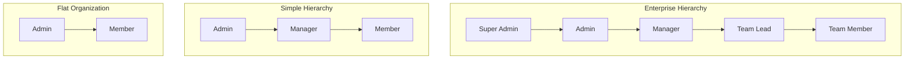
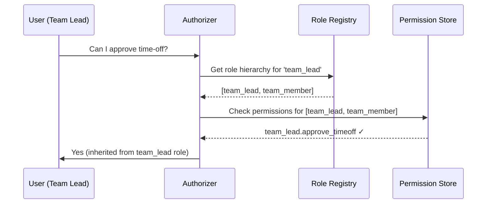
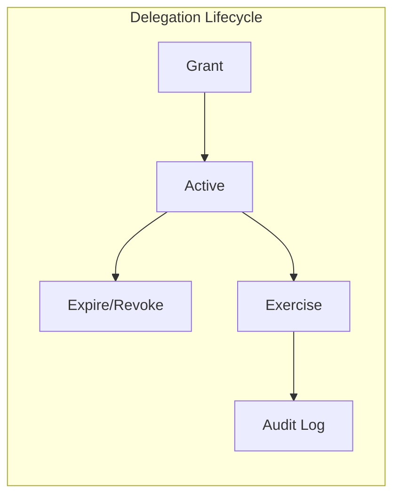
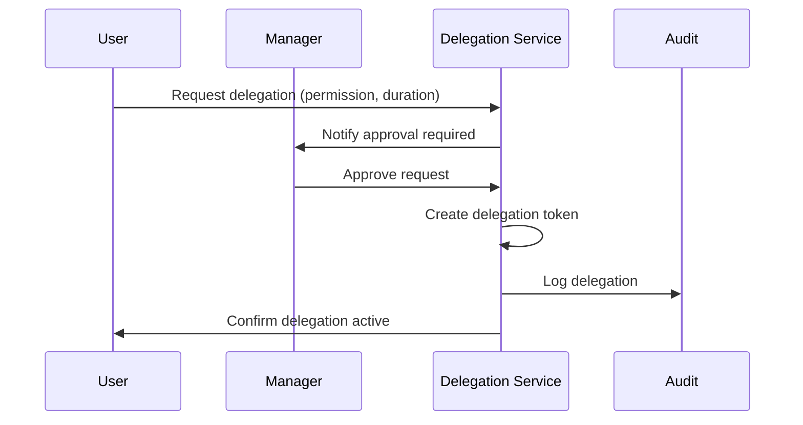
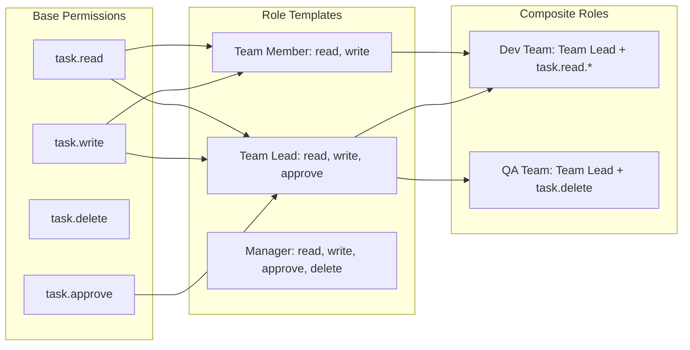

# Role Hierarchies & Delegation Patterns

> **Navigation:** [CRUD Specialization](crud-specialization.md) | [CRUD Anti-Patterns](crud-anti-patterns.md) | [Concurrent Editing](concurrent-editing.md)
>
> **Applies To:** ISPOKE-04 (Staff Identity), HUB-05 (RBAC)
>
> **Cross-Reference:** [Extension Points Map](../extensibility/extension-points-map.md#5-route-definition)
>
> **Status:** 🟢 Active

---

## 1. Role Hierarchy Framework

### Standard Role Structures



#### Role Definitions

| Role | Scope | Typical Permissions | Reports To |
|------|-------|-------------------|------------|
| **Super Admin** | System-wide | All operations, tenant management, global config | — |
| **Admin** | Tenant-wide | User management, billing, feature flags | Super Admin |
| **Manager** | Department/Team | Staff assignments, reporting, approvals | Admin |
| **Team Lead** | Team | Task management, moderation, time-off approval | Manager |
| **Team Member** | Self | Content creation, task execution, personal settings | Team Lead |

#### PHP Role Model

```php
<?php
namespace Sovereign\Spoke\Staff\Roles;

enum Role: string
{
    case SuperAdmin = 'super_admin';
    case Admin = 'admin';
    case Manager = 'manager';
    case TeamLead = 'team_lead';
    case TeamMember = 'team_member';

    /**
     * Return all roles this role inherits permissions from.
     */
    public function inherits(): array
    {
        return match ($this) {
            Role::SuperAdmin => [Role::Admin, Role::Manager, Role::TeamLead, Role::TeamMember],
            Role::Admin => [Role::Manager, Role::TeamLead, Role::TeamMember],
            Role::Manager => [Role::TeamLead, Role::TeamMember],
            Role::TeamLead => [Role::TeamMember],
            Role::TeamMember => [],
        };
    }

    /**
     * Return roles that report to this role.
     */
    public function subordinates(): array
    {
        return match ($this) {
            Role::SuperAdmin => [Role::Admin, Role::Manager, Role::TeamLead, Role::TeamMember],
            Role::Admin => [Role::Manager, Role::TeamLead, Role::TeamMember],
            Role::Manager => [Role::TeamLead, Role::TeamMember],
            Role::TeamLead => [Role::TeamMember],
            Role::TeamMember => [],
        };
    }
}
```

### Permission Inheritance Flow



---

## 2. Inheritance & Override Patterns

### Permission Inheritance Rules

1. **Downward inheritance:** A role automatically receives all permissions of its `inherits()` roles.
2. **Explicit override:** A role can explicitly grant a permission that its children don't have.
3. **Deny overrides allow:** An explicit `deny` at any level overrides inherited `allow`.
4. **Scoped inheritance:** Inheritance can be scoped to specific resources or tenants.

```php
<?php
class PermissionResolver
{
    /**
     * Resolve effective permissions for a user by walking the role hierarchy.
     * Deny-overrides-allow: if any role in the chain explicitly denies, it wins.
     */
    public function resolveEffectivePermissions(string $userId, string $tenantId): array
    {
        $user = $this->userRepo->find($userId);
        $roles = $user->getRole()->inherits();
        $roles[] = $user->getRole();  // Include user's direct role

        $permissions = ['allows' => [], 'denies' => []];

        foreach ($roles as $role) {
            $rolePerms = $this->permissionRepo->getByRole($role, $tenantId);
            $permissions['allows'] = array_merge($permissions['allows'], $rolePerms['allows']);
            $permissions['denies'] = array_merge($permissions['denies'], $rolePerms['denies']);
        }

        // Deny overrides allow
        return array_diff($permissions['allows'], $permissions['denies']);
    }
}
```

### Override Types

| Override Type | Scope | Example | Mechanism |
|--------------|-------|---------|-----------|
| **Tenant-specific** | Single tenant | Admin can modify billing in tenant A, not tenant B | `tenant_id` scoped permission |
| **Resource-specific** | Single resource type | Manager can approve invoices but not time-off | `resource_type` scoped permission |
| **Field-level** | Specific field | Team Lead can update task status but not priority | `field` scoped permission |
| **Time-bound** | Specific period | Temporary admin access during incident | `valid_from` / `valid_until` |

---

## 3. Delegation Patterns

Delegation allows a user to temporarily grant elevated privileges to another user without permanently changing their role.



### Task-Based Delegation

Grant a specific permission for a specific task instance.

```php
<?php
class TaskDelegation
{
    /**
     * Delegate a specific permission to a user for a specific task.
     */
    public function delegateForTask(
        string $fromUserId,
        string $toUserId,
        string $taskId,
        string $permission,
        ?\DateTimeImmutable $expiresAt = null,
    ): DelegationToken {

        $token = new DelegationToken(
            id: Uuid::generate(),
            fromUserId: $fromUserId,
            toUserId: $toUserId,
            scope: new TaskScope($taskId),
            permissions: [$permission],
            grantedAt: new \DateTimeImmutable(),
            expiresAt: $expiresAt ?? (new \DateTimeImmutable())->modify('+24 hours'),
        );

        $this->delegationStore->save($token);

        $this->audit->log('delegation.granted', [
            'from' => $fromUserId,
            'to' => $toUserId,
            'task' => $taskId,
            'permission' => $permission,
            'expires' => $token->expiresAt,
        ]);

        return $token;
    }
}
```

### Time-Limited Access

```php
<?php
class TimeLimitedDelegation
{
    /**
     * Grant a temporary role elevation with automatic revocation.
     */
    public function grantElevation(
        string $granterId,
        string $recipientId,
        Role $elevatedRole,
        \DateTimeImmutable $validFrom,
        \DateTimeImmutable $validUntil,
        string $reason,
    ): void {

        $elevation = new RoleElevation(
            id: Uuid::generate(),
            userId: $recipientId,
            elevatedRole: $elevatedRole,
            baseRole: $this->userRepo->find($recipientId)->getRole(),
            validFrom: $validFrom,
            validUntil: $validUntil,
            grantedBy: $granterId,
            reason: $reason,
        );

        $this->elevationStore->save($elevation);

        // Schedule automatic revocation
        $this->scheduler->schedule(
            at: $validUntil,
            job: new RevokeElevationJob($elevation->id),
        );

        $this->audit->log('role.elevation.granted', [
            'user' => $recipientId,
            'elevated_to' => $elevatedRole->value,
            'from' => $elevation->baseRole->value,
            'valid_until' => $validUntil,
            'reason' => $reason,
            'granted_by' => $granterId,
        ]);
    }
}
```

### Approval-Based Delegation



### Escalation Delegation

When a task or approval reaches a deadline without action, it auto-escalates to the next role level.

```php
<?php
class EscalationPolicy
{
    /**
     * Escalate an unactioned task up the management chain.
     */
    public function escalate(string $taskId): void
    {
        $task = $this->taskRepo->find($taskId);

        if ($task->isOverdue()) {
            $currentAssignee = $this->userRepo->find($task->getAssigneeId());
            $managerRole = $this->getNextRoleUp($currentAssignee->getRole());

            if ($managerRole === null) {
                $this->alert->critical("Task {$taskId} has no escalation path");
                return;
            }

            $manager = $this->userRepo->findManagerByRole(
                $task->getTeamId(), $managerRole
            );

            // Delegate the task to the manager
            $this->delegation->delegateForTask(
                fromUserId: $currentAssignee->getId(),
                toUserId: $manager->getId(),
                taskId: $taskId,
                permission: 'task.approve',
                expiresAt: (new \DateTimeImmutable())->modify('+48 hours'),
            );

            $this->audit->log('task.escalated', [
                'task' => $taskId,
                'from' => $currentAssignee->getId(),
                'to' => $manager->getId(),
                'reason' => 'deadline_exceeded',
            ]);
        }
    }

    private function getNextRoleUp(Role $current): ?Role
    {
        return match ($current) {
            Role::TeamMember => Role::TeamLead,
            Role::TeamLead => Role::Manager,
            Role::Manager => Role::Admin,
            Role::Admin => Role::SuperAdmin,
            Role::SuperAdmin => null,  // No further escalation
        };
    }
}
```

### Delegation Types Summary

| Type | Duration | Scope | Approval Required | Auto-Renew |
|------|----------|-------|-------------------|------------|
| **Task-based** | Task lifetime | Single task | Optional | No |
| **Time-limited** | Fixed window | Role-level | Yes | No |
| **Approval-based** | Configurable | Permission set | Yes | No |
| **Escalation** | Deadline-driven | Single task | No (automatic) | No |

---

## 4. Permission Composition

### Three-Layer Composition Model



```php
<?php
// Avoiding combinatorial explosion through template inheritance
class RoleComposer
{
    private array $templates = [
        'team_member' => [
            'permissions' => ['task.read', 'task.write', 'comment.create'],
        ],
        'team_lead' => [
            'extends' => 'team_member',  // Inherits all team_member permissions
            'permissions' => ['task.approve', 'task.assign', 'report.read'],
        ],
        'manager' => [
            'extends' => 'team_lead',    // Inherits all team_lead permissions
            'permissions' => ['task.delete', 'staff.read', 'timeoff.approve'],
        ],
    ];

    public function compose(string $roleName, array $additionalPermissions = []): array
    {
        $template = $this->templates[$roleName] ?? throw new \RuntimeException("Unknown role: {$roleName}");

        $permissions = $this->resolveInherited($roleName);
        $permissions = array_merge($permissions, $additionalPermissions);

        return array_unique($permissions);
    }

    private function resolveInherited(string $roleName): array
    {
        $template = $this->templates[$roleName];
        $permissions = $template['permissions'];

        if (isset($template['extends'])) {
            $permissions = array_merge(
                $this->resolveInherited($template['extends']),
                $permissions,
            );
        }

        return $permissions;
    }
}
```

### Permission Composition Anti-Patterns

| Anti-Pattern | Problem | Solution |
|-------------|---------|----------|
| Flat permission list (100+ entries) | Impossible to understand or audit | Group into role templates |
| Role-per-user | Each user has a unique role | Use base role + delegation |
| Permission duplication | Same permission defined in 15 roles | Template inheritance |
| Boolean explosion | `can_read && can_write && can_delete && ...` | Group into permission categories |

---

## 5. Audit Trail Patterns

### Audit Event Schema

```php
<?php
// Canonical audit event for all role/delegation changes
class RoleAuditEvent
{
    public function __construct(
        public readonly string $eventId,
        public readonly string $eventType,   // 'role.changed' | 'delegation.granted' | 'delegation.revoked' | 'elevation.granted' | 'elevation.expired'
        public readonly string $userId,      // Subject (who changed)
        public readonly string $targetId,    // Object (who was changed)
        public readonly array $changes,      // ['field' => ['old' => x, 'new' => y]]
        public readonly string $source,      // 'admin_ui' | 'api' | 'system' | 'escalation'
        public readonly string $reason,      // Human-readable reason
        public readonly string $tenantId,
        public readonly \DateTimeImmutable $occurredAt,
    ) {}
}
```

### Audit Query Patterns

```sql
-- Find all role changes for a specific user
SELECT * FROM role_audit_log
WHERE target_id = :userId
  AND event_type IN ('role.changed', 'elevation.granted')
ORDER BY occurred_at DESC;

-- Find all active delegations
SELECT * FROM role_audit_log
WHERE event_type = 'delegation.granted'
  AND occurred_at > NOW() - INTERVAL 30 DAY
  AND NOT EXISTS (
    SELECT 1 FROM role_audit_log AS revoke
    WHERE revoke.event_type = 'delegation.revoked'
      AND revoke.target_id = role_audit_log.target_id
      AND revoke.occurred_at > role_audit_log.occurred_at
  );

-- Compliance report: all admin-level changes in last 90 days
SELECT * FROM role_audit_log
WHERE (event_type LIKE 'role.%' OR event_type LIKE 'elevation.%')
  AND occurred_at > NOW() - INTERVAL 90 DAY
  AND changes LIKE '%"admin"%';
```

### Delegation Token Verification

```php
<?php
class DelegationVerifier
{
    /**
     * Verify a delegation token is still valid for the requested permission.
     */
    public function verify(string $userId, string $permission, string $resourceId): bool
    {
        $activeTokens = $this->delegationStore->findActiveByUser($userId);

        foreach ($activeTokens as $token) {
            if ($token->expiresAt < new \DateTimeImmutable()) {
                $token->markExpired();
                continue;
            }

            if ($token->hasPermission($permission) && $token->scope->matches($resourceId)) {
                $this->audit->log('delegation.exercised', [
                    'token' => $token->id,
                    'user' => $userId,
                    'permission' => $permission,
                    'resource' => $resourceId,
                ]);
                return true;
            }
        }

        return false;
    }
}
```

---

## 6. Implementation Reference

### Interface Contracts

```php
<?php
namespace Sovereign\Internal\Staff\Contracts;

interface RoleHierarchyInterface
{
    /** Get all roles that inherit from (are above) the given role. */
    public function getAncestors(Role $role): array;

    /** Get all roles that inherit the given role. */
    public function getDescendants(Role $role): array;

    /** Check if a role change is valid (no circular dependencies). */
    public function validateTransition(Role $current, Role $new): bool;
}

interface DelegationInterface
{
    /** Create a new delegation token. */
    public function grant(DelegationRequest $request): DelegationToken;

    /** Revoke an active delegation token. */
    public function revoke(string $tokenId, string $reason): void;

    /** Verify a delegation token for a specific permission and resource. */
    public function verify(string $userId, string $permission, string $resourceId): bool;

    /** Get all active delegation tokens for a user (granted and received). */
    public function getActiveTokens(string $userId): array;
}

interface RoleAuditInterface
{
    /** Record a role or delegation change. */
    public function record(RoleAuditEvent $event): void;

    /** Query audit log for compliance reports. */
    public function query(RoleAuditQuery $query): array;
}
```

### Delegation Token Data Model

```sql
CREATE TABLE delegation_tokens (
    id              VARCHAR(64) PRIMARY KEY,
    from_user_id    VARCHAR(64) NOT NULL,
    to_user_id      VARCHAR(64) NOT NULL,
    scope_type      VARCHAR(32) NOT NULL,    -- 'task', 'tenant', 'global'
    scope_id        VARCHAR(64) NOT NULL,
    permissions     JSON NOT NULL,            -- ['task.approve', 'task.assign']
    granted_at      DATETIME(3) NOT NULL,
    expires_at      DATETIME(3) NOT NULL,
    revoked_at      DATETIME(3) NULL,
    reason          TEXT NOT NULL,
    INDEX idx_to_user (to_user_id, expires_at),
    INDEX idx_from_user (from_user_id),
    INDEX idx_scope (scope_type, scope_id)
);

CREATE TABLE role_elevations (
    id              VARCHAR(64) PRIMARY KEY,
    user_id         VARCHAR(64) NOT NULL,
    base_role       VARCHAR(32) NOT NULL,
    elevated_role   VARCHAR(32) NOT NULL,
    valid_from      DATETIME(3) NOT NULL,
    valid_until     DATETIME(3) NOT NULL,
    granted_by      VARCHAR(64) NOT NULL,
    reason          TEXT NOT NULL,
    revoked_at      DATETIME(3) NULL,
    INDEX idx_user_active (user_id, valid_from, valid_until)
);

CREATE TABLE role_audit_log (
    id              BIGINT UNSIGNED AUTO_INCREMENT PRIMARY KEY,
    event_id        VARCHAR(64) NOT NULL UNIQUE,
    event_type      VARCHAR(32) NOT NULL,
    user_id         VARCHAR(64) NOT NULL,
    target_id       VARCHAR(64) NOT NULL,
    changes         JSON NOT NULL,
    source          VARCHAR(32) NOT NULL,
    reason          TEXT,
    tenant_id       VARCHAR(64) NOT NULL,
    occurred_at     DATETIME(3) NOT NULL,
    INDEX idx_event_type (event_type),
    INDEX idx_target (target_id, occurred_at),
    INDEX idx_tenant_time (tenant_id, occurred_at)
);
```

---

> **Document Version:** 1.0
> **Last Updated:** Current Session
> **Status:** 🟢 Active
> **Review Cycle:** Quarterly