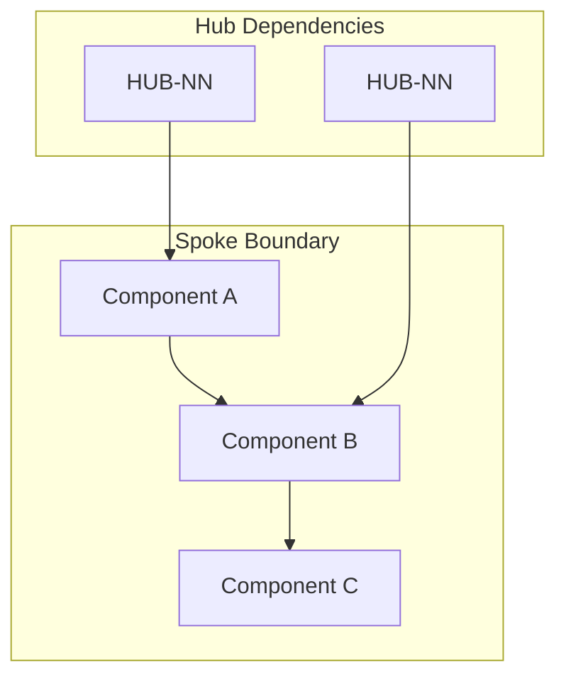
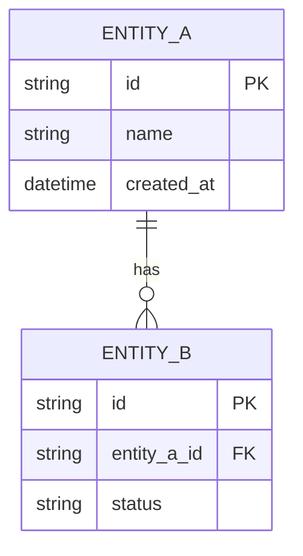

# Spoke Documentation Template

> **Navigation:** [Internal Spokes Timeline](../roadmap/internal-spokes-timeline.md) | [Placeholder Blueprints](placeholder-blueprints.md)
>
> **Cross-References:** [Extension Points Map](../extensibility/extension-points-map.md) | [Design Pattern Catalog](../design-patterns/factory-pattern.md)

---

## Purpose

This template standardises the structure of all Internal Spoke documentation across four progressive levels of detail. Every spoke **must** complete Level 1 (Concept) before implementation begins. Levels 2–4 are completed incrementally as the spoke matures.

---

## Four-Level Maturity Model

| Level | Name | Required For | Provides |
|-------|------|-------------|----------|
| **1 - Concept** | Blueprint Approval | Implementation start | High-level scope, dependencies, sequencing |
| **2 - Design** | Architecture Review | Code scaffold | Data model, interfaces, contracts |
| **3 - Implementation** | Development Ready | Feature completion | Integration wiring, CI criteria, configuration |
| **4 - Operations** | Production Readiness | Deployment | Runbooks, monitoring, scaling, failure modes |

---

## Level 1 — Concept

### Phase ID
`ISPOKE-NN`

### Tier
Internal Spoke (Staff-only Application)

### Component Name
[Descriptive name, e.g. "Sovereign Admin Panel"]

### Description
[2–3 sentence overview of what this spoke does. Focus on the business capability, not the technical implementation.]

### Sequencing Rationale
[1–2 sentences explaining why this spoke is placed at this point in the implementation order. Mention dependency relationships.]

### Status
`📝 Placeholder` | `🔧 In Design` | `🛠 In Development` | `✅ Complete` | `🟢 Production`

---

## Level 2 — Design

### Context7 Research

#### Direct Hub Dependencies
- `HUB-NN: [Dependency Name]` — [Why this dependency exists]
- `HUB-NN: [Dependency Name]` — [Why this dependency exists]
- ...

#### Transitive Core Dependencies
- `CORE-NN: [Dependency Name]`
- `CORE-NN: [Dependency Name]`
- ...

#### External Patterns & References
- [Pattern name / technology reference with URL or citation]

### Architectural Design
[Describe the high-level architecture. Include key components and their responsibilities.]



#### Key Components
| Component | Responsibility | Key Pattern |
|-----------|---------------|-------------|
| [Component A] | [Responsibility] | [Pattern] |
| [Component B] | [Responsibility] | [Pattern] |

### Interface Contracts

```php
namespace Sovereign\Internal\{SpokeName}\Contracts;

interface {SpokeName}Interface
{
    /**
     * [Description of the contract method.]
     */
    public function primaryOperation(string $param): array;
}
```

### Data Model
[Describe primary entities, relationships, and storage patterns.]



---

## Level 3 — Implementation

### Integration Strategy

#### Bootstrapping
[How this spoke registers itself — Service Provider, Kernel hooks, etc.]

```php
<?php
class {SpokeName}ServiceProvider extends ServiceProvider
{
    public function register(): void
    {
        // Bind spoke contracts to implementations
        $this->container->bind({SpokeName}Interface::class, {SpokeName}Service::class);
    }

    public function boot(): void
    {
        // Register routes, listeners, middleware
    }
}
```

#### UI Rendering
[How the spoke consumes UI components from HUB-26 or provides its own.]

#### Notifications & Events
[Which Hub events this spoke publishes or subscribes to. Integration with ISPOKE-07.]

#### Auditing
[How this spoke integrates with HUB-06 and ISPOKE-10 for audit logging.]

#### Health Reporting
[How this spoke reports health status to HUB-15.]

### Configuration Reference

```php
// config/{spoke-name}.php
return [
    'feature_flags' => [
        'new_ui' => env('{SPOKE}_NEW_UI', false),
    ],
    'pagination' => [
        'default_per_page' => 25,
        'max_per_page' => 100,
    ],
];
```

### CI Verification Criteria
- **[Criterion 1]:** [Description of what is verified and how.]
- **[Criterion 2]:** [Description of what is verified and how.]
- **[Criterion 3]:** [Description of what is verified and how.]

### Testing Strategy

#### Unit Tests
- [Component A] — [coverage target / key scenarios]
- [Component B] — [coverage target / key scenarios]

#### Integration Tests
- [Hub dependency integration] — [scenarios]
- [Cross-spoke integration] — [scenarios]

#### E2E Tests
- [User journey 1]
- [User journey 2]

### Performance Baseline
| Metric | Target | Measurement Method |
|--------|--------|---------------------|
| Page load time | < [time] | [tool] |
| API response time (P50) | < [time] | [tool] |
| API response time (P99) | < [time] | [tool] |
| Concurrent users | [n] | [tool] |

---

## Level 4 — Operations

### Runbook

#### Startup
1. [Step 1]
2. [Step 2]

#### Health Check
- Endpoint: `/health/{spoke-name}`
- Expected response: `{ "status": "healthy" }`

#### Common Failure Modes
| Failure | Symptom | Resolution |
|---------|---------|------------|
| [Failure 1] | [Symptom] | [Resolution steps] |
| [Failure 2] | [Symptom] | [Resolution steps] |

### Monitoring & Alerting

#### Key Metrics
| Metric | Alert Threshold | Severity |
|--------|----------------|----------|
| [Metric] | [Threshold] | [Severity] |

#### Dashboard Panels
- [Panel description 1]
- [Panel description 2]

### Scaling Guidance
[How this spoke scales with increasing load. Vertical vs. horizontal scaling recommendations.]

### Security Considerations
- [Security concern 1] — [Mitigation]
- [Security concern 2] — [Mitigation]

---

## Completion Checklist

### Level 1 — Concept
- [ ] Phase ID and tier documented
- [ ] Component name and description written
- [ ] Sequencing rationale provided
- [ ] Status tag set

### Level 2 — Design
- [ ] Direct Hub dependencies listed
- [ ] Transitive Core dependencies listed
- [ ] Architectural design described with Mermaid diagram
- [ ] Interface contracts defined
- [ ] Data model documented

### Level 3 — Implementation
- [ ] Integration strategy documented
- [ ] CI verification criteria defined
- [ ] Testing strategy outlined
- [ ] Configuration reference added
- [ ] Performance baseline established

### Level 4 — Operations
- [ ] Runbook created
- [ ] Monitoring & alerting configured
- [ ] Scaling guidance documented
- [ ] Security considerations addressed

---

> **Template Version:** 1.0
> **Created:** Current Session
> **Review Cycle:** Quarterly, aligned with evaluation/EVALUATION_SUMMARY.md updates