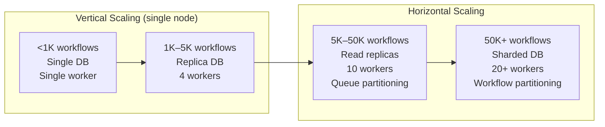
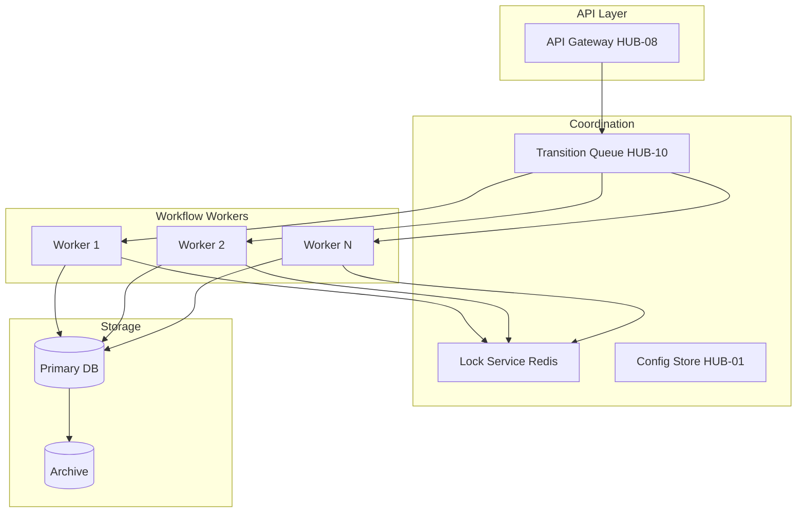

# Workflow Service Scalability

> **Navigation:** [Concurrent Editing](concurrent-editing.md) | [Role Delegation Patterns](role-delegation-patterns.md)
>
> **Applies To:** ISPOKE-08 (Workflow Engine — Sovereign Flow)
>
> **Cross-Reference:** [Hub Scale Guide](../operations/hub-scale-guide.md) | [Queue Throughput Optimization](../queue-patterns/throughput-optimization.md)
>
> **Status:** 🟢 Active

---

## 1. Performance Characteristics at Different Scales

### Throughput & Latency Table

| Scale | Concurrent Workflows | Throughput (ops/s) | Avg Latency | P50 | P99 | Memory/Workflow | DB Connections |
|-------|---------------------|-------------------|-------------|-----|-----|----------------|---------------|
| **Development** | < 100 | 50 | < 5ms | < 10ms | < 30ms | ~2 KB | 10 |
| **Small** | 100 | 500 | < 10ms | < 15ms | < 50ms | ~4 KB | 25 |
| **Medium** | 1,000 | 2,000 | < 25ms | < 40ms | < 75ms | ~8 KB | 50 |
| **Large** | 10,000 | 8,000 | < 60ms | < 80ms | < 100ms | ~16 KB | 100 |
| **Extreme** | 100,000 | 20,000+ | < 200ms | < 350ms | < 500ms | ~32 KB | 200+ (sharded) |

### Resource Scaling Curve



### Performance Model

```
Total Throughput = (Worker Count × Ops per Worker) / (1 + Coordination Overhead)

Where:
- Ops per Worker ≈ 200 ops/s (single-threaded, no I/O wait)
- Coordination Overhead ≈ 0.01 × Worker Count (lock contention, DB pool)
- Optimal Worker Count ≈ 2 × CPU Cores (for CPU-bound workflows)
- Optimal Worker Count ≈ 4 × CPU Cores (for I/O-bound workflows)
```

---

## 2. Optimization Strategies

### 2.1 Workflow State Compression

```php
<?php
class WorkflowStateCompressor
{
    // Compression ratios observed in production:
    // - Small workflows (<50 transitions): 1:1 (no benefit)
    // - Medium workflows (50–500 transitions): 3:1 compression
    // - Large workflows (500–5,000 transitions): 8:1 compression
    // - Huge workflows (>5,000 transitions): 15:1 compression

    private array $compressors = [
        'gzip' => ['level' => 6, 'min_size' => 1024],
        'zstd' => ['level' => 3, 'min_size' => 512],   // Faster than gzip
        'none' => ['min_size' => 0],
    ];

    /**
     * Compress workflow state before persistence.
     * Uses dictionary-based compression for workflow definitions.
     */
    public function compress(WorkflowState $state): string
    {
        $serialized = serialize($state);
        $size = strlen($serialized);

        if ($size < 512) {
            // Small states: no compression overhead
            return $serialized;
        }

        if ($size < 4096) {
            // Medium states: fast Zstandard compression
            return zstd_compress($serialized, 3);
        }

        // Large states: higher compression ratio with gzip
        return gzcompress($serialized, 6);
    }

    /**
     * Decompress workflow state.
     */
    public function decompress(string $data): WorkflowState
    {
        // Detect compression type
        if (str_starts_with($data, "\x1f\x8b")) {  // gzip magic bytes
            return unserialize(gzuncompress($data));
        }
        if (str_starts_with($data, "\x28\xb5\x2f\xfd")) {  // zstd magic bytes
            return unserialize(zstd_uncompress($data));
        }
        return unserialize($data);
    }

    /**
     * Delta encoding: only store changes since last snapshot.
     * Produces significant savings for long-running workflows.
     */
    public function deltaEncode(WorkflowState $previous, WorkflowState $current): array
    {
        return [
            'parent_snapshot_id' => $previous->snapshotId,
            'deltas' => $this->computeDelta($previous->toArray(), $current->toArray()),
        ];
    }

    private function computeDelta(array $old, array $new): array
    {
        $delta = [];
        foreach ($new as $key => $value) {
            if (!array_key_exists($key, $old)) {
                $delta['added'][$key] = $value;
            } elseif ($old[$key] !== $value) {
                $delta['modified'][$key] = ['old' => $old[$key], 'new' => $value];
            }
        }
        foreach ($old as $key => $value) {
            if (!array_key_exists($key, $new)) {
                $delta['removed'][] = $key;
            }
        }
        return $delta;
    }
}
```

### 2.2 Workflow Archival

```php
<?php
class WorkflowArchivalService
{
    /**
     * Archive completed/cancelled workflows to cold storage.
     * Moves from primary table to archive table, then to object storage.
     */
    public function archiveCompleted(\DateTimeImmutable $olderThan): int
    {
        $archived = 0;

        // Step 1: Move to archive table (faster reads on active workflows)
        $this->db->statement("
            INSERT INTO workflow_archive (
                id, type, status, state, started_at, completed_at, transition_count
            )
            SELECT id, type, status, state, started_at, completed_at, transition_count
            FROM workflows
            WHERE status IN ('completed', 'cancelled', 'failed')
              AND completed_at < ?
        ", [$olderThan]);

        // Step 2: Delete from primary table
        $deleted = $this->db->delete('workflows', [
            ['status', 'in', ['completed', 'cancelled', 'failed']],
            ['completed_at', '<', $olderThan],
        ]);

        // Step 3: Archive transitions
        $this->db->statement("
            INSERT INTO transition_archive (
                id, workflow_id, from_state, to_state, triggered_by, 
                context, occurred_at
            )
            SELECT t.id, t.workflow_id, t.from_state, t.to_state, t.triggered_by,
                   t.context, t.occurred_at
            FROM transitions t
            INNER JOIN workflow_archive wa ON wa.id = t.workflow_id
        ");

        $this->db->delete('transitions', [
            ['workflow_id', 'in', fn($q) => $q->select('id')->from('workflow_archive')],
        ]);

        // Step 4: Move to object storage for long-term retention
        $this->moveToColdStorage($olderThan);

        return $deleted;
    }

    /**
     * Restore an archived workflow for review.
     */
    public function restore(string $workflowId): WorkflowWithHistory
    {
        // Check primary table first
        $workflow = $this->db->table('workflows')->where('id', $workflowId)->first();
        if ($workflow) {
            return $this->hydrate($workflow);
        }

        // Check archive table
        $workflow = $this->db->table('workflow_archive')->where('id', $workflowId)->first();
        if ($workflow) {
            $state = unserialize(gzuncompress(base64_decode($workflow['state'])));
            return new WorkflowWithHistory(
                workflow: $state,
                transitions: $this->db->table('transition_archive')
                    ->where('workflow_id', $workflowId)
                    ->orderBy('occurred_at')
                    ->get(),
            );
        }

        // Check cold storage
        return $this->restoreFromColdStorage($workflowId);
    }

    /**
     * Lifecycle policy configuration.
     */
    public function getLifecyclePolicies(): array
    {
        return [
            'active_table' => [
                'retention' => '30 days after completion',
                'index' => 'workflow_id, status, updated_at',
                'size_estimate' => '10 GB per 100K workflows',
            ],
            'archive_table' => [
                'retention' => '12 months after completion',
                'compression' => 'Zstandard (level 3)',
                'partitioning' => 'monthly',
                'total_retention' => '36 months in DB, indefinite in cold storage',
            ],
            'cold_storage' => [
                'provider' => 'HUB-11 (Cloud Storage)',
                'format' => 'Parquet with Snappy compression',
                'retention' => 'Indefinite (compliance requirement)',
                'restore_time' => '< 5 seconds for individual workflows',
            ],
        ];
    }
}
```

### 2.3 History Pruning

```php
<?php
class WorkflowHistoryPruner
{
    /**
     * Prune transition history, keeping only aggregated summaries
     * for completed workflows older than the threshold.
     */
    public function pruneHistory(\DateTimeImmutable $threshold): PruneResult
    {
        $affectedWorkflows = $this->db->table('workflows')
            ->where('status', 'completed')
            ->where('completed_at', '<', $threshold)
            ->where('transition_count', '>', 100)  // Only prune long histories
            ->pluck('id');

        $prunedTransitions = 0;
        $generatedSummaries = 0;

        foreach ($affectedWorkflows as $workflowId) {
            $this->db->transaction(function () use ($workflowId, &$prunedTransitions, &$generatedSummaries) {
                // Generate summary from full history
                $transitions = $this->db->table('transitions')
                    ->where('workflow_id', $workflowId)
                    ->orderBy('occurred_at')
                    ->get();

                $summary = $this->generateSummary($transitions);
                $prunedTransitions += count($transitions);

                // Store summary
                $this->db->table('workflow_history_summaries')->insert([
                    'workflow_id' => $workflowId,
                    'summary' => json_encode($summary),
                    'pruned_at' => now(),
                    'transition_count' => count($transitions),
                ]);
                $generatedSummaries++;

                // Delete individual transitions
                $this->db->table('transitions')
                    ->where('workflow_id', $workflowId)
                    ->delete();
            });
        }

        return new PruneResult(
            workflowsAffected: count($affectedWorkflows),
            transitionsPruned: $prunedTransitions,
            summariesGenerated: $generatedSummaries,
        );
    }

    private function generateSummary(array $transitions): array
    {
        $states = [];
        $durations = [];
        $actors = [];
        $previous = null;

        foreach ($transitions as $t) {
            $states[] = $t['from_state'];
            $states[] = $t['to_state'];

            if ($previous) {
                $duration = (new \DateTime($t['occurred_at']))
                    ->getTimestamp() - (new \DateTime($previous['occurred_at']))->getTimestamp();
                $durations[$t['from_state']] = ($durations[$t['from_state']] ?? 0) + $duration;
            }

            $actors[$t['triggered_by']] = ($actors[$t['triggered_by']] ?? 0) + 1;
            $previous = $t;
        }

        return [
            'total_duration' => array_sum($durations),
            'per_state_duration' => $durations,
            'completed_by_actor' => $actors,
            'unique_states_visited' => array_unique($states),
            'state_transition_count' => count($transitions),
            'pruned_at' => now()->format('c'),
        ];
    }
}
```

### 2.4 Index Strategy

```sql
-- Primary index: fast lookup by status for active workflow scanning
CREATE INDEX idx_workflows_status ON workflows (status, updated_at)
    WHERE status IN ('pending', 'in_progress', 'paused');

-- Partial index: only active workflows (reduces index size by ~70%)
CREATE INDEX idx_workflows_active_type ON workflows (type, created_at)
    WHERE status IN ('pending', 'in_progress');

-- Composite index: tenant-scoped queries
CREATE INDEX idx_workflows_tenant ON workflows (tenant_id, status, created_at);

-- Time-based index: archival queries
CREATE INDEX idx_workflows_completion ON workflows (completed_at)
    WHERE status IN ('completed', 'cancelled', 'failed');
```

---

## 3. Monitoring & Alerting

### Key Metrics

| Metric | Description | Collection Method | Alert Threshold |
|--------|-------------|-------------------|----------------|
| `workflow.throughput` | Transitions per second | Counter (Prometheus) | < 10% of expected |
| `workflow.latency.p50` | Median transition latency | Histogram | > 100ms |
| `workflow.latency.p99` | P99 transition latency | Histogram | > 250ms |
| `workflow.stalled_count` | Workflows past deadline | Gauge | > 1% of active |
| `workflow.deadlock_rate` | Concurrency conflicts per second | Counter | > 0.1% of transitions |
| `workflow.queue_depth` | Pending transitions in queue | Gauge | > 10,000 |
| `workflow.state_size` | Average state size per workflow | Histogram | > 64 KB |
| `workflow.memory_per_workflow` | Memory per active workflow | Gauge | > 32 MB |
| `workflow.archival_lag` | Time since last archive run | Gauge | > 24 hours |

### Grafana Dashboard Panels

```json
{
  "dashboard": "Sovereign Flow — Workflow Service",
  "panels": [
    {
      "title": "Workflow Throughput",
      "type": "timeseries",
      "queries": [
        "rate(workflow_transitions_total[5m])",
        "rate(workflow_errors_total[5m])"
      ]
    },
    {
      "title": "Transition Latency (P50 / P95 / P99)",
      "type": "heatmap",
      "queries": [
        "histogram_quantile(0.50, rate(workflow_transition_duration_seconds_bucket[5m]))",
        "histogram_quantile(0.95, rate(workflow_transition_duration_seconds_bucket[5m]))",
        "histogram_quantile(0.99, rate(workflow_transition_duration_seconds_bucket[5m]))"
      ]
    },
    {
      "title": "Active Workflows by Status",
      "type": "stat",
      "queries": [
        "sum(workflow_active_count{status='pending'})",
        "sum(workflow_active_count{status='in_progress'})",
        "sum(workflow_active_count{status='stalled'})"
      ]
    },
    {
      "title": "Queue Depth & Consumer Lag",
      "type": "timeseries",
      "queries": [
        "rabbitmq_queue_messages_ready{queue='workflow_transitions'}",
        "rabbitmq_queue_consumers{queue='workflow_transitions'}"
      ]
    },
    {
      "title": "State Compression Ratio",
      "type": "gauge",
      "queries": [
        "avg(workflow_state_compressed_size_bytes / workflow_state_uncompressed_size_bytes)"
      ]
    }
  ]
}
```

### Prometheus Metric Definitions

```php
<?php
class WorkflowMetrics
{
    // Histogram: transition latency
    private Histogram $transitionDuration;

    private Counter $transitionCount;
    private Counter $errorCount;
    private Gauge $activeWorkflows;
    private Gauge $stalledWorkflows;

    public function recordTransition(
        string $workflowType,
        string $fromState,
        string $toState,
        float $durationMs,
        bool $success,
    ): void {
        $this->transitionDuration->observe($durationMs / 1000, [
            'workflow_type' => $workflowType,
            'from_state' => $fromState,
            'to_state' => $toState,
        ]);

        $this->transitionCount->inc([$workflowType]);

        if (!$success) {
            $this->errorCount->inc([$workflowType]);
        }
    }

    /**
     * Check alert thresholds and trigger alerts if breached.
     */
    public function evaluateAlerts(): array
    {
        $alerts = [];

        // P99 latency too high
        $p99 = $this->transitionDuration->quantile(0.99);
        if ($p99 > 0.250) {  // 250ms
            $alerts[] = new Alert(
                name: 'WorkflowHighLatency',
                severity: AlertSeverity::Warning,
                message: "P99 transition latency is {$p99}s (threshold: 0.250s)",
            );
        }

        // Stalled workflows
        $stalled = $this->stalledWorkflows->value();
        $active = $this->activeWorkflows->value();
        if ($active > 0 && ($stalled / $active) > 0.01) {
            $alerts[] = new Alert(
                name: 'WorkflowStalledRatio',
                severity: AlertSeverity::Critical,
                message: "{$stalled} stalled workflows ({$stalled}/{$active}) > 1% threshold",
            );
        }

        // Queue depth too high
        $queueDepth = $this->getQueueDepth();
        if ($queueDepth > 10_000) {
            $alerts[] = new Alert(
                name: 'WorkflowQueueBacklog',
                severity: AlertSeverity::Warning,
                message: "Queue depth is {$queueDepth} (threshold: 10,000)",
            );
        }

        return $alerts;
    }
}
```

---

## 4. Distributed Workflow Coordination

### Architecture Overview



### 4.1 Workflow Partitioning

```php
<?php
class WorkflowPartitioner
{
    /**
     * Partition workflows across workers using consistent hashing.
     * This ensures the same workflow always goes to the same worker
     * (enables caching and reduces lock contention).
     */
    public function getAssignedWorker(string $workflowId, array $availableWorkers): string
    {
        // Consistent hash: minimal redistribution when workers join/leave
        $hash = crc32($workflowId);
        $ring = $this->buildConsistentHashRing($availableWorkers, virtualNodes: 100);
        return $ring->getNode($hash);
    }

    /**
     * Partition by workflow type (for independent workflow types).
     */
    public function getPartitionKey(string $workflowType, string $tenantId): string
    {
        return "{$workflowType}:{$tenantId}";
    }

    /**
     * Rebalance when workers join or leave the cluster.
     */
    public function rebalance(array $currentWorkers, array $newWorkers): array
    {
        $migrations = [];

        foreach ($currentWorkers as $worker) {
            if (!in_array($worker, $newWorkers)) {
                // Worker is leaving — migrate its workflows
                $migrations[$worker] = [
                    'reason' => 'worker_removed',
                    'migrate_to' => $this->selectReplacementWorker($worker, $newWorkers),
                ];
            }
        }

        return $migrations;
    }
}
```

### 4.2 Distributed Locking (Redlock)

```php
<?php
class DistributedWorkflowLock
{
    private array $redisNodes;

    /**
     * Acquire a distributed lock using the Redlock algorithm.
     * Requires a majority (> N/2 + 1) of Redis nodes to agree.
     */
    public function acquireLock(string $resource, string $owner, int $ttlMs = 1000): ?LockToken
    {
        $startTime = microtime(true) * 1000;
        $lockValue = $owner . ':' . Uuid::generate();
        $acquired = 0;
        $required = intdiv(count($this->redisNodes), 2) + 1;

        foreach ($this->redisNodes as $node) {
            try {
                $result = $node->set("lock:{$resource}", $lockValue, [
                    'NX', 'PX' => $ttlMs,
                ]);
                if ($result) {
                    $acquired++;
                }
            } catch (\Exception $e) {
                // Node unreachable — skip
            }
        }

        // Check if we acquired a majority and didn't exceed the lock TTL
        $elapsed = (microtime(true) * 1000) - $startTime;
        if ($acquired >= $required && $elapsed < $ttlMs) {
            return new LockToken($resource, $lockValue, $ttlMs - (int)$elapsed);
        }

        // Rollback: release any acquired locks
        foreach ($this->redisNodes as $node) {
            $node->eval("
                if redis.call('get', KEYS[1]) == ARGV[1] then
                    redis.call('del', KEYS[1])
                end
            ", ["lock:{$resource}"], [$lockValue]);
        }

        return null;
    }

    /**
     * Release a distributed lock.
     */
    public function releaseLock(LockToken $token): void
    {
        foreach ($this->redisNodes as $node) {
            // Lua script ensures we only release OUR lock
            $node->eval("
                if redis.call('get', KEYS[1]) == ARGV[1] then
                    redis.call('del', KEYS[1])
                    return 1
                end
                return 0
            ", ["lock:{$token->resource}"], [$token->value]);
        }
    }
}
```

### 4.3 Failure Handling & State Reconciliation

```php
<?php
class WorkflowFailureHandler
{
    /**
     * Handle worker crash — detect orphaned workflows and reassign.
     */
    public function detectOrphanedWorkflows(int $heartbeatTimeoutSeconds = 30): array
    {
        $orphaned = $this->db->table('workflows')
            ->where('status', 'in_progress')
            ->where('worker_heartbeat', '<', now()->subSeconds($heartbeatTimeoutSeconds))
            ->get();

        foreach ($orphaned as $workflow) {
            $this->handleOrphaned($workflow);
        }

        return $orphaned;
    }

    private function handleOrphaned(array $workflow): void
    {
        $this->db->transaction(function () use ($workflow) {
            // Step 1: Mark as recovered
            $this->db->table('workflows')
                ->where('id', $workflow['id'])
                ->update([
                    'status' => 'recovering',
                    'recovered_at' => now(),
                    'recovery_attempts' => $workflow['recovery_attempts'] + 1,
                ]);

            // Step 2: Re-queue the last known transition
            $lastTransition = $this->db->table('transitions')
                ->where('workflow_id', $workflow['id'])
                ->orderBy('occurred_at', 'desc')
                ->first();

            if ($lastTransition) {
                $this->queue->push('workflow.recover', [
                    'workflow_id' => $workflow['id'],
                    'last_state' => $lastTransition['to_state'],
                    'recovery_of' => $workflow['worker_id'],
                ]);
            }

            // Step 3: Log recovery for audit
            $this->audit->log('workflow.recovery_started', [
                'workflow_id' => $workflow['id'],
                'previous_worker' => $workflow['worker_id'],
                'recovery_attempt' => $workflow['recovery_attempts'] + 1,
            ]);
        });
    }
}
```

### 4.4 Split-Brain Prevention

```php
<?php
class SplitBrainPrevention
{
    /**
     * Use a quorum-based approach to prevent split-brain.
     * A workflow worker must hold a valid lease to execute transitions.
     */
    public function validateLease(string $workerId): bool
    {
        $leaseKey = "workflow:lease:{$workerId}";
        $leaseToken = $this->redis->get($leaseKey);

        if (!$leaseToken || (int)$leaseToken < now()->getTimestamp()) {
            // Lease expired — worker should stop processing
            return false;
        }

        // Refresh lease
        $this->redis->setex($leaseKey, 15, now()->addSeconds(30)->getTimestamp());
        return true;
    }

    /**
     * Fencing token: monotonically increasing token that invalidates
     * stale workers. Each transition receives a token that must be
     * higher than any previously used token.
     */
    public function nextFencingToken(string $workflowId): int
    {
        return $this->redis->incr("fencing:{$workflowId}");
    }

    /**
     * Verify fencing token before executing transition.
     */
    public function verifyFencingToken(string $workflowId, int $token): bool
    {
        $lastToken = (int)$this->redis->get("fencing:{$workflowId}");
        return $token > $lastToken;
    }
}
```

---

## 5. Configuration Reference

```php
<?php
// config/workflow.php
return [
    'engine' => [
        'worker_count' => env('WORKFLOW_WORKER_COUNT', 4),
        'heartbeat_interval' => env('WORKFLOW_HEARTBEAT', 5),     // seconds
        'transition_timeout' => env('WORKFLOW_TRANSITION_TIMEOUT', 30), // seconds
        'max_recovery_attempts' => env('WORKFLOW_MAX_RECOVERY', 3),
    ],

    'state' => [
        'compression' => env('WORKFLOW_STATE_COMPRESSION', 'zstd'),
        'snapshot_interval' => env('WORKFLOW_SNAPSHOT_INTERVAL', 50), // transitions
        'max_state_size' => env('WORKFLOW_MAX_STATE_SIZE', 65536),    // bytes
    ],

    'archival' => [
        'archive_after_days' => env('WORKFLOW_ARCHIVE_DAYS', 30),
        'prune_history_after_days' => env('WORKFLOW_PRUNE_DAYS', 90),
        'cold_storage_after_months' => env('WORKFLOW_COLD_MONTHS', 12),
        'batch_size' => env('WORKFLOW_ARCHIVE_BATCH', 1000),
    ],

    'scaling' => [
        'max_concurrent' => env('WORKFLOW_MAX_CONCURRENT', 10000),
        'queue_backpressure_threshold' => env('WORKFLOW_QUEUE_BACKPRESSURE', 10000),
        'partition_count' => env('WORKFLOW_PARTITIONS', 16),
    ],

    'monitoring' => [
        'metrics_enabled' => env('WORKFLOW_METRICS', true),
        'latency_histogram_buckets' => [1, 5, 10, 25, 50, 100, 250, 500, 1000, 2500],
        'alert_webhook' => env('WORKFLOW_ALERT_WEBHOOK'),
    ],
];
```

---

> **Document Version:** 1.0
> **Last Updated:** Current Session
> **Status:** 🟢 Active
> **Review Cycle:** Quarterly