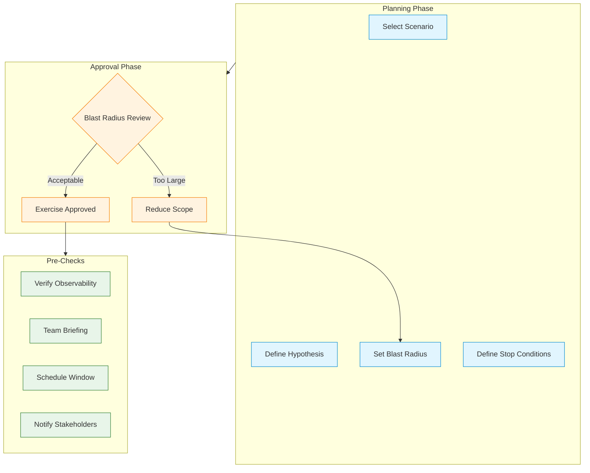
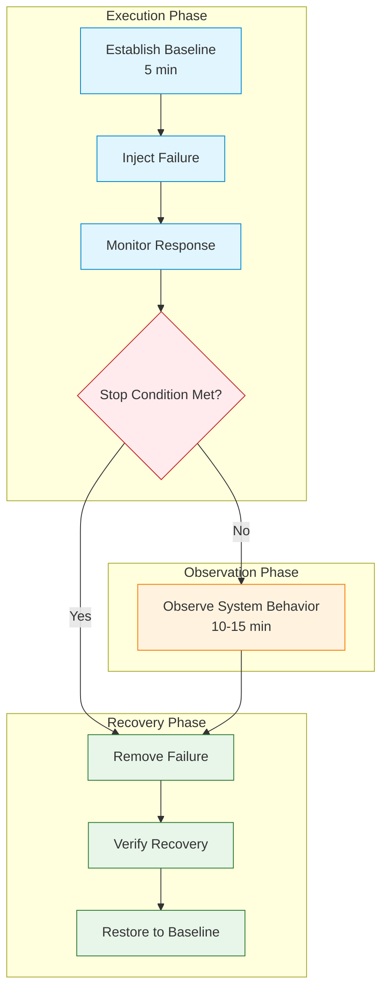

# Chaos Engineering Program

> **Navigation:** [Operations Home](index.md) | [Observability Framework](observability-framework.md) | [Incident Response](incident-response.md) | [Runbooks](runbooks/index.md)
>
> **Cross-Reference:** [SOLUTIONS_TO_WEAKNESSES.md — Weakness 2 (Strategic)](../../evaluation/SOLUTIONS_TO_WEAKNESSES.md#weakness-2-operational-complexity-81-services-and-team-learning-curve-identified-as-primary-risks)
>
> **Related:** [Hub Scale Guide](hub-scale-guide.md) | [Service Dependency Analyzer](service-dependency-analyzer.md) | [Team Scaling Guide](../team-scaling-guide.md)
>
> **Status:** ✅ Design Complete

---

## Overview

The Chaos Engineering Program builds team confidence in handling failure scenarios across all 81+ DGLab services through planned, controlled exercises. This program addresses **Strategic Weakness 2: Operational Complexity** by systematically exposing teams to failure modes, validating observability coverage, and verifying runbook effectiveness — all within a blameless culture.

**Primary Driver:** [Strategic Weakness 2](../../evaluation/SOLUTIONS_TO_WEAKNESSES.md#weakness-2-operational-complexity-81-services-and-team-learning-curve-identified-as-primary-risks)

**Key Success Targets:**
- Team confidence >90% in failure scenarios (measured quarterly)
- Zero operational blind spots verified through simulation coverage
- Runbook accuracy validated through real-world exercises

---

## 1. Program Overview

### 1.1 Principles of Blameless Chaos

The Chaos Engineering Program is built on five core principles:

| # | Principle | Description |
|---|-----------|-------------|
| 1 | **Blameless by Design** | Failures during exercises are system failures, not individual failures. The goal is to find weaknesses, not weaknesses in people. |
| 2 | **Start Small** | Begin with controlled, low-impact experiments in isolated services. Expand scope only after patterns are validated. |
| 3 | **Guardrails First** | Every experiment has automated stop conditions. If a metric threshold is breached, the experiment halts immediately. |
| 4 | **Progressive Complexity** | Increase complexity only after previous exercises have been analyzed and remediations applied. |
| 5 | **Closed-Loop Improvement** | Every exercise generates at least one action item. Exercises repeat until 100% pass rate is achieved. |

### 1.2 Maturity Model

```mermaid
flowchart LR
    subgraph Initial["Level 1: Initial"]
        I1[Ad-hoc experiments<br/>No formal process<br/>Manual execution]
    end

    subgraph Repeatable["Level 2: Repeatable"]
        R1[Standard exercise templates<br/>Scheduled monthly<br/>Known failure catalog]
    end

    subgraph Defined["Level 3: Defined"]
        D1[Automated experiment execution<br/>CI/CD integration<br/>Metrics-driven analysis]
    end

    subgraph Managed["Level 4: Managed"]
        M1[Continuous experimentation<br/>Resilience SLOs<br/>Proactive weakness detection]
    end

    subgraph Optimizing["Level 5: Optimizing"]
        O1[Self-healing systems<br/>Game days as culture<br/>Industry-leading resilience]
    end

    Initial -->|Quarter 1-2| Repeatable
    Repeatable -->|Quarter 3-4| Defined
    Defined -->|Year 2| Managed
    Managed -->|Year 3+| Optimizing

    classDef l1 fill:#ffebee,stroke:#c62828
    classDef l2 fill:#fff3e0,stroke:#f57c00
    classDef l3 fill:#e8f5e9,stroke:#2e7d32
    classDef l4 fill:#e1f5fe,stroke:#0288d1
    classDef l5 fill:#f3e5f5,stroke:#7b1fa2

    class Initial,I1 l1
    class Repeatable,R1 l2
    class Defined,D1 l3
    class Managed,M1 l4
    class Optimizing,O1 l5
```



**Current State:** DGLab is at **Level 1 (Initial)** with ad-hoc post-incident reviews. The program below defines the path to Level 2 (Repeatable).

---

## 2. Monthly Exercise Schedule

### 2.1 Year 1 Schedule: Foundation & Core Services

| Month | Exercise | Scope | Duration | Target |
|-------|----------|-------|----------|--------|
| **Month 1** | Pilot: Single instance kill | 1 service (non-critical) | 1 hour | Validate detection + restart |
| **Month 2** | Network latency injection | 1 service → 1 dependency | 1.5 hours | Test timeout handling, circuit breakers |
| **Month 3** | Cache node failure | Cache cluster (HUB-02) | 2 hours | Validate cache failover, degradation paths |
| **Month 4** | Database failover | Primary → replica | 2 hours | Validate connection pooling, retry logic |
| **Month 5** | Queue backpressure simulation | Queue service (HUB-10) | 1.5 hours | Test DLQ, backpressure, consumer scaling |
| **Month 6** | Review + Remediation Sprint | All findings to date | 2 days | Close action items, update runbooks |
| **Month 7** | Network partition | Service mesh | 2 hours | Validate mesh resilience, retry budgets |
| **Month 8** | Resource exhaustion (CPU) | 2 services simultaneously | 1.5 hours | Test HPA, resource limits, degradation |
| **Month 9** | Resource exhaustion (Memory) | 2 services simultaneously | 1.5 hours | Test OOM handling, graceful degradation |
| **Month 10** | Dependency outage cascade | Service + all dependencies | 2 hours | Validate circuit breaker propagation |
| **Month 11** | Auth service degradation | Auth (HUB-04) | 2 hours | Test token caching, fallback auth |
| **Month 12** | Full-System Game Day | Cross-service, multi-region | 4 hours | Validate E2E resilience, team coordination |

### 2.2 Year 2+ Schedule: Cross-Service & Complex Scenarios

| Quarter | Exercise | Scope | Focus |
|---------|----------|-------|-------|
| Q1 | Multi-service simultaneous failure | 3+ services | Cascading failure prevention |
| Q2 | Data corruption scenario | Database + cache | Data integrity validation |
| Q3 | Regional failover | Active-passive DR | Disaster recovery |
| Q4 | Chaos day (6h marathon) | All critical services | Endurance test, team readiness |

### 2.3 Quarterly Calibration Schedule

At the end of each quarter, the Chaos Engineering team conducts a calibration review:

| Activity | Owner | Duration | Outcome |
|----------|-------|----------|---------|
| Metrics review | SRE Lead | 1 hour | Confidence score update, backlog prioritization |
| Scenario catalog update | Chaos Engineering Lead | 2 hours | New scenarios added, obsolete ones retired |
| Runbook audit | On-Call Team | 2 hours | Runbooks validated, updated based on exercise findings |
| Tooling assessment | Platform Engineer | 1 hour | New tools evaluated, existing tools updated |
| Quarterly report | SRE Director | 1 hour | Executive summary, trend analysis, recommendations |

---

## 3. Failure Scenario Catalog

### 3.1 Infrastructure Failures

| ID | Scenario | Description | Severity | Detection | Mitigation |
|----|----------|-------------|----------|-----------|------------|
| INF-01 | **Node failure** | K8s node becomes unavailable | Critical | `NodeReady` status → `NotReady` | Pods rescheduled by K8s controller |
| INF-02 | **Network partition** | Service cannot reach dependency | High | `network_packet_loss` > 5% | Circuit breaker opens, retry budget exhausted |
| INF-03 | **Disk full** | Node disk reaches 100% | Critical | `disk_usage_percent` = 100 | Pod eviction, log rotation, PVC expansion |
| INF-04 | **DNS failure** | CoreDNS unavailable | Critical | `dns_query_duration` timeout | Use cached DNS, fallback IPs |
| INF-05 | **Clock skew** | Node clock drifts > 5s | Medium | `node_time_offset` > 5s | Token validation fails, re-sync NTP |
| INF-06 | **CPU starvation** | CPU throttled by noisy neighbor | Medium | `cpu_throttled_seconds` > 0 | Resource quotas, priority classes |
| INF-07 | **Memory leak** | Service memory grows unbounded | High | `memory_working_set` trending up | OOMKill, heap dump analysis |
| INF-08 | **NIC failure** | Network interface drops packets | High | `network_errors_total` > 0 | Pod migration, interface reset |

### 3.2 Service Failures

| ID | Scenario | Description | Severity | Example Exercise |
|----|----------|-------------|----------|-----------------|
| SVC-01 | **Instance crash** | Service pod/process crashes | Critical | Kill pod with `kubectl delete pod` |
| SVC-02 | **Slow responses** | Service latency degrades to >5s | High | Inject latency with service mesh fault injection |
| SVC-03 | **Error rate spike** | Service returns 50%+ 5xx errors | High | Inject error responses via proxy sidecar |
| SVC-04 | **Dependency timeout** | Downstream dependency times out | Medium | Block traffic to dependency |
| SVC-05 | **Connection pool exhaustion** | All connections to DB in use | Medium | Reduce max connections in pool |
| SVC-06 | **Resource quota exceeded** | Service exceeds CPU/memory limit | Medium | Reduce resource limits |
| SVC-07 | **Config reload failure** | Config change causes crash loop | High | Push invalid config to config store |
| SVC-08 | **Graceful shutdown failure** | Service doesn't drain connections | Medium | Send SIGTERM, observe in-flight request behavior |

### 3.3 Data Failures

| ID | Scenario | Description | Severity | Detection |
|----|----------|-------------|----------|-----------|
| DAT-01 | **Database connection loss** | DB cluster unreachable | Critical | Connection errors, query timeouts |
| DAT-02 | **Read replica lag** | Replica lag > 60 seconds | High | `replica_lag_seconds` metric |
| DAT-03 | **Data corruption** | Invalid data in DB rows | Critical | Checksum validation, consistency checks |
| DAT-04 | **Cache poisoning** | Stale/corrupt data in cache | Medium | Cache version mismatch, TTL expiry |
| DAT-05 | **Message loss** | Queue messages dropped | Critical | Message count discrepancy, audit trail |
| DAT-06 | **Duplicate messages** | Same message delivered twice | Medium | Idempotency key violations |
| DAT-07 | **Dead-letter overflow** | DLQ exceeds retention threshold | Medium | DLQ depth monitoring |
| DAT-08 | **Migration failure** | Schema migration fails or conflicts | High | Migration state stuck, version mismatch |

### 3.4 Security Events

| ID | Scenario | Description | Severity | Playbook |
|----|----------|-------------|----------|----------|
| SEC-01 | **DDoS simulation** | Traffic spike to 10x normal | High | Rate limiting, WAF, auto-scaling |
| SEC-02 | **Credential leak** | Service credential exposed in logs | Critical | Rotate credentials, audit log analysis |
| SEC-03 | **Unauthorized access** | Request with invalid token reaches service | High | Token validation enforcement, audit |
| SEC-04 | **Rate limit bypass** | Consumer exceeds quota without throttle | Medium | Rate limit configuration audit |
| SEC-05 | **Audit log tampering** | Audit log entries missing or modified | Critical | Immutable log storage, alert on gaps |
| SEC-06 | **Privilege escalation** | Low-privilege user accesses admin endpoint | High | RBAC validation, access review |

---

## 4. Exercise Lifecycle

### 4.1 Planning & Approval

Every chaos exercise follows a formal planning and approval process to ensure safety and value.



**Exercise Plan Template:**

```markdown
# Chaos Exercise Plan: [Scenario Name]

## Details
- **Scenario ID:** [INF/SVC/DAT/SEC]-[number]
- **Date:** [YYYY-MM-DD]
- **Time:** [HH:MM UTC]
- **Duration:** [X hours]
- **Owner:** [Name]

## Hypothesis
> [Clear statement of expected system behavior under failure]

## Blast Radius
| Scope | Detail |
|-------|--------|
| Target service(s) | [Service names] |
| Affected users | [None / Internal only / Staging only] |
| Data risk | [None / Read-only / Read+Write] |
| Fallback | [Automatic / Manual procedure] |

## Stop Conditions
| Metric | Threshold | Action |
|--------|-----------|--------|
| Error rate | >5% for target | Abort experiment |
| P99 latency | >2s above baseline | Abort experiment |
| Customer-reported issue | Any | Abort experiment |
| Alert paged | SEV1/SEV2 | Abort experiment |

## Steps
1. [Step 1: Pre-exercise baseline]
2. [Step 2: Steady state validation]
3. [Step 3: Failure injection]
4. [Step 4: Observation period]
5. [Step 5: Recovery validation]
6. [Step 6: Cleanup and restore]
```

### 4.2 Execution & Monitoring



**During execution, the following roles are active:**

| Role | Responsibility |
|------|---------------|
| **Exercise Lead** | Coordinates exercise, monitors progress, makes abort decisions |
| **Observer** | Watches system behavior, takes notes, records metrics |
| **Safety Officer** | Watches stop conditions, has sole authority to abort |
| **On-Call Engineer** | Stands by to handle real incidents during the exercise window |

### 4.3 Analysis & Findings

After the exercise, the team conducts a structured analysis within 24 hours:

| Analysis Area | Questions | Output |
|---------------|-----------|--------|
| **Steady state validation** | Was the baseline correct? Did the system behave as expected before injection? | Baseline validation report |
| **Detection effectiveness** | How quickly was the failure detected? Was the alert correct? | Detection time, alert accuracy |
| **Response effectiveness** | Did runbooks work? Was MTTR within target? | Runbook accuracy, MTTR measurement |
| **Resilience validation** | Did circuit breakers open? Did failover work? Was degradation graceful? | Resilience score |
| **Observability gaps** | Were all signals captured? Was there a blind spot? | Observability gap list |
| **Action items** | What needs to change to improve resilience? | Prioritized improvement backlog |

### 4.4 Remediation Tracking

All findings from chaos exercises are tracked as action items in the same system as incident post-mortems:

```markdown
## Exercise Findings & Action Items

| # | Finding | Severity | Action Item | Owner | Due Date | Status |
|---|---------|----------|-------------|-------|----------|--------|
| 1 | Alert didn't fire for cache failover | High | Add alert rule for cache failover event | SRE Team | 2 weeks | Open |
| 2 | Timeout configuration too aggressive | Medium | Increase default timeout from 1s to 3s | Platform Team | 1 month | Open |
| 3 | Runbook step for DB failover incorrect | High | Update runbook with correct failover procedure | On-Call Team | 1 week | In Progress |
| 4 | Missing dashboard for queue depth | Low | Add queue depth dashboard to service overview | Platform Team | 2 months | Open |
```

**Remediation SLAs:**

| Finding Severity | Remediation SLA | Verification |
|------------------|-----------------|--------------|
| Critical | 1 week | Re-run exercise for that specific scenario |
| High | 2 weeks | Code review + unit test |
| Medium | 1 month | Sprint planning |
| Low | 2 months | Backlog |

---

## 5. Incident Post-Mortem Process

### 5.1 Timeline Reconstruction

Every real incident (SEV1, SEV2) and significant chaos exercise generates a post-mortem. The timeline reconstruction process:

1. **Collect data sources:**
   - Alert timestamps from Alertmanager/PagerDuty
   - Log entries from ELK/Splunk
   - Trace spans from Jaeger
   - Chat logs from incident Slack channel
   - Deployment timestamps from CI/CD system

2. **Create chronological timeline:**
   - All events are time-stamped to UTC
   - Include both automated and human actions
   - Note gaps in observability

3. **Identify decision points:**
   - Where were decisions made?
   - Were they based on correct data?
   - What information was missing?

### 5.2 Root Cause Analysis

Use the **5 Whys** technique to drill from symptom to systemic root cause:

```
1. Why did the service go down?
   → Because it ran out of memory.

2. Why did it run out of memory?
   → Because a background job loaded all tenant data at once.

3. Why did the job load all tenant data?
   → Because the pagination parameter was missing.

4. Why was the pagination parameter missing?
   → Because the new endpoint didn't require pagination.

5. Why didn't the endpoint require pagination?
   → Because the code review didn't catch the missing pagination pattern.

Root Cause: No standard pattern for batch processing endpoints.
Correction: Add batch processing checklist to code review template.
```

### 5.3 Action Item Tracking

All post-mortem action items are tracked with:

- **Unique ID** for traceability
- **Owner** assigned and accountable
- **Due date** with SLA
- **Status** (Open / In Progress / Done / Verified)
- **Verification criteria** — how to confirm the fix is effective

### 5.4 Post-Mortem Template

Use the [Post-Mortem Template from Incident Response](incident-response.md#4-post-mortem-template) for all post-incident and post-exercise reviews.

**Artifact Location:** `/docs/operations/post-mortems/YYYY-MM-DD-scenario-summary.md`

---

## 6. Blameless Culture Guidelines

### 6.1 Communication Standards

| Do Say | Don't Say |
|--------|-----------|
| "The timeout configuration was too aggressive for this use case." | "Bob should have set the timeout higher." |
| "The alert threshold didn't capture this failure mode." | "Someone forgot to configure the alert." |
| "We need better documentation for this failover procedure." | "They should have known how to failover." |
| "The system didn't have sufficient guardrails for this scenario." | "They weren't careful enough." |
| "This was a gap in our testing coverage." | "They should have tested it." |

### 6.2 Learning Reviews vs. Performance Reviews

It is **critical** that chaos exercise outcomes are never used in performance evaluations.

| Review Type | Purpose | Includes Chaos Data? |
|-------------|---------|---------------------|
| **Learning Review** | Improve the system | Yes — all findings are system-focused |
| **Performance Review** | Individual career growth | No — strictly separated |

**Separation mechanism:**
- Post-exercise reports are stored in a **separate system** from HR/performance records
- Individual names are used only in the context of "who discovered the issue," never "who caused the issue"
- Team-level metrics (e.g., MTTR, resilience score) are allowed; individual-level metrics are not

### 6.3 Psychological Safety Practices

| Practice | Description | Frequency |
|----------|-------------|-----------|
| **Exercise retrospective** | Teams reflect on what was learned, not who did what | After each exercise |
| **Blame-free language check** | Post-mortems reviewed for blame language before publishing | Per post-mortem |
| **Anonymous feedback** | Team members can submit concerns anonymously | Continuous |
| **Error budget transparency** | All teams can see error budget without fear of blame | Daily |
| **Celebration of failures found** | Finding a weakness is celebrated, not penalized | Quarterly |

### 6.4 Recognition & Celebrations

| Achievement | Recognition | Awarded By |
|-------------|-------------|------------|
| First to detect an incident | Shout-out in #dglab-celebrations | Team Lead |
| Found a critical blind spot | Chaos Contributor badge | Chaos Engineering Lead |
| Updated a runbook from exercise findings | Runbook Hero badge | SRE Team |
| Achieved 100% pass rate on repeat exercise | Resilience Ambassador title | SRE Director |
| Quarter with zero repeat incidents | Team resilience award | CTO |

---

## 7. Tooling & Automation

### 7.1 Recommended Tools

| Tool | Purpose | When to Use |
|------|---------|-------------|
| **Litmus** | Chaos orchestration on Kubernetes | K8s-native deployments |
| **Chaos Mesh** | Chaos engineering on Kubernetes | When deeper failure injection needed |
| **Gremlin** | Managed chaos engineering SaaS | When managed service is preferred |
| **Locust / k6** | Load testing | When combining load with chaos |
| **Custom scripts** | Simple failure injection | Initial experiments, Level 1-2 maturity |

### 7.2 Integration with Observability

Every chaos exercise MUST be identifiable in the observability stack:

```yaml
# Example: Chaos exercise metric label
chaos_exercise:
  name: "cache-node-failure"
  scenario_id: "INF-01"
  timestamp: "2026-04-07T14:00:00Z"
  labels:
    chaos: "true"
    chaos_exercise: "month-3-cache-failure"
```

All metrics, logs, and traces emitted during an exercise are tagged with:
- `chaos: "true"` — enables filtering chaos exercise data from production data
- `chaos_exercise: "<exercise-name>"` — specific exercise identifier

---

## Success Metrics

| Metric | Target | Measurement | Review Cadence |
|--------|--------|-------------|----------------|
| Exercise adherence | Monthly execution | Calendar completion | Quarterly |
| Scenario coverage | 100% of catalog executed | Scenario completion checklist | Quarterly |
| Team confidence | >90% in failure scenarios | Anonymous survey | Quarterly |
| Runbook validation | 100% of runbooks exercised | Runbook exercise coverage | Monthly |
| Action item closure | 90% within SLA | Action item tracking | Monthly |
| Repeat incident rate | 0% for exercised scenarios | Incident comparison | Quarterly |
| Observability blind spots | Zero identified | Exercise gap analysis | Quarterly |

---

## Related Resources

- [SOLUTIONS_TO_WEAKNESSES.md — Strategic Weakness 2](../../evaluation/SOLUTIONS_TO_WEAKNESSES.md#weakness-2-operational-complexity-81-services-and-team-learning-curve-identified-as-primary-risks)
- [Observability Framework](observability-framework.md)
- [Incident Response](incident-response.md)
- [Runbooks](runbooks/index.md)
- [Hub Scale Guide](hub-scale-guide.md)
- [Service Dependency Analyzer](service-dependency-analyzer.md)
- [Team Scaling Guide](../team-scaling-guide.md)

---

> **Document Version:** 1.0
> **Last Updated:** Current Session
> **Status:** ✅ Ready for Implementation
> **Review Cycle:** Quarterly (aligned with EVALUATION_SUMMARY.md updates)