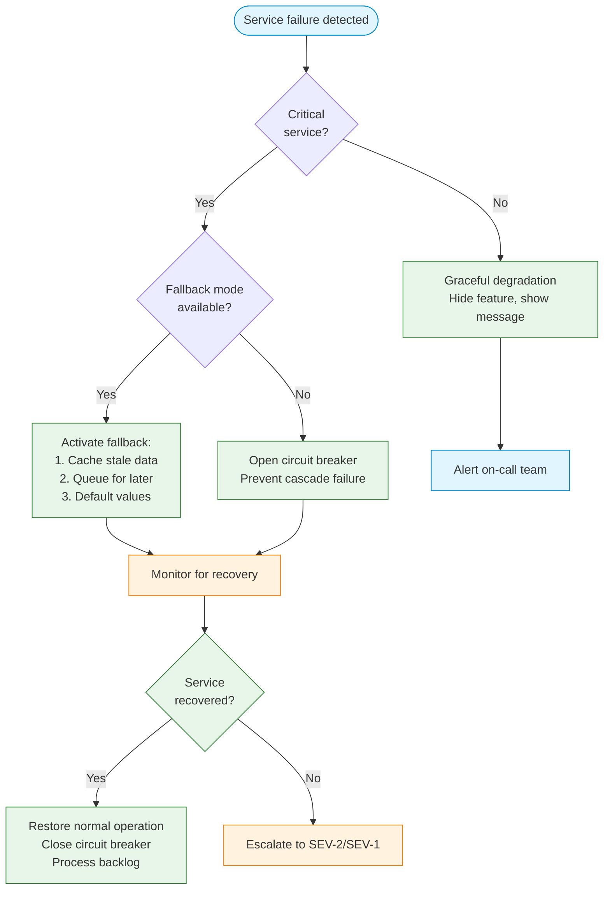

# Hub Scale Operations Guide

> **Navigation:** [Operations Home](index.md) | [Runbooks](runbooks/index.md) | [Service Dependency Analyzer](service-dependency-analyzer.md)
>
> **Related Guides:** [Hub Navigation Guide](../hub-taxonomy/hub-navigation-guide.md) | [Hub Dependency Graph](../hub-taxonomy/hub-dependency-graph.md)

---

## Overview

Operating 30+ Hub services simultaneously requires structured operational models, clear monitoring requirements, well-defined alerting patterns, and team capacity planning. This guide provides operational frameworks for three scale tiers.

**Primary Blueprints:** All Hub blueprints ([HUB-01](../../ApprovedBlueprints/Hub/HUB-01.md) through [HUB-30](../../ApprovedBlueprints/Hub/HUB-30.md))

---

## Scale Tiers Overview

```mermaid
flowchart TD
    subgraph Tier1["Tier 1: Small (1-10 services)"]
        T1_Core["Core + essential Hub services<br/>HUB-01, HUB-02, HUB-04, HUB-05<br/>HUB-07, HUB-09, HUB-10, HUB-15<br/>HUB-19, HUB-21"]
        T1_Team["1 SRE (part-time)<br/>2 platform engineers<br/>Devs own their services"]
        T1_Tools["Basic monitoring<br/>Centralized logging<br/>Manual runbooks"]
    end

    subgraph Tier2["Tier 2: Medium (11-25 services)"]
        T2_Core["All Tier 1 +<br/>HUB-03, HUB-06, HUB-08, HUB-11<br/>HUB-12, HUB-14, HUB-17, HUB-20<br/>HUB-22, HUB-25, HUB-27, HUB-30"]
        T2_Team["2 SREs (shared on-call)<br/>4 platform engineers<br/>1 dedicated observability"]
        T2_Tools["Advanced monitoring + dashboards<br/>Automated runbooks<br/>Service dependency maps"]
    end

    subgraph Tier3["Tier 3: Large (26-30+ services)"]
        T3_Core["All Hub services<br/>HUB-01 to HUB-30"]
        T3_Team["4-5 SREs (dedicated rotation)<br/>6-8 platform engineers<br/>2 observability engineers<br/>1 security engineer"]
        T3_Tools["Full observability stack<br/>Self-healing runbooks<br/>Chaos engineering program<br/>Capacity planning automation"]
    end

    Tier1 -->|"Growth triggers"| Growth1{>10 services}
    Tier2 -->|"Growth triggers"| Growth2{>25 services}

    Growth1 -->|"Or:<br/>HA requirement<br/>Multi-region"| Tier2
    Growth2 -->|"Or:<br/>SLA >99.9%<br/>24/7 support"| Tier3

    classDef tier1 fill:#e8f5e9,stroke:#2e7d32
    classDef tier2 fill:#fff3e0,stroke:#f57c00
    classDef tier3 fill:#ffebee,stroke:#c62828
    classDef decision fill:#e1f5fe,stroke:#0288d1

    class Tier1,T1_Core,T1_Team,T1_Tools tier1
    class Tier2,T2_Core,T2_Team,T2_Tools tier2
    class Tier3,T3_Core,T3_Team,T3_Tools tier3
    class Growth1,Growth2 decision
```



---

## Tier 1: Small (1-10 Services)

### Service Inventory

For deployments with fewer than 10 Hub services, focus on **essential infrastructure**:

| Category | Required | Optional |
|----------|----------|----------|
| Config & Flags | HUB-01 (Config) | HUB-22 (Billing), HUB-23 (Reporting) |
| Cache | HUB-02 (Cache) | HUB-11 (Cloud Storage — only if needed) |
| Auth & Security | HUB-04 (Identity), HUB-05 (RBAC), HUB-19 (Validation) | HUB-20 (Vault — defer secrets to env vars) |
| Eventing | HUB-09 (Event Bus) | HUB-17 (Webhooks — if external events) |
| Queue | HUB-10 (Queue) | HUB-25 (Chronos — use OS cron) |
| Observability | HUB-15 (Health) | HUB-06 (Audit — basic file logging) |

### Monitoring Requirements

| Signal | Tool | Frequency | Storage |
|--------|------|-----------|---------|
| CPU / RAM / Disk | OS-level (netdata, htop) | 60s | 7 days |
| HTTP request latency | Application logs | Per-request | 14 days |
| Error rate | Application logs | Per-error | 30 days |
| Cache hit ratio | Redis `INFO stats` | 60s | 7 days |
| Queue depth | Redis `LLEN` | 60s | 7 days |
| Health endpoint | External uptime monitor | 30s | 30 days |

### Alerting Configuration

```yaml
# Tier 1: Basic alerting rules
alerts:
  service_down:
    expr: "up{job=~'hub-.+'} == 0"
    for: "1m"
    severity: "critical"
    channels: ["slack", "email"]

  high_error_rate:
    expr: "rate(http_errors_total[5m]) / rate(http_requests_total[5m]) > 0.05"
    for: "5m"
    severity: "warning"
    channels: ["slack"]

  disk_space:
    expr: "node_filesystem_avail_bytes / node_filesystem_size_bytes < 0.1"
    for: "5m"
    severity: "critical"
    channels: ["slack", "email"]

  cache_miss_spike:
    expr: "rate(cache_misses_total[5m]) / rate(cache_requests_total[5m]) > 0.5"
    for: "5m"
    severity: "warning"
    channels: ["slack"]
```

### Team Configuration

| Role | Headcount | Responsibility |
|------|-----------|----------------|
| SRE (part-time) | 0.5 FTE | Infrastructure uptime, incident response |
| Platform Engineer | 2 FTE | Service development, deployment |
| Developers | Per service | Business logic, own-service monitoring |

**On-Call:** Best-effort (no 24/7 requirement); Slack-based escalation

---

## Tier 2: Medium (11-25 Services)

### Service Inventory

Add **growing services** to the Tier 1 foundation:

| Category | Added Services | Rationale |
|----------|---------------|-----------|
| Asset Pipeline | HUB-03 (Asset Engine) | Frontend complexity grows |
| Audit | HUB-06 (Auditor) | Compliance requirements |
| Gateway | HUB-08 (Gateway) | Inter-service routing needed |
| Storage | HUB-11 (Cloud Storage) | File uploads at scale |
| Notifications | HUB-12 (Notify) | Multi-channel messaging |
| Search | HUB-14 (Search) | Full-text search complexity |
| Webhooks | HUB-17 (Webhook Nexus) | External integrations |
| Secrets | HUB-20 (Vault) | Centralized secrets management |
| Billing | HUB-22 (Ledger) | Revenue operations |
| Scheduler | HUB-25 (Chronos) | Complex scheduling |
| CLI | HUB-30 (Hub-CLI) | Operational tooling |

### Monitoring Requirements

| Signal | Tool | Frequency | Storage | Retention |
|--------|------|-----------|---------|-----------|
| All Tier 1 metrics | + Dashboard per service | 30s | 30 days |
| Service dependency health | Internal health check mesh | 15s | 30 days |
| Distributed tracing | OpenTelemetry trace sampling | 10% of requests | 7 days |
| SLO burn rate | SLO dashboard | 1m | 90 days |
| Resource utilization trends | Capacity planner | 1h | 1 year |
| RUM (Real User Monitoring) | Lighthouse / Web Vitals | Per session | 30 days |

### Alerting Configuration (Tier 2 Additions)

```yaml
# Tier 2: Advanced alerting
alerts:
  slo_burn_budget:
    expr: "(1 - slo_ratio) < (slo_burn_budget * 0.5)"
    for: "1h"
    severity: "page"  # PagerDuty
    channels: ["pagerduty", "slack"]

  dependency_cascade:
    expr: "count(up{service='hub-gateway'} == 0) > 0 AND count(up{service='hub-auth'} == 0) > 0"
    for: "2m"
    severity: "critical"
    channels: ["pagerduty", "slack"]

  queue_growth:
    expr: "rate(queue_depth[10m]) > 0 AND queue_depth > 1000"
    for: "5m"
    severity: "warning"
    channels: ["pagerduty"]

  redis_memory_pressure:
    expr: "redis_memory_used_bytes / redis_memory_max_bytes > 0.8"
    for: "5m"
    severity: "warning"
    channels: ["slack"]

  dlq_growth:
    expr: "rate(dlq_depth[5m]) > 0"
    for: "10m"
    severity: "warning"
    channels: ["slack"]
```

### Team Configuration

| Role | Headcount | Responsibility |
|------|-----------|----------------|
| SRE (shared on-call) | 2 FTE | 24/7 incident response (follow-the-sun) |
| Platform Engineer | 4 FTE | Service development, automation |
| Observability Engineer | 1 FTE | Monitoring, dashboards, alerting |

**On-Call:** 24/7 follow-the-sun rotation; 1-week shifts; escalation to platform after 15 min

---

## Tier 3: Large (26-30+ Services)

### Full Service Inventory

All 30 Hub blueprints deployed and operational:

```
HUB-01  to HUB-30  (all 30 blueprints)
```

### Monitoring Requirements

| Signal | Tool | Frequency | Retention |
|--------|------|-----------|-----------|
| All Tier 1 + 2 metrics | Full observability stack | Real-time / 15s | 1 year |
| SLOs (latency, availability, throughput) | SLO dashboard | 1m | 1 year |
| Error budgets | Budget tracker | 1h | 1 year |
| Capacity forecasts | ML-based prediction | Daily | 2 years |
| Chaos experiment results | Chaos dashboard | Per experiment | 90 days |
| Cost per service | FinOps dashboard | Daily | 1 year |

### Alerting Configuration (Tier 3 Additions)

```yaml
# Tier 3: Full production alerting
alerts:
  multi_service_impact:
    expr: "count(up{service=~'hub-.+'} == 0) > 3"
    for: "1m"
    severity: "critical"
    channels: ["pagerduty", "slack", "phone"]

  saturation_event:
    expr: "sum by (service) (rate(http_requests_total[5m])) / (sum by (service) (rate(http_requests_max_capacity[5m]))) > 0.9"
    for: "5m"
    severity: "critical"
    channels: ["pagerduty"]

  anomaly_detection:
    expr: "predict_linear(rate(http_latency_seconds[1h]), 3600) > 1.5 * rate(http_latency_seconds[1h])"
    for: "10m"
    severity: "warning"
    channels: ["slack", "pagerduty"]

  chaos_alarm:
    expr: "chaos_experiment_status{result='unexpected_failure'} == 1"
    for: "0m"
    severity: "critical"
    channels: ["pagerduty", "slack", "postmortem"]
```

### Team Configuration

| Role | Headcount | Responsibility |
|------|-----------|----------------|
| SRE (dedicated rotation) | 4-5 FTE | 24/7 incident response, capacity planning |
| Platform Engineer | 6-8 FTE | Service development, platform automation |
| Observability Engineer | 2 FTE | Advanced monitoring, SLO management |
| Security Engineer | 1 FTE | Security monitoring, compliance |

**On-Call:** 24/7 dedicated; 12-hour shifts for primary; secondary as backup; 30-minute response SLA

---

## Service Degradation Framework

### Degradation Levels

| Level | Label | Description | Response Time | Communication |
|-------|-------|-------------|---------------|---------------|
| **L0** | Normal | All services operating within SLO | — | No action |
| **L1** | Degraded | Non-critical service(s) impacted; partial functionality | 15 min | Internal Slack |
| **L2** | Impaired | Critical service(s) degraded; user-facing impact | 5 min | PagerDuty + Slack |
| **L3** | Down | Critical service(s) unavailable; major incident | Immediate | PagerDuty + Slack + Status page |

### Graceful Degradation Flow



### Degradation Configuration

```php
<?php
namespace Sovereign\Hub\Operations\Degradation;

class ServiceDegradationConfig
{
    /**
     * Define fallback strategies per service.
     */
    public static function getFallbackConfig(): array
    {
        return [
            'hub-cache' => [
                'level'      => 'L2',
                'fallback'   => 'bypass', // Skip cache, go directly to DB
                'timeout_ms' => 50,       // Timeout after 50ms to avoid thundering herd
            ],
            'hub-auth' => [
                'level'      => 'L2',
                'fallback'   => 'cache_stale', // Use cached permissions (last 5 min)
                'ttl_sec'    => 300,
            ],
            'hub-search' => [
                'level'      => 'L1',
                'fallback'   => 'graceful', // Return empty results, show "search unavailable"
            ],
            'hub-notify' => [
                'level'      => 'L1',
                'fallback'   => 'queue', // Queue notifications for later delivery
                'queue_ttl'  => 3600,
            ],
            'hub-analytics' => [
                'level'      => 'L0',
                'fallback'   => 'skip', // Drop analytics, no user impact
            ],
        ];
    }
}
```

### Circuit Breaker Patterns

```php
<?php
namespace Sovereign\Hub\Operations\Degradation;

class CircuitBreaker
{
    private string $state = 'CLOSED';
    private int $failureCount = 0;
    private int $threshold = 5;
    private int $timeout = 30; // seconds
    private int $lastFailureTime = 0;

    /**
     * Execute operation with circuit breaker protection.
     */
    public function call(callable $operation): mixed
    {
        if ($this->state === 'OPEN') {
            if (time() - $this->lastFailureTime > $this->timeout) {
                $this->state = 'HALF_OPEN';
            } else {
                throw new CircuitBreakerOpenException('Circuit breaker is OPEN');
            }
        }

        try {
            $result = $operation();
            if ($this->state === 'HALF_OPEN') {
                $this->state = 'CLOSED';
                $this->failureCount = 0;
            }
            return $result;
        } catch (\Throwable $e) {
            $this->failureCount++;
            $this->lastFailureTime = time();

            if ($this->failureCount >= $this->threshold) {
                $this->state = 'OPEN';
            }

            throw $e;
        }
    }

    public function getState(): string
    {
        return $this->state;
    }
}
```

---

## Team Sizing Guidance

### Full-Time Equivalent Estimates

| Function | Tier 1 | Tier 2 | Tier 3 |
|----------|--------|--------|--------|
| SRE / Operations | 0.5 FTE | 2 FTE | 4-5 FTE |
| Platform Engineering | 2 FTE | 4 FTE | 6-8 FTE |
| Observability | Shared with platform | 1 FTE | 2 FTE |
| Security | Shared with platform | Shared with SRE | 1 FTE |
| **Total Operations** | **~2.5 FTE** | **~7 FTE** | **~14 FTE** |
| Service Developers | 3-5 FTE | 8-12 FTE | 15-20 FTE |

### On-Call Burden

| Metric | Tier 1 | Tier 2 | Tier 3 |
|--------|--------|--------|--------|
| On-call frequency | Best-effort | Primary + secondary | 12h shifts, rotation |
| Incidents per week | 1-3 | 5-10 | 15-25 |
| MTTR (median) | 30 min | 15 min | 8 min |
| Alert fatigue risk | Low | Medium | High (require tuning) |
| Time on-call per week | Variable | ~50 hours | ~84 hours (primary) |

### On-Call Rotation Template

```yaml
# Tier 3: 4-person SRE rotation
rotation:
  teams:
    - name: "SRE Alpha"
      members: ["alice", "bob", "carol", "dave"]
      shift_length: "12 hours"
      schedule: "Mon-Thu"
      handover: "30 min overlap"

    - name: "SRE Bravo"
      members: ["eve", "frank", "grace", "henry"]
      shift_length: "12 hours"
      schedule: "Fri-Sun + holidays"
      handover: "30 min overlap"

  escalation:
    primary_timeout: 15  # minutes before escalation
    secondary_reach: 30  # minutes before incident commander
    incident_commander: "platform lead"

  well_being:
    max_shifts_per_week: 3
    min_rest_between_shifts: 16  # hours
    no_two_consecutive_days: true
```

---

## Monitoring Stack Recommendations

### Tier 1 (Minimal)

```text
┌──────────────────────────────────────────────────────┐
│                    TIER 1: MINIMAL                    │
├──────────────────────────────────────────────────────┤
│                                                      │
│  Metrics:  Prometheus (single instance)              │
│  Logging:  File-based → journald                     │
│  Tracing:  None (use request IDs in logs)             │
│  Alerting: AlertManager + Slack webhook              │
│  Dashboards:  Grafana (pre-configured dashboards)     │
│  Uptime:  External HTTP health check                  │
│                                                      │
│  Total infrastructure cost: ~$200-500/month           │
└──────────────────────────────────────────────────────┘
```

### Tier 2 (Growing)

```text
┌──────────────────────────────────────────────────────┐
│                    TIER 2: GROWING                    │
├──────────────────────────────────────────────────────┤
│                                                      │
│  Metrics:  Prometheus (HA pair)                      │
│  Logging:  Loki / ELK stack (14-day retention)       │
│  Tracing:  OpenTelemetry (10% sample rate)            │
│  Alerting: PagerDuty + AlertManager + Slack          │
│  Dashboards:  Grafana (per-service dashboards)        │
│  SLOs:  SLO dashboard with burn rate alerts          │
│  Dependency:  Service map (OpenTelemetry)             │
│                                                      │
│  Total infrastructure cost: ~$2,000-5,000/month       │
└──────────────────────────────────────────────────────┘
```

### Tier 3 (Full Scale)

```text
┌──────────────────────────────────────────────────────┐
│                  TIER 3: FULL SCALE                   │
├──────────────────────────────────────────────────────┤
│                                                      │
│  Metrics:  Thanos / VictoriaMetrics (global view)    │
│  Logging:  Loki + Cortex (1-year retention)          │
│  Tracing:  OpenTelemetry (100% with tail sampling)   │
│  Alerting: PagerDuty + Slack + Phone + Status page  │
│  Dashboards:  Grafana (SLO, cost, capacity, chaos)   │
│  SLOs:  Service-level objectives + error budgets     │
│  Dependency:  Service graph + critical path analysis│
│  Chaos:  Chaos Mesh / Gremlin experiments            │
│  ML:  Anomaly detection + capacity forecasting       │
│  FinOps:  Cost allocation per service                │
│                                                      │
│  Total infrastructure cost: ~$15,000-40,000/month     │
└──────────────────────────────────────────────────────┘
```

---

## Capacity Planning Checklist

### Monthly Review

| Item | Owner | Frequency |
|------|-------|-----------|
| Review service growth trends | SRE | Monthly |
| Project resource consumption 3 months forward | SRE | Monthly |
| Review SLO burn rate for all services | Observability | Monthly |
| Audit incident response times and MTTR | SRE | Monthly |
| Update dependency graph changes | Platform | Monthly |

### Quarterly Review

| Item | Owner | Frequency |
|------|-------|-----------|
| Team capacity and hiring needs | Engineering Manager | Quarterly |
| Infrastructure cost optimization | FinOps | Quarterly |
| Chaos experiment results and improvements | SRE | Quarterly |
| Runbook audit and updates | All teams | Quarterly |
| Load testing of critical services | Platform | Quarterly |
| Security audit and penetration testing | Security | Quarterly |

---

## Related Blueprints

| Blueprint | Role in Operations |
|-----------|-------------------|
| [HUB-01](../../ApprovedBlueprints/Hub/HUB-01.md) | Centralized configuration for all services |
| [HUB-15](../../ApprovedBlueprints/Hub/HUB-15.md) | Health monitoring for all Hub services |
| [HUB-16](../../ApprovedBlueprints/Hub/HUB-16.md) | Weaver orchestration and dependency validation |
| [HUB-29](../../ApprovedBlueprints/Hub/HUB-29.md) | Integration/E2E testing for operations validation |
| [HUB-30](../../ApprovedBlueprints/Hub/HUB-30.md) | CLI toolchain for operational management |