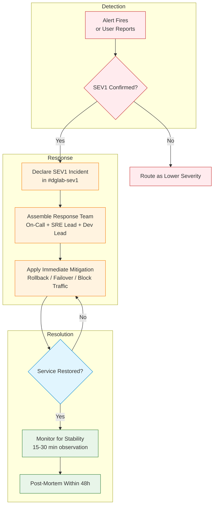
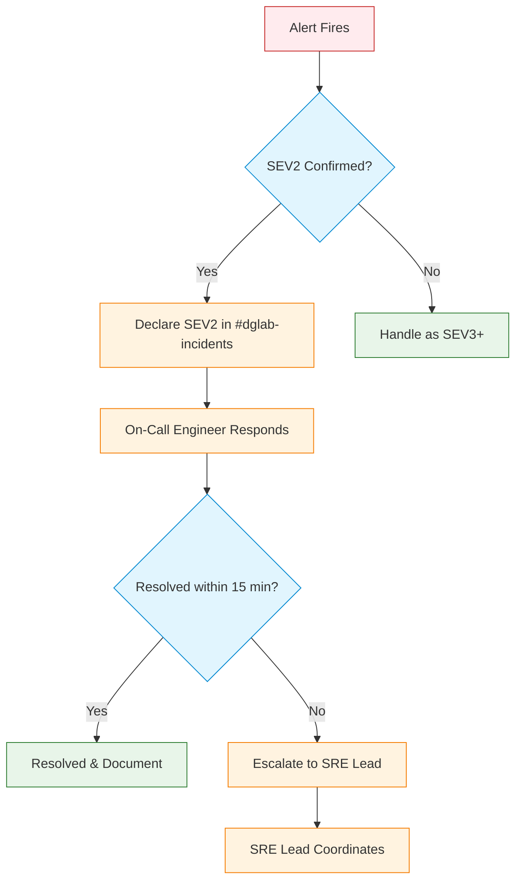
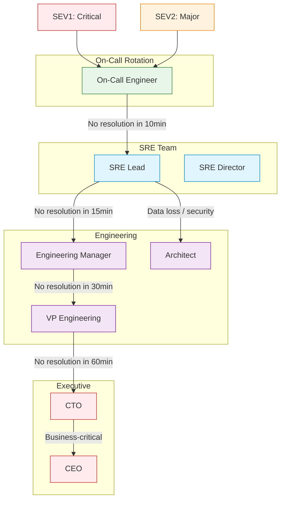

# Incident Response Framework

> **Navigation:** [Operations Home](index.md) | [Observability Framework](observability-framework.md) | [Chaos Engineering](chaos-engineering.md) | [Runbooks](runbooks/index.md)
>
> **Cross-Reference:** [SOLUTIONS_TO_WEAKNESSES.md — Weakness 2 (Strategic)](../../evaluation/SOLUTIONS_TO_WEAKNESSES.md#weakness-2-operational-complexity-81-services-and-team-learning-curve-identified-as-primary-risks)
>
> **Related:** [Hub Scale Guide](hub-scale-guide.md) | [Team Scaling Guide](../team-scaling-guide.md) | [Service Dependency Analyzer](service-dependency-analyzer.md)
>
> **Status:** ✅ Design Complete

---

## Overview

This framework defines the incident response process for all 81+ DGLab services, covering severity classification, response runbook templates, communication templates, and a post-mortem template. It is designed to achieve **MTTR <15 minutes for 90% of incidents** through clear roles, automated escalation, and blameless post-incident reviews.

**Primary Driver:** [Strategic Weakness 2](../../evaluation/SOLUTIONS_TO_WEAKNESSES.md#weakness-2-operational-complexity-81-services-and-team-learning-curve-identified-as-primary-risks)

**Key Success Targets:**
- MTTR <15 minutes for 90% of incidents
- Team confidence >90% in failure scenarios

---

## 1. Incident Severity Classification

### 1.1 Severity Matrix

| Severity | Definition | Examples | Response Time | MTTR Target | Pages? |
|----------|------------|----------|---------------|-------------|--------|
| **SEV1** | Complete service outage or data loss affecting all users | Bridge down, Database offline, Data corruption | Immediate (<5 min) | <15 min | ✓ All tiers |
| **SEV2** | Major degradation affecting a subset of users or features | Cache failure, Queue backpressure, High error rate (>5%) | <15 min | <30 min | ✓ On-call + SRE Lead |
| **SEV3** | Minor degradation with no immediate user impact | Elevated latency, Partial cache miss, Low error rate (<5%) | <1 hour | <2 hours | ✗ Slack notification |
| **SEV4** | Informational or maintenance-related | Approaching capacity limits, Certificate expiry, Deprecation notices | Next business day | N/A | ✗ Email / dashboard |

### 1.2 SEV1: Critical Outage

**Definition:** Complete loss of service functionality affecting all users, or confirmed data loss.

**Examples:**
- Bridge (API Gateway) returns 503 for all requests
- Primary database cluster offline
- Authentication service unavailable (no logins possible)
- Data corruption detected in critical storage
- Security breach or data exfiltration confirmed

**Response Flow:**



**Command Structure:**
- **Incident Commander (IC):** SRE Lead — coordinates response, makes escalation decisions
- **Technical Lead:** On-Call Engineer — investigates root cause, implements fix
- **Communications Lead:** Engineering Manager — handles internal/external status updates
- **Scribe:** Rotating team member — documents timeline and actions

---

### 1.3 SEV2: Major Degradation

**Definition:** Significant impairment of service affecting a subset of users or core feature set.

**Examples:**
- Cache cluster failure (increased latency but service still functional)
- Queue backpressure >100K messages
- Error rate >5% on critical endpoints
- Media upload failures affecting content creators
- Search service returns degraded results

**Response Flow:**



**Command Structure:**
- **Lead Responder:** On-Call Engineer — investigates and resolves
- **Support:** SRE Lead — escalation if needed

---

### 1.4 SEV3: Minor Degradation

**Definition:** Non-critical degradation with no measurable user impact.

**Examples:**
- Elevated p99 latency (>500ms but <2s)
- Cache hit ratio drops from 95% to 80%
- Error rate <5% on non-critical endpoints
- Single instance failure (other replicas handling traffic)
- Non-production environment issue

**Response Flow:**
1. Alert posted to `#dglab-alerts`
2. On-Call engineer acknowledges within 1 hour
3. Investigation during regular business hours
4. Fix scheduled in next sprint unless trivial

---

### 1.5 SEV4: Informational / Maintenance

**Definition:** No service impact; proactive awareness.

**Examples:**
- SSL certificate expiring in <30 days
- Disk usage >70% on non-critical nodes
- Deprecated API version still receiving traffic
- Dependency security advisory
- Proactive maintenance window notification

**Response Flow:**
1. Notification via email or dashboard widget
2. Team lead assigns owner during sprint planning
3. Remediation scheduled before next threshold

### 1.6 Severity Matrix with Examples

| Service | SEV1 Example | SEV2 Example | SEV3 Example | SEV4 Example |
|---------|--------------|--------------|--------------|--------------|
| Bridge (API Gateway) | All requests 503 | Error rate >10% on 50%+ endpoints | Error rate >5% on 1 endpoint | Cert expires in 30 days |
| Auth Service | No users can log in | Social login failure | MFA prompt timeout | Deprecated token format |
| Database Cluster | Complete offline | Read replica lag >60s | Connection pool 80% used | Table fragmentation >30% |
| Cache (Redis) | All nodes down | 50%+ nodes unreachable | Hit ratio drops 20% | Memory usage >70% |
| Queue | All queues stuck | Critical queue depth >50K | Non-critical queue depth >10K | Queue consumer lag >1min |
| Event Bus | Event loss confirmed | Bus lag >5min | Bus lag >1min | Bus lag >30s |
| Media Service | Uploads completely failing | Thumbnails not generating | Transcoding slower than usual | Storage usage >80% |
| CMS Studio | All content unreadable | Publishing failing | Search indexing delay | Deprecated API version |

---

## 2. Response Runbook Templates

### 2.1 SEV1 Response Runbook

```markdown
# SEV1 Response Runbook

> **Severity:** SEV1 — Critical Outage
> **MTTR Target:** <15 minutes
> **Owner:** On-Call Engineer → SRE Lead

---

## Immediate Actions (First 5 Minutes)

### Step 1: Confirm and Declare

| Action | Detail |
|--------|--------|
| Verify alert | Confirm the alert is not a false positive |
| Determine scope | Is it all users? All services? Single region? |
| Declare in Slack | Post in `#dglab-sev1` with format below |
| Attach IC hat | Assign Incident Commander (IC) |

**Declaration Template:**

```
🔴 SEV1 DECLARED
• Service: [service name]
• Started: [timestamp]
• Impact: [what is affected]
• Action: [immediate containment]
• IC: [name]
• Channel: #dglab-sev1
```

### Step 2: Assemble Response

1. **Incident Commander (IC)** — coordinates, does not touch keyboard
2. **Technical Lead** — investigates and implements fix
3. **Communications Lead** — posts updates every 15 min
4. **Scribe** — documents timeline in incident channel

### Step 3: Immediate Containment

Choose the fastest restoration path:

| Path | When | Action |
|------|------|--------|
| Rollback | Recent deploy (<2h ago) | Revert to last known good version |
| Failover | Multi-region setup | Route traffic to standby region |
| Feature toggle | Degradation limited to a feature | Disable feature via config flag |
| Scale up | Capacity-related | Increase replica count manually |

---

## Investigation (5–15 Minutes)

### Step 4: Identify Root Cause

| Data Source | What to Look For |
|-------------|------------------|
| Dashboards | Error rate spike, latency degradation, resource exhaustion |
| Logs (Kibana) | Error stack traces, correlation IDs |
| Traces (Jaeger) | Slow spans, failed requests, dependency failures |
| Recent changes | Deploys, config changes, infrastructure changes |

### Step 5: Apply Permanent Fix

1. Implement fix in a dedicated incident branch
2. Get expedited code review (IC can waive review if needed)
3. Deploy to production with monitoring
4. Verify health indicators normalize

---

## Resolution (15–30 Minutes)

### Step 6: Verify and Monitor

- [ ] Error rate returns to baseline
- [ ] Latency returns to baseline
- [ ] All replicas healthy
- [ ] No queue backlog growing
- [ ] Customer-reported issues resolved

### Step 7: Post-Incident

1. Keep incident channel open for 30 min monitoring
2. Schedule post-mortem within 48 hours
3. Create action items in tracking system
4. Update runbooks with new findings

---

## Escalation

| Time | Escalation Path |
|------|-----------------|
| 5 min | SRE Lead joins if not already |
| 15 min | Engineering Manager notified |
| 30 min | CTO / VP Engineering notified |
| 60 min | Executive team notified |
```

### 2.2 SEV2 Response Runbook

```markdown
# SEV2 Response Runbook

> **Severity:** SEV2 — Major Degradation
> **MTTR Target:** <30 minutes
> **Owner:** On-Call Engineer

---

## Immediate Actions (First 5 Minutes)

### Step 1: Acknowledge and Assess

| Action | Detail |
|--------|--------|
| Acknowledge alert | `/ack` in Slack or acknowledge in PagerDuty |
| Assess severity | Confirm it meets SEV2 criteria |
| Post status | `#dglab-incidents` with format below |

**Declaration Template:**

```
🟡 SEV2 DECLARED
• Service: [service name]
• Started: [timestamp]
• Impact: [what is degraded]
• Responder: [name]
• Channel: #dglab-incidents
```

### Step 2: Investigation

1. Check dashboards for the affected service
2. Review recent changes (last 1 hour)
3. Examine logs for error patterns
4. Check dependency health

### Step 3: Recovery

- Apply the relevant runbook ([Failure Recovery](runbooks/failure-recovery.md))
- If no runbook exists, triage and document for future runbook creation

---

## Escalation

| Time | Escalation Path |
|------|-----------------|
| 15 min | SRE Lead notified |
| 30 min | Engineering Manager notified |
| 60 min | Consider upgrading to SEV1 |
```

### 2.3 SEV3 Response Runbook

```markdown
# SEV3 Response Runbook

> **Severity:** SEV3 — Minor Degradation
> **MTTR Target:** <2 hours
> **Owner:** On-Call Engineer (during business hours)

---

## Actions

1. **Acknowledge** alert in Slack (acknowledge within 15 min during business hours)
2. **Assess** impact: Is it auto-recovering? Is there a known pattern?
3. **Investigate** during regular hours; no urgency for out-of-hours
4. **Schedule fix** in current or next sprint
5. **Document** findings in the incident channel

**No escalation needed unless degradation worsens.**
```

### 2.4 Escalation Paths & Contact Trees



**Contact Methods:**

| Role | Primary Contact | Secondary Contact | Out-of-Hours |
|------|-----------------|-------------------|--------------|
| On-Call Engineer | PagerDuty | Slack direct message | Always on-call |
| SRE Lead | PagerDuty | Phone call | Always (escalation) |
| Engineering Manager | Slack | Phone call | Critical escalation only |
| Architect | Slack | Email | Business hours |
| VP Engineering | Phone call | Email | SEV1 only |
| CTO | Phone call | Email | SEV1 > 60 min |

---

## 3. Communication Templates

### 3.1 Incident Acknowledgment

```
🔴 ACTIVE INCIDENT
• Service: {service}
• Severity: SEV{1|2|3|4}
• Started: {timestamp (UTC)}
• Impact: {description of user-facing impact}
• Action: {investigating / mitigated / resolved}
• Status updates: Every 15 min (SEV1), 30 min (SEV2)
• Channel: #dglab-{sev1|incidents|alerts}
```

### 3.2 Status Update (Internal)

```
📊 INCIDENT UPDATE — {service} — SEV{severity}
• Time: {timestamp (UTC)}
• Duration: {elapsed time}
• Status: {Investigating | Mitigating | Monitoring | Resolved}
• What we know: {short summary of findings}
• Current action: {what the team is doing now}
• Next check-in: {timestamp}
• Channel: #dglab-{sev1|incidents}
```

### 3.3 Status Update (Customer-Facing)

```
⚠️ {Service Name} Incident Update — {date}

We are currently investigating an issue affecting {impact}. 
Our team is actively working to restore full functionality.

Current status: {Investigating | Mitigating | Monitoring | Resolved}
Next update: {time}

We apologize for any inconvenience. Status page: {status-page-url}
```

### 3.4 Incident Resolved Notification

```
✅ INCIDENT RESOLVED — {service} — SEV{severity}
• Started: {start timestamp}
• Resolved: {end timestamp}
• Duration: {total duration}
• Root cause: {short description}
• Action taken: {what was done to resolve}
• Monitoring: {observation window}
• Post-mortem: Scheduled for {date}
```

### 3.5 Post-Incident Summary (for stakeholders)

```
📋 POST-INCIDENT SUMMARY — {service} — SEV{severity}

Date: {date}
Duration: {duration from start to end}
Impact: {users affected, downtime minutes, data loss if any}

Timeline:
- {timestamp}: Alert triggered
- {timestamp}: Incident declared
- {timestamp}: Initial mitigation applied
- {timestamp}: Service restored
- {timestamp}: Monitoring period ended

Root Cause: {1-2 sentence root cause}

Action Items:
1. {action} — Owner: {name} — Due: {date}
2. {action} — Owner: {name} — Due: {date}
3. {action} — Owner: {name} — Due: {date}

Full post-mortem: {link to post-mortem document}
```

---

## 4. Post-Mortem Template

```markdown
# Post-Mortem: [Incident Title]

> **Status:** [Draft | Reviewed | Approved]
> **Date:** [YYYY-MM-DD]
> **Authors:** [Names]

---

## Incident Summary

| Field | Value |
|-------|-------|
| Service(s) | [affected services] |
| Severity | SEV[1-4] |
| Date | [date] |
| Duration | [Xh Xm] |
| Detection Method | [Alert / User Report / Monitoring] |
| MTTR | [Xm] |
| Downtime Impact | [X minutes of user-facing downtime] |
| Data Loss | [Yes / No — if yes, describe extent] |

## Timeline

| Timestamp (UTC) | Event |
|-----------------|-------|
| [HH:MM] | [First alert or report] |
| [HH:MM] | [Incident declared] |
| [HH:MM] | [Initial response action] |
| [HH:MM] | [Mitigation applied] |
| [HH:MM] | [Service restored] |
| [HH:MM] | [Monitoring period complete] |
| [HH:MM] | [Incident declared resolved] |

## Root Cause Analysis (5 Whys)

1. **Why did the incident occur?**
   - [Answer]
2. **Why did that happen?**
   - [Answer]
3. **Why was that the case?**
   - [Answer]
4. **Why was that allowed?**
   - [Answer]
5. **What systemic issue enabled this?**
   - [Answer — the root cause]

## Contributing Factors

| Factor | Category | Details |
|--------|----------|---------|
| [e.g., Missing alert] | Monitoring | [Details] |
| [e.g., Recent deploy] | Change Management | [Details] |
| [e.g., Documentation gap] | Process | [Details] |

## Detection Gaps

| Gap | Improvement | Owner |
|-----|-------------|-------|
| [What wasn't detected] | [How to detect next time] | [Name] |
| [What was detected too late] | [How to detect earlier] | [Name] |

## Action Items

| # | Action | Owner | Due Date | Type | Status |
|---|--------|-------|----------|------|--------|
| 1 | [Action] | [Name] | [Date] | [Runbook / Monitoring / Code / Process] | [Open / In Progress / Done] |
| 2 | [Action] | [Name] | [Date] | [Category] | [Open / In Progress / Done] |
| 3 | [Action] | [Name] | [Date] | [Category] | [Open / In Progress / Done] |

## Runbook Updates

- [ ] [Runbook name] updated with new failure scenario
- [ ] [Runbook name] steps corrected/improved
- [ ] New runbook created for [scenario]

## Monitoring & Alerting Updates

- [ ] New metric added: [metric name]
- [ ] Dashboard added/modified: [dashboard link]
- [ ] Alert added/modified: [alert description]

## Lessons Learned

### What went well
- [Positive observation]
- [Positive observation]

### What went wrong
- [Area for improvement]
- [Area for improvement]

### What we will do differently next time
- [Process change]
- [Tooling improvement]

## Blameless Statement

> **No individual is at fault.** This incident was caused by systemic issues in our processes, tooling, or infrastructure. The purpose of this post-mortem is to improve the system, not to assign blame.

---

## Follow-Up Tracking

| Item | Status | Verified By | Verification Date |
|------|--------|-------------|-------------------|
| Action items completed | [Pending / In Progress / Done] | [Name] | [Date] |
| Runbooks updated | [Pending / Done] | [Name] | [Date] |
| Monitoring improved | [Pending / Done] | [Name] | [Date] |
| Post-mortem approved | [Pending / Done] | [Name] | [Date] |
```

---

## Success Metrics

| Metric | Target | Measurement | Tool |
|--------|--------|-------------|------|
| SEV1 MTTR | <15 min | Timer from alert to resolution | PagerDuty |
| SEV2 MTTR | <30 min | Timer from alert to resolution | PagerDuty |
| SEV1 frequency | <2 per quarter | Incident count | PagerDuty |
| Post-mortem completion | 100% within 48h | Post-mortem document date | Incident tracking |
| Action item closure | 90% within SLA | Action item status | Project management |
| Escalation accuracy | >90% correct severity | Post-incident audit | Incident review |

---

## Related Resources

- [SOLUTIONS_TO_WEAKNESSES.md — Strategic Weakness 2](../../evaluation/SOLUTIONS_TO_WEAKNESSES.md#weakness-2-operational-complexity-81-services-and-team-learning-curve-identified-as-primary-risks)
- [Observability Framework](observability-framework.md)
- [Chaos Engineering](chaos-engineering.md)
- [Runbooks](runbooks/index.md)
- [Hub Scale Guide](hub-scale-guide.md)
- [Team Scaling Guide](../team-scaling-guide.md)

---

> **Document Version:** 1.0
> **Last Updated:** Current Session
> **Status:** ✅ Ready for Implementation
> **Review Cycle:** Quarterly (aligned with EVALUATION_SUMMARY.md updates)