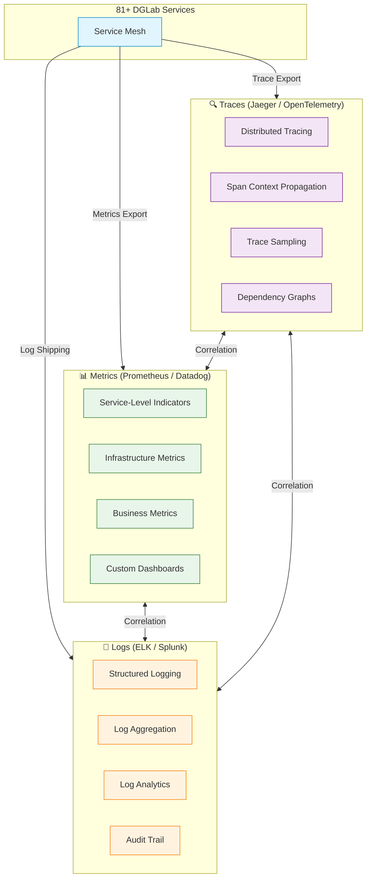
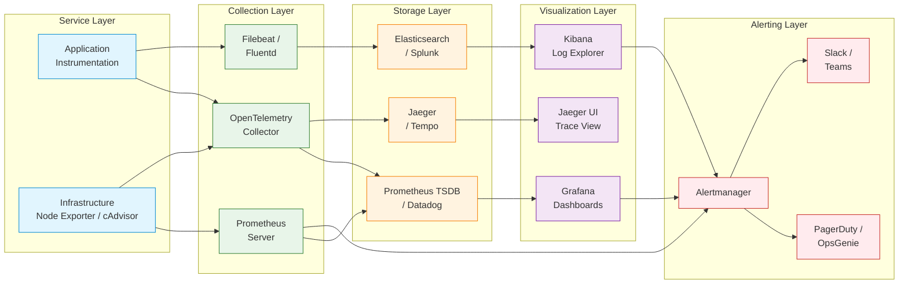
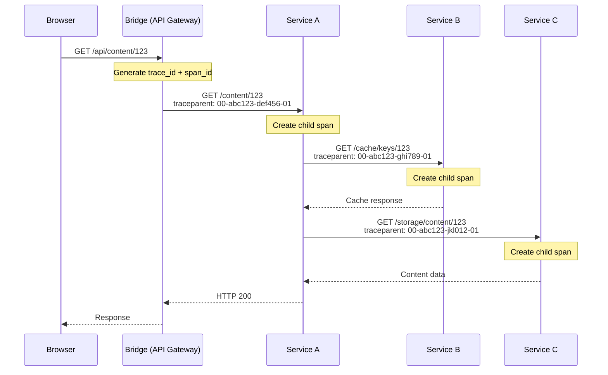
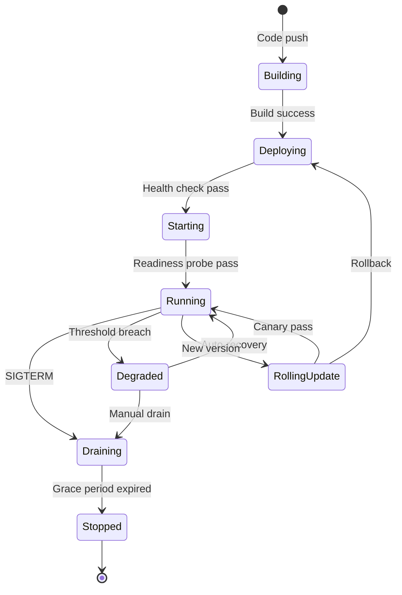
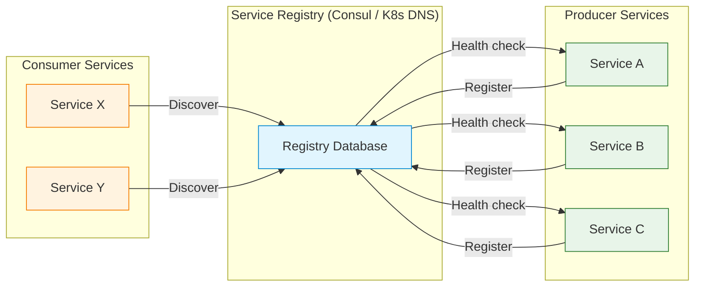
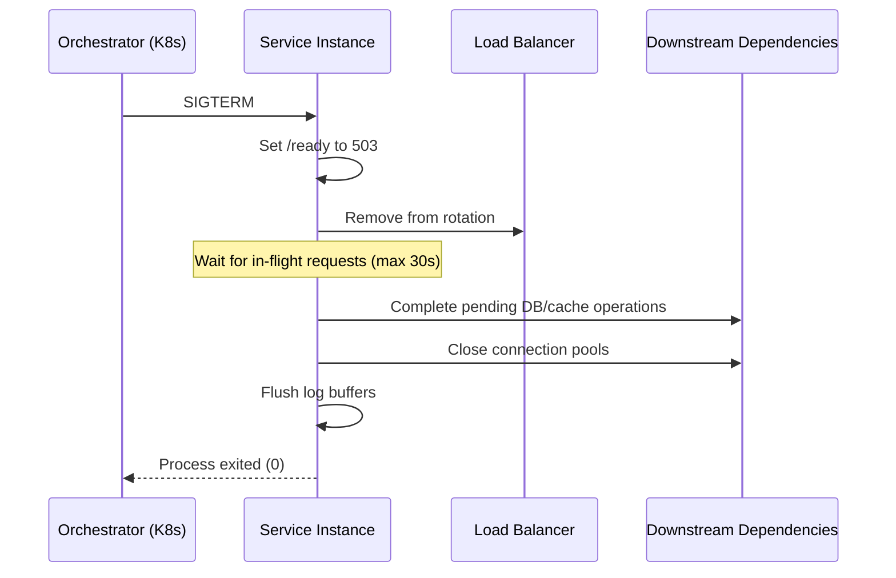
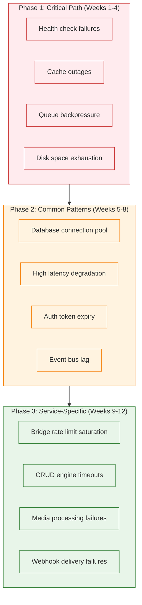
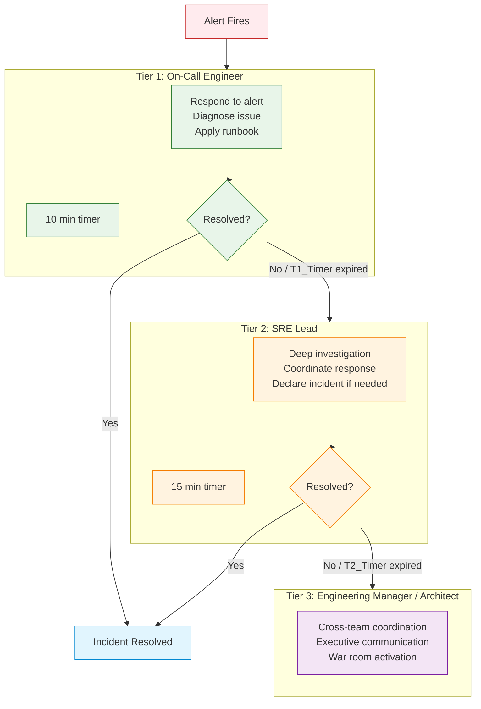

# Observability Framework

> **Navigation:** [Operations Home](index.md) | [Hub Scale Guide](hub-scale-guide.md) | [Service Dependency Analyzer](service-dependency-analyzer.md) | [Incident Response](incident-response.md)
>
> **Cross-Reference:** [SOLUTIONS_TO_WEAKNESSES.md — Weakness 2 (Strategic)](../../evaluation/SOLUTIONS_TO_WEAKNESSES.md#weakness-2-operational-complexity-81-services-and-team-learning-curve-identified-as-primary-risks)
>
> **Related:** [Runbooks](runbooks/index.md) | [Chaos Engineering](chaos-engineering.md) | [Hub Scale Guide](hub-scale-guide.md)
>
> **Status:** ✅ Design Complete

---

## Overview

This framework addresses **Strategic Weakness 2: Operational Complexity (81+ Services)** by providing a comprehensive observability stack — metrics, logs, and distributed traces — across all DGLab services. It defines service orchestration for unified lifecycle management, a runbook automation framework targeting 80% incident coverage, and alerting patterns with escalation policies.

**Primary Driver:** [Strategic Weakness 2](../../evaluation/SOLUTIONS_TO_WEAKNESSES.md#weakness-2-operational-complexity-81-services-and-team-learning-curve-identified-as-primary-risks)

**Key Success Targets:**
- MTTR <15 minutes for 90% of incidents (automated remediation)
- Zero operational blind spots across all services

---

## 1. Architecture Overview

### 1.1 Three Pillars: Metrics, Logs, Traces



### 1.2 Data Flow Architecture



---

## 2. Metrics Stack

### 2.1 Prometheus / Datadog

DGLab supports two metrics backends. Choose based on deployment scale and operational maturity.

| Feature | Prometheus (Self-Hosted) | Datadog (SaaS) |
|---------|-------------------------|-----------------|
| **Deployment** | Self-managed on K8s / VMs | Fully managed SaaS |
| **Cost** | Infrastructure-only (no per-metric cost) | Per-host + per-metric pricing |
| **Scale ceiling** | ~1M series per instance (with sharding) | Unlimited (enterprise) |
| **Retention** | Local: 15–30 days; Thanos/Cortex: unlimited | Configurable up to 15 months |
| **Alerting** | Alertmanager | Datadog Monitor |
| **Multi-cluster** | Thanos / Cortex for global view | Native multi-account |
| **Best for** | Small–medium deployments, cost-sensitive | Large deployments, managed operations |

**Recommended Default:** Prometheus + Thanos for 1–50 services; Datadog for 50+ services or when 24/7 SaaS reliability is required.

### 2.2 Service-Level Indicators (SLIs)

Every service must expose at minimum these standard metrics:

| SLI | Metric Name | Type | Labels |
|-----|-------------|------|--------|
| Request Rate | `http_requests_total` | Counter | `service`, `method`, `path`, `status` |
| Request Latency | `http_request_duration_seconds` | Histogram | `service`, `method`, `path` |
| Error Rate | `http_errors_total` | Counter | `service`, `method`, `path`, `error_code` |
| Request In-flight | `http_requests_in_flight` | Gauge | `service` |
| Health | `up` | Gauge | `service`, `instance` |
| Cache Hit Ratio | `cache_hits_total` / `cache_requests_total` | Counter | `service`, `cache_name` |
| Queue Depth | `queue_depth` | Gauge | `service`, `queue_name` |
| Event Bus Lag | `event_bus_lag` | Gauge | `service`, `event_type` |

**Instrumentation:** Use Prometheus client libraries for PHP (via `prometheus/client_php`) or OpenTelemetry SDK for multi-language support.

```php
// Example: PHP metric instrumentation
use Prometheus\CollectorRegistry;

$registry = CollectorRegistry::getDefault();
$requestCounter = $registry->getOrRegisterCounter(
    'http_requests_total',
    'Total HTTP requests',
    ['service', 'method', 'path', 'status']
);
$requestCounter->incBy(1, ['cms-studio', 'GET', '/api/content', '200']);
```

### 2.3 Dashboards & Visualization

| Dashboard | Scope | Refresh | Owner |
|-----------|-------|---------|-------|
| **Service Overview** | All services: request rate, error rate, latency p50/p95/p99 | 30s | SRE Team |
| **Infrastructure** | CPU, memory, disk, network per node | 30s | SRE Team |
| **Cache Performance** | Hit ratio, eviction rate, memory usage per cache | 60s | Platform Team |
| **Queue Health** | Depth, processing rate, dead-letter count per queue | 60s | Platform Team |
| **Event Bus** | Throughput, lag, error rate per event type | 30s | Domain Teams |
| **Business Metrics** | Tenant activity, API usage by consumer | 5min | Product Team |
| **SLO Compliance** | Error budget burn rate, remaining budget | 1min | Architecture Review Board |

```yaml
# Example: Grafana dashboard provisioning
apiVersion: 1
providers:
  - name: 'DGLab Service Overview'
    orgId: 1
    folder: 'DGLab Services'
    type: file
    options:
      path: /etc/grafana/dashboards/service-overview.json
```

### 2.4 Metric Retention & Aggregation

| Granularity | Retention | Aggregation | Storage Requirement |
|-------------|-----------|-------------|---------------------|
| Raw (10s) | 7 days | None | ~1.5 GB / service / day |
| 1-minute | 30 days | avg, max, min, count | ~150 MB / service |
| 1-hour | 12 months | avg, max, min | ~15 MB / service |
| 1-day | 3 years | avg, max | ~1 MB / service |

---

## 3. Logging Stack

### 3.1 ELK Stack / Splunk

| Feature | ELK Stack (Self-Hosted) | Splunk (SaaS) |
|---------|------------------------|----------------|
| **Deployment** | Elasticsearch cluster + Kibana + Logstash/Filebeat | Fully managed SaaS |
| **Ingest** | Filebeat, Logstash, Elastic Agent | Splunk Universal Forwarder, HTTP Event Collector |
| **Query** | Kibana Query Language (KQL) | Search Processing Language (SPL) |
| **Scale** | Up to ~10TB/day with cluster tuning | Unlimited (enterprise) |
| **Pricing** | Infrastructure + Elastic License (free tier available) | Per-GB ingested |
| **Best for** | Cost-sensitive, existing Elastic expertise | Managed ops, advanced SIEM |

**Recommended Default:** ELK Stack for self-hosted; Splunk for regulated industries with compliance requirements.

### 3.2 Structured Logging Standards

All services **MUST** output structured JSON logs. No plain-text log lines.

```json
{
  "timestamp": "2026-04-07T14:30:00.123Z",
  "level": "info",
  "service": "cms-studio",
  "version": "1.2.3",
  "trace_id": "abc123def456",
  "span_id": "ghi789",
  "tenant_id": "tenant-acme",
  "request_id": "req-001",
  "message": "Content published successfully",
  "context": {
    "content_id": "cnt-456",
    "content_type": "manga",
    "publish_duration_ms": 234
  },
  "error": null
}
```

**Required fields per log entry:**

| Field | Type | Required | Description |
|-------|------|----------|-------------|
| `timestamp` | ISO 8601 | ✓ | Event time with timezone |
| `level` | string | ✓ | `debug`, `info`, `warning`, `error`, `fatal` |
| `service` | string | ✓ | Service name (matches blueprint) |
| `version` | string | ✓ | Service version (semver) |
| `trace_id` | string | ✗ | Distributed trace correlation ID |
| `span_id` | string | ✗ | Span ID (if tracing) |
| `tenant_id` | string | ✗ | Tenant context (if applicable) |
| `request_id` | string | ✗ | Request correlation ID |
| `message` | string | ✓ | Human-readable log message |
| `context` | object | ✗ | Structured key-value metadata |
| `error` | object | ✗ | Error details: `type`, `message`, `stack_trace` |

### 3.3 Log Levels & Correlation IDs

| Level | Usage | Volume | Alerting |
|-------|-------|--------|----------|
| `debug` | Development troubleshooting | High — disabled in production | None |
| `info` | Normal operation events | Medium | None |
| `warning` | Degraded but not failing | Low | Dashboard alert |
| `error` | Operational failure | Very low | Immediate alert (SEV3+) |
| `fatal` | Catastrophic failure | Rare | PagerDuty (SEV1) |

**Correlation ID Propagation:**
- Every incoming request receives a `request_id` (UUID v4) at the edge (Bridge)
- The `request_id` propagates through all downstream service calls via HTTP header `X-Request-ID`
- If distributed tracing is enabled, `trace_id` and `span_id` replace `request_id` as the primary correlation key
- Log aggregation tools correlate entries across services using these IDs

### 3.4 Log Retention Policies

| Log Category | Retention | Archive | Compliance |
|--------------|-----------|---------|------------|
| Application logs | 30 days | 1 year (cold storage) | Standard |
| Audit logs | 90 days | 7 years (cold storage) | SOC2, GDPR |
| Access logs | 30 days | 1 year (cold storage) | Standard |
| Error logs | 90 days | 2 years (cold storage) | Incident investigation |
| Debug logs | 7 days | None | Development only |
| Security events | 1 year | 7 years (cold storage) | SOC2, HIPAA |

---

## 4. Distributed Tracing

### 4.1 Jaeger / OpenTelemetry

| Feature | Jaeger (Self-Hosted) | OpenTelemetry Collector + Backend |
|---------|---------------------|-----------------------------------|
| **Deployment** | All-in-one or production (collector + query + storage) | Collector (agent or gateway) + backend (Jaeger/Tempo) |
| **Storage** | Elasticsearch, Cassandra, or Badger | Depends on backend: S3/GCS (Tempo), Elasticsearch (Jaeger) |
| **Sampling** | Probabilistic, rate-limiting, remote | Head-based + tail-based sampling |
| **UI** | Jaeger Query UI | Grafana (w/ Tempo), Jaeger UI |
| **Best for** | Simple tracing setup | Multi-language, multi-backend flexibility |

**Recommended Default:** OpenTelemetry SDK for instrumentation, exporting to Jaeger for storage and visualization.

### 4.2 Trace Sampling Strategies

To control tracing costs and storage at 81+ service scale, use **adaptive sampling**:

| Strategy | Rate | Use Case |
|----------|------|----------|
| **Probabilistic** (default) | 5% of all requests | General observability |
| **Rate-limiting** | 10 traces/sec per service | High-throughput services |
| **Head-based** | Variable by endpoint | Critical endpoints: 100%; others: 1% |
| **Tail-based** | Variable by latency | Slow traces (>p95): 100%; fast: 1% |

```yaml
# Example: OpenTelemetry Collector sampling configuration
processors:
  probabilistic_sampler:
    hash_seed: 42
    sampling_percentage: 5
  
  tail_sampling:
    policies:
      - name: always-sample-errors
        type: status_code
        configuration:
          status_codes:
            - ERROR
            - FATAL
      - name: sample-slow-traces
        type: latency
        configuration:
          threshold_ms: 2000
```

### 4.3 Trace Context Propagation



**Propagation Protocol:** W3C Trace Context (`traceparent` header)

- **trace_id:** 16-byte (32 hex chars) globally unique ID for the entire trace
- **span_id:** 8-byte (16 hex chars) ID for the current span
- **trace_flags:** 1-byte bit field (bit 0 = sampled)

### 4.4 Trace-Metric-Log Correlation

To correlate across signals, use the following **unified dimensions**:

| Dimension | Metric Label | Log Field | Trace Attribute |
|-----------|-------------|-----------|-----------------|
| Service name | `service` | `service` | `service.name` |
| Trace ID | `trace_id` | `trace_id` | `trace_id` |
| Span ID | — | `span_id` | `span_id` |
| Tenant | `tenant` | `tenant_id` | `tenant.id` |
| Request ID | — | `request_id` | `http.request_id` |
| HTTP method | `method` | — | `http.method` |
| HTTP status | `status` | — | `http.status_code` |
| Error code | `error_code` | `error.code` | `error.code` |

**Correlation workflow:**
1. **Alert triggers** from a metric threshold breach
2. **Open Grafana** to view the metric spike
3. **Use metric labels** to identify the service and trace ID
4. **Open Jaeger** to view the trace and identify the failing span
5. **Open Kibana** to view logs filtered by trace_id for the failing span
6. **Root cause identified** — apply automated remediation or manual runbook

---

## 5. Service Orchestration Framework

### 5.1 Unified Lifecycle Management

All 81+ DGLab services follow a **standardized lifecycle**, enabling consistent management across the fleet.



**Lifecycle States:**

| State | Definition | Duration | Action |
|-------|------------|----------|--------|
| Building | CI pipeline running | 1–10 min | Monitor build status |
| Deploying | Container/image deployed | 30s–2 min | Wait for health check |
| Starting | Health check passed, starting dependencies | 10–60s | Wait for readiness probe |
| Running | Fully operational | Indefinite | Normal operation |
| Degraded | Operating below thresholds | Configurable | Auto-remediation or manual intervention |
| Draining | Gracefully shutting down connections | 30s–5 min | Remove from service discovery |
| RollingUpdate | Canary deployment in progress | 5–30 min | Monitor error budget burn |
| Stopped | Process terminated | Indefinite | Investigation or cleanup |

### 5.2 Health Check & Readiness Probes

Every service MUST expose two HTTP endpoints:

| Endpoint | Purpose | Expected Response | Failure Consequence |
|----------|---------|-------------------|---------------------|
| `GET /health` | Liveness — is the process alive? | `200 OK` | Container restart |
| `GET /ready` | Readiness — can the service handle traffic? | `200 OK` | Remove from load balancer |

**Standard health check format:**

```json
{
  "status": "ok",
  "service": "cms-studio",
  "version": "1.2.3",
  "uptime_seconds": 86400,
  "dependencies": [
    {"name": "database", "status": "ok", "latency_ms": 5},
    {"name": "cache", "status": "ok", "latency_ms": 2},
    {"name": "queue", "status": "degraded", "latency_ms": 150, "message": "Queue depth > 10000"}
  ],
  "checks": [
    {"name": "config_valid", "status": "ok"},
    {"name": "migrations_current", "status": "ok"}
  ]
}
```

**Probe configuration (Kubernetes example):**

```yaml
livenessProbe:
  httpGet:
    path: /health
    port: 8080
  initialDelaySeconds: 10
  periodSeconds: 15
  timeoutSeconds: 5
  failureThreshold: 3

readinessProbe:
  httpGet:
    path: /ready
    port: 8080
  initialDelaySeconds: 5
  periodSeconds: 10
  timeoutSeconds: 3
  successThreshold: 1
  failureThreshold: 2
```

### 5.3 Service Discovery & Registry



| Environment | Registry Backend | Registration Mechanism | TTL |
|-------------|-----------------|----------------------|-----|
| Development | Docker Compose DNS | Service name via `docker-compose.yml` | N/A |
| Staging | Kubernetes DNS (CoreDNS) | Pod labels + Service resources | N/A |
| Production | Consul + K8s DNS | Agent registration + health checks | 30s |

### 5.4 Graceful Shutdown & Draining

Every service MUST implement graceful shutdown:



**Implementation requirements:**
- Listen for `SIGTERM` and `SIGINT` signals
- Set readiness probe to unhealthy immediately
- Wait up to `max(30s, request_timeout + 5s)` for in-flight requests to complete
- Close database connection pools, cache connections, and message queue consumers
- Flush log buffers before exiting
- Exit with code 0 for clean shutdown, code 1 for forced termination

---

## 6. Runbook Automation Framework

### 6.1 Runbook Structure & Publishing

Every runbook follows a standardized template:

```markdown
# Runbook: [Title]

> **Severity:** [Critical | High | Medium | Low]
> **MTTR Target:** [Time]
> **Owner:** [Team/Role]

---

## Detection

| Signal | Source | Threshold |
|--------|--------|-----------|
| [Signal name] | [Metric/log source] | [Threshold value] |

## Recovery Procedure

1. [Step 1]
2. [Step 2]
3. ...

## Verification

- [ ] [Check 1]
- [ ] [Check 2]

## Escalation

If not resolved in [time], escalate to [team/role] via [channel].
```

**Published location:** [`/docs/operations/runbooks/`](runbooks/index.md)

### 6.2 Automated Remediation Patterns

Target: **80% of common incidents** covered by automated remediation.

| Pattern | Description | Coverage | Automation |
|---------|-------------|----------|------------|
| **Restart** | Restart unhealthy service instance | 20% of incidents | K8s `livenessProbe` auto-restart |
| **Scale** | Scale replicas in response to load | 15% of incidents | HPA (Horizontal Pod Autoscaler) |
| **Circuit Breaker** | Open circuit to failing dependency | 10% of incidents | Service mesh (Istio/Linkerd) |
| **Cache Refresh** | Warm cache after invalidation event | 10% of incidents | Scheduled cache warming job |
| **Queue Drain** | Redirect poison messages to DLQ | 10% of incidents | Automated DLQ handler |
| **Failover** | Switch to standby instance/region | 5% of incidents | DNS failover / active-passive |
| **Log Rotation** | Rotate logs when disk threshold hit | 5% of incidents | Logrotate / sidecar container |
| **Config Reload** | Reload configuration from central store | 5% of incidents | Watch config changes (Consul/K8s ConfigMap) |

**Total automated coverage: 80%**

Remaining 20% require manual intervention (new failure modes, security incidents, data corruption).

### 6.3 Runbook Effectiveness Metrics

| Metric | Target | Measurement |
|--------|--------|-------------|
| Runbook availability | 100% of services covered | Inventory audit |
| Automated remediation rate | 80% of incidents | Incident tracking |
| Runbook accuracy | >95% steps correct | Post-incident review |
| MTTR with runbook | <15 min | Incident timer |
| Runbook update lag | <48h after incident | Git commit timestamps |

### 6.4 80% Incident Coverage Plan



---

## 7. Alerting Patterns & Escalation

### 7.1 Alert Severity Classification

| Severity | Definition | Response Time | Notification | Page? |
|----------|------------|---------------|--------------|-------|
| **Critical** | Service unavailable or data loss | <5 min | Slack + PagerDuty | ✓ |
| **High** | Major degradation, partial outage | <15 min | Slack + PagerDuty | ✓ |
| **Medium** | Minor degradation, no user impact | <1 hour | Slack | ✗ |
| **Low** | Informational, pre-threshold warning | Next business day | Email / dashboard | ✗ |

### 7.2 Escalation Tiers & Timers



| Tier | Role | Timer | Escalation Channel |
|------|------|-------|-------------------|
| 1 | On-Call Engineer | 10 min | Slack → PagerDuty |
| 2 | SRE Lead | 15 min | PagerDuty → Phone call |
| 3 | Engineering Manager | Immediate | Phone call → War room |

### 7.3 Notification Channels

| Channel | Purpose | Reachability | Alert Types |
|---------|---------|--------------|-------------|
| **Slack** (`#dglab-alerts`) | All alerts, initial notification | High (daytime) | All severities |
| **PagerDuty** | Critical/High out-of-hours | Always | Critical, High |
| **Email** | Daily digest, low priority | Best-effort | Low, daily summary |
| **Phone call** | SEV1 escalation | Always | Critical (escalation) |

### 7.4 Alert Fatigue Prevention

**Rules to prevent alert fatigue:**

1. **No alert without a runbook** — Every alert must have a corresponding runbook step
2. **Throttle flapping alerts** — Minimum 5-minute interval between identical alerts
3. **Aggregate related alerts** — Group alerts from the same incident into a single notification
4. **Seasonal tuning** — Review alert thresholds quarterly based on historical data
5. **Silence known maintenance** — Automatically silence alerts during scheduled maintenance windows
6. **Error budget burn rate** — Only alert when error budget burns faster than SLO allows

```yaml
# Example: Alertmanager configuration with fatigue prevention
route:
  receiver: 'default'
  group_by: ['alertname', 'service']
  group_wait: 30s
  group_interval: 5m
  repeat_interval: 4h
  routes:
    - match:
        severity: 'critical'
      receiver: 'pagerduty-critical'
      repeat_interval: 15m
    - match:
        severity: 'high'
      receiver: 'pagerduty-high'
      repeat_interval: 30m
```

---

## Success Metrics

| Metric | Target | Measurement | Tool |
|--------|--------|-------------|------|
| MTTR | <15 min for 90% of incidents | Incident timer | PagerDuty + Alertmanager |
| Signal coverage | 100% of services instrumented | Inventory audit | Prometheus target discovery |
| Trace sampling | ≥5% of all requests traced | Trace volume | Jaeger metrics |
| Log completeness | 100% services producing structured JSON | Log validation | Filebeat + ES index |
| Runbook coverage | 80% automated remediation | Incident tracking | Incident management system |
| Alert accuracy | <5% false positive rate | Alert feedback | Alertmanager silences |
| Dashboard freshness | All dashboards updated within 15 min of deploy | Dashboard version tracking | Grafana API |

---

## Related Resources

- [SOLUTIONS_TO_WEAKNESSES.md — Strategic Weakness 2](../../evaluation/SOLUTIONS_TO_WEAKNESSES.md#weakness-2-operational-complexity-81-services-and-team-learning-curve-identified-as-primary-risks)
- [Hub Scale Guide](hub-scale-guide.md)
- [Runbooks](runbooks/index.md)
- [Incident Response](incident-response.md)
- [Chaos Engineering](chaos-engineering.md)
- [Service Dependency Analyzer](service-dependency-analyzer.md)

---

> **Document Version:** 1.0
> **Last Updated:** Current Session
> **Status:** ✅ Ready for Implementation
> **Review Cycle:** Quarterly (aligned with EVALUATION_SUMMARY.md updates)