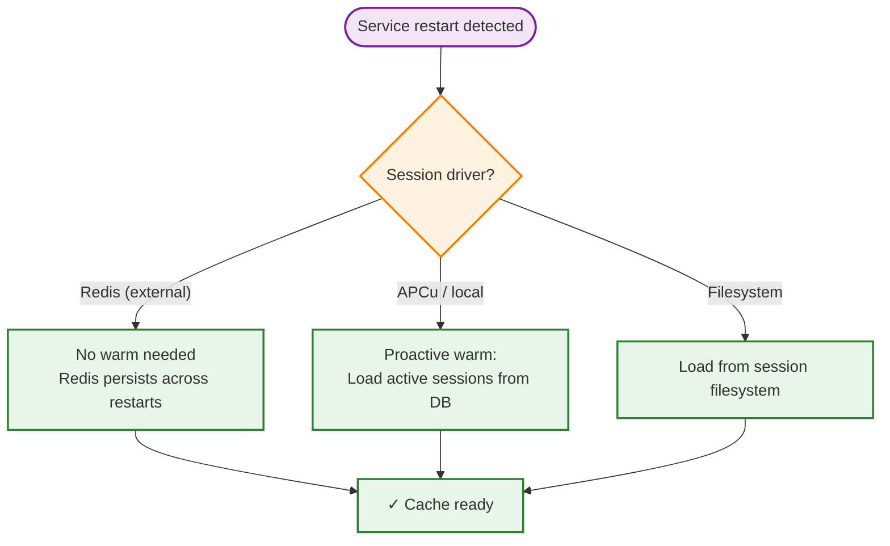
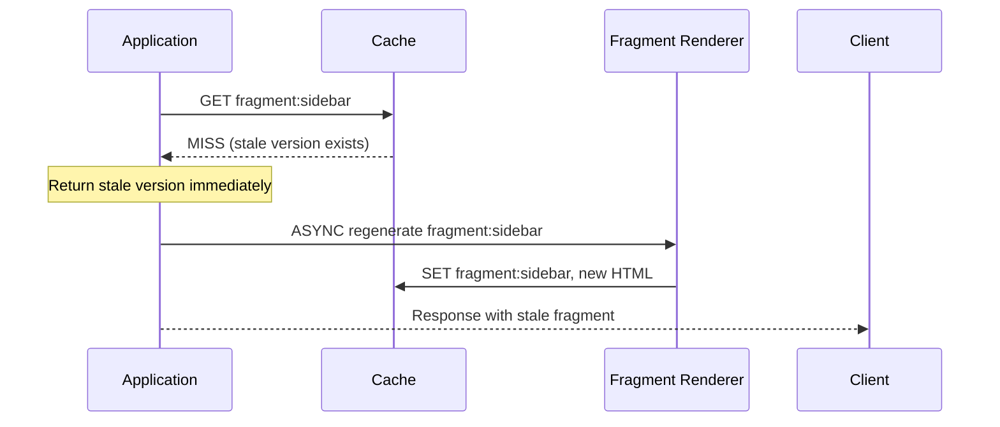
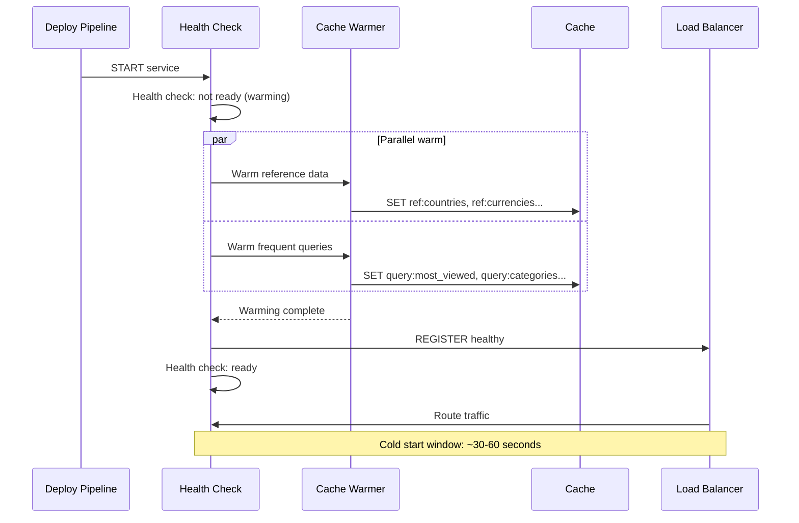

# Runbook: Cache Warming

> **Navigation:** [Operations Home](../index.md) | [Runbooks](index.md) | [Queue Backpressure](queue-backpressure.md) | [Failure Recovery](failure-recovery.md)
>
> **Related Guides:** [Cache Invalidation Strategies](../../cache-patterns/cache-invalidation-strategies.md) | [Cache Sizing Guide](../../cache-patterns/cache-sizing-guide.md)

---

## Overview

Cache warming is the process of pre-populating a cache with frequently accessed data before it serves production traffic. Proper warming prevents the **cold-start problem** where every initial request suffers a cache miss, causing a database load spike (thundering herd).

**Severity:** Medium (High during deployments)
**MTTR Target:** <5 minutes for automated warming
**Owner:** Platform Engineering / DevOps

---

## When to Warm the Cache

| Scenario | Priority | Why |
|----------|----------|-----|
| Service deployment / restart | **Critical** | Empty cache = 100% miss rate |
| New service instance (horizontal scale) | **High** | Prevents miss storm on new node |
| Cache cluster failover | **High** | Warm replica reduces catch-up time |
| After bulk data migration | **Medium** | Repopulate with new data schema |
| Scheduled cache flush (maintenance) | **Low** | Schedule during low traffic |

---

## Warming Strategies by Data Type

### Strategy 1: Session Data (Lazy + Proactive)

Session data is rarely reused across deployments since sessions are invalidated on restart.



### Strategy 2: Database Query Results (Proactive)

Warm the most frequently accessed query results to prevent database load spike.

```php
<?php
namespace Sovereign\Hub\Operations\CacheWarming;

class QueryResultWarmer implements CacheWarmerInterface
{
    public function __construct(
        private CacheDriverInterface $cache,
        private DatabaseRepository $repository,
        private array $warmQueries
    ) {}

    /**
     * Warm cache with common query results.
     * Queries are ordered by frequency (most accessed first).
     */
    public function warm(): WarmingResult
    {
        $start = microtime(true);
        $loaded = 0;
        $failed = 0;

        foreach ($this->warmQueries as $query) {
            try {
                $results = $this->repository->execute($query['sql'], $query['params']);
                $cacheKey = $this->buildCacheKey($query);

                $this->cache->set(
                    $cacheKey,
                    $results,
                    $query['ttl'] ?? 3600
                );
                $loaded += count($results);
            } catch (\Throwable $e) {
                $failed++;
                // Log failure but continue warming
                error_log("Cache warm failed for query: {$query['label']} — {$e->getMessage()}");
            }
        }

        return new WarmingResult(
            type: 'query_results',
            itemsLoaded: $loaded,
            failedQueries: $failed,
            elapsed: microtime(true) - $start
        );
    }

    private function buildCacheKey(array $query): string
    {
        return 'query:' . md5($query['sql'] . serialize($query['params']));
    }
}
```

### Strategy 3: HTML Fragments (On-Demand with Stale-While-Revalidate)

Pre-warming HTML fragments is expensive and often unnecessary. Use **stale-while-revalidate** instead:



### Strategy 4: Reference Data (Bulk Preload)

Reference data (countries, currencies, tax rates) changes infrequently and is ideal for bulk warming.

```php
<?php
namespace Sovereign\Hub\Operations\CacheWarming;

class ReferenceDataWarmer implements CacheWarmerInterface
{
    /**
     * Load all reference data into cache at once.
     * These datasets are small (<10MB) and rarely change.
     */
    public function warm(): WarmingResult
    {
        $start = microtime(true);

        $datasets = [
            'countries'       => $this->loadCountries(),
            'currencies'      => $this->loadCurrencies(),
            'timezones'       => $this->loadTimezones(),
            'tax_rates'       => $this->loadTaxRates(),
            'feature_flags'   => $this->loadFeatureFlags(),
        ];

        $loaded = 0;
        foreach ($datasets as $key => $data) {
            $this->cache->set("ref:{$key}", $data, 86400); // 24-hour TTL
            $loaded += count($data);
        }

        return new WarmingResult(
            type: 'reference_data',
            itemsLoaded: $loaded,
            failedQueries: 0,
            elapsed: microtime(true) - $start
        );
    }
}
```

---

## Automated Warming Sequence

### Service Startup Warming



### Warming Health Check Integration

```php
<?php
namespace Sovereign\Hub\Operations\CacheWarming;

class WarmingHealthCheck
{
    private bool $warmed = false;

    /**
     * Register a warming task to be completed before health check passes.
     */
    public function registerTask(string $name, callable $task): void
    {
        $this->tasks[$name] = $task;
    }

    /**
     * Execute all warming tasks.
     * The health endpoint returns 503 until this completes.
     */
    public function executeAll(): void
    {
        foreach ($this->tasks as $name => $task) {
            try {
                $task();
                $this->logSuccess($name);
            } catch (\Throwable $e) {
                $this->logFailure($name, $e);
                // Don't block service start on warm failure
            }
        }
        $this->warmed = true;
    }

    public function isReady(): bool
    {
        return $this->warmed;
    }
}
```

---

## Warming Verification

### Hit-Rate Validation

After warming, verify the cache is populated correctly:

```php
<?php
namespace Sovereign\Hub\Operations\CacheWarming;

class WarmingVerification
{
    /**
     * Verify cache population by checking expected keys.
     * Returns the percentage of expected keys that exist.
     */
    public function verifyPopulation(array $expectedKeys): float
    {
        $found = 0;
        foreach ($expectedKeys as $key) {
            if ($this->cache->has($key)) {
                $found++;
            }
        }

        $hitRate = count($expectedKeys) > 0 ? ($found / count($expectedKeys)) * 100 : 0;

        if ($hitRate < 90) {
            $this->alertLowWarmRate($hitRate);
        }

        return $hitRate;
    }

    /**
     * Verify that warming did not evict existing hot data.
     */
    public function verifyNoEviction(): void
    {
        $info = $this->redis->info('stats');
        $evictions = $info['evicted_keys'] ?? 0;

        if ($evictions > 1000) {
            $this->alertExcessiveEvictions($evictions);
        }
    }
}
```

---

## Emergency Procedures

### Scenario: Cache Warming Failed

| Step | Action | Command / Detail |
|------|--------|-----------------|
| 1 | Detect failure | Warming job reports error, health check stuck |
| 2 | Check Redis connectivity | `redis-cli ping` → should return `PONG` |
| 3 | Check memory pressure | `INFO memory` → `used_memory / maxmemory` |
| 4 | Fall back to lazy population | Set `CACHE_WARM_FAILURE=true` env var → app populates on cache miss |
| 5 | Warm selectively | Manually warm only critical keys: `php artisan cache:warm --critical-only` |
| 6 | Monitor DB load | If miss rate >50%, expect 2× DB load; scale readers if needed |

### Scenario: Warming Causes High Memory

| Step | Action | Command / Detail |
|------|--------|-----------------|
| 1 | Detect OOM risk | `INFO memory` → fragmentation ratio >1.5 |
| 2 | Pause warming | `php artisan cache:warm --pause` |
| 3 | Evict low-TTL items | Keys with TTL <60s are safe to evict |
| 4 | Resume with smaller batch | `php artisan cache:warm --batch=100` (default: 1000) |
| 5 | Verify evictions stopped | Monitor `evicted_keys` in `INFO stats` |

---

## Monitoring Thresholds

| Metric | Normal | Warning | Critical |
|--------|--------|---------|----------|
| Cache hit rate (after warm) | >95% | 80-95% | <80% |
| Warming duration | <30s | 30-60s | >60s |
| DB load during warm | <2× baseline | 2-3× baseline | >3× baseline |
| Eviction rate during warm | <100/s | 100-500/s | >500/s |
| Memory after warm | <70% | 70-85% | >85% |

---

## Related Blueprints

| Blueprint | Role in Cache Warming |
|-----------|----------------------|
| [HUB-02](../../../ApprovedBlueprints/Hub/HUB-02.md) | Cache implementation |
| [HUB-15](../../../ApprovedBlueprints/Hub/HUB-15.md) | Health monitoring, warm status endpoint |
| [CORE-15](../../../ApprovedBlueprints/Core/CORE-15.md) | PSR-16 cache abstraction |
| [HUB-30](../../../ApprovedBlueprints/Hub/HUB-30.md) | CLI tooling for manual warm commands |