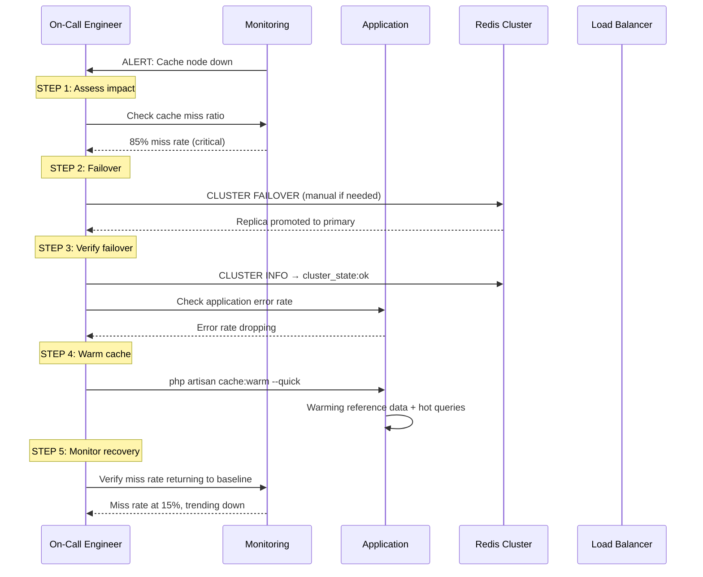
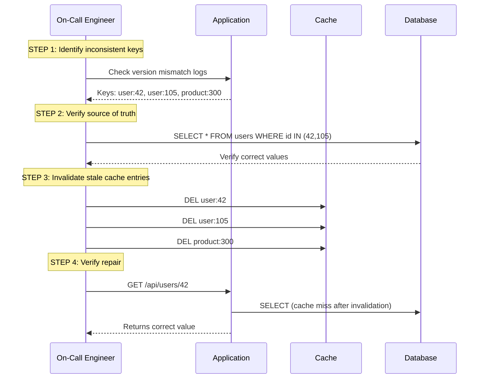

# Runbook: Cache/Queue Failure Recovery

> **Navigation:** [Operations Home](../index.md) | [Runbooks](index.md) | [Cache Warming](cache-warming.md) | [Queue Backpressure](queue-backpressure.md)
>
> **Related Guides:** [Cache Invalidation Strategies](../../cache-patterns/cache-invalidation-strategies.md) | [Dead-Letter Handling](../../queue-patterns/dead-letter-handling.md)

---

## Overview

This runbook provides step-by-step recovery procedures for common cache and queue failure scenarios in the DGLab Hub architecture. Each procedure includes detection, immediate containment, root cause investigation, and recovery verification.

**Severity:** Critical to High (varies by scenario)
**MTTR Target:** <15 minutes (90th percentile)
**Owner:** On-Call Engineer / SRE

---

## Failure Mode Index

| # | Scenario | Severity | MTTR Target | Page |
|---|----------|----------|-------------|------|
| 1 | Cache node failure (Redis) | **Critical** | <5 min | [Cache Node Recovery](#1-cache-node-failure) |
| 2 | Cache connection pool exhaustion | **High** | <10 min | [Cache Pool Exhaustion](#2-cache-connection-pool-exhaustion) |
| 3 | Cache data inconsistency | **Medium** | <15 min | [Cache Data Inconsistency](#3-cache-data-inconsistency) |
| 4 | Queue broker outage (Redis) | **Critical** | <5 min | [Queue Broker Outage](#4-queue-broker-outage) |
| 5 | Queue message loss | **High** | <15 min | [Queue Message Loss](#5-queue-message-loss) |
| 6 | Stuck queue (poison messages) | **Medium** | <10 min | [Stuck Queue](#6-stuck-queue-poison-messages) |

---

## 1. Cache Node Failure

### Detection

| Signal | Source | Threshold |
|--------|--------|-----------|
| Redis connection errors | Application logs | >10 errors/min |
| Cache miss rate spike | `CACHE_MISS_RATIO` metric | >50% (baseline: ~10%) |
| Redis health check failure | HUB-15 health endpoint | 503 status |
| PagerDuty/paging alert | Monitoring system | `CACHE_NODE_DOWN` alert |

### Recovery Procedure



### Step-by-Step

| Step | Action | Command | Expected Result |
|------|--------|---------|----------------|
| 1 | Verify the failure | `redis-cli -h <host> -p <port> ping` | `PONG` or connection refused |
| 2 | Check cluster state | `redis-cli --cluster check <host>:<port>` | All slots covered or fail state |
| 3 | Promote replica | `redis-cli CLUSTER FAILOVER` | Replica becomes primary |
| 4 | Check replication | `redis-cli INFO replication` | `master_link_status:up` |
| 5 | Verify application connectivity | Check app error logs | Connection errors stopped |
| 6 | Warm critical cache | `php artisan cache:warm --critical-only` | "Warming complete" |
| 7 | Verify cache hit ratio | Grafana dashboard | Hit ratio >80% within 5 min |

### Rollback

If failover fails or data is inconsistent:

```bash
# Force failback to original primary
redis-cli CLUSTER FAILOVER FORCE

# If cluster is completely down, switch to degraded mode
php artisan config:set cache.degraded=true
php artisan cache:clear
```

---

## 2. Cache Connection Pool Exhaustion

### Detection

| Signal | Source | Threshold |
|--------|--------|-----------|
| `connection_pool_exhausted` error | Application logs | >0 for >30s |
| High `connected_clients` | `redis-cli CLIENT LIST` | >80% of `maxclients` |
| Request latency increase | APM traces | >5× baseline P95 latency |

### Recovery Procedure

| Step | Action | Command | Expected Result |
|------|--------|---------|----------------|
| 1 | Check current connections | `redis-cli CLIENT LIST \| wc -l` | Count near maxclients |
| 2 | Increase maxclients | `redis-cli CONFIG SET maxclients 10000` | Configuration updated |
| 3 | (or) Restart Redis with new config | `systemctl restart redis` | Service restarted (causes brief outage) |
| 4 | Check for connection leaks | `redis-cli CLIENT LIST \| grep "idle"` | Few idle connections >30s |
| 5 | Fix leaking connections in app | Check `PoolInterface::release()` calls | Connections returned after use |
| 6 | Monitor pool usage | `redis-cli INFO clients` | `connected_clients` stable |

### Connection Pool Configuration

```php
<?php
namespace Sovereign\Hub\Operations\FailureRecovery;

class ConnectionPoolConfig
{
    /**
     * Optimal pool sizing based on concurrent workers.
     */
    public static function recommendedPool(int $workerCount, int $connectionsPerWorker = 2): array
    {
        return [
            'pool_size'        => $workerCount * $connectionsPerWorker,  // e.g., 50 workers × 2 = 100
            'max_idle'         => $workerCount,                          // Keep workerCount idle
            'idle_timeout'     => 60,                                    // Close idle after 60s
            'max_lifetime'     => 300,                                   // Reconnect every 5 min
            'wait_timeout'     => 5,                                     // Wait 5s before throwing
        ];
    }
}
```

---

## 3. Cache Data Inconsistency

### Detection

| Signal | Source | Threshold |
|--------|--------|-----------|
| Stale data returned | Application logs (version mismatch) | >0 |
| Cross-service data discrepancy | Integration tests | Test failure |
| User-reported data issues | Support tickets | >3 similar reports |

### Recovery Procedure



### Automated Inconsistency Repair

```php
<?php
namespace Sovereign\Hub\Operations\FailureRecovery;

class CacheConsistencyRepair
{
    /**
     * Repair inconsistent cache entries by comparing versions
     * and invalidating stale copies.
     *
     * @param array $keys Keys to verify and repair
     * @return RepairReport
     */
    public function repairKeys(array $keys): RepairReport
    {
        $repaired = 0;
        $failed = 0;

        foreach ($keys as $key) {
            try {
                $cached = $this->cache->get($key);
                $dbValue = $this->repository->find($key);

                if (!$this->isConsistent($cached, $dbValue)) {
                    $this->cache->delete($key);
                    $repaired++;
                    $this->logInconsistency($key, $cached, $dbValue);
                }
            } catch (\Throwable $e) {
                $failed++;
            }
        }

        return new RepairReport($repaired, $failed);
    }

    private function isConsistent(mixed $cached, mixed $dbValue): bool
    {
        if ($cached === null || $dbValue === null) {
            return $cached === $dbValue;
        }

        // Compare version fields if available
        $cachedVersion = $cached['_version'] ?? 0;
        $dbVersion = $dbValue['updated_at'] ?? time();

        return $cachedVersion >= $dbVersion;
    }
}
```

---

## 4. Queue Broker Outage

### Detection

| Signal | Source | Threshold |
|--------|--------|-----------|
| Queue push failures | `QUEUE_PUSH_ERROR` metric | >0 for >30s |
| Connection refused | Application logs | Redis connection errors |
| All queues frozen | Queue depth static | No change for >60s |

### Recovery Procedure

| Step | Action | Command | Expected Result |
|------|--------|---------|----------------|
| 1 | Verify broker status | `redis-cli ping` | `PONG` or connection error |
| 2 | Check broker process | `systemctl status redis` | Active or failed |
| 3 | Restart Redis | `systemctl restart redis` | Service started |
| 4 | Verify replication (if Sentinel) | `redis-cli INFO sentinel` | `sentinel_masters=1` |
| 5 | Check queue depth after restart | `redis-cli LLEN queue:default` | Depth preserved (RDB/AOF) |
| 6 | Resume consumers | `php artisan queue:work --once` | Message processing resumes |
| 7 | Verify message delivery | Check consumer logs | Messages being processed |

### Fallback: Database-Backed Queue

If Redis is down for an extended period:

```bash
# Switch queue driver to database
php artisan config:set queue.default database

# Verify database queue table
php artisan queue:table
php artisan migrate

# Re-route pending Redis messages (via CLI tool)
php artisan queue:transfer redis database
```

---

## 5. Queue Message Loss

### Detection

| Signal | Source | Threshold |
|--------|--------|-----------|
| Message count mismatch | Producer vs consumer counts | >0.1% discrepancy |
| DLQ unexpected messages | DLQ has messages | >0 |
| Business impact | Missing events, incomplete processing | User-reported |

### Recovery Procedure

| Step | Action | Command | Expected Result |
|------|--------|---------|----------------|
| 1 | Determine loss scope | Check logs for timeframe and queue | Affected period identified |
| 2 | Check Redis persistence | `redis-cli INFO persistence` | `rdb_last_save_time` or `aof_last_rewrite_time` |
| 3 | Recover from AOF/RDB | `redis-cli --rdb /var/lib/redis/dump.rdb` | RDB file exported |
| 4 | Analyze lost messages | `php artisan queue:recover --from=<backup>` | Lost messages re-enqueued |
| 5 | Verify idempotency | Check consumer dedup logic | Duplicates rejected |
| 6 | Reprocess if needed | `php artisan queue:redrive --dlq` | DLQ messages re-processed |

### Message Recovery Script

```php
<?php
namespace Sovereign\Hub\Operations\FailureRecovery;

class MessageRecoveryService
{
    /**
     * Recover messages from Redis RDB backup.
     * Parses dump, finds queue entries, and re-enqueues.
     */
    public function recoverFromBackup(string $rdbPath, string $queueName): int
    {
        // Parse RDB dump (simplified — use redis-rdb-tools in practice)
        $messages = $this->parseRdbDump($rdbPath, "queue:{$queueName}");
        $recovered = 0;

        foreach ($messages as $message) {
            try {
                // Check if already processed (dedup)
                if (!$this->dedup->isDuplicate($message['id'])) {
                    $this->queue->send($message['body'], $message['headers']);
                    $recovered++;
                }
            } catch (\Throwable $e) {
                $this->logRecoveryFailure($message['id'], $e);
            }
        }

        return $recovered;
    }
}
```

---

## 6. Stuck Queue (Poison Messages)

### Detection

| Signal | Source | Threshold |
|--------|--------|-----------|
| Messages repeatedly cycling | Same message ID reappears | >5 visibility timeouts |
| Consumer continuously failing | Worker logs show same error | >10 consecutive failures |
| Queue depth not decreasing | Depth metric | Static for >5 min |

### Recovery Procedure

| Step | Action | Command | Expected Result |
|------|--------|---------|----------------|
| 1 | Identify poison message | `redis-cli LRANGE queue:default 0 5` | See message IDs/contents |
| 2 | Peek at failing message | `php artisan queue:peek <messageId>` | View payload and error |
| 3 | Move to DLQ | `php artisan queue:poison <messageId>` | Message moved to `<queue>.dlq` |
| 4 | Verify processing resumes | Check queue depth | Depth decreasing |
| 5 | Analyze poison message | Check DLQ entry in dashboard | Root cause identified |
| 6 | (If needed) Fix and re-queue | `php artisan queue:redrive --dlq` | Fixed message re-processed |

### Poison Message Bulk Cleanup

```bash
# List all poison messages
php artisan queue:poison:list --queue=default

# Move all to DLQ with one command
php artisan queue:poison:flush --queue=default

# Analyze DLQ for failure patterns
php artisan queue:dlq:analyze --queue=default
```

---

## Recovery Verification Checklist

### Post-Recovery Validation

| Check | What to Verify | Pass/Fail |
|-------|---------------|-----------|
| Cache hit ratio | Back to within 10% of baseline | |
| Queue depth | Trending down or stable at healthy level | |
| Error rates | At or below baseline | |
| P99 latency | Within 20% of baseline | |
| Message processing rate | At or above pre-incident rate | |
| Redis memory | <70% of maxmemory | |
| DLQ growth | <1 message per minute | |

### Automated Verification Script

```bash
#!/bin/bash
# verify-recovery.sh

echo "=== Recovery Verification ==="

echo "1. Cache hit ratio:"
redis-cli INFO stats | grep keyspace_hits

echo "2. Queue depth:"
redis-cli LLEN queue:default

echo "3. Error count (last 5 min):"
tail -100 /var/log/app/queue.log | grep -c "ERROR"

echo "4. Redis memory:"
redis-cli INFO memory | grep -E "used_memory_human|maxmemory_human"

echo "5. DLQ depth:"
redis-cli LLEN queue:default.dlq
```

---

## Incident Report Template

```markdown
## Incident Report: {TITLE}

**Date:** {DATE}
**Duration:** {START} → {END} (total: {MINUTES} min)
**Severity:** SEV-{1/2/3}
**MTTR:** {MINUTES} min (target: {TARGET} min)

### Timeline
- {HH:MM} Alert fired ({ALERT_NAME})
- {HH:MM} Engineer acknowledged
- {HH:MM} Diagnosis: {ROOT_CAUSE}
- {HH:MM} Mitigation applied
- {HH:MM} Recovery confirmed
- {HH:MM} Incident closed

### Root Cause
{SUMMARY}

### Impact
- Affected services: {SERVICES}
- User-visible impact: {DESCRIPTION}
- Data loss: {YES/NO — details}

### Action Items
- [ ] Fix: {PERMANENT_FIX}
- [ ] Monitor: {ADDITIONAL_METRICS}
- [ ] Runbook: {UPDATE_RUNBOOK}
- [ ] Owner: {TEAM}
- [ ] Due: {DATE}
```

---

## Related Blueprints

| Blueprint | Role in Recovery |
|-----------|-----------------|
| [HUB-02](../../../ApprovedBlueprints/Hub/HUB-02.md) | Cache implementation, Redlock for lock recovery |
| [HUB-10](../../../ApprovedBlueprints/Hub/HUB-10.md) | Queue implementation, DLQ for message recovery |
| [HUB-15](../../../ApprovedBlueprints/Hub/HUB-15.md) | Health monitoring and alerting |
| [HUB-06](../../../ApprovedBlueprints/Hub/HUB-06.md) | Audit logging for incident tracking |
| [HUB-30](../../../ApprovedBlueprints/Hub/HUB-30.md) | CLI commands for recovery actions |