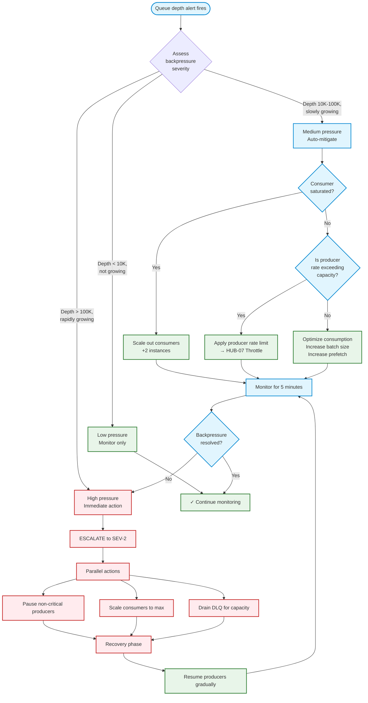

# Runbook: Queue Backpressure

> **Navigation:** [Operations Home](../index.md) | [Runbooks](index.md) | [Cache Warming](cache-warming.md) | [Failure Recovery](failure-recovery.md)
>
> **Related Guides:** [Throughput Optimization](../../queue-patterns/throughput-optimization.md) | [Dead-Letter Handling](../../queue-patterns/dead-letter-handling.md)

---

## Overview

Queue backpressure occurs when the rate of message production exceeds the rate of consumption, causing queue depth to grow. Sustained backpressure leads to increased latency, memory pressure, and eventual message loss or system failure.

**Severity:** High
**MTTR Target:** <10 minutes
**Owner:** On-Call Engineer / SRE

---

## Backpressure Detection

### Symptoms

| Symptom | Indicator | Detection Method |
|---------|-----------|-----------------|
| Growing queue depth | Queue length increasing | `redis-cli LLEN queue:default` or Grafana panel |
| Increasing message latency | Age of oldest unprocessed message | `QUEUE_OLDEST_MSG_AGE` metric |
| Consumer utilization >95% | Consumers saturated | `PHP-FPM process count` or `worker_cpu_usage` |
| Producer timeouts | Application-side queue push fails | `QUEUE_PUSH_TIMEOUT` error rate |
| Memory pressure on queue node | Redis memory high | `INFO memory` → `used_memory / maxmemory` |

### Alert Thresholds

| Alert | Warning | Critical | PagerDuty Severity |
|-------|---------|----------|-------------------|
| Queue depth > threshold | >1000 | >10,000 | SEV-3 / SEV-2 |
| Message age > SLA | >30s (realtime) / >5min (batch) | >60s / >10min | SEV-3 / SEV-2 |
| Consumer utilization | >80% | >95% | SEV-3 |
| DLQ growth rate | >10/min | >100/min | SEV-2 |
| Redis memory (queue node) | >70% | >85% | SEV-2 |

---

## Backpressure Flow Diagram



---

## Step-by-Step Mitigation

### Step 1: Diagnose the Root Cause

```bash
# 1. Check queue depth and consumer lag
redis-cli LLEN queue:default
redis-cli LRANGE queue:default 0 10  # Sample oldest messages

# 2. Check consumer health (Redis-based queue)
redis-cli CLIENT LIST | grep -c "worker"
redis-cli INFO stats | grep instantaneous_ops_per_sec

# 3. Check for slow / stuck consumers
redis-cli --eval check_consumer_lag.lua

# 4. Check memory on queue node
redis-cli INFO memory | grep -E "used_memory_human|maxmemory_human|evicted_keys"

# 5. Check DLQ depth
redis-cli LLEN queue:default.dlq
```

### Step 2: Apply Immediate Mitigation

| Severity | Immediate Action | Command / Script |
|----------|-----------------|-----------------|
| **High** | Pause non-critical producers | `php artisan queue:pause --queues=reports,analytics,email` |
| **High** | Scale consumers to max | `php artisan queue:scale --workers=50` |
| **Medium** | Increase batch size | Set `QUEUE_BATCH_SIZE=500` in `.env` |
| **Medium** | Increase prefetch | Set `QUEUE_PREFETCH=100` in `.env` |
| **Low** | Rate-limit producers | `php artisan throttle:set queue_publish 1000/min` |

### Step 3: Investigate Root Cause

```php
<?php
namespace Sovereign\Hub\Operations\QueueBackpressure;

class BackpressureInvestigator
{
    /**
     * Analyze queue to identify root cause of backpressure.
     */
    public function investigate(string $queueName): InvestigationResult
    {
        $result = new InvestigationResult($queueName);

        // 1. Check producer rate
        $result->producerRate = $this->metrics->getRate("queue:{$queueName}:publish_rate", '1m');

        // 2. Check consumer rate
        $result->consumerRate = $this->metrics->getRate("queue:{$queueName}:consume_rate", '1m');

        // 3. Check processing time percentiles
        $result->p50ProcessingTime = $this->metrics->getValue("queue:{$queueName}:processing_time_p50");
        $result->p99ProcessingTime = $this->metrics->getValue("queue:{$queueName}:processing_time_p99");

        // 4. Check error rate
        $result->errorRate = $this->metrics->getRate("queue:{$queueName}:error_count", '1m');

        // 5. Diagnose
        if ($result->producerRate > $result->consumerRate * 1.2) {
            $result->diagnosis = BackpressureCause::PRODUCER_OVERLOAD;
        } elseif ($result->p99ProcessingTime > 5000) {
            $result->diagnosis = BackpressureCause::SLOW_CONSUMER;
        } elseif ($result->errorRate > 0.1) {
            $result->diagnosis = BackpressureCause::HIGH_ERROR_RATE;
        } else {
            $result->diagnosis = BackpressureCause::INSUFFICIENT_CAPACITY;
        }

        return $result;
    }
}
```

---

## Auto-Scaling Rules

### Consumer Auto-Scaling

```yaml
# auto-scaling.yml (Kubernetes HPA-style configuration)
queue_consumer_scaling:
  queue_depth:
    metric: "queue:depth"
    scale_up_threshold: 5000
    scale_down_threshold: 500
    scale_up_cooldown: 120     # seconds
    scale_down_cooldown: 300   # seconds
    min_replicas: 2
    max_replicas: 20

  consumer_lag:
    metric: "queue:oldest_age_seconds"
    scale_up_threshold: 30     # 30 second lag
    scale_down_threshold: 5    # 5 second lag
    min_replicas: 2
    max_replicas: 15
```

### Rate Limiter Adjustment

```php
<?php
namespace Sovereign\Hub\Operations\QueueBackpressure;

class AutoRateLimiter
{
    /**
     * Dynamically adjust producer rate limit based on queue health.
     */
    public function adjustRateLimit(string $queueName, int $currentDepth): void
    {
        if ($currentDepth > 50_000) {
            // Critical: cut rate by 75%
            $this->rateLimiter->setLimit("queue_publish:{$queueName}", 250); // per minute
        } elseif ($currentDepth > 10_000) {
            // Warning: cut rate by 50%
            $this->rateLimiter->setLimit("queue_publish:{$queueName}", 500);
        } elseif ($currentDepth > 1_000) {
            // Mild: cut rate by 20%
            $this->rateLimiter->setLimit("queue_publish:{$queueName}", 800);
        } else {
            // Healthy: full rate
            $this->rateLimiter->setLimit("queue_publish:{$queueName}", 1000);
        }
    }
}
```

---

## Recovery Verification

### Checklist

| Step | Check | Expected | Actual |
|------|-------|----------|--------|
| 1 | Queue depth trending down | Decreasing over 5 min | |
| 2 | Message age decreasing | Oldest message < SLA | |
| 3 | Consumer utilization | <80% | |
| 4 | Redis memory | <70% of maxmemory | |
| 5 | DLQ growth stopped | <1/min | |
| 6 | Error rate | <1% of messages | |

### Confirm Resolution

```bash
# Verify queue depth over 5-minute window
redis-cli --csv LLEN queue:default | tee -a /tmp/queue_recovery.csv
# Expected: decreasing values

# Check for no new alerts
curl -s http://monitor:9090/api/v1/alerts | jq '.data.alerts[] | select(.labels.alertname == "QueueDepthHigh")'
# Expected: empty or resolved

# Resume paused producers (if any)
php artisan queue:resume --queues=reports,analytics,email
```

---

## Post-Mortem Actions

| Finding | Action | Owner | Due |
|---------|--------|-------|-----|
| Consumer processing too slow | Profile and optimize hot path | Service team | 1 week |
| Producer rate exceeded capacity | Add producer rate limiting | Platform team | 1 week |
| Inefficient batch processing | Tune batch size / prefetch | Platform team | 2 weeks |
| Insufficient consumer count | Adjust auto-scaling thresholds | SRE team | 2 weeks |
| DLQ not draining automatically | Implement auto-drain rules | Platform team | 1 week |

---

## Related Blueprints

| Blueprint | Role in Backpressure |
|-----------|---------------------|
| [HUB-10](../../../blueprints/Hub/HUB-10.md) | Queue implementation (depth, delays, DLQ) |
| [HUB-07](../../../blueprints/Hub/HUB-07.md) | Rate limiting for producer throttling |
| [HUB-15](../../../blueprints/Hub/HUB-15.md) | Health monitoring and alerting |
| [HUB-30](../../../blueprints/Hub/HUB-30.md) | CLI commands for queue management |