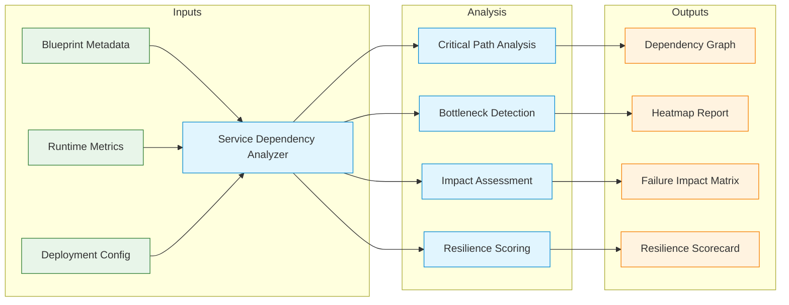
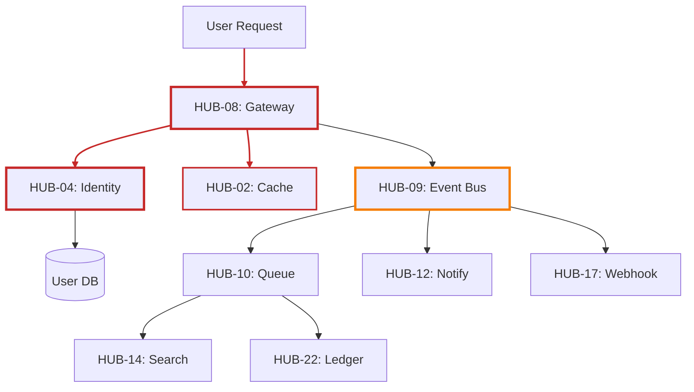
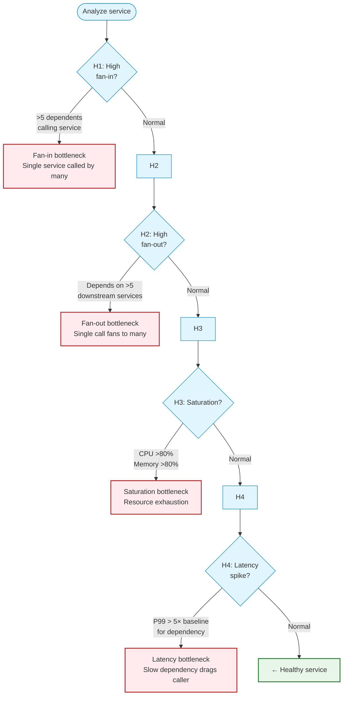

# Service Dependency Analyzer (Concept)

> **Navigation:** [Operations Home](index.md) | [Hub Scale Guide](hub-scale-guide.md) | [Runbooks](runbooks/index.md)
>
> **Related Guides:** [Hub Dependency Graph](../hub-taxonomy/hub-dependency-graph.md) | [Hub Navigation Guide](../hub-taxonomy/hub-navigation-guide.md)

---

## Overview

The **Service Dependency Analyzer (SDA)** is a tool concept for automatically discovering, analyzing, and visualizing service dependency graphs within the DGLab Hub architecture. Its primary purpose is to help operators identify critical paths, single points of failure, and bottleneck services in deployments with 30+ Hub services.

**Primary Driver:** [Weakness 3: Limited Operational Complexity Guidance](../../SOLUTIONS_TO_WEAKNESSES.md#weakness-3-limited-operational-complexity-guidance-for-30-services)

---

## Core Capabilities



---

## Data Sources

### 1. Blueprint Metadata (Design-Time)

Each Hub blueprint contains structured metadata that the SDA extracts:

```yaml
# Example: Extracted dependency metadata from HUB-09 (Event Bus)
service: hub-event-bus
blueprint_id: HUB-09
dependencies:
  - service: hub-cache         # HUB-02
    type: hard                  # Required at runtime
    protocol: redis
    port: 6379
    sla_impact: critical        # Failure breaks event delivery

  - service: hub-queue          # HUB-10
    type: hard
    protocol: redis
    port: 6379
    sla_impact: critical

  - service: hub-identity       # HUB-04
    type: soft                  # Can degrade
    protocol: http
    port: 8080
    sla_impact: medium          # Auth only for internal events
    fallback: cache_stale       # Use cached permissions

depends_on_me:
  - service: hub-notify         # HUB-12
  - service: hub-webhook        # HUB-17
  - service: hub-analytics
```

### 2. Runtime Metrics (Run-Time)

The SDA collects live telemetry for dynamic dependency analysis:

| Metric | Source | Use in SDA |
|--------|--------|------------|
| Request latency (P50, P95, P99) | OpenTelemetry traces | Identify slow dependencies |
| Error rate (HTTP 5xx, connection failures) | Service metrics | Detect failing dependencies |
| Circuit breaker state | Service health endpoints | Track active degradation |
| Saturation (CPU, memory, connections) | Infrastructure metrics | Predict capacity bottlenecks |
| Call count (requests per second) | Service metrics | Measure dependency criticality |

### 3. Deployment Configuration (Deploy-Time)

```yaml
# deployment-config.yml
topology:
  zones:
    - name: "us-east-1a"
      services: [hub-cache, hub-queue, hub-event-bus]
    - name: "us-east-1b"
      services: [hub-cache, hub-queue, hub-gateway]

  dependencies:
    hub-gateway:
      depends_on: [hub-identity, hub-cache]
      readiness_probe: "/health?deps=hub-identity, hub-cache"
```

---

## Critical Path Identification

### Algorithm

The SDA identifies **critical paths** — dependency chains where failure of any single service cascades to the widest user impact.



**Critical path rules:**
- **Red** paths (CORE critical): Gateway → Identity → Database (every request)
- **Orange** paths (HIGH criticality): Event Bus → downstream consumers
- **Yellow** paths (MEDIUM criticality): Queue → Search / Billing (background)

### Criticality Scoring

```php
<?php
namespace Sovereign\Hub\Operations\DependencyAnalysis;

class CriticalityScore
{
    /**
     * Calculate a service's criticality score based on:
     * - Number of downstream dependents
     * - Impact level of each dependent
     * - Whether the service has a fallback mode
     *
     * Score range: 0 (not critical) to 100 (most critical)
     */
    public function calculate(
        string $serviceId,
        array $dependents,    // Services that depend on this one
        array $fallbacks,     // Available fallback modes
    ): int {
        $score = 0;

        // +50 base for having any dependent
        if (!empty($dependents)) {
            $score += 50;
        }

        // +10 per critical dependent
        foreach ($dependents as $dep) {
            if ($dep['sla_impact'] === 'critical') {
                $score += 10;
            } elseif ($dep['sla_impact'] === 'high') {
                $score += 5;
            }
        }

        // -20 if the service itself has a fallback
        if (!empty($fallbacks)) {
            $score -= 20;
        }

        return min(100, max(0, $score));
    }
}
```

---

## Bottleneck Analysis

### Detection Rules

The SDA identifies bottlenecks using four heuristics:



### Bottleneck Report Example

```json
{
  "report_id": "bottleneck-2025-01-15",
  "generated_at": "2025-01-15T14:30:00Z",
  "services_analyzed": 28,
  "bottlenecks_found": 4,
  "bottlenecks": [
    {
      "service": "hub-event-bus",
      "type": "FAN_OUT",
      "score": 92,
      "details": "Hub-09 fans out to 8 downstream consumers",
      "downstream_impact": [
        "hub-notify: latency +150ms (P99)",
        "hub-webhook: latency +200ms (P99)",
        "hub-analytics: latency +50ms (P50)"
      ],
      "recommendation": "Implement async fan-out with HUB-10 Queue to decouple consumers",
      "estimated_improvement": "P99 latency reduction: 60%"
    },
    {
      "service": "hub-cache",
      "type": "FAN_IN",
      "score": 88,
      "details": "22 Hub services depend on cache directly",
      "recommendation": "Add Redis Cluster read replicas; implement client-side caching",
      "estimated_improvement": "Cache throughput increase: 300%"
    },
    {
      "service": "hub-queue",
      "type": "SATURATION",
      "score": 75,
      "details": "Redis memory at 82%, evictions increasing",
      "recommendation": "Increase Redis maxmemory to 8GB; review TTLs on queue messages",
      "estimated_improvement": "Evictions eliminated, queue latency -40%"
    },
    {
      "service": "hub-identity",
      "type": "LATENCY",
      "score": 65,
      "details": "Database query latency P99: 800ms during peak",
      "recommendation": "Add read replica for auth queries; implement session caching",
      "estimated_improvement": "Auth latency P99: 200ms (-75%)"
    }
  ]
}
```

---

## Report Format

### Dependency Graph (Visual)

The SDA generates an interactive dependency graph with:

**Node encoding:**
- **Size**: Number of dependents (larger = more critical)
- **Color**: Criticality (red = critical, orange = high, yellow = medium, green = low)
- **Border**: Circuit breaker state (solid = closed, dashed = open, dotted = half-open)

**Edge encoding:**
- **Thickness**: Request volume (thicker = more calls)
- **Color**: Health (green = normal, red = failing, gray = degraded)
- **Style**: Solid = synchronous, dashed = async/queue, dotted = event-driven

### Impact Analysis Report

```yaml
# sample-impact-report.yml
report:
  scenario: "hub-cache (HUB-02) failure"
  generated: "2025-01-15T14:30:00Z"

  affected_services:
    - service: hub-gateway
      impact: "degraded"
      details: "Auth checks fall back to DB (2× latency)"
      user_visible: true
      sla_remaining: "99.5% → 99.2%"

    - service: hub-event-bus
      impact: "degraded"
      details: "Event publishing delayed (queued for async retry)"
      user_visible: false
      sla_remaining: "99.9% → 99.8%"

    - service: hub-queue
      impact: "degraded"
      details: "Job metadata unavailable; processing continues with defaults"
      user_visible: false
      sla_remaining: "99.9% → 99.9%"

    - service: hub-identity
      impact: "degraded"
      details: "Session cache unavailable; hits database"
      user_visible: true
      sla_remaining: "99.8% → 99.0%"

  unaffected_services:
    - hub-chronos
    - hub-storage
    - hub-search

  recovery_estimate: "15-30 minutes (cache warm after node restart)"
```

### Resilience Scorecard

| Metric | Current | Target | Status |
|--------|---------|--------|--------|
| **Single Point of Failure count** | 3 | 0 | ⚠ Action needed |
| **Services with fallback mode** | 18/30 | 30/30 | ⚠ In progress |
| **Services with circuit breaker** | 12/30 | 30/30 | ⚠ In progress |
| **Redundant dependency paths** | 60% | 100% | ⚠ Improve |
| **P99 latency under single failure** | 2.5× baseline | <1.5× baseline | ❌ Over target |
| **Chaos experiment pass rate** | 80% | 95% | ⚠ Improve |

---

## Implementation Concept

### High-Level Architecture

```
┌─────────────────────────────────────────────────────────────────────┐
│                   SERVICE DEPENDENCY ANALYZER                        │
├─────────────────────────────────────────────────────────────────────┤
│                                                                      │
│  ┌────────────┐   ┌────────────┐   ┌────────────┐                    │
│  │ Metadata   │   │ Runtime    │   │ Config     │                    │
│  │ Collector  │   │ Collector  │   │ Collector  │                    │
│  └─────┬──────┘   └─────┬──────┘   └─────┬──────┘                    │
│        │                │                │                            │
│  ┌─────▼────────────────▼────────────────▼──────┐                    │
│  │              Graph Builder                    │                    │
│  │  - Dependency edges                           │                    │
│  │  - Health state mapping                       │                    │
│  │  - Criticality scoring                        │                    │
│  └─────────────────────┬─────────────────────────┘                    │
│                        │                                              │
│  ┌─────────────────────▼─────────────────────────┐                    │
│  │              Analysis Engine                   │                    │
│  │  - Critical path finder                        │                    │
│  │  - Bottleneck detector                         │                    │
│  │  - Impact simulator (what-if)                  │                    │
│  │  - Resilience scorer                           │                    │
│  └─────────────────────┬─────────────────────────┘                    │
│                        │                                              │
│  ┌─────────────────────▼─────────────────────────┐                    │
│  │              Output Generators                 │                    │
│  │  - Interactive graph (D3.js/vis.js)            │                    │
│  │  - Impact report (JSON/YAML)                   │                    │
│  │  - Resilience scorecard                         │                    │
│  └─────────────────────────────────────────────────┘                    │
└─────────────────────────────────────────────────────────────────────┘
```

### Integration Points

| Integration | Purpose | Trigger |
|-------------|---------|---------|
| CI/CD pipeline | Auto-generate dependency graph on deploy | On every deployment |
| On-call dashboard | Display live dependency health | Continuous (15s refresh) |
| Incident response | Calculate impact scope during incidents | On incident trigger |
| Capacity planning | Forecast bottleneck growth | Daily / on-demand |
| Architecture review | Analyze design-time dependencies | On blueprint update |

---

## Usage Scenarios

### Scenario 1: Pre-Deployment Impact Assessment

```text
Q: "If I upgrade HUB-09 (Event Bus), which services will be affected?"

SDA Response:
1. Direct dependents: hub-notify, hub-webhook, hub-analytics (3 services)
2. Indirect dependents: hub-queue, hub-search, hub-billing (3 services)
3. Total blast radius: 6 services (20% of Hub)
4. Recommended procedure:
   a. Deploy to staging → verify all 6 dependents
   b. Enable circuit breakers on 6 dependent connections
   c. Deploy during low-traffic window
   d. Monitor 3 critical paths for 30 min post-deploy
```

### Scenario 2: Incident Response

```text
Q: "HUB-02 (Cache) is down. What is the impact?"

SDA Response:
1. Direct impact: 22 services depend on cache
2. Critical impact: 8 services (gateway, identity, event bus, queue, ...)
3. Fallback status:
   - gateway: degraded (2× latency)
   - identity: degraded (no session cache)
   - event bus: degraded (queued retries)
   - queue: minor (metadata unavailable)
4. Estimated recovery time: 15-30 min (cache warm after failover)
5. Recommended action: Initiate cache failover to replica
```

### Scenario 3: Architecture Planning

```text
Q: "We're adding a new notification service. Where should it connect?"

SDA Response:
1. Recommended dependencies:
   - hub-event-bus (for domain events)
   - hub-queue (for async processing)
   - hub-identity (for user preferences)
   - hub-cache (for template caching)
2. This adds:
   - 2 new fan-out edges from hub-event-bus
   - 0.5% increased load on hub-cache (acceptable)
3. Bottleneck warning: hub-event-bus fan-out is already at 8 consumers.
   Consider adding a dedicated notification queue.
```

---

## Tool Integration Concept

### CLI Commands

```bash
# Generate dependency graph
sda graph --format=svg --output=hub-dependencies.svg

# Analyze impact of service failure
sda impact --service=hub-cache --scenario=failover

# Find bottlenecks
sda bottlenecks --min-score=70

# Generate resilience scorecard
sda scorecard --format=markdown

# Watch live dependency health
sda watch --refresh=30s
```

### Dashboard Integration

The SDA can be embedded in Grafana as a panel plugin, providing:

- Real-time dependency graph with health overlays
- Click-to-drill-down service details
- Timeline view of dependency changes
- What-if scenario sandbox
- Exportable impact reports

---

## Success Metrics

| Metric | Target | Measurement |
|--------|--------|-------------|
| Dependency discovery accuracy | >95% | Manual audit of generated graphs |
| Impact assessment time | <2 min | Time from SDA query to report |
| Bottleneck detection precision | >90% | Confirmed by manual analysis |
| Operator adoption | >80% of on-call team | Weekly active usage tracking |
| False positive rate (alerting) | <5% | Alert-to-incident ratio |

---

## Related Blueprints

| Blueprint | Role in Dependency Analysis |
|-----------|----------------------------|
| [HUB-15](../../ApprovedBlueprints/Hub/HUB-15.md) | Health monitoring data source |
| [HUB-16](../../ApprovedBlueprints/Hub/HUB-16.md) | Weaver orchestration and dependency validation |
| [HUB-08](../../ApprovedBlueprints/Hub/HUB-08.md) | Gateway — central routing topology |
| [HUB-01](../../ApprovedBlueprints/Hub/HUB-01.md) | Configuration for dependency metadata |
| [HUB-30](../../ApprovedBlueprints/Hub/HUB-30.md) | CLI tooling integration point |