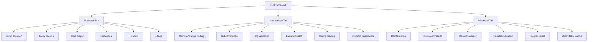
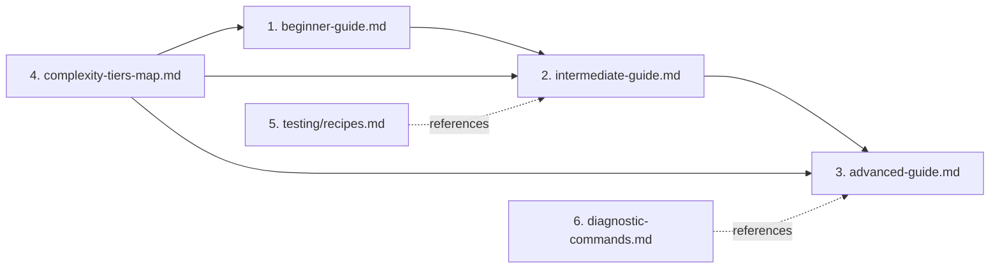

# CLI Framework & Testing Documentation Plan

## Context Summary

After examining the existing codebase, I found:

**Existing CLI Infrastructure** (`Legacy.old/cli/`):
- 9 standalone CLI scripts: `build-assets.php`, `cleanup.php`, `deploy.php`, `events.php`, `migrate.php`, `nexus.php`, `super.php`, `test.php`, `worker.php`
- Each uses manual `$argv` parsing with `switch/case` routing - no unified CLI framework
- Common patterns: option flags (`--flag=value`, `--flag`), ANSI color output, event dispatch integration
- Exit code conventions (0 success, non-zero failure)

**Existing Testing Infrastructure** (`Legacy.old/tests/`):
- Base classes: `TestCase`, `IntegrationTestCase`, `BrowserTestCase`, `ComponentTestCase`
- Concern traits: `MakesReactiveAssertions`, `MakesVisualAssertions`, `MakesAccessibilityAssertions`
- `EventFake` for event testing, SQLite in-memory for integration tests
- Test scaffolding via `cli/test.php` commands (`make:test`, `make:integration-test`, etc.)
- ~50+ test files across Unit, Integration, Browser suites

**Existing Docs** (`docs/`):
- ADRs, design patterns, implementation guides, integration docs
- No existing `docs/cli-framework/` or `docs/testing/` directories

---

## Files to Create

### 1. `docs/cli-framework/beginner-guide.md`

**Purpose**: Onboard new developers to basic CLI command creation in <1 hour.

**Content Outline**:
- **What is the DGLab CLI?** - Overview of the CLI ecosystem, how `php cli/` scripts work
- **Quick Start: Your First Command** - Step-by-step: create a new `cli/greet.php`, register it, run it
- **Argument Parsing 101**: Using `$argv`, `$argc`, extracting positional args, basic flags (`--verbose`, `--dry-run`)
- **Exit Codes**: Convention mapping (0=success, 1=general error, 2=misusage, 127=command not found)
- **Output Conventions**: `echo` vs color-coded output using ANSI sequences, success/error/info markers
- **Help System**: Building `showHelp()` methods, `php cli/foo.php help` convention
- **Common Patterns**: HasOption helper, GetOption helper, filter positional args helper
- **Troubleshooting**: "command not found", permission errors, missing autoload
- **Next Steps**: Link to intermediate guide

**Code examples**:
- Minimal CLI script skeleton
- Argument parsing with helpers
- Help text formatting
- Exit code usage

---

### 2. `docs/cli-framework/intermediate-guide.md`

**Purpose**: Level up to advanced routing, middleware patterns, and input validation.

**Content Outline**:
- **Advanced Argument Parsing**: Named options with values (`--name=value`, `--name value`), boolean flags, compound commands
- **Routing Architecture**: The command-map pattern (`$this->commands = []`), subcommands, route groups
- **Middleware Patterns**: Pre-execution hooks (auth checks, environment validation), post-execution hooks (cleanup, logging)
- **Input Validation**: Sanitizing CLI args, type coercion, required parameter enforcement, error messages
- **Error Handling**: Try/catch wrappers, user-friendly error display, stack trace suppression in production mode
- **Event Integration**: Dispatching events from CLI commands (`TestSuiteStarted`, `TestSuiteFinished`)
- **Configuration Loading**: Reading config files, environment variables, `.env` integration
- **Test Scaffolding Commands**: Pattern for `make:*` commands that generate files from templates
- **Parallel Execution**: Pattern for `pcntl_fork` parallel processing (Linux/Mac only)

**Code examples**:
- Command-map registration with metadata
- Pre/post middleware chain
- Validation function library
- Template-based file scaffolding
- Parallel execution with process management

---

### 3. `docs/cli-framework/advanced-guide.md`

**Purpose**: Custom commands, event hooks, and integration with other DGLab services.

**Content Outline**:
- **Custom Command Design**: Creating self-contained command classes, dependency injection in CLI
- **Event Hook System**: Registering listeners from CLI, lifecycle hooks (`before:command`, `after:command`, `on:error`)
- **Service Integration**: Using DI container in CLI, accessing database, queue, cache services
- **Plugin Commands**: Architecture for extensible commands that plugins can register
- **Progress Reporting**: Long-running command UX (progress bars, spinners, percentage output)
- **Output Formatting**: Table output, JSON output (`--json`), machine-readable output formats
- **State Management**: Persistent state across command invocations (lock files, status files)
- **Daemon/Worker Commands**: Long-running processes, signal handling (`SIGTERM`, `SIGINT`), graceful shutdown
- **Integration Cookbook**: 
  - CLI + Event Dispatcher workflow
  - CLI + Queue worker pattern
  - CLI + Database migration runner
  - CLI + Asset pipeline orchestration

**Code examples**:
- Command class with DI injection
- Event hook registration in CLI bootstrap
- Progress bar implementation
- Table/JSON output formatters
- Daemon process with signal handling
- Multi-step deployment orchestration

---

### 4. `docs/cli-framework/complexity-tiers-map.md`

**Purpose**: Visual map showing essential vs. optional CLI features for different developer roles.

**Content Outline**:
- **Tier Map Overview**: Three-tier system (Essential / Intermediate / Advanced)
- **Essential Tier** (Day 1): 
  - Basic script structure, argv parsing, echo output
  - Exit codes, help text, option flags
  - Target: All developers
- **Intermediate Tier** (Week 1):
  - Command-map routing, subcommands, argument validation
  - Event dispatch, config loading, middleware
  - Target: Feature developers
- **Advanced Tier** (Week 2+):
  - Custom command classes, DI integration, plugin registration
  - Daemon/worker commands, parallel execution
  - Progress reporting, formatted output
  - Target: CLI tool developers, infrastructure team



- **Role-to-Tier Mapping**:
  | Role | Essential | Intermediate | Advanced |
  |------|-----------|-------------|----------|
  | Junior Dev | ✓ | | |
  | Feature Dev | ✓ | ✓ | |
  | Infrastructure | ✓ | ✓ | ✓ |
  | Plugin Author | ✓ | ✓ | ✓ |
- **Decision Tree**: "Which tier do I need?" based on use case
- **Quick Reference Card**: One-page cheat sheet for each tier

---

### 5. `docs/testing/recipes.md` - ~20 Testing Patterns

**Purpose**: Cookbook of documented testing patterns for common DGLab scenarios.

**Content Structure**:
- **Header**: Overview, conventions (test namespace, base classes), test environment setup
- **Patterns organized by category**:

#### A. Foundation Patterns (4 recipes)
1. **Unit Test with Mocking** - Mocking external services using Prophecy
2. **Test Fixtures Setup & Cleanup** - `setUp()`/`tearDown()` patterns, temp directory management
3. **Data Provider Pattern** - PHPUnit data providers for parameterized tests
4. **Custom Assertion Pattern** - Creating reusable custom assertions

#### B. Async & Event Patterns (3 recipes)
5. **Event Dispatching Test** - Using `EventFake`, `assertEventDispatched`, `assertEventNotDispatched`
6. **Async Listener Test** - Testing queued/async event listeners with database verification
7. **Event Payload Assertion** - Testing event data with callback assertions

#### C. Database Patterns (3 recipes)
8. **In-Memory SQLite Test** - Integration test with SQLite `:memory:`
9. **Migration Verification** - Testing that migrations run successfully
10. **Transaction Rollback Pattern** - Test isolation via `beginTransaction`/`rollBack`

#### D. CLI & Command Patterns (3 recipes)
11. **CLI Command Output Test** - Capturing stdout, exit codes, error output
12. **Scaffolded File Test** - Testing `make:*` generated output
13. **Argument Parsing Test** - Testing various argument combinations

#### E. HTTP & API Patterns (3 recipes)
14. **Request/Response Cycle Test** - Using `createRequest()`, `call()`, `assertResponse*`
15. **Route Resolution Test** - Testing route matching, parameters, middleware
16. **API Endpoint Integration Test** - Full request-to-response pipeline

#### F. Multi-Tenancy & Security Patterns (4 recipes)
17. **Tenant Isolation Test** - Verifying cross-tenant data separation
18. **Rate Limiting Test** - Testing rate limiter thresholds and reset
19. **Authentication/Authorization Test** - RBAC permission checking
20. **Session Lifecycle Test** - Session creation, validation, expiry

**Each recipe includes**:
- Title and scenario description
- When to use this pattern
- Complete code example
- Expected output/assertions
- Common pitfalls to avoid
- Link to related recipes

---

### 6. `docs/cli-framework/diagnostic-commands.md`

**Purpose**: Document CLI diagnostic capabilities for troubleshooting.

**Content Outline**:
- **`dglab diagnose-setup` Concept**: Vision for unified diagnostic command
  - Configuration verification (config files exist, parse correctly)
  - Dependency health checks (PHP extensions, required packages, external services)
  - Filesystem permissions (storage, cache, logs writable)
  - Database connectivity (connection string, migration status)
  - Event system health (dispatcher registered, listeners loaded)
  
- **Configuration Verification Patterns**:
  ```php
  function verifyConfig(): array {
      $checks = [];
      $checks[] = checkFile('config/app.php');
      $checks[] = checkFile('config/database.php');
      $checks[] = checkParsing('config/routing.php');
      $checks[] = checkRequiredKeys('config/app.php', ['name', 'env', 'debug']);
      return $checks;
  }
  ```

- **Dependency Health Check Patterns**:
  - PHP version check (`version_compare`)
  - Extension loaded check (`extension_loaded`)
  - Class existence check (`class_exists`)
  - Function availability check (`function_exists`)
  - Binary availability check (`exec('which ...')`)
  - Service reachability check (database ping, cache ping)

- **Troubleshooting Guide**:
  | Symptom | Likely Cause | Check Command | Fix |
  |---------|-------------|--------------|-----|
  | "Class not found" | Autoload not configured | Check `composer.json` | Run `composer dump-autoload` |
  | "Connection refused" | DB not running | `php -r '...'` | Start database service |
  | "Permission denied" | Storage not writable | `ls -la storage/` | `chmod -R 775 storage` |
  | "Command not found" | Script not registered | Check `cli/` directory | Add to `composer.json` scripts |
  | Event not dispatching | Listener not registered | `php cli/events.php list` | Check event service provider |
  | Test fails in CI only | Missing service | Check CI config | Add Testcontainers or fallback |

- **Health Report Generation**: Pattern for generating HTML/JSON health reports
- **Self-Healing Commands**: Commands that attempt auto-fix (clear cache, recreate dirs)
- **Verbose Mode**: `-v`, `-vv`, `-vvv` verbosity levels convention

---

## Implementation Order & Dependencies



1. `complexity-tiers-map.md` first (provides the framework overview)
2. `beginner-guide.md` (foundational, no dependencies)
3. `intermediate-guide.md` (builds on beginner concepts)
4. `advanced-guide.md` (builds on intermediate concepts)
5. `testing/recipes.md` (references intermediate concepts but can be parallel)
6. `diagnostic-commands.md` (references advanced concepts but can be parallel)

Steps 5 and 6 can be done in parallel with steps 3-4.

---

## Success Metrics Validation

| Metric | How We'll Measure |
|--------|------------------|
| Commands buildable in <1 day | Beginner guide covers all prerequisite knowledge |
| Test setup time reduced 50% | Recipes provide copy-paste templates for 20 patterns |
| 95% FAQ coverage | Diagnostic guide + troubleshooting table covers common issues |