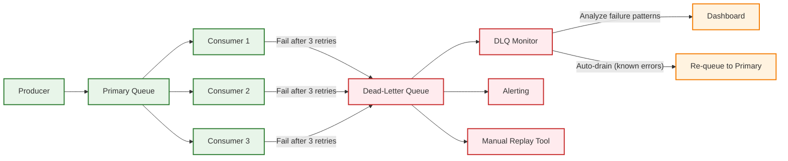
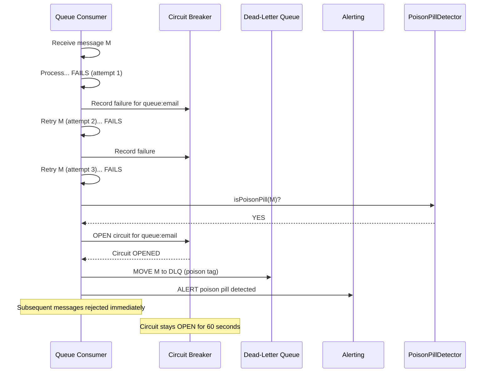
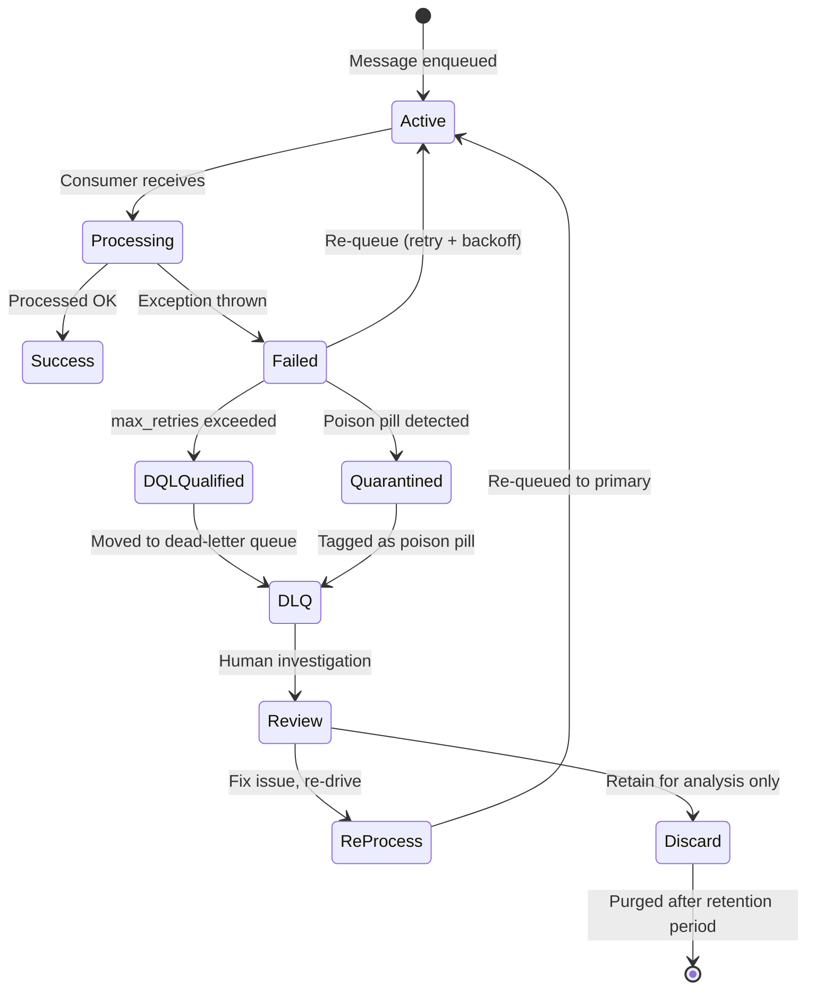

# Dead-Letter Handling

> **Navigation:** [Queue Patterns Index](index.md) | [Message Ordering Guarantees](message-ordering-guarantees.md) | [Throughput Optimization](throughput-optimization.md)
>
> **Decision Trees:** [Queue Solution Selector](../hub-taxonomy/queue-solution-selector.md)

---

## Overview

A **Dead-Letter Queue (DLQ)** is a secondary queue that captures messages that cannot be processed successfully after exhausting retry attempts. Proper DLQ management prevents message loss, enables forensic analysis, and maintains queue health.

**Primary Blueprint:** [HUB-10: Sovereign Queue](../../ApprovedBlueprints/Hub/HUB-10.md)

---

## Dead-Letter Queue Architecture



---

## DLQ Setup

### Configuration

```php
<?php
namespace Sovereign\Hub\Queue\DLQ;

class DeadLetterQueueConfig
{
    /**
     * Configure DLQ settings for a queue.
     *
     * @param string $queueName Name of the primary queue
     * @param array $settings DLQ configuration parameters
     */
    public static function configure(string $queueName, array $settings = []): array
    {
        return array_merge([
            'enabled'              => true,
            'dlq_name'             => "{$queueName}.dlq",
            'max_receive_count'    => 3,    // Max times a message can be received
            'visibility_timeout'   => 30,   // Seconds before message reappears
            'retention_period'     => 14,   // Days to retain DLQ messages
            'redrive_policy'       => [
                'enabled'            => true,
                'max_redrives'       => 2,   // Max times a DLQ msg can be re-driven
                'redrive_delay'      => 300, // Seconds before redrive attempt
            ],
        ], $settings);
    }
}
```

### Driver Implementation (Redis)

```php
<?php
namespace Sovereign\Hub\Queue\DLQ;

use Sovereign\Core\Queue\QueueInterface;

class RedisDLQ implements DeadLetterQueueInterface
{
    public function __construct(
        private RedisClient $redis,
        private string $primaryQueue,
        private string $dlqQueue,
        private int $maxRetries = 3
    ) {}

    /**
     * Check if message should be moved to DLQ after failure.
     */
    public function handleFailure(string $messageId, array $message, string $error): void
    {
        $retryCount = $this->incrementRetry($messageId);

        if ($retryCount >= $this->maxRetries) {
            $this->moveToDlq($messageId, $message, $error, $retryCount);
        } else {
            // Re-queue with exponential backoff
            $this->requeueWithBackoff($messageId, $message, $retryCount);
        }
    }

    private function incrementRetry(string $messageId): int
    {
        $key = "retry:{$this->primaryQueue}:{$messageId}";
        $count = $this->redis->incr($key);
        $this->redis->expire($key, 86400); // TTL to prevent unbounded growth
        return $count;
    }

    private function moveToDlq(string $messageId, array $message, string $error, int $retryCount): void
    {
        $dlqEntry = [
            'original_message_id' => $messageId,
            'original_queue'      => $this->primaryQueue,
            'body'                => $message['body'],
            'headers'             => $message['headers'] ?? [],
            'error'               => $error,
            'retry_count'         => $retryCount,
            'moved_at'            => time(),
        ];

        $this->redis->rPush($this->dlqQueue, serialize($dlqEntry));
        $this->redis->lRem($this->primaryQueue, $messageId, 0); // Remove from primary
        $this->redis->del("retry:{$this->primaryQueue}:{$messageId}");
    }

    private function requeueWithBackoff(string $messageId, array $message, int $retryCount): void
    {
        $delay = BackoffCalculator::exponentialWithJitter($retryCount);
        // Delayed re-queue (use Redis sorted set or delayed queue)
        $this->redis->zAdd("delayed:{$this->primaryQueue}", time() + $delay, serialize($message));
    }
}
```

---

## Poison Pill Detection

A **poison pill** is a message that always causes a processing failure, consuming resources indefinitely unless detected and quarantined.

### Detection Heuristics

| Heuristic | Threshold | Action |
|-----------|-----------|--------|
| **Fatal error** | Uncaught exception | Immediate DLQ |
| **Consistent failure** | 3+ consecutive same-message failures | DLQ with poison-pill tag |
| **Corrupt payload** | JSON decode fails, schema violation | DLQ + developer alert |
| **Resource exhaustion** | Triggers OOM, DB connection pool depletion | Immediate DLQ + rate-limited retry |
| **Timeout suicide** | Consumer timeout reached (visibility expired) | DLQ after 5 consecutive timeouts |

### Poison Pill Handler

```php
<?php
namespace Sovereign\Hub\Queue\DLQ;

class PoisonPillDetector
{
    private array $failureHistory = [];

    /**
     * Determine if a message is a poison pill.
     */
    public function isPoisonPill(string $messageId, \Throwable $error): bool
    {
        // Track failure reasons
        $this->failureHistory[$messageId][] = [
            'time'  => time(),
            'error' => get_class($error),
            'code'  => $error->getCode(),
        ];

        // Heuristic 1: Same fatal error class 3+ times
        $errors = array_column($this->failureHistory[$messageId], 'error');
        $errorCounts = array_count_values($errors);
        if (max($errorCounts) >= 3) {
            return true;
        }

        // Heuristic 2: Corrupt payload (parse errors)
        if ($error instanceof \JsonException) {
            return true; // Immediate quarantine
        }

        // Heuristic 3: Timeout suicide
        if ($error instanceof TimeoutException && count($this->failureHistory[$messageId]) >= 5) {
            return true;
        }

        return false;
    }
}
```

### Circuit Breaker Integration

When a poison pill is detected, the **circuit breaker** prevents further attempts:



---

## Retry Policies with Exponential Backoff

### Backoff Calculation

```php
<?php
namespace Sovereign\Hub\Queue\DLQ;

class BackoffCalculator
{
    /**
     * Calculate delay with exponential backoff and jitter.
     *
     * Formula: min(base_delay × 2^attempt + random(0, jitter), max_delay)
     *
     * @param int $attempt Zero-based attempt number
     * @param int $baseDelay Base delay in seconds (default: 5)
     * @param int $maxDelay Maximum delay in seconds (default: 3600)
     * @param int $jitter Jitter in seconds (default: 10% of calculated delay)
     * @return int Delay in seconds
     */
    public static function exponentialWithJitter(
        int $attempt,
        int $baseDelay = 5,
        int $maxDelay = 3600,
        ?int $jitter = null
    ): int {
        $delay = min($baseDelay * (2 ** $attempt), $maxDelay);
        $jitter = $jitter ?? (int) ($delay * 0.1);

        return $delay + random_int(0, $jitter);
    }

    /**
     * Pre-calculated delays for common retry configurations.
     */
    public static function retrySchedule(int $baseDelay = 5, int $maxRetries = 5): array
    {
        $schedule = [];
        for ($i = 0; $i < $maxRetries; $i++) {
            $schedule[] = self::exponentialWithJitter($i, $baseDelay);
        }
        return $schedule;
    }
}
```

### Retry Schedule Examples

| Attempt | Base 5s | Base 10s | Base 30s |
|---------|---------|----------|----------|
| 0 | 5 ±0.5s | 10 ±1s | 30 ±3s |
| 1 | 10 ±1s | 20 ±2s | 60 ±6s |
| 2 | 20 ±2s | 40 ±4s | 120 ±12s |
| 3 | 40 ±4s | 80 ±8s | 240 ±24s |
| 4 | 80 ±8s | 160 ±16s | 480 ±48s |
| 5 | 160 ±16s | 320 ±32s | 960 ±96s |
| 6 | 320 ±32s | 640 ±64s | 1920 ±192s |
| 7 | 640 ±64s | 1280 ±128s | 3600 (capped) |
| 8 | 1280 ±128s | 2560 ±256s | 3600 (capped) |
| 9 | 3600 (capped) | 3600 (capped) | 3600 (capped) |

### Retry Budget

Prevents retries from overwhelming a failing system:

```php
<?php
namespace Sovereign\Hub\Queue\DLQ;

class RetryBudget
{
    /**
     * A retry budget limits retries as a fraction of normal traffic.
     *
     * Budget = max_retries_per_second = normal_throughput × budget_ratio
     *
     * Example: 100 msg/s normal, 10% budget → max 10 retries/s
     */
    public function __construct(
        private int $normalThroughput,   // Baseline QPS
        private float $budgetRatio = 0.10, // 10% of normal
        private int $windowSeconds = 10
    ) {}

    public function allowRetry(): bool
    {
        $budget = (int) ($this->normalThroughput * $this->budgetRatio * $this->windowSeconds);
        $currentRetries = $this->getRetryCountInWindow();

        return $currentRetries < $budget;
    }
}
```

---

## DLQ Monitoring and Alerting

### Alert Thresholds

| Metric | Warning | Critical | Action |
|--------|---------|----------|--------|
| DLQ depth (total) | >100 | >1000 | Investigate failure pattern |
| DLQ growth rate | >10 msg/min | >100 msg/min | Auto-scale consumers or circuit-break |
| Oldest DLQ message | >1 hour | >24 hours | Human investigation required |
| Redrive success rate | <80% | <50% | Check poison pills, fix upstream |
| DLQ-to-primary ratio | >1% | >5% | System-level failure likely |

### DLQ Dashboard Integration

```yaml
# Example: Grafana dashboard JSON snippet for DLQ monitoring
panels:
  - title: "Dead-Letter Queue Depth by Service"
    type: "timeseries"
    targets:
      - expr: 'hub_queue_dlq_depth{queue=~".+"}'
        legendFormat: "{{queue}}"

  - title: "Poison Pill Detection Rate"
    type: "stat"
    targets:
      - expr: 'rate(hub_queue_poison_pill_detected[5m])'

  - title: "Retry Budget Utilization"
    type: "gauge"
    targets:
      - expr: 'hub_queue_retry_budget_used / hub_queue_retry_budget_total * 100'
```

---

## DLQ Lifecycle



---

## Re-Driving Messages from DLQ

```php
<?php
namespace Sovereign\Hub\Queue\DLQ;

class DLQRedriveService
{
    public function __construct(
        private QueueInterface $primaryQueue,
        private RedisClient $redis,
        private string $dlqPrefix = 'dlq:'
    ) {}

    /**
     * Redrive messages from DLQ back to the primary queue.
     */
    public function redrive(string $queueName, int $batchSize = 100): RedriveResult
    {
        $dlqKey = "{$this->dlqPrefix}{$queueName}";
        $redrived = 0;
        $failed = 0;

        $messages = $this->redis->lRange($dlqKey, 0, $batchSize - 1);

        foreach ($messages as $serialized) {
            $dlqMessage = unserialize($serialized);

            try {
                $this->primaryQueue->send(
                    $dlqMessage['body'],
                    $dlqMessage['headers'] ?? []
                );
                $this->redis->lRem($dlqKey, $serialized, 1);
                $redrived++;
            } catch (\Throwable $e) {
                $failed++;
            }
        }

        return new RedriveResult($redrived, $failed);
    }

    /**
     * Auto-drain messages from DLQ that match known-error patterns.
     */
    public function autoDrainKnownErrors(string $queueName, array $patterns): int
    {
        $dlqKey = "{$this->dlqPrefix}{$queueName}";
        $drained = 0;
        $messages = $this->redis->lRange($dlqKey, 0, -1);

        foreach ($messages as $serialized) {
            $entry = unserialize($serialized);
            foreach ($patterns as $errorPattern => $action) {
                if (str_contains($entry['error'], $errorPattern)) {
                    if ($action === 'requeue') {
                        $this->primaryQueue->send($entry['body'], $entry['headers']);
                    }
                    $this->redis->lRem($dlqKey, $serialized, 1);
                    $drained++;
                }
            }
        }

        return $drained;
    }
}
```

---

## Related Blueprints

| Blueprint | Role in Dead-Letter Handling |
|-----------|------------------------------|
| [HUB-10](../../ApprovedBlueprints/Hub/HUB-10.md) | Queue driver with DLQ support |
| [HUB-09](../../ApprovedBlueprints/Hub/HUB-09.md) | Event Bus retry patterns |
| [HUB-06](../../ApprovedBlueprints/Hub/HUB-06.md) | Audit logging for DLQ events |
| [HUB-17](../../ApprovedBlueprints/Hub/HUB-17.md) | Webhook retry and failure handling |