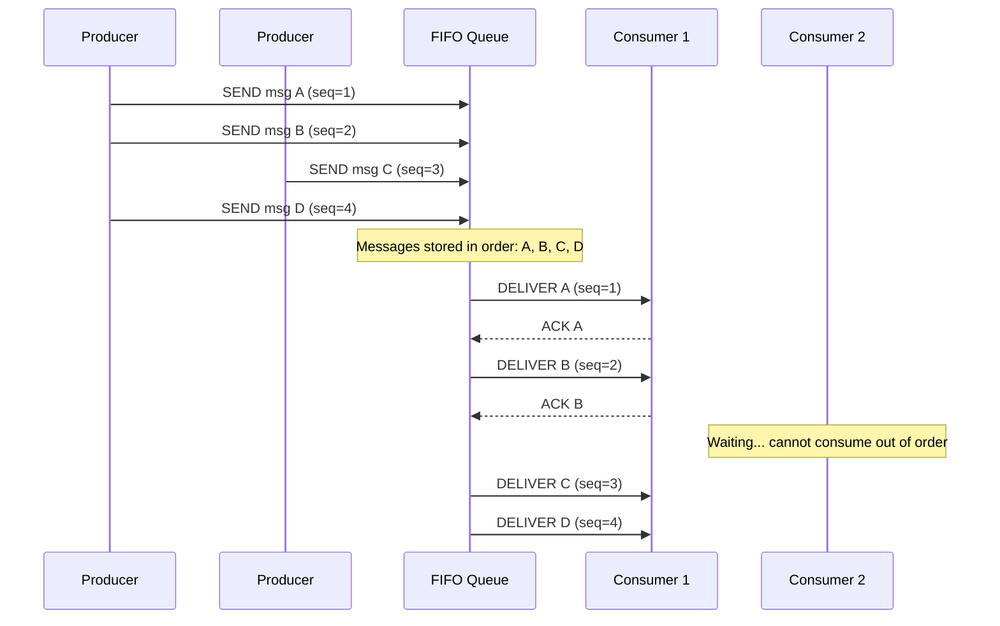
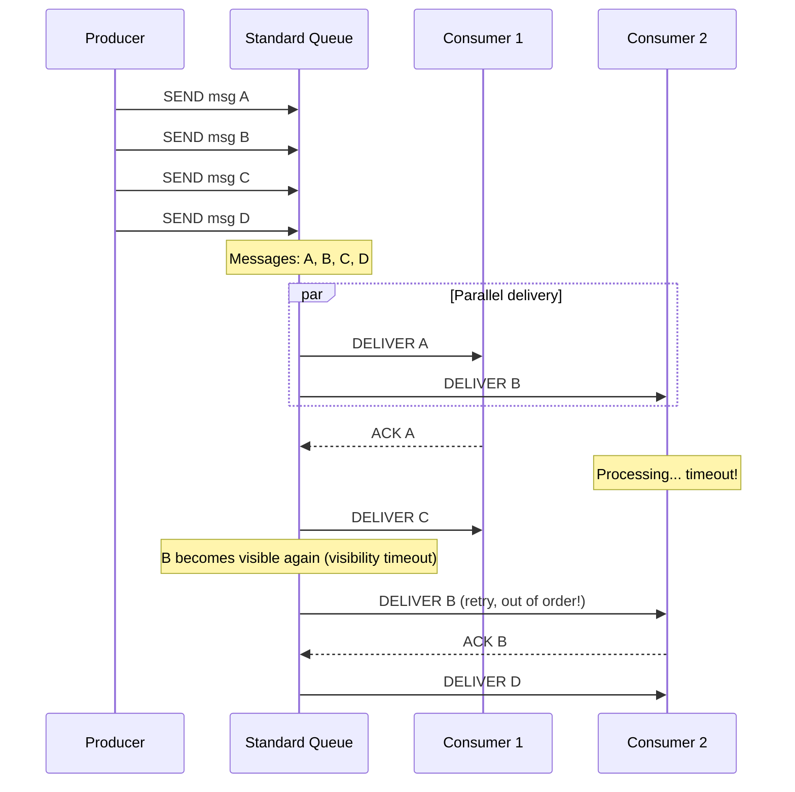
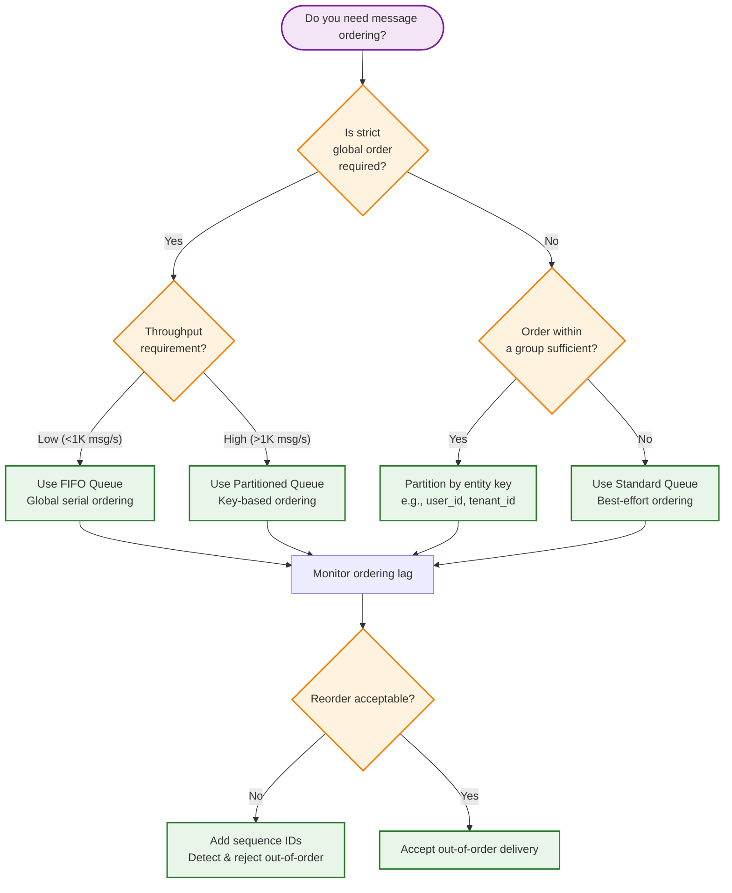

# Message Ordering Guarantees

> **Navigation:** [Queue Patterns Index](index.md) | [Dead-Letter Handling](dead-letter-handling.md) | [Throughput Optimization](throughput-optimization.md)
>
> **Decision Trees:** [Queue Solution Selector](../hub-taxonomy/queue-solution-selector.md)

---

## Overview

Message ordering in distributed queue systems involves trade-offs between strict ordering, throughput, and fault tolerance. This guide covers the ordering guarantees available in the DGLab Hub queue infrastructure and how to select the right model.

**Primary Blueprint:** [HUB-10: Sovereign Queue](../../ApprovedBlueprints/Hub/HUB-10.md)

---

## Ordering Models

### FIFO Queue (Strict Ordering)

Messages are delivered in the exact order they were sent. At-most-once or exactly-once delivery enforced.



**Characteristics:**
- **Delivery order:** Exact (insertion order)
- **Throughput:** Limited (single-consumer FIFO per partition)
- **Use case:** Financial transactions, audit trails, sequential state machines
- **HUB-10 support:** When ordered group IDs are specified

### Standard Queue (At-Least-Once)

Messages are delivered at least once. Ordering is best-effort; messages may be delivered out of order due to retries or parallel consumers.



**Characteristics:**
- **Delivery order:** Best-effort (retries may reorder)
- **Throughput:** High (parallel consumers)
- **Use case:** Email sending, report generation, image processing
- **HUB-10 support:** Default mode

---

## Delivery Guarantees

### At-Most-Once

| Property | Value |
|----------|-------|
| **Delivery** | Each message delivered 0 or 1 times |
| **Ordering** | Not guaranteed |
| **Ack required** | No |
| **Retry** | Never |
| **Use case** | Telemetry, metrics (loss acceptable) |

### At-Least-Once (Default for HUB-10)

| Property | Value |
|----------|-------|
| **Delivery** | Each message delivered 1+ times |
| **Ordering** | Best-effort (FIFO per partition if configured) |
| **Ack required** | Yes |
| **Retry** | Until ack or retry limit |
| **Use case** | Background jobs, async processing |

### Exactly-Once

| Property | Value |
|----------|-------|
| **Delivery** | Each message delivered exactly 1 time |
| **Ordering** | Strict (per partition) |
| **Ack required** | Yes (with deduplication) |
| **Retry** | Deduplication prevents double processing |
| **Use case** | Payment processing, critical events |

---

## Sequence ID Patterns

### Monotonic Sequence IDs

Assign a globally unique sequence number to each message. Consumers can detect gaps and reorder.

```php
<?php
namespace Sovereign\Hub\Queue\Ordering;

class MonotonicSequencer
{
    private RedisClient $redis;

    /**
     * Generate a monotonic sequence ID using Redis atomic increment.
     *
     * Format: {timestamp_ms}-{counter:06d}-{shard_id}
     * Example: 1706119234567-000042-s1
     */
    public function nextId(string $partitionKey, string $shardId = 's1'): string
    {
        $counter = $this->redis->incr("seq:{$partitionKey}");
        // Reset counter daily to keep IDs bounded
        $this->redis->expire("seq:{$partitionKey}", 86400);

        return sprintf(
            '%d-%06d-%s',
            hrtime(true) / 1_000_000, // millisecond timestamp
            $counter,
            $shardId
        );
    }
}

class OrderedMessage
{
    public function __construct(
        public readonly string $sequenceId,
        public readonly string $body,
        public readonly string $partitionKey
    ) {}
}
```

### Partition Keys

Messages within the same partition are guaranteed ordered. Partitions enable parallel consumption while maintaining per-group ordering.

```php
// All messages for user_id=42 go to the same partition
$partitionKey = "user:{$userId}";
$queue->send(new OrderedMessage(
    sequenceId: $sequencer->nextId($partitionKey),
    body: json_encode($payload),
    partitionKey: $partitionKey
));
```

### Ordering by Partition

```mermaid
graph TD
    P[Producer] --> Router[Partition Router]
    Router -->|hash(user_id) mod 3| P0[Partition 0]
    Router -->|hash(user_id) mod 3| P1[Partition 1]
    Router -->|hash(user_id) mod 3| P2[Partition 2]

    P0 --> C0[Consumer Group A]
    P1 --> C1[Consumer Group B]
    P2 --> C2[Consumer Group C]

    Note over P0: user:1, user:4, user:7 → ORDERED
    Note over P1: user:2, user:5, user:8 → ORDERED
    Note over P2: user:3, user:6, user:9 → ORDERED

    classDef partition fill:#e8f5e9,stroke:#2e7d32
    class P0,P1,P2 partition
```

### Deduplication

Even with at-least-once delivery, deduplication IDs provide exactly-once semantics for idempotent consumers:

```php
<?php
namespace Sovereign\Hub\Queue\Ordering;

class DeduplicationService
{
    private RedisClient $redis;

    /**
     * Check if a message has already been processed.
     * Uses Redis SET NX with TTL matching the deduplication window.
     */
    public function isDuplicate(string $dedupId, int $windowSeconds = 3600): bool
    {
        // SET NX — returns false if key already exists
        if (!$this->redis->set("dedup:{$dedupId}", '1', ['NX', 'EX' => $windowSeconds])) {
            return true; // Already processed
        }
        return false;
    }
}
```

---

## Global vs. Per-Partition Ordering

### Global Ordering

All messages processed in strict sequence across all consumers.

| Aspect | Detail |
|--------|--------|
| **Scalability** | Single-consumer bottleneck |
| **Throughput** | ~1,000 msg/s (Redis), ~100 msg/s (DB) |
| **Use case** | Event sourcing, append-only logs |
| **Cost** | High (serialized processing) |

### Per-Partition Ordering

Messages ordered within a partition; partitions consumed in parallel.

| Aspect | Detail |
|--------|--------|
| **Scalability** | Scales with partition count |
| **Throughput** | Partitions × per-partition throughput |
| **Use case** | User-scoped processing, tenant-isolated workflows |
| **Cost** | Moderate (partition management overhead) |

### Decision Framework



---

## Configuration: HUB-10 Queue Ordering

```php
<?php
namespace Sovereign\Hub\Queue\Config;

class OrderingConfig
{
    /**
     * Returns the queue configuration for the given ordering mode.
     */
    public static function forMode(string $mode): array
    {
        return match ($mode) {
            'fifo' => [
                'driver'          => 'redis',
                'ordered'         => true,
                'partition_count' => 1,
                'visibility_timeout' => 30, // seconds
                'max_retries'     => 3,
                'deduplication'   => false,
            ],
            'partitioned' => [
                'driver'          => 'redis',
                'ordered'         => true,
                'partition_count' => 16,
                'visibility_timeout' => 60,
                'max_retries'     => 5,
                'deduplication'   => true,
            ],
            'standard' => [
                'driver'          => 'database', // More throughput headroom
                'ordered'         => false,
                'partition_count' => 1,
                'visibility_timeout' => 120,
                'max_retries'     => 10,
                'deduplication'   => false,
            ],
        };
    }
}
```

---

## Monitoring Ordering Health

| Metric | What It Tells | Warning | Critical |
|--------|--------------|---------|----------|
| **Reordered messages** | Consumer detected sequence gap | >0.1% of messages | >1% of messages |
| **Deduplication rate** | Duplicate deliveries | >1% | >5% |
| **Partition lag** | Slowest partition depth vs. average | 2× average | 5× average |
| **Consumer rebalance** | Consumers joining/leaving group | >1/min | >5/min |

---

## Related Blueprints

| Blueprint | Role in Ordering |
|-----------|-----------------|
| [HUB-10](../../ApprovedBlueprints/Hub/HUB-10.md) | Queue driver with ordering modes |
| [HUB-09](../../ApprovedBlueprints/Hub/HUB-09.md) | Event Bus — ordering considerations for pub/sub |
| [HUB-06](../../ApprovedBlueprints/Hub/HUB-06.md) | Audit logging for ordering violations |
| [CORE-03](../../ApprovedBlueprints/Core/CORE-03.md) | Event dispatcher (PSR-14) foundations |