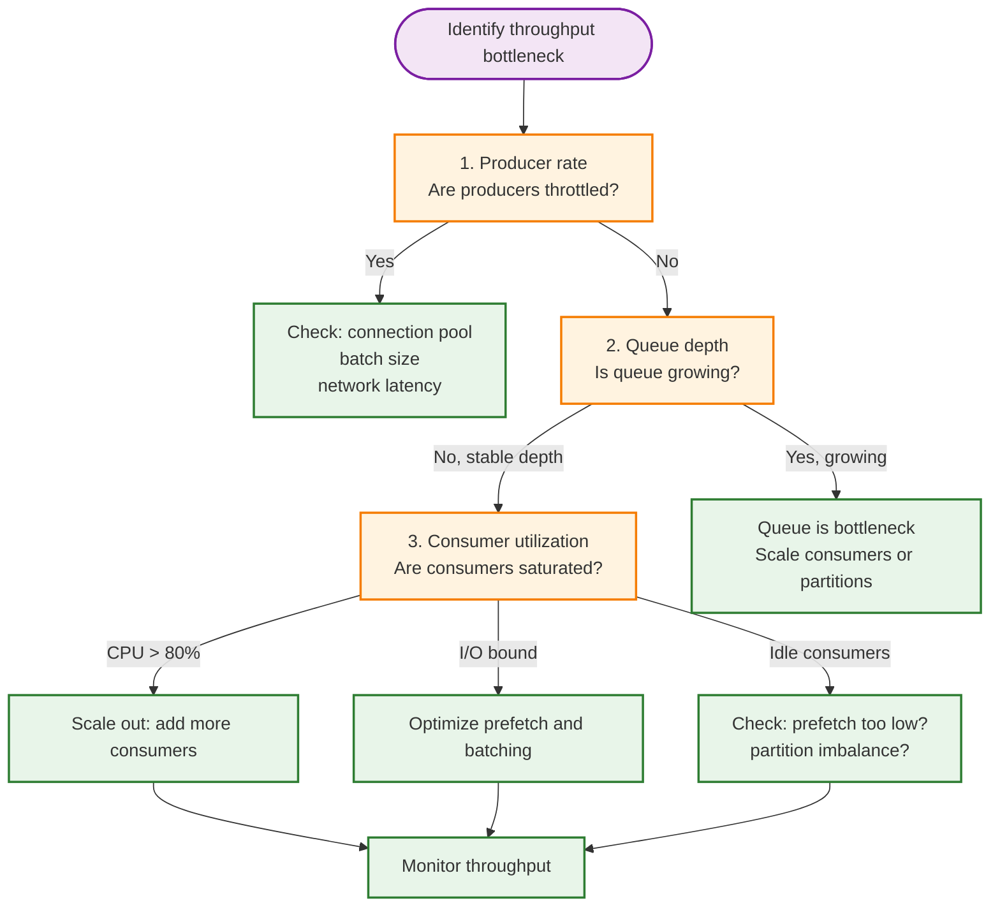
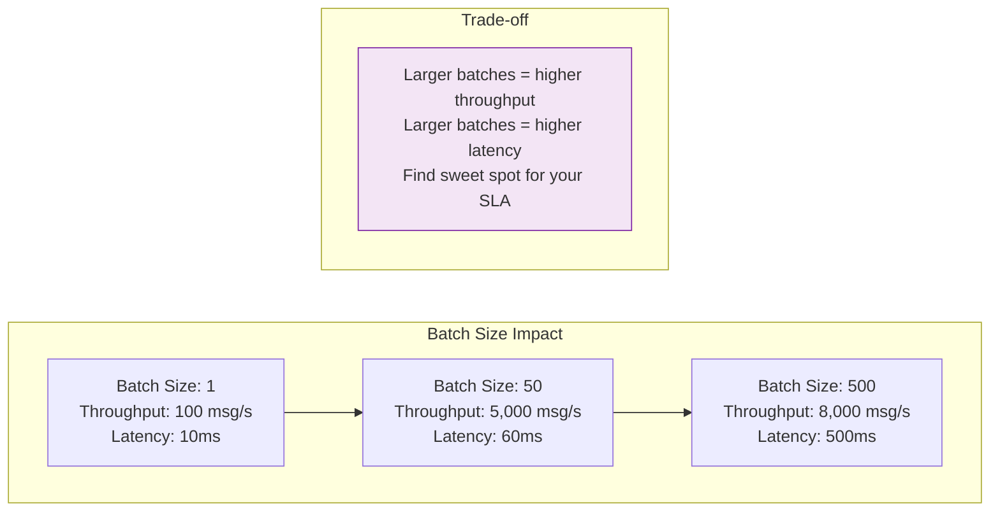
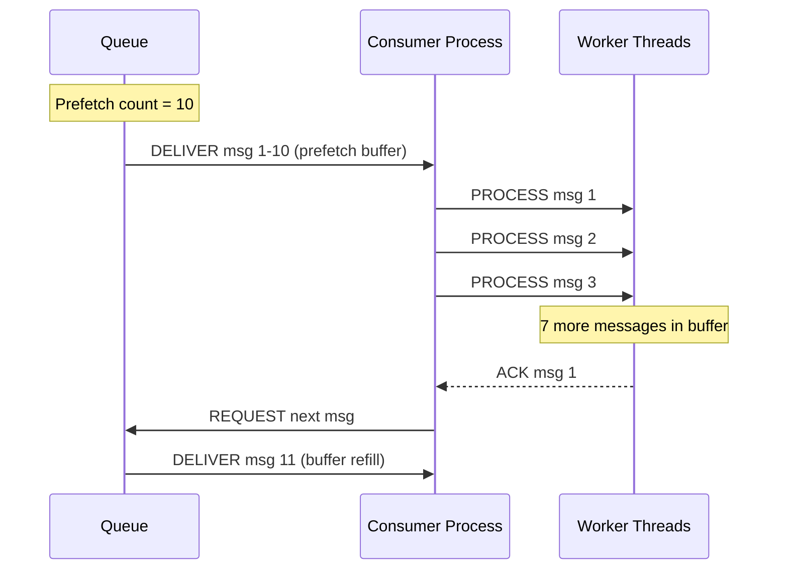
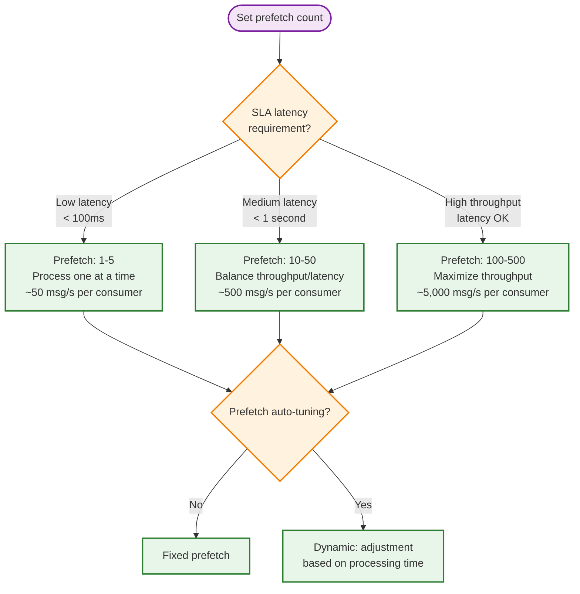

# Throughput Optimization

> **Navigation:** [Queue Patterns Index](index.md) | [Message Ordering Guarantees](message-ordering-guarantees.md) | [Dead-Letter Handling](dead-letter-handling.md)
>
> **Decision Trees:** [Queue Solution Selector](../hub-taxonomy/queue-solution-selector.md)

---

## Overview

Queue throughput optimization balances message production rate, consumer processing capacity, and system resource utilization. This guide covers strategies for maximizing throughput within the DGLab Hub queue infrastructure.

**Primary Blueprint:** [HUB-10: Sovereign Queue](../../blueprints/Hub/HUB-10.md)

---

## Throughput Bottleneck Analysis



---

## Batch Consumption

### Why Batching Matters

Processing messages individually incurs overhead on every message:

| Overhead Source | Per-Message | Per-Batch (100) | Savings |
|----------------|-------------|-----------------|---------|
| Redis roundtrip | ~1ms | ~1ms | 99% |
| DB transaction start | ~2ms | ~2ms | 99% |
| ACK/nack | ~0.5ms | ~1ms (batch ACK) | 80% |
| Serialization overhead | ~0.1ms | ~0.1ms | 0% |
| Business logic | ~10ms | ~10ms × 100 | 0% (but parallel) |

### Batch Consumer Implementation

```php
<?php
namespace Sovereign\Hub\Queue\Optimization;

class BatchConsumer
{
    public function __construct(
        private QueueDriverInterface $queue,
        private MessageProcessor $processor,
        private int $batchSize = 50,
        private int $batchTimeout = 2, // seconds
        private int $flushInterval = 10000 // ms for max wait
    ) {}

    /**
     * Consume messages in batches.
     * Collects up to batchSize messages or waits batchTimeout, whichever comes first.
     */
    public function consumeBatch(): BatchResult
    {
        $messages = [];
        $startTime = microtime(true);

        // Collect batch
        while (count($messages) < $this->batchSize) {
            $msg = $this->queue->receive();
            if ($msg === null) {
                // No messages available — wait briefly
                usleep(100_000); // 100ms
            } else {
                $messages[] = $msg;
            }

            // Timeout reached — process partial batch
            if ((microtime(true) - $startTime) >= $this->batchTimeout) {
                break;
            }
        }

        if (empty($messages)) {
            return new BatchResult(0, 0, 0.0);
        }

        // Process as batch (single DB transaction, single ACK)
        $result = $this->processor->processBatch($messages);
        $this->queue->batchAcknowledge($messages);

        return new BatchResult(
            processed: count($messages),
            succeeded: $result->successCount,
            elapsed: microtime(true) - $startTime
        );
    }
}
```

### Batch Size Tuning



### Dynamic Batch Sizing

```php
/**
 * Adjust batch size dynamically based on queue depth.
 *
 * - Deep queue (>1000): Large batches (high throughput)
 * - Shallow queue (<100): Small batches (low latency)
 */
public function computeBatchSize(int $queueDepth, int $minBatch = 10, int $maxBatch = 500): int
{
    if ($queueDepth > 10_000) {
        return $maxBatch; // Drain mode
    }
    if ($queueDepth > 1_000) {
        return min($maxBatch, $queueDepth / 10);
    }
    return $minBatch;
}
```

---

## Prefetch Sizing

### How Prefetch Works

The **prefetch count** determines how many messages are buffered at the consumer before processing. Too few → idle consumers. Too many → wasted work if processing fails.



### Prefetch Sizing Decision Tree



### Consumer-Level vs. Channel-Level

```php
<?php
namespace Sovereign\Hub\Queue\Optimization;

class PrefetchManager
{
    /**
     * Calculate optimal prefetch count based on processing metrics.
     *
     * @param float $avgProcessingTime Average message processing time in seconds
     * @param int $targetConcurrency Desired concurrent messages in flight
     * @return int Recommended prefetch count
     */
    public function optimalPrefetch(float $avgProcessingTime, int $targetConcurrency = 10): int
    {
        // prefetch = target_concurrency / (avg_processing_time × consumer_count)
        // Aim for 1 second of work buffered per consumer
        return max(1, (int) ($targetConcurrency / max($avgProcessingTime, 0.001)));
    }

    /**
     * Adjust prefetch dynamically based on processing time trends.
     */
    public function dynamicAdjustment(float $currentAvg, float $previousAvg, int $currentPrefetch): int
    {
        $ratio = $currentAvg / max($previousAvg, 0.001);

        if ($ratio > 1.5) {
            // Processing slowed down — reduce prefetch
            return max(1, (int) ($currentPrefetch * 0.75));
        }
        if ($ratio < 0.5) {
            // Processing faster — increase prefetch
            return min(500, (int) ($currentPrefetch * 1.5));
        }

        return $currentPrefetch;
    }
}
```

---

## Parallel Processing Strategies

### Worker Pool Pattern

```php
<?php
namespace Sovereign\Hub\Queue\Optimization;

class WorkerPool
{
    private array $workers = [];
    private \Swoole\Coroutine\Channel $channel;

    /**
     * @param int $workerCount Number of concurrent workers
     * @param int $queueCapacity Max items in internal channel
     */
    public function __construct(
        private int $workerCount = 10,
        int $queueCapacity = 100
    ) {
        $this->channel = new \Swoole\Coroutine\Channel($queueCapacity);
        $this->startWorkers();
    }

    private function startWorkers(): void
    {
        for ($i = 0; $i < $this->workerCount; $i++) {
            go(function () {
                $worker = new Worker("worker-{$i}");
                while (true) {
                    $message = $this->channel->pop();
                    if ($message === null) {
                        break; // Channel closed
                    }
                    $worker->process($message);
                }
            });
        }
    }

    public function submit(Message $message): void
    {
        $this->channel->push($message);
    }

    public function shutdown(): void
    {
        $this->channel->close();
    }
}
```

### Concurrency Limits

| Resource | Limit | Sign of Saturation | Action |
|----------|-------|-------------------|--------|
| CPU | 80% utilization | Worker processing time increases | Scale out horizontally |
| Memory | 80% of heap | GC pressure, OOM risk | Reduce prefetch, batch size |
| Database connections | Pool exhaustion (100%) | Connection timeouts | Increase pool or reduce workers |
| I/O wait | >50ms avg | Network saturation | Rate-limit, backpressure |
| Lock contention | >10% wait | Mutex spinning | Shard by partition key |

### Backpressure Signals

```php
<?php
namespace Sovereign\Hub\Queue\Optimization;

class BackpressureController
{
    private float $backpressureLevel = 0.0;

    /**
     * Calculate current backpressure level based on system metrics.
     *
     * @param int $queueDepth Current queue depth
     * @param int $maxDepth Maximum allowed depth
     * @param float $consumerUtilization 0.0 - 1.0
     * @return float 0.0 (no pressure) to 1.0 (critical)
     */
    public function calculatePressure(
        int $queueDepth,
        int $maxDepth,
        float $consumerUtilization
    ): float {
        $depthPressure = min(1.0, $queueDepth / $maxDepth);
        $utilPressure = $consumerUtilization;

        $this->backpressureLevel = max($depthPressure, $utilPressure);
        return $this->backpressureLevel;
    }

    /**
     * Apply backpressure: throttle producer or consumer.
     */
    public function apply(): void
    {
        if ($this->backpressureLevel > 0.9) {
            // Critical: pause consumption
            $this->pauseConsumers();
        } elseif ($this->backpressureLevel > 0.7) {
            // Warning: reduce prefetch
            $this->reducePrefetch();
        } elseif ($this->backpressureLevel > 0.5) {
            // Mild: reduce batch size
            $this->reduceBatchSize();
        }
        // < 0.5: Normal operation
    }

    private function pauseConsumers(): void { /* signal consumer pause */ }
    private function reducePrefetch(): void { /* cut prefetch by 50% */ }
    private function reduceBatchSize(): void { /* reduce batch to 10 */ }
}
```

---

## Driver Performance Comparison

| Driver | Max Throughput | Latency P50 | Latency P99 | Best For |
|--------|---------------|-------------|-------------|----------|
| **Redis (in-memory)** | ~50,000 msg/s | ~1ms | ~5ms | High-throughput, loss-tolerant |
| **Redis (persistent)** | ~10,000 msg/s | ~5ms | ~20ms | Durable, moderate throughput |
| **Database (MySQL)** | ~2,000 msg/s | ~10ms | ~50ms | Exactly-once, transactional |
| **Database (PostgreSQL)** | ~3,000 msg/s | ~8ms | ~40ms | Exactly-once, advanced queries |

### Multi-Driver Strategy

```php
<?php
namespace Sovereign\Hub\Queue\Optimization;

class MultiDriverQueue
{
    /**
     * Route messages to the optimal driver based on characteristics.
     *
     * Critical messages → Database (exactly-once)
     * High-volume → Redis (throughput)
     * Bulk → File (deferred processing)
     */
    public function route(array $message): string
    {
        if ($message['headers']['delivery_guarantee'] === 'exactly-once') {
            return 'database';
        }
        if ($message['headers']['priority'] === 'bulk') {
            return 'file';
        }
        return 'redis'; // Default
    }
}
```

---

## Optimization Quick Reference

### Tuning Parameters

| Parameter | Default | Min | Max | Effect |
|-----------|---------|-----|-----|--------|
| `batch_size` | 50 | 1 | 500 | Higher = more throughput, higher latency |
| `prefetch_count` | 10 | 1 | 500 | Higher = less idle, more wasted on failure |
| `worker_count` | CPU cores × 2 | 1 | 100 | Higher = more parallelism, more contention |
| `visibility_timeout` | 30s | 1s | 600s | Higher = fewer retries, slower failure detection |
| `poll_interval_ms` | 100ms | 10ms | 5000ms | Lower = snappier, higher CPU |

### Bottleneck Resolution

| Symptom | Likely Cause | Resolution |
|---------|-------------|------------|
| Queue depth growing while consumers idle | Prefetch too low | Increase prefetch_count |
| Consumers at 100% CPU but low throughput | Batch size too low | Increase batch_size |
| High message latency | Visibility timeout too large | Decrease visibility_timeout |
| Uneven partition load | Bad partition key | Use more granular keys |
| Frequent consumer rebalances | Workers dying | Increase heartbeat timeout |

---

## Related Blueprints

| Blueprint | Role in Throughput |
|-----------|-------------------|
| [HUB-10](../../blueprints/Hub/HUB-10.md) | Queue driver with batching and prefetch config |
| [HUB-09](../../blueprints/Hub/HUB-09.md) | Event Bus — throughput considerations for pub/sub |
| [HUB-07](../../blueprints/Hub/HUB-07.md) | Rate limiting to prevent consumer overload |
| [CORE-03](../../blueprints/Core/CORE-03.md) | Event dispatcher foundations |