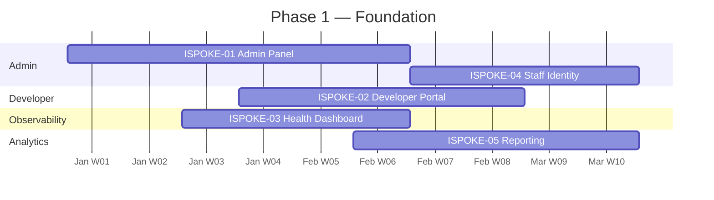
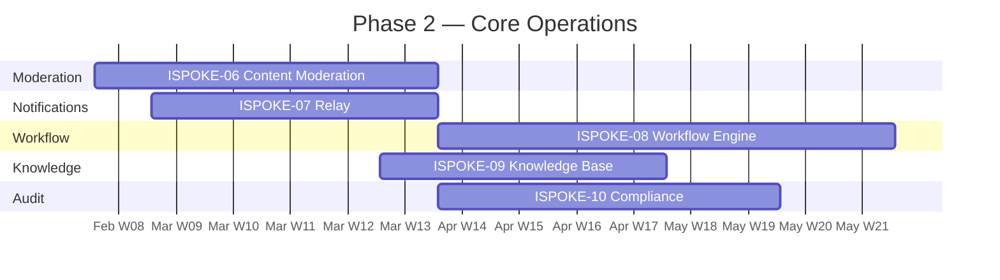
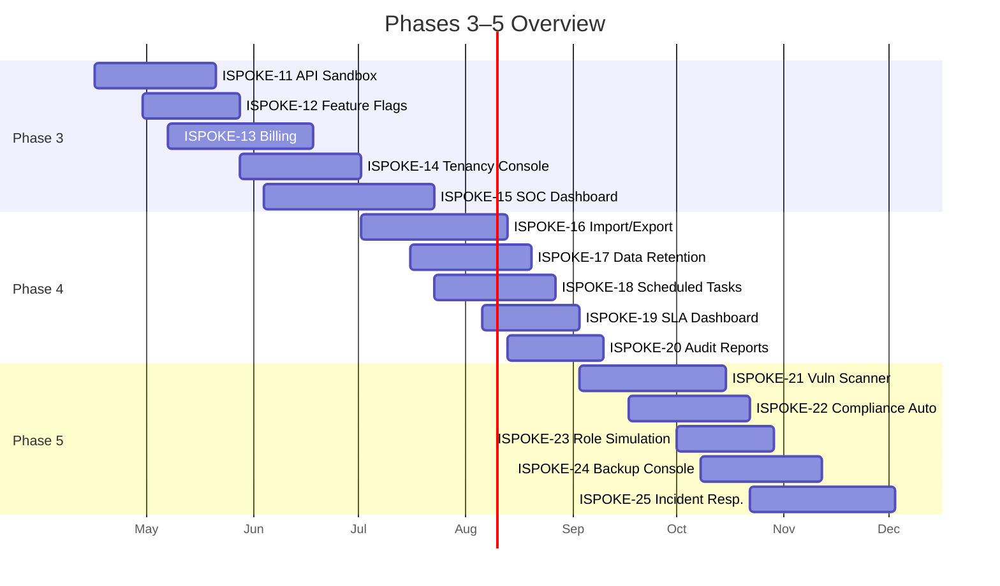
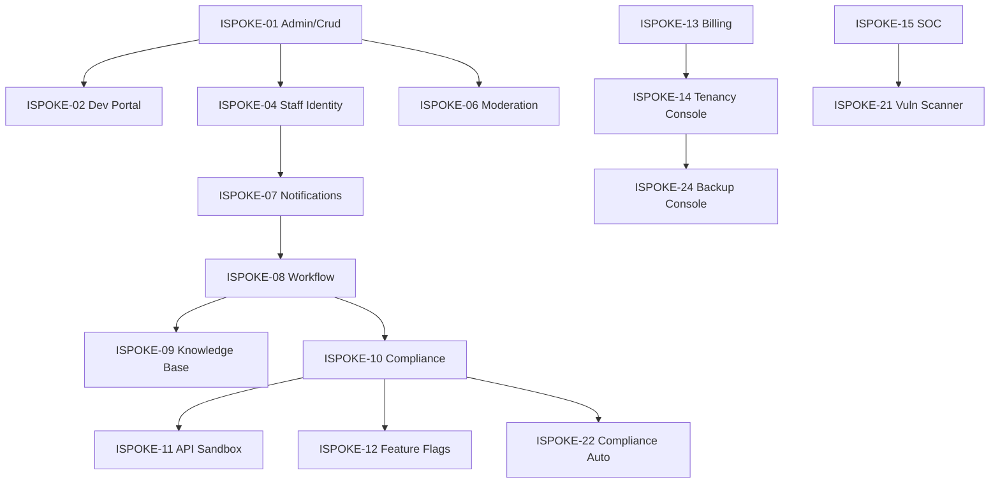

# Internal Spokes Implementation Timeline

> **Navigation:** [Spoke Documentation Template](../internal-spokes/spoke-documentation-template.md) | [Placeholder Blueprints](../internal-spokes/placeholder-blueprints.md)
>
> **Status:** 🟢 Active — Quarterly Review Cycle

---

## Executive Summary

The Internal Spokes tier consists of **25 planned spokes** (15 approved + 10 in roadmap). This document provides the phased implementation timeline, dependency chains, resource allocation guidance, and risk factors for completing all 25 spokes.

**Tier Score:** 84/100 | **Target:** 90/100

---

## Implementation Phases

### Phase 1 — Foundation (Weeks 1–8)

**Theme:** Establish administrative core — identity, configuration, and basic management.

| Spoke | Component | Dependencies | Est. Effort | Timeline |
|-------|-----------|--------------|-------------|----------|
| **ISPOKE-01** | Admin Panel & CRUD Engine | HUB-04, HUB-05, HUB-21, HUB-26 | 6 weeks | Weeks 1–6 |
| **ISPOKE-02** | Developer Portal & Docs Hub | HUB-11, HUB-14, HUB-24 | 5 weeks | Weeks 4–8 |
| **ISPOKE-03** | System Health & Observability | HUB-15, HUB-06, HUB-09 | 4 weeks | Weeks 3–6 |
| **ISPOKE-04** | Staff Identity & Onboarding | HUB-04, HUB-05, HUB-20 | 5 weeks | Weeks 5–9 |
| **ISPOKE-05** | Reporting & Analytics | HUB-28, HUB-24, HUB-26 | 5 weeks | Weeks 6–10 |

**Phase 1 Milestone:** All foundation spokes reach Level 3 (Implementation) documentation.

---

### Phase 2 — Core Operations (Weeks 9–18)

**Theme:** Operational capabilities — moderation, notifications, workflow automation.

| Spoke | Component | Dependencies | Est. Effort | Timeline |
|-------|-----------|--------------|-------------|----------|
| **ISPOKE-06** | Content Moderation | HUB-04, HUB-05, HUB-24 | 6 weeks | Weeks 8–13 |
| **ISPOKE-07** | Notification & Messaging | HUB-10, HUB-12, HUB-01 | 5 weeks | Weeks 9–13 |
| **ISPOKE-08** | Workflow Engine | ISPOKE-07, HUB-05, HUB-10 | 8 weeks | Weeks 10–17 |
| **ISPOKE-09** | Knowledge Base & Wiki | HUB-13, HUB-14, HUB-06 | 5 weeks | Weeks 13–17 |
| **ISPOKE-10** | Audit & Compliance Portal | HUB-06, HUB-28, ISPOKE-08 | 6 weeks | Weeks 14–19 |

**Phase 2 Milestone:** Core operations spokes reach Level 4 (Operations) documentation.

---

### Phase 3 — Collaboration & Integration (Weeks 16–26)

**Theme:** Developer tooling, testing, feature management, and billing.

| Spoke | Component | Dependencies | Est. Effort | Timeline |
|-------|-----------|--------------|-------------|----------|
| **ISPOKE-11** | API Sandbox | HUB-08, HUB-24, ISPOKE-10 | 5 weeks | Weeks 16–20 |
| **ISPOKE-12** | Feature Flag Control | HUB-01, HUB-06, HUB-28 | 4 weeks | Weeks 18–21 |
| **ISPOKE-13** | Billing & Subscriptions | HUB-21, HUB-17, HUB-06 | 6 weeks | Weeks 19–24 |
| **ISPOKE-14** | Multi-tenancy Console | HUB-21, HUB-01, ISPOKE-13 | 5 weeks | Weeks 22–26 |
| **ISPOKE-15** | Security/SOC Dashboard | HUB-06, HUB-04, HUB-28 | 7 weeks | Weeks 23–29 |

**Phase 3 Milestone:** All 15 approved spokes reach Level 3+ documentation maturity.

---

### Phase 4 — Advanced Capabilities (Weeks 27–40)

**Theme:** Additional planned spokes for advanced functionality (placeholder — see [`placeholder-blueprints.md`](../internal-spokes/placeholder-blueprints.md)).

| Spoke | Component | Dependencies | Est. Effort | Timeline |
|-------|-----------|--------------|-------------|----------|
| **ISPOKE-16** | Advanced Import/Export | ISPOKE-01, HUB-10 | 6 weeks | Weeks 27–32 |
| **ISPOKE-17** | Data Retention Manager | ISPOKE-10, HUB-28 | 5 weeks | Weeks 29–33 |
| **ISPOKE-18** | Scheduled Task Manager | ISPOKE-08, HUB-10 | 5 weeks | Weeks 30–34 |
| **ISPOKE-19** | SLA & Uptime Dashboard | ISPOKE-03, HUB-15 | 4 weeks | Weeks 32–35 |
| **ISPOKE-20** | Audit Report Builder | ISPOKE-10, HUB-28 | 4 weeks | Weeks 33–36 |

**Phase 4 Milestone:** Placeholder spokes reach Level 1 documentation maturity with resource estimates.

---

### Phase 5 — Security & Compliance (Weeks 36–52)

**Theme:** Deepening security posture and compliance automation.

| Spoke | Component | Dependencies | Est. Effort | Timeline |
|-------|-----------|--------------|-------------|----------|
| **ISPOKE-21** | Vulnerability Scanner | ISPOKE-15, HUB-04 | 6 weeks | Weeks 36–41 |
| **ISPOKE-22** | Compliance Auto-Reporting | ISPOKE-10, HUB-28 | 5 weeks | Weeks 38–42 |
| **ISPOKE-23** | Role Simulation Lab | ISPOKE-04, HUB-05 | 4 weeks | Weeks 40–43 |
| **ISPOKE-24** | Backup Admin Console | ISPOKE-14, HUB-03 | 5 weeks | Weeks 41–45 |
| **ISPOKE-25** | Incident Response Console | ISPOKE-15, ISPOKE-07 | 6 weeks | Weeks 43–48 |

**Phase 5 Milestone:** All 25 spokes documented. Full tier documentation maturity target: 90/100.

---

## Dependency Map

### Inter-Spoke Dependencies

### Hub-to-Spoke Dependency Heat Map

| Hub Blueprint | Affected Spokes | Criticality |
|---------------|-----------------|-------------|
| HUB-04 (Identity) | ISPOKE-01, -04, -06, -15, -21 | Critical |
| HUB-05 (RBAC) | ISPOKE-01, -04, -06, -08, -23 | Critical |
| HUB-06 (Audit) | ISPOKE-03, -09, -10, -12, -13, -15, -17, -20, -22 | Critical |
| HUB-26 (UI Library) | ISPOKE-01, -02, -05, -06, -09, -11, -12, -13, -14 | High |
| HUB-28 (Analytics) | ISPOKE-05, -10, -15, -17, -20, -22 | High |
| HUB-10 (Queue) | ISPOKE-07, -08, -16, -18 | Medium |
| HUB-15 (Health) | ISPOKE-03, -19 | Medium |
| HUB-21 (Tenancy) | ISPOKE-01, -13, -14, -24 | High |

---

## Resource Allocation

### Team Sizing by Phase

| Phase | Spokes in Progress | Recommended Team | Key Specialties |
|-------|-------------------|-----------------|-----------------|
| Phase 1 | 3–4 concurrent | 4–5 engineers | UI/UX, CRUD, Identity |
| Phase 2 | 2–3 concurrent | 4–6 engineers | Workflow, Audit, Notifications |
| Phase 3 | 2–3 concurrent | 3–5 engineers | Billing, Dev Tools, Feature Mgmt |
| Phase 4 | 2 concurrent | 3–4 engineers | Data, Scheduling |
| Phase 5 | 2 concurrent | 4–5 engineers | Security, Compliance |

### Effort Estimation Approach

- **Small spokes** (ISPOKE-03, -12, -19): 3–4 weeks, 1–2 engineers
- **Medium spokes** (ISPOKE-02, -04, -07, -09, -11, -17, -18, -20, -23, -24): 4–5 weeks, 2–3 engineers
- **Large spokes** (ISPOKE-01, -05, -06, -08, -10, -13, -14, -15, -16, -21, -22, -25): 6–8 weeks, 3–4 engineers

---

## Risk Factors & Mitigations

| Risk | Probability | Impact | Mitigation |
|------|------------|--------|------------|
| Hub dependency delays | Medium | High | Phase spokes to align with Hub readiness; identify Hub-independent sub-components |
| Resource contention (multiple spokes needing HUB-26) | High | Medium | Establish UI component pipeline with lead time commitments |
| CRUD engine over-generalization (ISPOKE-01) | Medium | High | Enforce specialization hooks per [CRUD Specialization Guide](../internal-spokes/crud-specialization.md) |
| Workflow engine complexity (ISPOKE-08) | High | High | Begin with sequential state machines; add parallel branches in iteration 2 |
| Spoke documentation lag behind implementation | Medium | Medium | Mandate Level 1 documentation before any implementation starts |
| Security spoke (ISPOKE-15) dependency on mature audit | Medium | Medium | Allow prototype-level audit in Phase 2; harden in Phase 3 |

---

## Timeline Buffer Allocation

| Phase | Estimated Duration | Buffer | Total |
|-------|-------------------|--------|-------|
| Phase 1 | 8 weeks | 2 weeks | 10 weeks |
| Phase 2 | 10 weeks | 2 weeks | 12 weeks |
| Phase 3 | 10 weeks | 3 weeks | 13 weeks |
| Phase 4 | 14 weeks | 3 weeks | 17 weeks |
| Phase 5 | 16 weeks | 4 weeks | 20 weeks |
| **Total** | **58 weeks** | **14 weeks** | **72 weeks** |

Buffer allocation: 20% of total timeline, weighted toward later phases where uncertainty is higher.

---

## Documentation Maturity Target

| Phase End | Target Level | Coverage |
|-----------|-------------|----------|
| Phase 1 | Level 3 (Implementation) | ISPOKE-01 through -05 |
| Phase 2 | Level 4 (Operations) | ISPOKE-06 through -10 |
| Phase 3 | Level 3+ | ISPOKE-11 through -15 |
| Phase 4 | Level 1 (Concept) | ISPOKE-16 through -20 |
| Phase 5 | Level 1+ | ISPOKE-21 through -25 |

---

## Review & Adjustment Cycle

- **Monthly:** Phase progress review against timeline
- **Quarterly:** Dependency map validation and risk reassessment
- **Per-Phase Gate:** Milestone review before advancing to next phase
- **Weekly during spikes:** Stand-up tracking against estimated completion dates

Alignment with [`EVALUATION_SUMMARY.md`](../../EVALUATION_SUMMARY.md) and [`BLUEPRINT_RANKINGS.md`](../../BLUEPRINT_RANKINGS.md) — quarterly.

---

> **Document Version:** 1.0
> **Last Updated:** Current Session
> **Status:** 🟢 Active
> **Review Cycle:** Quarterly