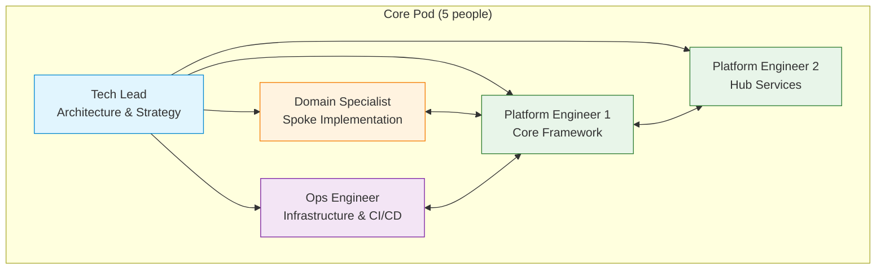
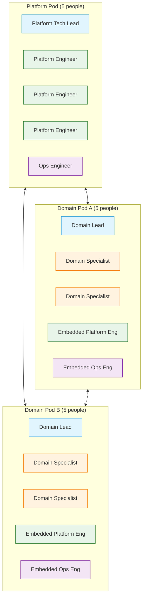
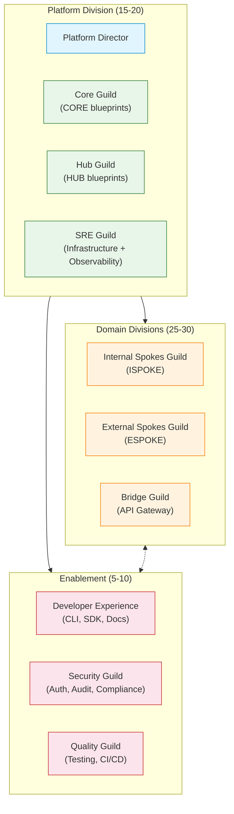
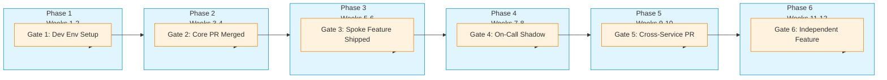

# Team Scaling Guide

> **Navigation:** [Operations Home](operations/index.md) | [Hub Scale Guide](operations/hub-scale-guide.md) | [Observability Framework](operations/observability-framework.md)
>
> **Cross-Reference:** [SOLUTIONS_TO_WEAKNESSES.md — Weakness 1 (Strategic)](evaluation/SOLUTIONS_TO_WEAKNESSES.md#weakness-1-team-scaling-challenges-not-thoroughly-addressed)
>
> **Related:** [Team Training Module (Tenancy)](tenancy/team-training.md) | [ADR Template](architecture/decisions/ADR-TEMPLATE.md)
>
> **Status:** ✅ Design Complete

---

## Overview

This guide addresses **Strategic Weakness 1: Team Scaling Challenges** — the gap between DGLab's current team structure and the needs of supporting 81+ services across 15+ spokes. It provides team structure models for three growth stages, competency mappings for key roles, a 12-week onboarding curriculum, and knowledge management processes to prevent critical single points of knowledge.

**Primary Driver:** [Strategic Weakness 1](../../evaluation/SOLUTIONS_TO_WEAKNESSES.md#weakness-1-team-scaling-challenges-not-thoroughly-addressed)

**Success Target:** New team members independently implementing features within **8 weeks**.

---

## 1. Team Structure Models

As DGLab scales from a small core team to supporting 81+ services, team structures must evolve. Below are three organizational models calibrated to different team sizes.

### 1.1 Team of 5: The Core Pod



| Role | Count | Ownership | On-Call |
|------|-------|-----------|---------|
| Tech Lead | 1 | Architecture, design decisions, mentoring | Occasionally |
| Platform Engineer | 2 | Core framework (CORE-01–20), Hub services | Primary rotation |
| Domain Specialist | 1 | First spoke implementation, business logic | Secondary |
| Ops Engineer | 1 | Infrastructure, CI/CD, monitoring | Primary rotation |

**Best for:** 0–5 services, initial platform development, first external integration.

**Key behaviors:**
- Single team owns all code; no cross-team dependencies
- Pair programming for complex features
- Tech Lead reviews all architectural decisions via ADRs

---

### 1.2 Team of 15: Domain Pods



| Pod | Headcount | Ownership | Dependencies |
|-----|-----------|-----------|--------------|
| Platform | 5 | Core framework, Hub services, shared infrastructure | None (foundation) |
| Domain A | 5 | Internal Spokes (ISPOKE-01–07) | Platform Pod |
| Domain B | 5 | External Spokes / Bridge (ESPOKE-01–15) | Platform Pod |

**Best for:** 11–25 services, multiple spoke domains, dedicated platform team.

**Key behaviors:**
- Platform Pod publishes APIs and contracts; Domain Pods consume them
- Weekly sync between Platform Tech Lead and Domain Leads
- Embedded engineers rotate every 3 months to prevent knowledge silos
- ADRs reviewed by all leads before acceptance

---

### 1.3 Team of 50+: Guilds & Platforms



| Division | Headcount | Guilds | Focus |
|----------|-----------|--------|-------|
| Platform | 15–20 | Core, Hub, SRE | Framework, infrastructure, reliability |
| Domains | 25–30 | Internal Spokes, External Spokes, Bridge | Business logic, integrations |
| Enablement | 5–10 | DevEx, Security, Quality | Tooling, governance, testing |

**Best for:** 30+ services, multi-team org, 24/7 operations, formal SRE rotation.

**Key behaviors:**
- Guilds have a Staff+ Engineer as technical authority
- Cross-guild Architecture Review Board meets bi-weekly
- Platform Division publishes internal SLAs consumed by Domain Divisions
- Rotational program: engineers spend 6 months in a different guild every 18 months

---

### 1.4 Growth Transition Triggers

| Current State | Trigger | Target State | Preparation |
|---------------|---------|--------------|-------------|
| Core Pod (5) | >5 services OR 2+ spokes | Domain Pods (15) | Document APIs, create onboarding curriculum, hire Tech Leads |
| Domain Pods (15) | >25 services OR 24/7 SLA | Guilds (50+) | Formalize SRE rotation, establish Architecture Review Board, build observability stack |
| Guilds (50+) | >60 services OR multi-region | Multi-Region Guilds | Regional pod replication, global load balancing, compliance across jurisdictions |

---

## 2. Competency Mapping

### 2.1 Platform Engineer

Platform Engineers own the core framework ([CORE-01–20](../../blueprints/Core/)) and Hub services ([HUB-01–30](../../blueprints/Hub/)). They ensure the platform is stable, performant, and extensible.

| Competency | Junior (L3) | Mid (L4) | Senior (L5) | Staff (L6) |
|-------------|-------------|----------|-------------|-------------|
| **Core Framework** | Can implement a CORE blueprint with guidance | Independently implements CORE blueprints | Designs new CORE extensions | Architects cross-blueprint patterns |
| **Hub Services** | Understands 10+ Hub blueprints | Operates 20+ Hub services | Tunes Hub service performance | Defines Hub service lifecycle |
| **PHP / SuperPHP** | Writes framework-compliant code | Debugs framework internals | Optimizes framework performance | Extends SuperPHP compiler |
| **DI Container** | Uses container for dependency injection | Configures container bindings | Designs container extensions | Architects container strategy |
| **Event System** | Consumes events | Publishes events | Designs event flows | Architects event-driven patterns |
| **Testing** | Writes unit tests | Writes integration tests | Designs test fixtures | Defines testing strategy |
| **Performance** | Measures with provided tools | Identifies bottlenecks | Optimizes critical paths | Defines SLOs and budgets |

**Certification Path:** Platform Engineer I (L3) → Platform Engineer II (L4) → Senior Platform Engineer (L5) → Staff Platform Engineer (L6)

---

### 2.2 Domain Specialist

Domain Specialists own spoke implementations — internal business logic ([ISPOKE-01–15](../../blueprints/Spoke/Internal/)) and external integrations ([ESPOKE-01–15](../../blueprints/Spoke/External/)).

| Competency | Junior (L3) | Mid (L4) | Senior (L5) | Staff (L6) |
|-------------|-------------|----------|-------------|-------------|
| **Spoke Architecture** | Implements one spoke blueprint | Owns 2–3 spokes end-to-end | Designs new spokes | Architects spoke ecosystem |
| **Domain Modeling** | Follows domain model patterns | Designs domain models | Validates domain boundaries | Defines domain-driven strategy |
| **CRUD Engine** | Uses CRUD for standard operations | Customizes CRUD via hooks | Designs CRUD specializations | Evaluates CRUD vs CQRS trade-offs |
| **Validation** | Implements field-level validation | Builds cross-field validation | Designs validation pipelines | Architects validation strategy |
| **API Design** | Follows existing API contracts | Designs new API endpoints | Reviews API for consistency | Defines API versioning strategy |
| **Integration** | Consumes external APIs | Builds external integrations | Designs adapter patterns | Architects integration ecosystem |
| **Business Logic** | Implements defined rules | Translates requirements to code | Validates rules with stakeholders | Defines domain strategy |

**Certification Path:** Domain Specialist I (L3) → Domain Specialist II (L4) → Senior Domain Specialist (L5) → Staff Domain Specialist (L6)

---

### 2.3 Ops Engineer / SRE

Ops Engineers and SREs own infrastructure reliability, observability, incident response, and operational automation across all 81+ services.

| Competency | Junior (L3) | Mid (L4) | Senior (L5) | Staff (L6) |
|-------------|-------------|----------|-------------|-------------|
| **Monitoring** | Uses existing dashboards | Creates dashboards | Designs monitoring strategy | Architects observability stack |
| **Incident Response** | Follows runbooks | Leads SEV3/SEV4 incidents | Leads SEV1/SEV2 incidents | Designs incident response process |
| **Infrastructure as Code** | Deploys via existing pipelines | Writes Terraform/Ansible | Designs infrastructure modules | Architects deployment strategy |
| **Container Orchestration** | Deploys containers | Manages K8s clusters | Tunes cluster performance | Architects multi-cluster strategy |
| **CI/CD** | Triggers pipeline runs | Configures pipeline stages | Designs pipeline optimization | Architects CI/CD strategy |
| **Chaos Engineering** | Participates in exercises | Designs failure scenarios | Leads game days | Architects chaos program |
| **Capacity Planning** | Measures current usage | Forecasts growth trends | Designs scaling policies | Defines capacity strategy |

**Certification Path:** Ops Engineer I (L3) → Ops Engineer II (L4) → Senior SRE (L5) → Staff SRE (L6)

---

### 2.4 Role Transition Paths

```mermaid
flowchart LR
    subgraph Entry["Entry Points"]
        A[Junior Engineer<br/>Any discipline]
    end

    subgraph Growth["Growth Tracks"]
        B[Platform Engineer]
        C[Domain Specialist]
        D[Ops Engineer / SRE]
    end

    subgraph Senior["Senior Tracks"]
        E[Staff Platform Engineer]
        F[Staff Domain Specialist]
        G[Staff SRE]
    end

    subgraph Leadership["Leadership"]
        H[Architect<br/>(Cross-Discipline)]
        I[Engineering Manager<br/>(People Leadership)]
    end

    A --> B
    A --> C
    A --> D

    B --> E
    C --> F
    D --> G

    E --> H
    F --> H
    G --> H

    E --> I
    F --> I
    G --> I

    classDef entry fill:#e8f5e9,stroke:#2e7d32
    classDef plat fill:#e1f5fe,stroke:#0288d1
    classDef domain fill:#fff3e0,stroke:#f57c00
    classDef ops fill:#f3e5f5,stroke:#7b1fa2
    classDef lead fill:#ffebee,stroke:#c62828

    class A entry
    class B,C,D growth
    class E,F,G senior
    class H,I lead
```

**Key principles:**
- Engineers are not locked into tracks; rotations encouraged every 12–18 months
- Staff+ roles are individual contributor (IC) tracks, not management
- The Architect role is cross-discipline, requiring exposure to platform, domain, and operations
- Engineering Managers are expected to have previously operated at Senior level in at least one discipline

---

## 3. 12-Week Onboarding Curriculum

The onboarding curriculum is structured in **6 phases**, each building on the previous. Progression gates validate skills before advancing.

### 3.1 Phase Overview

| Phase | Weeks | Theme | Outcome |
|-------|-------|-------|---------|
| 1 | 1–2 | DGLab Foundations | Understand architecture, tooling, and development workflow |
| 2 | 3–4 | Core Framework | Implement a CORE blueprint with mentorship |
| 3 | 5–6 | Domain Specialization | Own a spoke feature end-to-end |
| 4 | 7–8 | Operations & Observability | Handle on-call rotation with mentorship |
| 5 | 9–10 | Integration & Extensibility | Integrate across 2+ services |
| 6 | 11–12 | Independent Contribution | Deliver a feature independently |



---

### 3.2 Phase 1: DGLab Foundations (Weeks 1–2)

| Week | Topics | Activities | Artifacts |
|------|--------|------------|-----------|
| **1** | System architecture overview, Hub & Spoke model, blueprint taxonomy, development environment setup | Read [CORE_FRAMEWORK.md](../../architecture/origin/CORE_FRAMEWORK.md) and [HUB_AND_SPOKE.md](../../architecture/origin/HUB_AND_SPOKE.md); set up local dev environment | Working dev environment, first commit on a docs fix |
| **2** | DI container, plugin system, validation framework, event system | Complete [DI Container Setup](../docs/implementation-guides/di-container-setup.md) and [Plugin Registration](../docs/implementation-guides/plugin-registration.md) walkthroughs | Green test suite, ADR review of a minor decision |

**Checkpoint Gate 1: Development Environment Setup**
- [ ] Local dev environment running all required services (Docker Compose)
- [ ] Test suite passes with 0 failures
- [ ] Can explain Hub & Spoke architecture to a peer
- [ ] Has read 5 approved blueprints end-to-end

---

### 3.3 Phase 2: Core Framework (Weeks 3–4)

| Week | Topics | Activities | Artifacts |
|------|--------|------------|-----------|
| **3** | ADR process, design patterns catalog, extension points | Implement a simple CORE blueprint feature (e.g., add a validation rule); document with ADR template | ADR draft, feature branch with implementation |
| **4** | Service lifecycle, health checks, configuration management | Integrate a Hub service (e.g., HUB-15 Health) into a spoke; write integration tests | Merged PR with tests, updated documentation |

**Checkpoint Gate 2: Core PR Merged**
- [ ] Feature PR merged to `main` with tests and docs
- [ ] Understands and can apply 3+ design patterns from the catalog
- [ ] Can navigate the blueprint hierarchy without assistance
- [ ] Written and received at least one code review

---

### 3.4 Phase 3: Domain Specialization (Weeks 5–6)

| Week | Topics | Activities | Artifacts |
|------|--------|------------|-----------|
| **5** | Spoke architecture, CRUD engine, domain modeling | Implement a spoke feature (e.g., ISPOKE-XX entity with CRUD); add domain validation | Spoke feature deployed to staging |
| **6** | Event-driven patterns, queue consumption, caching | Add event publishing to the spoke feature; integrate with HUB-09 (Event Bus) and HUB-02 (Cache) | Event-driven integration tested and working |

**Checkpoint Gate 3: Spoke Feature Shipped**
- [ ] Feature deployed to staging environment
- [ ] Events published and consumed correctly
- [ ] Cache integration verified
- [ ] Can explain the spoke's domain model to non-technical stakeholders

---

### 3.5 Phase 4: Operations & Observability (Weeks 7–8)

| Week | Topics | Activities | Artifacts |
|------|--------|------------|-----------|
| **7** | Monitoring dashboards, log analysis, alert configuration | Shadow on-call rotation; respond to SEV3 incidents; update a runbook | Runbook update PR, incident log entries |
| **8** | Incident response, escalation, post-mortem process | Lead a SEV4 incident with supervision; draft a post-mortem for a simulated incident | Post-mortem document, incident timeline |

**Checkpoint Gate 4: On-Call Shadow**
- [ ] Shadowed 2+ on-call shifts
- [ ] Updated at least one runbook with new findings
- [ ] Can independently diagnose a service degradation using dashboards
- [ ] Understands SEV classification and escalation paths

**✳️ Week 8 = Productivity Target:** Engineer should be independently handling supervised feature work by this point. This aligns with the **8-week productivity target** from success metrics.

---

### 3.6 Phase 5: Integration & Extensibility (Weeks 9–10)

| Week | Topics | Activities | Artifacts |
|------|--------|------------|-----------|
| **9** | Cross-service integration, adapter patterns, API versioning | Integrate two spokes with each other via events; implement an adapter for an external system | Cross-service integration PR |
| **10** | Performance optimization, scalability patterns, capacity planning | Profile a service and identify a bottleneck; implement an optimization | Performance report, optimization PR |

**Checkpoint Gate 5: Cross-Service PR Merged**
- [ ] Cross-service integration PR merged to `main`
- [ ] Performance optimization implemented and measured (10%+ improvement)
- [ ] Can explain service dependencies and failure domains for owned services
- [ ] Has reviewed 3+ PRs from other team members

---

### 3.7 Phase 6: Independent Contribution (Weeks 11–12)

| Week | Topics | Activities | Artifacts |
|------|--------|------------|-----------|
| **11** | Full feature lifecycle (design → implement → test → deploy → monitor) | Design and implement a medium-complexity feature independently from ADR to deployment | Independent feature PR, monitoring dashboard |
| **12** | Mentorship preparation, knowledge sharing | Present a tech talk; review a junior engineer's onboarding progress | Tech talk slides, mentor feedback |

**Checkpoint Gate 6: Independent Feature Delivered**
- [ ] Feature designed, implemented, tested, deployed, and monitored independently
- [ ] Presented a technical topic to the team
- [ ] Can onboard the next new team member on owned service
- [ ] All runbooks for owned services are up to date

---

### 3.8 Skill Validation Gates Summary

| Gate | Week | Validation Method | Reviewer | Pass Criteria |
|------|------|-------------------|----------|---------------|
| G1 | 2 | Dev env checklist | Mentor | All checklist items verified |
| G2 | 4 | PR review + ADR review | Tech Lead | Feature merged, ADR accepted |
| G3 | 6 | Staging deployment | Domain Lead | Feature deployed, events verified |
| G4 | 8 | On-call shadow + runbook update | SRE Lead | Incidents handled, runbook updated |
| G5 | 10 | Cross-service PR review | Tech Lead | Integration merged, optimization measured |
| G6 | 12 | Independent feature review | Engineering Manager | Full lifecycle demonstrated |

---

## 4. Knowledge Management Processes

### 4.1 Incident Post-Mortems

Every incident (SEV1 and SEV2; optional for SEV3) requires a post-mortem written within **48 hours** of resolution.

**Process:**
1. **Timeline Reconstruction** — Gather all events, alerts, and actions in chronological order
2. **Root Cause Analysis** — Apply the **5 Whys** technique to identify systemic root causes
3. **Action Items** — Generate concrete, owner-assigned action items with deadlines
4. **Runbook Updates** — Update relevant runbooks with the new knowledge
5. **Blameless Review** — Review for systemic improvements, never individual blame

**Template:** Use the [Incident Post-Mortem Template](operations/incident-response.md#4-post-mortem-template) from the Incident Response Framework.

**Artifact Location:** `/docs/operations/post-mortems/YYYY-MM-DD-incident-summary.md`

---

### 4.2 Decision Recording (ADRs)

All significant architectural decisions must be documented using the [ADR Template](architecture/decisions/ADR-TEMPLATE.md).

**When to write an ADR:**
- Adding a new service or blueprint
- Changing an existing API contract
- Selecting a new technology or library
- Modifying deployment architecture
- Changing data flow or storage strategy

**Process:**
1. **Draft** — Author writes ADR using template
2. **Review** — Tech Lead (or Architecture Review Board for larger decisions) reviews
3. **Decide** — Decision recorded as Accepted, Rejected, or Deferred
4. **Publish** — ADR merged to `/docs/architecture/decisions/`
5. **Track** — Implementation status tracked in blueprint

**Existing ADRs:**
- [ADR-001: DI Container Design](architecture/decisions/ADR-001-di-container-design.md)
- [ADR-002: Plugin System Architecture](architecture/decisions/ADR-002-plugin-system-architecture.md)
- [ADR-003: Validation Framework Strategy](architecture/decisions/ADR-003-validation-framework-strategy.md)
- [ADR-004: Routing Strategy](architecture/decisions/ADR-004-routing-strategy.md)
- [ADR-005: Event System Design](architecture/decisions/ADR-005-event-system-design.md)

---

### 4.3 Pair Programming & Mentorship

**Pair Programming Guidelines:**

| Session Type | Frequency | Duration | Focus |
|-------------|-----------|----------|-------|
| Onboarding pair | Daily (first 2 weeks) | 2–4 hours | Dev environment, architecture walkthrough |
| Feature pair | Weekly (weeks 3–8) | 2 hours | Complex feature implementation |
| Knowledge transfer | As needed | 1–2 hours | Domain expertise, system insights |
| Mob programming | Bi-weekly | 1 hour | Cross-team alignment, debugging complex issues |

**Mentorship Structure:**
- Every new hire is assigned a **dedicated mentor** for at least the first 8 weeks
- Mentors and mentees meet weekly for 30-minute 1:1s
- Mentors are responsible for progressing the mentee through the 12-week curriculum
- Senior engineers are expected to mentor; mentoring counts toward promotion criteria

---

### 4.4 Knowledge Base Maintenance

**Document Ownership:**

| Document Type | Owner | Review Cadence | Update Trigger |
|---------------|-------|----------------|----------------|
| Blueprints | Blueprint author | Quarterly | Architecture changes |
| ADRs | Decision author | Bi-annual | Implementation changes |
| Runbooks | On-call team | Monthly | Incident findings |
| Onboarding materials | Mentor team | Per hire cycle | Curriculum changes |
| Architecture diagrams | Tech Lead | Bi-annual | System evolution |

**Preventing Single Points of Knowledge:**
- Every service must have **2+ engineers** who understand its architecture
- Cross-training: engineers spend 2 weeks per quarter in a different domain
- Documentation is treated as a **first-class deliverable** in sprint planning
- Code reviews require documentation updates alongside code changes

---

## Success Metrics

| Metric | Target | Measurement | Review Cadence |
|--------|--------|-------------|----------------|
| New member productivity | Independent features within 8 weeks | Gate progression tracking | Per cohort |
| Team scalability | No 1:1 mentorship bottlenecks | Mentor-to-mentee ratio | Quarterly |
| Knowledge retention | <5% knowledge loss during turnover | Post-exit knowledge audit | Per departure |
| Onboarding satisfaction | >4.0/5.0 satisfaction score | Anonymous survey | Per cohort |
| Runbook coverage | 100% of owned services have runbooks | Runbook inventory audit | Monthly |

---

## Related Resources

- [SOLUTIONS_TO_WEAKNESSES.md — Strategic Weakness 1](../../evaluation/SOLUTIONS_TO_WEAKNESSES.md#weakness-1-team-scaling-challenges-not-thoroughly-addressed)
- [Team Training Module (Tenancy)](tenancy/team-training.md)
- [Hub Scale Guide](operations/hub-scale-guide.md)
- [ADR Template](architecture/decisions/ADR-TEMPLATE.md)
- [Observability Framework](operations/observability-framework.md)
- [Incident Response Framework](operations/incident-response.md)

---

> **Document Version:** 1.0
> **Last Updated:** Current Session
> **Status:** ✅ Ready for Implementation
> **Review Cycle:** Quarterly (aligned with evaluation/EVALUATION_SUMMARY.md updates)