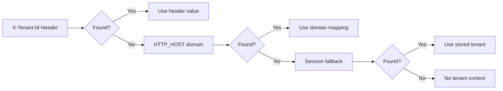
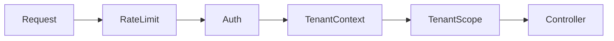
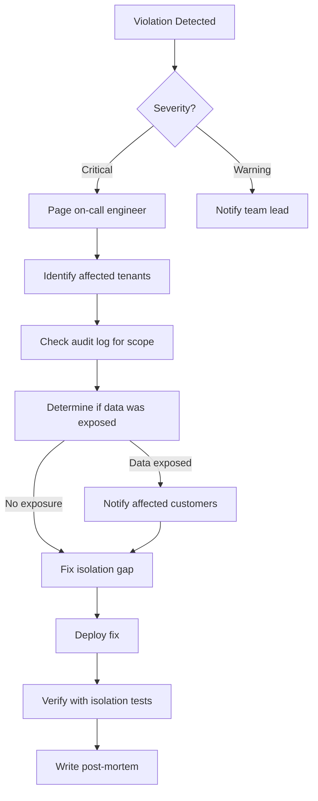

# Team Training Module: Tenancy Responsibilities

> **Navigation:** [Tenancy Home](index.md) | [Isolation Layer](isolation-layer.md) | [Audit Logging](tenant-audit-logging.md) | [Isolation Test Suite](isolation-test-suite.md)
>
> **Related:** [Tenancy Service Specification](../../ArchitectureOrigin/TENANCY_SERVICE.md) | [`TenancyService`](../../Legacy.old/app/Services/Tenancy/TenancyService.php)

---

## Overview

This training module ensures every developer understands **why tenancy isolation matters**, **how the framework enforces it**, and **what their responsibilities are** when building tenant-scoped features. The module is designed as a **2-hour session** with hands-on exercises.

This addresses **Weakness 5: Tenancy Isolation Relies on Developer Discipline** by formalizing knowledge transfer and establishing verification checkpoints.

---

## Training Session (2 Hours)

### Agenda

| Time | Topic | Format | Instructor |
|------|-------|--------|------------|
| 0:00 - 0:15 | Why Tenancy Matters | Presentation | Tech Lead |
| 0:15 - 0:30 | How Tenant Identification Works | Live Demo | Tech Lead |
| 0:30 - 0:50 | Query Scoping & Framework Enforcement | Walkthrough | Tech Lead |
| 0:50 - 1:05 | Audit System & Violation Alerts | Demo | Security Lead |
| 1:05 - 1:30 | Common Pitfalls & Anti-Patterns | Interactive | All |
| 1:30 - 2:00 | Hands-On: Fix a Tenancy Violation | Exercise | Self-paced |

---

### Module 1: Why Tenancy Matters (15 min)

**Learning Objectives:**
- Understand the shared-database shared-schema model used by DGLab
- Recognize the consequences of tenant isolation failure (data leak, compliance violation, customer loss)
- Know the trust model: DGLab guarantees Tenant A cannot see Tenant B's data

**Key Concepts:**
- **Shared Database / Shared Schema** — All tenants in one database, rows tagged with `tenant_id`
- **Isolation failure modes** — ID enumeration, missing WHERE clauses, cache key collisions, relationship leaks
- **Compliance requirements** — GDPR, SOC 2, HIPAA all require data isolation

**Slides:**
1. Multi-tenancy models (separate DB → shared schema)
2. Real-world impact of isolation failures (case studies)
3. DGLab's isolation guarantees and what they mean for customers

---

### Module 2: Tenant Identification (15 min)

**Learning Objectives:**
- Understand how [`TenancyService`](../../Legacy.old/app/Services/Tenancy/TenancyService.php) resolves the current tenant
- Write code that correctly accesses the current tenant context

**Live Demo:**
```php
// How the framework identifies your tenant
$tenant = app(TenancyService::class)->getCurrentTenant();
echo $tenant->identifier; // "acme-corp"

$tenantId = app(TenancyService::class)->tenantId();
echo $tenantId; // 42

// Require a tenant (throws if none found)
app(TenancyService::class)->requireTenant();
```

**Resolution Order (Visual):**



**Exercise:** Trace the tenant resolution path for a given HTTP request.

---

### Module 3: Query Scoping & Framework Enforcement (20 min)

**Learning Objectives:**
- Know how global scopes automatically filter queries by tenant
- Understand when to use `withoutTenantScope()` and `TenantIsolationBypass`
- Recognize the middleware chain and its role in scoping

**Walkthrough Code:**

```php
// Automatic scoping — this just works:
$documents = Document::all();
// SQL: SELECT * FROM documents WHERE tenant_id = 42

// Creating records — tenant_id is auto-assigned:
Document::create(['title' => 'New Doc']);
// SQL: INSERT INTO documents (tenant_id, title) VALUES (42, 'New Doc')

// Explicit bypass — only for authorized admin operations:
TenantIsolationBypass::run(function () {
    return Document::withoutTenantScope()->get();
}, reason: 'Monthly report', adminId: $admin->id);
```

**Middleware Chain (Visual):**



**Exercise:** Given a code snippet, identify if tenant scoping is correctly applied.

---

### Module 4: Audit System & Violation Alerts (15 min)

**Learning Objectives:**
- Understand what events trigger audit entries
- Know the severity levels and alert channels
- Be able to query the audit log for investigation

**Key Audit Events:**

| Event | Severity | Developer Action Required |
|-------|----------|--------------------------|
| `TENANT_CONTEXT_MISSING` | Warning | Add tenant context to the route |
| `TENANT_CROSS_ACCESS_DETECTED` | Critical | Investigate immediately |
| `TENANT_ADMIN_OVERRIDE` | Info | Document reason for override |

**Demo: Querying the Audit Log**

```sql
-- Check if your recent changes triggered any violations
SELECT event_type, severity, resource_type, created_at
FROM tenant_audit_logs
WHERE user_id = 42
ORDER BY created_at DESC
LIMIT 10;
```

**Exercise:** Investigate a simulated violation and determine its root cause.

---

### Module 5: Common Pitfalls & Anti-Patterns (25 min)

**Interactive session — review each anti-pattern and discuss the fix.**

#### ❌ Anti-Pattern 1: Hardcoded `tenant_id`

```php
// BAD: Hardcoded tenant ID will break in multi-tenant
$documents = DB::table('documents')
    ->where('tenant_id', 1)
    ->get();

// GOOD: Use the automatic global scope
$documents = Document::all();

// OR: Use the query macro if bypass is needed
$documents = DB::table('documents')->whereTenant()->get();
```

#### ❌ Anti-Pattern 2: Direct SQL Without Tenant Scope

```php
// BAD: Direct UPDATE bypasses all scoping
DB::statement('UPDATE documents SET status = "archived" WHERE id = 123');

// GOOD: Use the model with automatic scoping
Document::findOrFail(123)->update(['status' => 'archived']);
```

#### ❌ Anti-Pattern 3: Cache Key Without Tenant Prefix

```php
// BAD: Key collision between tenants
Cache::set('user_profile_42', $data);

// GOOD: Tenant-aware key (use TenantAwareCacheKeys trait)
Cache::set($this->tenantKey('user_profile', 42), $data);
// → "tenant_7_user_profile_42"
```

#### ❌ Anti-Pattern 4: Eager Loading Without Tenant Context

```php
// BAD: Eager loading may leak cross-tenant data
$tenant = Tenant::find(1);
$documents = $tenant->documents; // No tenant scope on the relation

// GOOD: Use scoped relation
$documents = Document::where('tenant_id', $tenant->id)->get();
```

#### ❌ Anti-Pattern 5: Silent Scope Bypass

```php
// BAD: Bypassing scope without logging or permission check
TenantGlobalScope::disable();
$allDocs = Document::all();
TenantGlobalScope::enable();

// GOOD: Use the authorized bypass mechanism
TenantIsolationBypass::run(function () {
    return Document::withoutTenantScope()->get();
}, reason: 'Admin report generation', adminId: Auth::id());
```

---

### Module 6: Hands-On Exercise — Fix a Tenancy Violation (30 min)

**Setup:** The instructor provides a broken feature that leaks data across tenants.

```php
// BUGGY CODE — Find and fix the tenancy violation
class DocumentController
{
    public function show(int $id): JsonResponse
    {
        $document = Document::withoutTenantScope()->findOrFail($id);
        return response()->json($document);
    }

    public function bulkArchive(Request $request): JsonResponse
    {
        DB::statement('UPDATE documents SET status = "archived" WHERE id IN (?)', [
            $request->input('ids')
        ]);
        return response()->json(['ok' => true]);
    }
}
```

**Expected Fixes:**
1. Remove `withoutTenantScope()` from the `show` method
2. Replace direct SQL with model operations in `bulkArchive`
3. Verify the fix by running the isolation test suite

**Verification:**
```bash
php vendor/bin/phpunit --group=tenancy-isolation --filter=DocumentController
```

---

## Code Review Checklist for Tenancy

Every pull request involving data access must pass this checklist before merge.

### PR Requirements

- [ ] **Model Review**
  - [ ] New models with `tenant_id` column extend `TenantScopedModel` or use the `TenantScoped` trait
  - [ ] New tables include a `tenant_id` column with foreign key constraint
  - [ ] New tables have appropriate indexes on `(tenant_id, ...)` query patterns

- [ ] **Query Review**
  - [ ] All queries against tenant-scoped tables go through the model (not raw SQL)
  - [ ] Raw SQL statements use `whereTenant()` or are wrapped in `TenantIsolationBypass`
  - [ ] `withoutTenantScope()` is only used inside an authorized bypass context
  - [ ] No `DB::statement()` / `DB::delete()` / `DB::update()` on tenant-scoped tables

- [ ] **Cache Review**
  - [ ] All cache keys for tenant-scoped data include `tenant_id` prefix
  - [ ] Cache invalidation respects tenant boundaries (no cross-tenant cache flush)

- [ ] **Queue Job Review**
  - [ ] Queue jobs dispatched within a tenant context retain that context
  - [ ] Jobs processing tenant data validate tenant context before processing

- [ ] **Relationship Review**
  - [ ] All relationships between tenant-scoped models remain within the same tenant
  - [ ] Eager loading does not bypass tenant scoping

- [ ] **API Endpoint Review**
  - [ ] All tenant-scoped endpoints are behind the `TenantContextMiddleware`
  - [ ] Resource IDs in responses cannot be enumerated to discover other tenants' data
  - [ ] Admin bypass endpoints require explicit `bypass_tenant_isolation` permission

- [ ] **Audit Trail Review**
  - [ ] Admin bypass operations include a documented reason
  - [ ] New violation event types are defined in the audit system

### PR Blockers (Cannot Merge)

| Issue | Reason |
|-------|--------|
| Missing `tenant_id` on new tenant-scoped table | Data leak risk |
| Raw SQL UPDATE/DELETE without tenant scope | Isolation bypass |
| Cache key without tenant prefix | Cross-tenant cache read |
| `withoutTenantScope()` outside of admin bypass | Unauthorized access |
| No audit entry for admin bypass | Compliance violation |

---

## Anti-Pattern Catalog

| # | Anti-Pattern | Risk | Detection Method |
|---|-------------|------|------------------|
| 1 | Hardcoded `tenant_id = N` in queries | Data leak | Code review, static analysis |
| 2 | Direct SQL without tenant scope | Isolation bypass | Code review, `TenantGlobalScope` audit |
| 3 | Cache keys without tenant prefix | Cross-tenant cache read | Code review, cache key convention check |
| 4 | Eager loading cross-tenant relationships | Data leak | Code review, isolation tests |
| 5 | Silent `TenantGlobalScope::disable()` | Isolation bypass | Audit log, `TENANT_SCOPE_BYPASSED` event |
| 6 | Missing `X-Tenant-Id` on internal Spoke calls | Context loss | Middleware validation, `TENANT_CONTEXT_MISSING` event |
| 7 | Sharing model instances across tenant contexts | Data corruption | Code review, scoping tests |

---

## Isolation Violation Response Protocol

### When a Violation is Discovered in Production



### Response Steps

1. **Identify** — Check the audit log to determine which tenants and resources were affected
2. **Contain** — If data was exposed, rotate API keys for affected tenants and revoke suspicious sessions
3. **Investigate** — Determine root cause (missing scope, bypass, cache leak, etc.)
4. **Fix** — Apply the isolation fix and run the full isolation test suite
5. **Notify** — If customer data was exposed, follow the security incident notification policy
6. **Prevent** — Update the code review checklist and training materials with the new pattern

---

## Developer Certification

All developers must complete the following before committing tenant-scoped code:

- [ ] Complete the 2-hour training session
- [ ] Pass the tenancy quiz (80% minimum)
- [ ] Successfully fix a tenancy violation exercise
- [ ] Review 3 PRs using the code review checklist
- [ ] Sign off on the tenancy responsibilities agreement

### Quiz Questions

1. How does `TenancyService` identify the current tenant? (Name all three methods)
2. What annotation marks a model as tenant-scoped?
3. How do you correctly bypass tenant isolation for admin operations?
4. What severity is `TENANT_CROSS_ACCESS_DETECTED` and what channel is it alerted on?
5. Name three anti-patterns that cause tenant isolation failures.

---

## References

- [Isolation Layer Architecture](isolation-layer.md) — Framework-enforced boundaries
- [Tenant Auditing System](tenant-audit-logging.md) — Violation tracking
- [Isolation Test Suite](isolation-test-suite.md) — Verification patterns
- [`TenancyService`](../../Legacy.old/app/Services/Tenancy/TenancyService.php) — Tenant identification
- [Tenancy Service Specification](../../ArchitectureOrigin/TENANCY_SERVICE.md) — Original spec
- [Testing Recipes](../testing/recipes.md) — General testing patterns