# SPEC-001 — DGLab Sovereign Stack Architecture

**Status:** Contractor-ready, immutable.
**Verified against:** DGLab repository HEAD `a4a3402`.
**Verification basis:** File-level cross-check of every specific factual claim against actual code, configuration, ADRs, and tests in the repository at the above HEAD.

---

## Central Architectural Completion Principle

> **Architecture is complete when its important invariants are executable, continuously verified, and consistent with the repository's actual implementation state — not merely when the documentation says they are complete.**

Operational test of this principle: **the repository, tests, CI, deployment gates, and documentation must converge on the same truth.** When those five sources disagree, the documentation is wrong, not the code. This SPEC encodes that discipline via §50 (generated `ARCHITECTURE_STATUS.md`), §37 (governance loop), §57 (acceptance matrix), and §60 (completion flowchart).

---

## Background

[DGLab repository](https://github.com/DGCodeIdeas/DGLab) is a PHP 8.4 monorepo/framework intended to provide a sovereign application stack with explicit architectural boundaries.

The repository uses a six-ring "Wheel Architecture":

```text
Outer Rim
   ↓
Outer Spokes
   ↓
Inner Rim
   ↓
Inner Spokes
   ↓
Hub
   ↓
Core
```

Dependencies are intended to point inward. ADR-004 formalizes this as a tier-enforcement DAG.

The current implementation shows that the **runtime and infrastructure foundations are substantially more mature than the application/domain layer**. The Core contains the principal runtime primitives, the Hub currently has configuration-oriented functionality, and the Spokes provide a larger collection of internal/external integration blueprints.

The existing implementation already provides several architectural foundations that must be preserved rather than rebuilt:

* PHP 8.4 runtime.
* Persistent FrankenPHP worker model.
* Fiber-isolated pulse/request instances.
* Immutable configuration after build.
* Immutable `TenantContext`.
* Repository-port pattern in existing Hub configuration code.
* Kernel lifecycle state machine.
* Router and middleware freezing after first use.
* Persistent-worker-safe global error handling.
* PSR-14 event dispatching.
* AES-256-GCM encryption and Argon2id key derivation.
* MySQL-primary DBAL abstractions per ADR-013; `MysqlDriver` is the current default backend, while `SqliteDriver` is used for tests/dev. ADR-013 references a disabled PostgreSQL driver, but no PostgreSQL driver currently exists in `packages/core/dbal/src/Driver/`; this discrepancy must be surfaced rather than assumed.
* Caddy → Tengine → FrankenPHP deployment topology.
* Blue/green deployment.
* Graceful worker shutdown and recycling.
* PHPUnit/PHPStan-based testing.
* Blocking architecture-lint CI.

The principal architectural gap is therefore **not a lack of infrastructure**. It is that several architectural intentions are not yet executable constraints, while the Hub/domain/application layer has not yet been developed deeply enough to demonstrate the complete architecture.

The project also has documentation/status drift. In particular, README status statements conflict with executable repository state, while dependency documentation is not always synchronized with Composer and the actual package structure.

The next phase should therefore follow this principle:

> **Turn the existing architecture into enforceable contracts first, then build the Hub/domain layer without weakening those contracts.**

The design must be contractor-implementable. A contractor should be able to determine:

1. which existing components must remain untouched;
2. which components must be extended;
3. which components must be introduced;
4. which architecture rules must be enforced automatically;
5. how deployment acceptance is determined; and
6. how production results are measured.

### Verification basis

The baseline in this specification incorporates the supplied file-level verification of the repository at HEAD `a4a3402`. Direct web search did not independently surface the repository files reliably, so this specification does not claim that the individual implementation details below were independently re-verified through web indexing.

---

## Requirements

Requirements use MoSCoW prioritization.

### MUST

#### M01 — Enforce ring dependency direction

The build/CI system MUST inspect actual PHP namespaces/imports and enforce the six-ring dependency DAG.

At minimum:

```text
Core
  → Core / approved PSR / PHP extensions

Hub
  → Hub + Core

Inner Spokes
  → Inner Spokes + Hub + Core

External Spokes
  → External Spokes + Hub + Core

Bridge
  → Bridge + Hub + Core

Application
  → enabled application packages

Infrastructure
  → approved Core/Hub contracts
```

The following dependency directions MUST fail CI:

```text
Core → Hub
Core → Spoke
Core → Bridge
Core → Application

Hub Domain → DBAL
Hub Domain → HTTP implementation
Hub Domain → controller
Hub Domain → SQL
Hub Domain → external SDK

Hub → Application
Hub → Spoke
Hub → Bridge
```

#### M02 — Establish an explicit composition root

Application composition MUST occur outside Core and Hub.

`public/index.php` MUST become a thin entry point delegating composition to an `ApplicationFactory` or equivalent application-level composition boundary.

The root composition layer may depend on all enabled rings.

Core MUST NOT become aware of application-specific implementations.

#### M03 — Prohibit Service Locator usage

Production application code MUST NOT resolve dependencies dynamically through a Service Locator.

Forbidden patterns include:

```php
$container->get(...);
$container->make(...);
Container::getInstance();
app(...);
```

Dependency injection MUST be constructor/factory based.

CI MUST detect prohibited patterns rather than relying solely on code review.

#### M04 — Preserve persistent-worker isolation

The application MUST remain safe under persistent FrankenPHP workers.

Each request/pulse MUST receive isolated request-scoped state.

Tests MUST demonstrate that:

* request A cannot observe request B's state;
* Fiber A cannot observe Fiber B's state;
* tenant context cannot leak;
* request/trace correlation cannot leak;
* exceptions do not leave mutable state behind.

#### M05 — Preserve lifecycle and freezing invariants

Existing lifecycle and immutability guarantees MUST remain enforced.

The following MUST continue to have tests:

* Kernel lifecycle transitions.
* Router freeze-after-first-match.
* Middleware pipeline freeze-after-first-handle.
* Config freeze-after-build.
* Immutable `TenantContext`.

New mutable runtime structures MUST follow the same explicit lifecycle/freeze model where appropriate.

#### M06 — Introduce authoritative RequestContext

A request-scoped immutable `RequestContext` MUST be introduced.

It SHOULD contain at minimum:

```text
request_id
trace_id
tenant_id
started_at
```

Optional metadata such as route name MAY be populated after routing.

The context MUST be Fiber/request isolated and MUST NOT use static global state.

It MUST integrate with the existing `TenantContext` design rather than replacing it with a global context accessor.

#### M07 — Enforce safe and classified error handling

The existing five-class error taxonomy MUST become executable architecture:

```text
Transient
Permanent-External
Permanent-Local
Corrupt
Panic
```

Every operational error MUST map to one of these classes.

The existing doctrine MUST remain the canonical definition of the classes.

CI MUST verify that:

* exception/error handling identifies the appropriate class;
* log entries contain the class;
* Corrupt failures cannot silently become Transient;
* Panic failures trigger the required isolation/shutdown behavior;
* HTTP responses do not expose stack traces, internal filesystem paths, SQL, credentials, or other sensitive implementation details.

#### M08 — Separate runtime, domain, and integration events

Events MUST be semantically classified.

```text
Runtime Events
    Core lifecycle/runtime concerns

Domain Events
    Hub business state transitions

Integration Events
    External/Bridge contracts
```

Runtime events MUST NOT become a substitute for business-domain orchestration.

Integration events MUST use explicit, versioned contracts.

#### M09 — Establish domain/persistence boundaries

The Hub domain MUST follow:

```text
Entity
ValueObject
Aggregate
DomainEvent
DomainException
Repository interfaces
```

Persistence implementations MUST live outside the domain.

Repositories MUST be ports/interfaces owned by the appropriate domain/application boundary, with infrastructure adapters implementing them.

The application service MUST own the transaction boundary.

#### M10 — Separate health semantics

The current single `/health` concept MUST evolve into distinct health checks:

```text
/health/live
/health/ready
/health/dependencies
```

`/_anvil/ping` remains infrastructure-specific.

Liveness MUST NOT depend on external services.

Readiness MAY verify required dependencies.

Detailed dependency information MUST be protected from uncontrolled public exposure.

#### M11 — Introduce a complete release verification gate

Traffic MUST NOT be switched to a new blue/green candidate merely because the FrankenPHP process started successfully.

Before traffic switching, the candidate MUST pass a full-stack verification path:

```text
Caddy
  ↓
Tengine
  ↓
FrankenPHP
  ↓
Application
```

The gate MUST verify at least:

* liveness/readiness;
* representative application route;
* request/trace propagation;
* safe error responses;
* architecture fitness checks;
* application smoke tests;
* candidate health after startup;
* expected worker/runtime behavior.

Rollback MUST be possible by selecting the previous immutable deployment artifact.

#### M12 — Generate authoritative architecture status

Implementation status MUST be derived from executable repository state wherever technically possible.

A generated artifact such as:

```text
ARCHITECTURE_STATUS.md
```

SHOULD be produced from:

* package directories;
* blueprint metadata;
* executable verification;
* tests;
* Composer configuration;
* architecture manifests.

Manually maintained README status MUST describe intent but MUST NOT be the authoritative source for implementation status.

#### M13 — Establish requirement-to-acceptance traceability

Every MUST requirement MUST have an executable acceptance criterion.

The project MUST maintain a traceability structure equivalent to:

```text
Requirement
    ↓
Implementation
    ↓
Test / Fitness Check
    ↓
Deployment Verification
```

A requirement is not considered complete merely because code exists.

#### M14 — Verify graceful worker lifecycle behavior

The persistent worker MUST be tested for:

* SIGTERM;
* in-flight requests;
* worker recycling;
* startup after failure;
* shutdown completion;
* absence of request-state contamination after recycling.

Existing worker limits MUST be retained unless measured evidence requires adjustment.

### SHOULD

#### S01 — Support W3C trace context

The request context SHOULD support W3C `traceparent` propagation.

Incoming trace information SHOULD be validated and propagated downstream.

#### S02 — Introduce an outbox for asynchronous integration

When domain state changes must produce asynchronous integration events, an outbox SHOULD be used.

The design SHOULD provide at-least-once publication semantics with idempotent consumers.

#### S03 — Add operational chaos tests

The system SHOULD test:

* worker termination;
* dependency failure;
* health-check failure;
* blue/green candidate failure;
* rollback;
* SIGTERM during active traffic.

#### S04 — Automate rollback verification

CI/CD SHOULD periodically demonstrate that a known-good artifact can be restored without reconstructing the deployment manually.

#### S05 — Add persistent-worker soak testing

The system SHOULD run extended multi-request workloads to detect:

* memory growth;
* stale state;
* Fiber contamination;
* resource leaks;
* degradation over worker lifetime.

#### S06 — Consolidate observability

Logs, metrics and request correlation SHOULD converge on common:

```text
request_id
trace_id
tenant_id
```

where appropriate and safe.

### COULD

#### C01 — Route compilation

The router COULD eventually support a compiled/frozen representation for production startup efficiency.

#### C02 — Expand freeze-contract coverage

Additional mutable infrastructure structures COULD adopt the existing freeze-after-first-use testing pattern.

#### C03 — Architecture status visualization

Generated architecture status COULD later feed a human-readable dashboard.

### WON'T

The following are explicitly outside this specification:

* Rebuilding the existing Core primitives.
* Redesigning the Anvil Caddy/Tengine/FrankenPHP topology.
* Introducing microservices merely to enforce architectural layering.
* Introducing arbitrary latency SLOs before production baselines exist.
* Treating `/health` returning HTTP 200 as sufficient release verification.
* Treating percentage code coverage as the primary architecture-quality metric.
* Using unit tests alone as proof of ring compliance.
* Treating the manually maintained README as authoritative implementation status.
* Using runtime events as business-domain orchestration.
* Coupling the Hub domain directly to vendor SDKs or infrastructure implementations.

---

## Method

### 1. Target Architecture

The existing six-ring Wheel Architecture remains the architectural foundation. This specification **does not replace the Wheel**; it makes its boundaries executable.

> **Note on the diagram below:** This represents **target-state logical ownership**. Some dependencies shown (notably `HUBAPP → DBAL`) are not yet exercised by current Hub code — the existing Hub/config package uses in-memory repository implementations and has zero DBAL dependency in its `composer.json`. The `HUBAPP → DBAL` arrow will become accurate once Hub business capabilities at depth 3+ require persistence. Treat the diagram as the target architecture, not as a description of current Hub code.

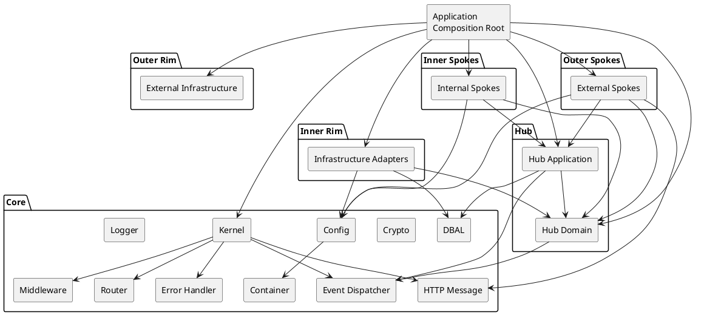

The important rule is that **dependencies point inward**, while the application composition root is allowed to assemble the complete graph.

The diagram describes logical ownership. Actual namespace/package names MUST be mapped to this model through an architecture manifest used by CI.

---

### 2. Current State vs Required Change

The implementation should be extended rather than reconstructed.

| Area                      | Current State          | Required Action                              |
| ------------------------- | ---------------------- | -------------------------------------------- |
| Core runtime              | Implemented            | Preserve                                     |
| Config immutability       | Implemented            | Preserve + regression tests                  |
| TenantContext             | Implemented            | Preserve                                     |
| Repository ports          | Proven in Hub/config   | Extend                                       |
| Kernel lifecycle          | Implemented/tested     | Preserve + concurrency tests                 |
| Router freezing           | Implemented/tested    | Preserve                                     |
| Middleware freezing       | Implemented/tested    | Preserve                                     |
| ErrorHandler              | Persistent-worker-safe | Preserve + taxonomy enforcement              |
| Event dispatcher          | PSR-14                 | Extend semantic model                        |
| DBAL                      | Basic infrastructure   | Extend through adapters                      |
| RequestContext            | Missing                | Introduce                                    |
| Ring CI enforcement       | Partial                | Introduce import-based enforcement           |
| ApplicationFactory        | Missing                | Introduce                                    |
| Hub domain                | Shallow                | Introduce incrementally                      |
| Outbox                    | Missing                | Introduce when async integration is required |
| Health separation         | Missing                | Introduce                                    |
| Full release verification | Partial                | Extend                                       |

This distinction is mandatory for contractor implementation: **existing functionality must not be recreated merely because it appears in the target architecture.**

---

### 3. Composition Root

`public/index.php` currently performs too much application composition.

The target structure is:

```text
public/index.php
       |
       v
ApplicationFactory
       |
       +--> Container
       +--> Config
       +--> Logger
       +--> ErrorHandler
       +--> EventDispatcher
       +--> HTTP
       +--> Router
       +--> Middleware
       +--> Hub services
       +--> Infrastructure adapters
       |
       v
Kernel
```

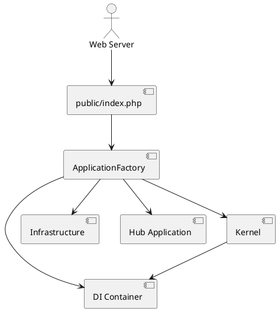

`public/index.php` SHOULD ultimately be limited to:

1. loading the application factory;
2. creating the application;
3. invoking the kernel/runtime;
4. allowing the established error/shutdown infrastructure to operate.

The ApplicationFactory belongs at the application/infrastructure composition boundary, **not inside Core**.

---

### 4. Dependency Injection Rules

The container remains an implementation mechanism rather than an application-facing global registry.

Dependencies SHOULD be expressed as:

```php
final class SomeService
{
    public function __construct(
        private readonly RepositoryInterface $repository,
        private readonly LoggerInterface $logger,
    ) {}
}
```

Factories MAY receive the container when composition genuinely requires dynamic assembly, but runtime business/application objects MUST NOT use the container as a Service Locator.

CI SHOULD scan production PHP files for forbidden patterns.

The initial forbidden-pattern set is:

```text
Container::getInstance(
$container->get(
$container->make(
$container->resolve(
Container::resolve(
app(
```

The implementation MUST avoid false positives by analysing PHP AST/imports where practical rather than relying solely on textual grep. In particular, the blanket `->resolve(` pattern MUST NOT be used — legitimate domain-specific resolvers exist (e.g., `MiddlewareResolver::resolve()`, `ContractRegistry::resolve()`) and must not trigger CI failures.

---

### 5. Ring-Boundary Fitness Test

The architecture-lint workflow MUST be extended from documentation checks into executable dependency analysis.

The algorithm is:

```text
1. Discover all production PHP files.
2. Determine owning package/ring.
3. Parse namespace and use/import declarations.
4. Resolve imported classes/interfaces.
5. Determine the imported package/ring.
6. Compare source ring against allowed dependency set.
7. Fail CI on forbidden dependency.
8. Emit source → target → rule in the failure.
```

Example failure:

```text
ARCH-BOUNDARY-001

Forbidden dependency:
packages/core/kernel/src/Kernel.php
    → DGLab\Hub\Application\ReleaseService

Rule:
Core MUST NOT depend on Hub.

Allowed targets:
Core, approved PSR interfaces, PHP extensions.
```

This test is an **architecture fitness test**, not a unit test.

The same mechanism SHOULD be extended to enforce:

* domain purity;
* prohibited infrastructure imports;
* prohibited vendor SDK imports;
* application composition boundaries.

---

### 6. Architecture Manifest

A machine-readable manifest SHOULD define the ownership and dependency rules.

Conceptually:

```yaml
rings:
  core:
    paths:
      - packages/core/*
    allowed:
      - core
      - psr
      - php-extension

  hub:
    paths:
      - packages/hub/*
    allowed:
      - hub
      - core

  inner-spokes:
    paths:
      - packages/spoke/internal/*
    allowed:
      - inner-spokes
      - hub
      - core

  external-spokes:
    paths:
      - packages/spoke/external/*
    allowed:
      - external-spokes
      - hub
      - core

  bridge:
    paths:
      - packages/bridge/*
    allowed:
      - bridge
      - hub
      - core
```

> **Repository path verification:** The actual DGLab repository uses singular `packages/spoke/` (not plural `packages/spokes/`). The example manifest above reflects this. The manifest generator MUST derive paths from `composer.json` `autoload.psr-4` mappings and actual directory existence, not from this example.

This manifest becomes the input to the architecture-lint tool and the generated architecture-status document.

---

### 7. Persistent Worker Runtime

The persistent FrankenPHP worker changes the correctness model.

A PHP process can serve many requests:

```text
Worker
 ├── Request A
 ├── Request B
 ├── Request C
 └── Request D
```

Therefore, state that would normally disappear at process termination can survive between requests.

The existing container already distinguishes worker/singleton, pulse/Fiber/request, and transient lifetimes.

That model MUST be retained.

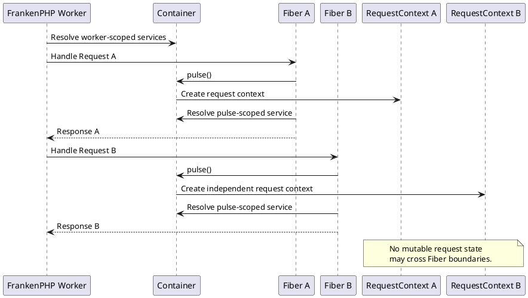

---

### 8. RequestContext

`RequestContext` SHOULD follow the immutable-value-object approach already established by `TenantContext`.

Proposed representation:

```php
final readonly class RequestContext
{
    public function __construct(
        public string $requestId,
        public string $traceId,
        public ?string $tenantId,
        public \DateTimeImmutable $startedAt,
    ) {}
}
```

The actual implementation MAY use stronger identifier/value-object types.

Requirements:

* immutable;
* no static accessor;
* created at request boundary;
* stored in Fiber-isolated request scope;
* destroyed/replaced with the next request;
* available to logging/error/event infrastructure.

If a tenant is established later in request processing, the context SHOULD be replaced with a new immutable instance rather than mutated.

---

### 9. Request and Trace Correlation

The request lifecycle becomes:

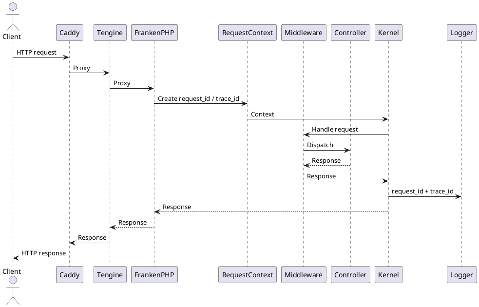

The application SHOULD:

* accept a valid incoming trace context when enabled;
* generate a request ID when absent;
* generate a trace ID when absent;
* propagate correlation through application logs;
* attach correlation to safe error responses;
* avoid exposing sensitive tenant information.

The application MUST NOT trust arbitrary incoming IDs as proof of identity.

---

### 10. Event Audit Context

The existing immutable event stamp mechanism can be used to associate runtime events with the request context.

For example:

```text
RequestReceivedEvent
    |
    +-- request_id
    +-- trace_id
    +-- tenant_id (when appropriate)
    +-- timestamp
```

The stamp is an audit record, not mutable event state.

This preserves the existing append-only event audit design while providing operational correlation.

---

### 11. Kernel Lifecycle

The existing Kernel lifecycle remains authoritative:

```text
Unbooted
    ↓
Booting
    ↓
Booted
    ↓
Handling
    ↓
Booted
    ↓
Terminating
    ↓
Terminated
```

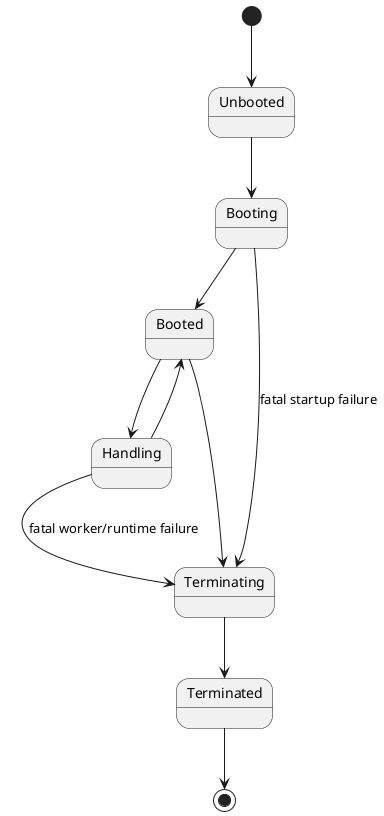

Existing lifecycle unit tests SHOULD remain unchanged unless the implementation requires additional cases.

The principal addition is concurrent/persistent-worker testing.

---

### 12. Concurrency and Isolation Test Strategy

A new integration/fitness suite MUST repeatedly execute requests in different Fibers.

Conceptual test:

```text
Fiber A:
    tenant = tenant-A
    request_id = A
    set request-local state
    yield

Fiber B:
    tenant = tenant-B
    request_id = B
    set request-local state
    yield

Resume Fiber A:
    assert tenant == tenant-A
    assert request_id == A

Resume Fiber B:
    assert tenant == tenant-B
    assert request_id == B
```

The test MUST also verify cleanup after exceptions:

```text
Request A
   ↓
throw exception
   ↓
cleanup
   ↓
Request B
   ↓
assert no state from A
```

A test failure indicates a **runtime architecture defect**, not merely a failed business test.

---

### 13. State Ownership Rules

Every runtime value MUST have an explicit lifetime.

| Lifetime    | Examples                                           | Rule                                            |
| ----------- | -------------------------------------------------- | ----------------------------------------------- |
| Worker      | immutable configuration, long-lived infrastructure | MUST be safe across requests                    |
| Pulse/Fiber | request context, request-scoped services           | MUST never cross Fibers                         |
| Transient   | DTOs, commands, temporary values                   | MUST have no hidden global state                |
| Domain      | aggregate state                                    | MUST belong to a unit of work                   |
| Database    | persisted state                                    | MUST be accessed through defined ports/adapters |

No request-specific mutable state may be stored in:

* static properties;
* global variables;
* worker-singleton mutable fields;
* process-wide registries.

---

### 14. Configuration and Tenant Context

The existing configuration immutability implementation MUST remain the source of truth.

The existing `TenantContext` MUST also remain the source of truth for tenant identity.

The new `RequestContext` composes with it conceptually:

```text
RequestContext
 ├── request_id
 ├── trace_id
 ├── started_at
 └── TenantContext
       └── tenant_id
```

No static tenant accessor is introduced.

The DBAL's existing tenant-aware `QueryBuilder` behavior should continue to receive `TenantContext` explicitly.

The purpose of this specification is therefore to **extend the established anti-global-state pattern**, not replace it.

---

### 15. Contractor Rule: Do Not Rebuild Existing Foundations

Before implementing any new component, contractors MUST verify whether an equivalent implementation already exists.

The following are explicitly existing foundations:

```text
Config immutability
TenantContext
Repository ports in Hub/config
Transaction primitive
ErrorHandler
Kernel lifecycle
Router freeze
Middleware freeze
Event dispatcher
Crypto primitives
DBAL connection/query infrastructure
FrankenPHP worker runtime
Blue/green deployment
Graceful shutdown
```

New code MUST integrate with these components rather than introduce competing abstractions.

---

### 16. Hub Domain Architecture

The Hub is the primary location for sovereign-stack business capabilities.

The current Hub implementation is intentionally shallow: configuration functionality exists, but the broader domain/application model is not yet implemented.

The target Hub structure is:

```text
packages/hub/<capability>/
├── src/
│   ├── Domain/
│   │   ├── Entity/
│   │   ├── ValueObject/
│   │   ├── Aggregate/
│   │   ├── Event/
│   │   ├── Exception/
│   │   └── Repository/
│   ├── Application/
│   │   ├── Command/
│   │   ├── Query/
│   │   └── Service/
│   └── ...
└── tests/
```

The exact directory structure MAY vary by capability, but the architectural ownership MUST remain explicit.

### 17. Domain Purity

Hub domain code MUST NOT directly depend on:

* HTTP request/response implementations;
* controllers;
* SQL;
* DBAL implementation classes;
* database drivers;
* framework infrastructure;
* Caddy/Tengine/FrankenPHP;
* external API clients;
* vendor SDKs;
* filesystem infrastructure.

The domain MAY depend on:

* PHP language primitives;
* domain-owned value objects;
* domain entities;
* domain aggregates;
* domain exceptions;
* domain events;
* repository interfaces;
* approved Core contracts where the dependency is genuinely architectural.

The objective is to ensure that business rules remain executable independently of transport and persistence.

---

### 18. Repository Ports

The existing configuration repository pattern is the reference implementation.

The pattern is:

```text
Domain/Application
       |
       v
RepositoryInterface
       ^
       |
Infrastructure Adapter
       |
       v
Core DBAL
       |
       v
MySQL/InnoDB
```

For example:

```php
interface ReleaseRepositoryInterface
{
    public function get(string $id): ?Release;

    public function save(Release $release): void;
}
```

The interface belongs to the appropriate Hub boundary.

The infrastructure implementation owns:

* SQL;
* DBAL interaction;
* row mapping;
* transaction participation;
* persistence-specific exceptions.

The domain MUST NOT know whether the implementation uses MySQL, SQLite, or another supported backend.

---

### 19. Database Backend Policy

The DBAL is **MySQL-primary**, according to ADR-013, which supersedes the previous PostgreSQL-primary ADR.

The current repository contains:

```text
MysqlDriver
    ↓
MySQL / InnoDB

SqliteDriver
    ↓
Test/development fixtures
```

ADR-013 references a PostgreSQL driver as shipped-but-disabled, but the current DBAL driver directory does not contain such a driver.

This discrepancy MUST be documented as repository/ADR drift.

Contractors MUST NOT introduce PostgreSQL as the primary persistence backend unless a future ADR explicitly changes the datastore decision.

The DBAL's driver abstraction MUST remain capable of supporting alternative relational backends without coupling the Hub domain to a specific driver.

---

### 20. Transaction Boundary

The application service owns the unit-of-work transaction.

The preferred flow is:

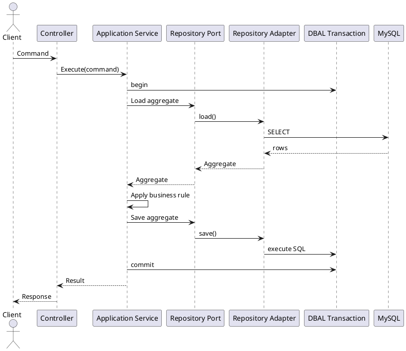

Transaction ownership MUST NOT be hidden inside individual repository methods.

This prevents a single application operation from accidentally committing only part of an aggregate transition.

On failure:

```text
begin
  ↓
load
  ↓
business operation
  ↓
persist
  ↓
event recording
  ↓
commit
```

Any failure before commit MUST roll back the unit of work.

---

### 21. Domain Events

Domain events represent meaningful business state transitions.

Examples:

```text
ReleaseCreated
ReleasePublished
ConfigurationChanged
FeatureFlagChanged
```

These are distinct from runtime events:

```text
BootEvent
RequestReceivedEvent
ResponseReadyEvent
TerminateEvent
```

The same PSR-14 dispatching infrastructure MAY transport both categories, but their semantics MUST remain separate.

A domain event MUST describe a business fact that has occurred.

It MUST NOT be used merely because a technical method executed.

---

### 22. Event Lifecycle

A state-changing operation SHOULD follow:

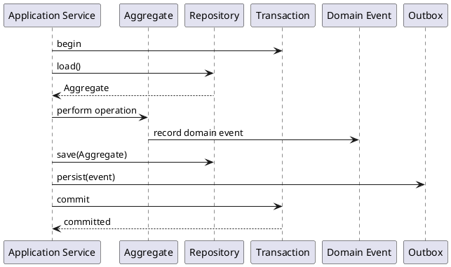

The important invariant is:

> A persisted business state transition and its required asynchronous integration event must become durable atomically.

If asynchronous integration is not required, an outbox does not need to be introduced solely for architectural completeness.

---

### 23. Outbox Schema

When asynchronous integration is required, introduce an outbox table.

Target schema:

```sql
CREATE TABLE outbox (
    id CHAR(36) NOT NULL,
    aggregate_type VARCHAR(100) NOT NULL,
    aggregate_id VARCHAR(100) NOT NULL,
    event_type VARCHAR(200) NOT NULL,
    event_version SMALLINT NOT NULL,
    payload JSON NOT NULL,
    occurred_at TIMESTAMP(6) NOT NULL,
    available_at TIMESTAMP(6) NOT NULL,
    published_at TIMESTAMP(6) NULL,
    attempt_count INT NOT NULL DEFAULT 0,
    last_error TEXT NULL,

    PRIMARY KEY (id),
    INDEX idx_outbox_available (published_at, available_at),
    INDEX idx_outbox_aggregate (aggregate_type, aggregate_id)
);
```

The exact UUID representation MAY be adapted to the selected MySQL version and migration conventions.

The event ID MUST be globally unique.

Publishing semantics are **at least once**.

Consumers MUST therefore be idempotent.

If consumer-level deduplication is needed:

```sql
CREATE TABLE processed_messages (
    event_id CHAR(36) NOT NULL,
    consumer VARCHAR(200) NOT NULL,
    processed_at TIMESTAMP(6) NOT NULL,

    PRIMARY KEY (event_id, consumer)
);
```

The outbox publisher MUST NOT delete an event merely because one publish attempt succeeded unless retention policy explicitly permits deletion.

---

### 24. Event Versioning

Integration event contracts MUST be versioned.

Example:

```text
release.published.v1
release.published.v2
```

Changing the meaning of an existing event MUST NOT silently modify its contract.

Backward-compatible fields MAY be added according to the integration contract.

Breaking changes require a new event version.

---

### 25. Error Taxonomy

The existing NUCLEAR-GRADE-DOCTRINE remains authoritative.

Exactly five classes exist:

```text
Transient
Permanent-External
Permanent-Local
Corrupt
Panic
```

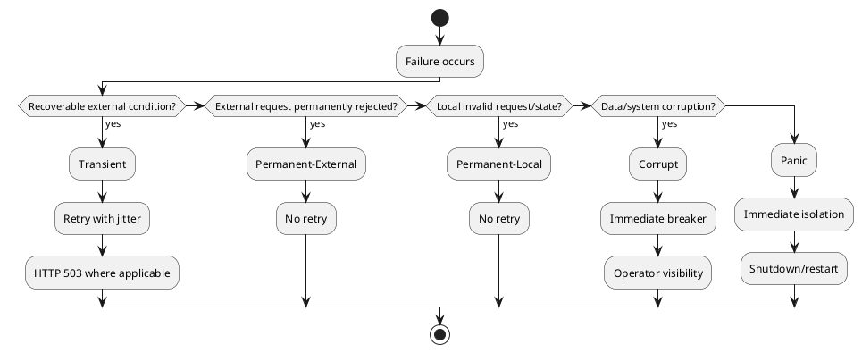

The taxonomy MUST affect operational behavior, not merely log labels.

| Class              |                 Retry |         Breaker | Typical HTTP behavior     |
| ------------------ | --------------------: | --------------: | ------------------------- |
| Transient          | Yes, bounded + jitter |      Eventually | 503                       |
| Permanent-External |                    No | After threshold | 4xx/502                   |
| Permanent-Local    |                    No |              No | 4xx                       |
| Corrupt            |                    No |       Immediate | 500 + operator visibility |
| Panic              |                    No |       Immediate | 500 + isolate/restart     |

The precise HTTP mapping MAY be refined for individual APIs while preserving the class semantics.

---

### 26. Error-Taxonomy Fitness Test

CI MUST enforce the existing doctrine.

The fitness test SHOULD inspect:

1. exception declarations;
2. explicit error-class metadata where used;
3. catch blocks;
4. retry decisions;
5. breaker decisions;
6. structured log calls.

Every emitted error log MUST identify its taxonomy class.

Example:

```json
{
  "level": "ERROR",
  "error_class": "Transient",
  "request_id": "…",
  "trace_id": "…",
  "message": "Dependency temporarily unavailable"
}
```

The actual implementation SHOULD use the project's existing logging abstractions rather than introducing an unrelated logging API.

---

### 27. Safe Error Responses

Internal exception details MUST remain internal.

Production HTTP responses MUST NOT expose:

* stack traces;
* source paths;
* SQL;
* credentials;
* connection strings;
* environment variables;
* internal service topology;
* cryptographic material.

The response MAY expose:

```json
{
  "error": "internal_error",
  "request_id": "…"
}
```

The request ID allows operators to correlate the public response with internal logs without exposing internal diagnostics.

---

### 28. Existing ErrorHandler

The existing persistent-worker-safe `ErrorHandler` MUST remain the central global error/shutdown mechanism.

Its existing properties include:

* worker-scoped registration;
* global error handlers;
* shutdown/fatal handling;
* `display_errors` disabled;
* recursion protection;
* fallback behavior when logging/rendering itself fails;
* classification of severe PHP errors.

The new taxonomy enforcement MUST extend this behavior rather than replacing the ErrorHandler with a second global error subsystem.

---

### 29. Health Architecture

Health endpoints are separated by purpose.

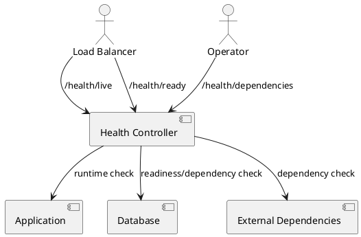

#### `/health/live`

Answers:

> Is the application process/runtime alive?

It MUST NOT require the database or external dependencies.

#### `/health/ready`

Answers:

> Is this instance ready to receive application traffic?

It MAY check required dependencies.

#### `/health/dependencies`

Answers:

> What dependencies are healthy?

This endpoint SHOULD be restricted to internal/operator access or otherwise sanitized.

The existing `/_anvil/ping` remains an infrastructure-level health signal.

---

### 30. Observability

The runtime already exposes several observability channels:

```text
FrankenPHP metrics
Tengine timing logs
Caddy JSON logs
systemd journal
```

The application should add consistent request correlation:

```text
request_id
trace_id
```

and, where operationally appropriate:

```text
tenant_id
```

Tenant identifiers MUST be treated as potentially sensitive metadata.

Application logs SHOULD use structured fields rather than embedding correlation information only inside free-form messages.

---

### 31. Deployment Architecture

The existing deployment topology remains:

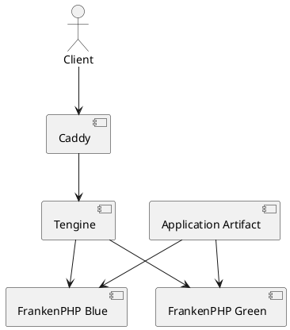

Caddy remains responsible for edge concerns such as:

* TLS/ACME;
* HTTP/2/3;
* security headers;
* structured edge logging;
* reverse proxy.

Tengine remains responsible for its existing documented responsibilities, including:

* slow-client shielding;
* rate limiting;
* connection limiting;
* real-IP restoration;
* upstream timing;
* dynamic blue/green routing;
* on-demand TLS gating.

FrankenPHP remains the persistent application runtime.

No topology redesign is required.

---

### 32. Release Gate

The deployment process becomes:

```text
Build immutable artifact
        ↓
Deploy candidate to inactive color
        ↓
Start candidate
        ↓
Wait for runtime health
        ↓
Full-stack verification
        ↓
Architecture fitness verification
        ↓
Application smoke verification
        ↓
Request/trace verification
        ↓
Security/error verification
        ↓
Switch traffic
```

Traffic MUST NOT switch merely because the process starts.

The candidate MUST be exercised through the actual network path:

```text
Caddy → Tengine → FrankenPHP → Application
```

---

### 33. Release Verification Checks

The release gate SHOULD execute checks equivalent to:

```text
1. /health/live returns success.
2. /health/ready returns success.
3. Representative application request succeeds.
4. Request ID is generated or propagated correctly.
5. Trace ID is generated or propagated correctly.
6. Response does not leak internal error information.
7. Expected middleware/controller path executes.
8. Architecture fitness checks pass.
9. No forbidden dependency edges exist.
10. Candidate remains healthy after verification.
```

A failed verification MUST prevent traffic switching.

---

### 34. Blue/Green Rollback

Rollback uses the existing immutable artifact model.

Conceptually:

```text
Before:
    Traffic → BLUE
    GREEN = candidate

Failed candidate:
    Traffic → BLUE
    GREEN = failed candidate

Successful candidate:
    Traffic → GREEN
    BLUE = previous release

Rollback:
    Traffic → BLUE
```

Rollback MUST NOT require rebuilding the previous release.

The deployment system SHOULD retain enough artifact metadata to identify the previous known-good version deterministically.

---

### 35. Worker Recycling

The current worker model uses request-count recycling.

Production configuration currently uses approximately:

```text
max_requests = 500
memory_limit = 256M
Restart = on-failure
RestartSec = 2s
TimeoutStopSec = 30s
KillSignal = SIGTERM
```

These values SHOULD remain unchanged until production measurements justify adjustment.

A future implementation MAY add time-based recycling if evidence demonstrates that request-count recycling alone is insufficient.

---

### 36. Deployment Failure Model

A deployment candidate is considered failed if any critical gate fails.

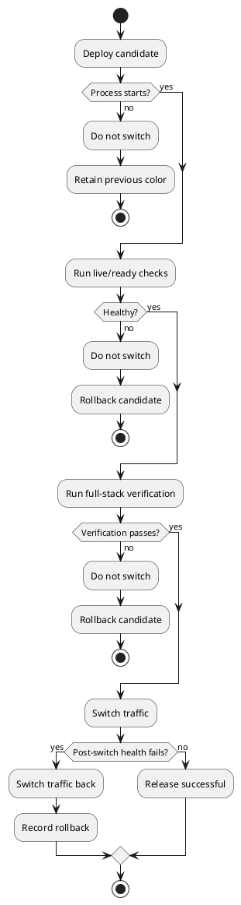

The existing smoke test remains useful, but becomes one component of the complete release gate rather than the complete acceptance mechanism.

---

### 37. Architecture Governance Loop

The final architecture governance loop is:

```text
Repository State
      ↓
Generated Architecture Status
      ↓
Architecture Manifest
      ↓
CI Fitness Tests
      ↓
Application Tests
      ↓
Deployment Verification
      ↓
Production Measurements
      ↓
Architecture Decisions
      ↓
Repository State
```

This prevents architectural documentation from becoming disconnected from implementation.

The most important governance rule is:

> **Executable repository state is authoritative wherever implementation status can be determined automatically.**

---

## Implementation

### 38. Implementation Principles

Implementation MUST follow these classifications:

| Classification        | Meaning                                                              |
| --------------------- | -------------------------------------------------------------------- |
| **CURRENT STATE**     | Already implemented and should be preserved                          |
| **EXTEND EXISTING**   | Existing implementation provides the foundation; modify or extend it |
| **INTRODUCE NEW**     | Capability does not currently exist and must be implemented          |
| **FUTURE / DEFERRED** | Explicitly outside the MVP unless evidence requires it               |

Contractors MUST NOT rebuild capabilities listed as CURRENT STATE.

### 39. Phase 0 — Baseline and Protection

**Goal:** Establish a reproducible baseline before architectural changes.

**EXTEND EXISTING**

* Run the current PHPUnit suite.
* Run PHPStan at the repository's configured level.
* Run the existing architecture-lint workflow.
* Run existing deployment smoke tests.
* Record the current worker, health, and deployment behavior.
* Record current package/blueprint counts from repository state.

**INTRODUCE NEW**

Create a machine-readable architecture baseline containing at minimum:

```text
repository_commit
php_version
core_packages
hub_packages
internal_spokes
external_spokes
bridge_packages
deploy_packages
architecture_decisions
test_suites
```

The baseline MUST be generated from repository state where possible rather than manually entered.

**Acceptance:**

* Baseline generation is reproducible from a clean checkout.
* No existing test suite is weakened to achieve baseline success.
* Existing deployment behavior remains functional.

---

### 40. Phase 1 — Enforce Ring Boundaries

**Goal:** Convert the six-ring architecture from documentation into executable architecture fitness rules.

**INTRODUCE NEW**

Implement an AST/import-based dependency checker.

The checker MUST inspect actual PHP namespaces/imports and enforce:

```text
Core
 └── Core / approved PSR / PHP extensions

Hub
 └── Hub + Core

Inner Spokes
 └── Inner Spokes + Hub + Core

External Spokes
 └── External Spokes + Hub + Core

Bridge
 └── Bridge + Hub + Core

App
 └── approved application dependencies

Infrastructure
 └── approved Core contracts + Hub ports
```

Forbidden examples include:

```text
Core → Hub
Core → Spoke
Core → Bridge
Core → App

Hub Domain → SQL
Hub Domain → DBAL implementation
Hub Domain → HTTP implementation
Hub Domain → vendor SDK
Hub Domain → controller

Hub → App
Hub → Spoke
Hub → Bridge
```

The repository root/application composition boundary is exempt from the inward-only restriction because it is intentionally omniscient.

The checker MUST report:

```text
source file
source ring
target ring
import
rule violated
```

### 41. Container Service-Locator Rule

**EXTEND EXISTING**

Add a static check for production service-locator usage.

The rule MUST specifically detect container receivers such as:

```php
$container->resolve(...)
Container::resolve(...)
```

and equivalent container-specific resolution patterns.

It MUST NOT generically ban:

```php
->resolve(...)
```

because legitimate existing methods include:

* `MiddlewareResolver::resolve()`;
* `ContractRegistry::resolve()`;
* `PerRequestHandler` resolution;
* `Vanguard` resolution.

**Acceptance:**

* Existing legitimate `resolve()` calls remain valid.
* Container service-location in production application code produces a CI failure.
* False positives are covered by regression tests.

---

### 42. Phase 2 — Request Context and Worker Isolation

**Goal:** Make persistent-worker state isolation an executable contract.

**INTRODUCE NEW**

Create an immutable `RequestContext` based on the existing `TenantContext` design.

Minimum fields:

```text
request_id
trace_id
tenant_id?
started_at
route_name?
```

The context MUST be request/Fiber scoped.

The existing container model already provides the mechanism:

```text
WeakMap<Fiber, ...>
        ↓
pulse()
        ↓
request/Fiber-scoped instances
```

Do not introduce static request state.

**EXTEND EXISTING**

Integrate the context with:

* request handling;
* event stamping;
* structured logging;
* error responses;
* middleware;
* downstream request propagation.

### 43. Worker Contamination Tests

**INTRODUCE NEW**

Add tests that deliberately perform multiple sequential and concurrent requests.

Tests MUST prove:

```text
Request A context ≠ Request B context
Tenant A ≠ Tenant B
Request A trace ≠ Request B trace
Mutable request state does not survive request completion
```

At minimum test:

1. sequential requests on one worker;
2. nested Fiber execution;
3. interleaved Fibers;
4. exception during request;
5. request termination;
6. repeated worker reuse.

**Acceptance:**

Zero cross-request contamination.

---

### 44. Phase 3 — Composition Root

**EXTEND EXISTING**

Move the composition currently performed by `public/index.php` into an `ApplicationFactory` or equivalent application-level composition module.

The factory MUST remain outside Core and Hub.

Target:

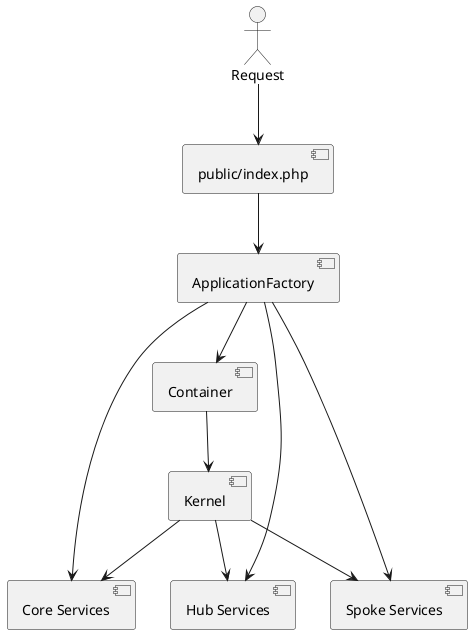

`public/index.php` SHOULD become a thin executable entry point.

It SHOULD primarily:

1. load the application factory;
2. build the application;
3. invoke the kernel;
4. allow the existing global error/shutdown handling to remain authoritative.

The factory MUST NOT become a service locator.

---

### 45. Phase 4 — Health and Release Verification

**EXTEND EXISTING**

Retain:

```text
/health
/_anvil/ping
cloud-init first-boot verification
deploy-smoke.sh
blue/green deployment
```

**INTRODUCE NEW**

Add:

```text
/health/live
/health/ready
/health/dependencies
```

Use the existing `/health` endpoint as a compatibility path during migration if necessary.

Extend `deploy-smoke.sh` or introduce a dedicated release-verification script rather than replacing existing deployment infrastructure.

The verification script MUST exercise:

```text
Caddy
  ↓
Tengine
  ↓
FrankenPHP
  ↓
Application
```

### 46. Phase 5 — Hub Vertical Slice

**INTRODUCE NEW**

Do not implement the entire Hub at once.

Select one representative business capability and implement it end-to-end:

```text
HTTP/API
   ↓
Application Command
   ↓
Application Service
   ↓
Domain Aggregate
   ↓
Repository Port
   ↓
Persistence Adapter
   ↓
Core DBAL
   ↓
MySQL/InnoDB
```

The vertical slice MUST demonstrate:

* domain entity/value object;
* aggregate boundary;
* domain invariant;
* repository port;
* MySQL adapter;
* application service;
* transaction boundary;
* error mapping;
* tests.

This slice becomes the template for future Hub capabilities.

---

### 47. Phase 6 — Transaction and Domain Event Infrastructure

**INTRODUCE NEW**

Extend the existing DBAL transaction primitive so the selected Hub application service can explicitly own its transaction.

The implementation MUST demonstrate:

```text
begin
 ↓
load aggregate
 ↓
execute business operation
 ↓
persist aggregate
 ↓
record required integration event
 ↓
commit
```

A rollback test MUST prove that neither state nor outbox records remain after a failed transaction.

---

### 48. Phase 7 — Outbox

**FUTURE / CONDITIONAL**

Implement the outbox only when the selected Hub capability has a real asynchronous integration requirement.

If required:

* persist the event in the same MySQL transaction as the aggregate state;
* publish asynchronously;
* use at-least-once delivery;
* use event IDs for idempotency;
* retry only transient failures;
* retain failed records for operational diagnosis.

Publisher processing SHOULD use MySQL row locking appropriate to the deployment's concurrency model, including `SKIP LOCKED` where supported and justified.

No distributed transaction between MySQL and the message broker is required.

---

### 49. Phase 8 — Error Governance

**EXTEND EXISTING**

Keep the existing `ErrorHandler` as the global error/shutdown mechanism.

Add executable enforcement around the five-class doctrine.

Required behavior:

```text
Exception
   ↓
Classification
   ↓
Operational policy
   ├── retry?
   ├── breaker?
   ├── isolate?
   └── HTTP response?
   ↓
Structured log
```

Add regression tests for all five classes.

Particular tests MUST prove that:

```text
Corrupt ≠ Transient
Panic ≠ Transient
Permanent ≠ retryable
```

---

### 50. Phase 9 — Architecture Status Generation

**INTRODUCE NEW**

Create a generated architecture-status artifact, for example:

```text
ARCHITECTURE_STATUS.md
```

The generator SHOULD inspect:

* `packages/core/*`;
* `packages/hub/*`;
* `packages/spoke/internal/*`;
* `packages/spoke/external/*`;
* bridge packages;
* deploy packages;
* tests;
* blueprint metadata;
* ADR metadata where machine-readable.

The generated status SHOULD report implementation facts such as:

```text
implemented
partial
planned
missing
```

README and INDEX documents MAY explain architectural intent, but MUST NOT be treated as authoritative implementation status where executable evidence exists.

This specifically addresses:

* blueprint-count drift;
* contradictory completion states;
* stale package documentation;
* ADR/repository mismatches.

---

## Milestones

### M0 — Protected Baseline

**Deliverables**

* reproducible test baseline;
* current architecture manifest;
* current deployment baseline;
* documented ADR/repository discrepancies.

**Exit criteria**

* existing tests pass;
* architecture lint passes;
* deployment smoke passes.

---

### M1 — Enforceable Architecture

**Deliverables**

* ring-boundary AST checker;
* container service-locator checker;
* CI integration;
* regression tests.

**Exit criteria**

* zero forbidden imports;
* zero production container service-locator hits;
* legitimate `resolve()` implementations remain accepted.

---

### M2 — Persistent Worker Safety

**Deliverables**

* `RequestContext`;
* request/trace propagation;
* Fiber isolation;
* contamination tests.

**Exit criteria**

* zero cross-request state leakage across sequential and concurrent tests.

---

### M3 — Composition Boundary

**Deliverables**

* `ApplicationFactory`;
* thin `public/index.php`;
* composition tests.

**Exit criteria**

* application boots through the factory;
* no service locator is introduced;
* Core remains unaware of application composition.

---

### M4 — Production Release Gate

**Deliverables**

* live/readiness/dependency health model;
* full-stack verification;
* blue/green candidate verification;
* rollback test.

**Exit criteria**

* failed candidate cannot receive production traffic;
* previous release can be restored without rebuilding;
* Caddy → Tengine → FrankenPHP → Application path is verified.

---

### M5 — Hub Vertical Slice

**Deliverables**

* one real Hub capability;
* domain model;
* repository port;
* MySQL adapter;
* application service;
* transaction boundary;
* integration tests.

**Exit criteria**

* domain contains no infrastructure dependencies;
* transaction rollback is verified;
* capability works through the production composition path.

---

### M6 — Event Infrastructure

**Deliverables**

* domain event model;
* integration event contract;
* outbox only where required;
* idempotent consumer strategy.

**Exit criteria**

* required state/event durability is atomic;
* duplicate delivery is safely handled;
* retry behavior follows the five-class error taxonomy.

---

### M7 — Operational Verification

**Deliverables**

* production measurement dashboard;
* worker-recycle measurements;
* health recovery measurements;
* deployment/rollback measurements;
* generated architecture status.

**Exit criteria**

* architecture status is reproducible from repository state;
* production behavior is measurable;
* no known critical architecture fitness violations remain.

---

## Gathering Results

### 51. Architecture Fitness

The architecture is considered compliant when:

```text
Forbidden ring imports = 0
Production container service-locator hits = 0
Domain → infrastructure imports = 0
Undocumented architectural exceptions = 0
```

Exceptions MUST be explicit, reviewed, and encoded in the architecture rules rather than silently ignored.

---

### 52. Persistent Worker Safety

Measure:

```text
cross_request_state_leaks
fiber_isolation_failures
request_context_reuse_errors
unclean_shutdowns
worker_restarts
worker_recycles
```

The required result for contamination tests is:

```text
0 failures
0 leaked request contexts
0 leaked tenant contexts
```

---

### 53. Request Correlation

Every application request SHOULD be traceable through:

```text
Caddy
 ↓
Tengine
 ↓
FrankenPHP
 ↓
Application
 ↓
Error/log/response
```

At minimum, operators must be able to correlate:

```text
request_id
trace_id
HTTP status
duration
error_class
```

No arbitrary distributed-tracing vendor is required for the MVP.

---

### 54. Error Taxonomy

Production measurements SHOULD include:

```text
errors_total{error_class}
retries_total{error_class}
breaker_events_total{error_class}
panic_events_total
corrupt_events_total
```

The key acceptance condition is semantic correctness:

```text
Transient failures are retryable.
Permanent failures are not retried.
Corrupt failures are not retried.
Panic failures trigger isolation/shutdown behavior.
```

---

### 55. Deployment Verification

Every release SHOULD produce a verification record containing:

```text
artifact/version
candidate color
verification timestamp
live result
ready result
representative request result
architecture fitness result
request correlation result
error-safety result
traffic-switch result
post-switch result
rollback result, if applicable
```

A release is accepted only after all blocking gates pass.

---

### 56. SLO Measurement Contract

No arbitrary latency target SHOULD be hard-coded before production baseline data exists.

The system MUST first measure:

```text
availability
request count
P50 latency
P95 latency
P99 latency
5xx rate
worker restart rate
worker recycle rate
health recovery time
deployment verification duration
rollback duration
outbox backlog, when applicable
```

After sufficient baseline data exists, service-level objectives MAY be established using observed workload characteristics and business requirements.

The architecture specification therefore defines the **measurement contract first**, rather than inventing unsupported performance thresholds.

---

### 57. Contractor Acceptance Matrix

| Category      | Acceptance condition                                                  |
| ------------- | --------------------------------------------------------------------- |
| Architecture  | Ring violations are detected by CI                                    |
| Composition   | No production service locator                                         |
| Runtime       | Request state is Fiber/request isolated                               |
| Domain        | Hub domain is infrastructure-independent                              |
| Persistence   | Repository ports isolate DB implementation                            |
| Transactions  | Application service owns unit of work                                 |
| Events        | Runtime/domain/integration semantics remain distinct                  |
| Errors        | Five-class doctrine is executable                                     |
| Observability | Request/trace correlation is available                                |
| Health        | Liveness/readiness/dependencies are separated                         |
| Deployment    | Candidate is verified before traffic switch                           |
| Rollback      | Previous release restores without rebuild                             |
| Governance    | Architecture status is generated from executable state                |
| Testing       | Architecture, isolation, lifecycle, and deployment tests are blocking |

---

### 58. Existing Capabilities That MUST NOT Be Rebuilt

The following are established foundations and should be extended rather than replaced:

* configuration immutability;
* `TenantContext`;
* Hub/config repository-port pattern;
* persistent-worker-safe `ErrorHandler`;
* Kernel lifecycle/state machine;
* Router freeze behavior;
* Middleware pipeline freeze behavior;
* existing configuration freeze tests;
* existing worker recycling;
* graceful shutdown;
* Caddy/Tengine/FrankenPHP topology;
* existing blue/green deployment;
* existing deployment smoke checks.

The implementation plan closes gaps around these capabilities rather than creating parallel implementations.

---

### 59. Explicitly Deferred / WON'T

The MVP does NOT include:

1. redesigning the Anvil Caddy/Tengine/FrankenPHP topology;
2. introducing microservices merely to enforce architectural boundaries;
3. replacing the existing ErrorHandler;
4. replacing the existing DBAL abstraction;
5. introducing PostgreSQL as the primary datastore;
6. introducing an outbox where no asynchronous integration requires one;
7. arbitrary latency SLOs before baseline measurement;
8. using code coverage percentage as the primary architecture-quality metric;
9. treating unit tests alone as proof of ring compliance;
10. manually maintaining README implementation status as authoritative;
11. using runtime events as business orchestration;
12. allowing domain code to directly call vendor SDKs or infrastructure;
13. adding time-based worker recycling without operational evidence.

---

### 60. Final Completion Criteria

The architecture work is considered complete for the MVP when all MUST requirements are satisfied and verified by automation.

The final gate is:

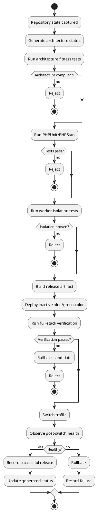

The central architectural completion principle is:

> **Architecture is complete when its important invariants are executable, continuously verified, and consistent with the repository's actual implementation state — not merely when the documentation says they are complete.**

---

*End of SPEC-001.*
