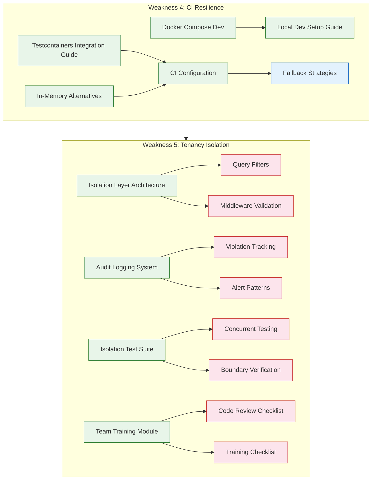

# Hub Tier - Weakness 4 & 5 Implementation Plan

**Objective:** Address CI Resilience (W4) and Tenancy Isolation (W5) for DGLab Hub Tier.

**Reference:** [`SOLUTIONS_TO_WEAKNESSES.md`](../SOLUTIONS_TO_WEAKNESSES.md) (lines 191-243)

---

## Architecture Overview



---

## Deliverable Breakdown

### Part 1: CI Resilience (Weakness 4) — `/docs/ci/` directory

#### 1.1 Testcontainers Integration Guide
**File:** [`docs/ci/testcontainers-integration.md`](../docs/ci/testcontainers-integration.md)

**Content:**
- **Overview** of Testcontainers pattern for PHP (PHPUnit integration via `testcontainers/testcontainers-php`)
- **Redis Container Setup:** Ephemeral Redis for cache tests with code examples showing `GenericContainer` with `redis:7-alpine`
- **Elasticsearch Container Setup:** Ephemeral ES for search tests with `GenericContainer` using `elasticsearch:8.x` + SSL config
- **MySQL Container Setup:** Ephemeral MySQL/MariaDB for integration tests with database migrations
- **Container Lifecycle Management:** `ContainerIsolationPolicy` for test-suite-level reuse, cleanup strategies
- **PHP Integration Examples:**
  ```php
  // Example pattern
  $redis = new GenericContainer('redis:7-alpine');
  $redis->withExposedPorts(6379);
  $redis->start();
  $this->assertNotNull($redis->getHost());
  ```
- **CI Pipeline Integration:** GitHub Actions example with Docker socket mount, parallel container provisioning
- **Resource Limits:** Setting memory/CPU constraints on containers in CI

#### 1.2 In-Memory Alternatives Documentation
**File:** [`docs/ci/in-memory-alternatives.md`](../docs/ci/in-memory-alternatives.md)

**Content:**
- **In-Memory Cache Driver:** PHP class implementing `CacheInterface` using `\ArrayObject` for `get()`/`set()`/`delete()`/`clear()` with TTL simulation
- **Fake Queue Implementation:** PHP class implementing `QueueInterface` with in-memory `SplQueue` for `push()`/`pop()`/`ack()`/`nack()` with retry counter simulation
- **In-Memory Database:** SQLite `:memory:` connection pattern (already used in existing test suite — reference [`Legacy.old/tests/IntegrationTestCase.php`](../Legacy.old/tests/IntegrationTestCase.php)) with migration runner
- **Test Double Patterns:**
  - Spy cache (record all keys accessed)
  - Mock queue (inspect published messages)
  - Stub Elasticsearch (return pre-configured results)
- **When to use each:** Decision matrix comparing Testcontainers vs. In-Memory vs. Mock
- **Code examples** for each test double with full class implementations

#### 1.3 Docker Compose Dev Environment
**File:** [`infrastructure/docker-compose.dev.yml`](../infrastructure/docker-compose.dev.yml)

**Services:**
- **Redis** (redis:7-alpine) — port 6379, with health check, persistence disabled for dev
- **Elasticsearch** (elasticsearch:8.12.0) — port 9200/9300, single-node mode, security disabled, with heap limits
- **MySQL/MariaDB** (mariadb:11) — port 3306, with init scripts, named volume for data persistence
- **PHP App Container** (builts from local Dockerfile) — with volume mounts for hot-reload, Xdebug enabled

**Features:**
- Named volumes for data persistence
- Health check dependencies (`depends_on` with condition)
- `.env.dev` file for configuration overrides
- Extendable from production `docker-compose.yml`

#### 1.4 Local Development Setup Guide
**File:** [`docs/ci/local-development-setup.md`](../docs/ci/local-development-setup.md)

**Content:**
- **Prerequisites:** Docker Desktop / Docker Engine, PHP 8.3+, Composer
- **Quick Start:** 5-step setup process (clone → `docker-compose up` → composer install → migrate → test)
- **Environment Configuration:** `.env` file template with per-service connection variables
- **Running Tests:** Commands for test suites with and without external services
- **Troubleshooting:** Port conflicts, container startup failures, volume permissions

#### 1.5 CI Configuration & Fallback Strategies
**File:** [`docs/ci/ci-configuration.md`](../docs/ci/ci-configuration.md)

**Content:**
- **CI Pipeline Stages:** Lint → Static Analysis → Unit Tests (no deps) → Integration Tests (with deps) → Browser Tests
- **Conditional Test Execution:**
  ```yaml
  # Pseudocode for CI pipeline
  - name: Integration tests
    if: env.SKIP_INTEGRATION != 'true'
    run: php vendor/bin/phpunit --testsuite=integration
  ```
- **Graceful Skip Mechanisms:**
  - `@requires` PHPUnit annotation for service-dependent tests
  - Environment variable gating (`CI_REDIS_HOST`, `CI_ELASTICSEARCH_HOST`)
  - Skip-trait pattern: `RedisAvailable` trait with `markTestSkipped()` if ping fails
- **Fallback Chain:** Try external service → Try Testcontainers → Skip test
- **GitHub Actions / GitLab CI / Jenkins** configuration examples

---

### Part 2: Tenancy Isolation (Weakness 5) — `/docs/tenancy/` directory

#### 2.1 Tenancy Isolation Architecture
**File:** [`docs/tenancy/isolation-layer.md`](../docs/tenancy/isolation-layer.md)

**Content:**
- **Architecture Overview:**
  ```mermaid
  graph TD
      R[HTTP Request] --> M[Tenant Context Middleware]
      M --> R1[Resolve Tenant]
      R1 --> V[Validate Context Propagation]
      V --> C[Controller / Handler]
      C --> S[Service Layer]
      S --> Q[Query Filter Layer]
      Q --> DB[(Database)]
      Q -.-> A[Audit Logger]
      A -.-> AL[(Audit Logs)]
  ```
- **Query Filter Interceptors:**
  - Global scope pattern: Automatic `WHERE tenant_id = ?` on all tenant-scoped models
  - Query macro pattern: `Model::withoutTenantScope()` for admin operations
  - Implementation using existing [`TenancyService`](../../Legacy.old/app/Services/Tenancy/TenancyService.php) (lines 19-27) as context provider
- **Context Validators:**
  - `TenantContextRequiredException` when tenant is missing
  - `TenantMismatchException` when cross-tenant access detected
  - Propagation validation at middleware boundaries
- **Middleware for Tenant Context Propagation:**
  - `TenantContextMiddleware`: Extracts, validates, and propagates tenant context
  - `TenantScopeMiddleware`: Applies query scopes to all DB queries
  - Chain position: Before auth, after routing
- **Database Query Filtering Patterns:**
  - Global scopes on base `Model` class
  - Query builder macros for `whereTenant()`, `allTenants()`
  - Subquery isolation for joins and relationships

#### 2.2 Tenant Auditing System
**File:** [`docs/tenancy/tenant-audit-logging.md`](../docs/tenancy/tenant-audit-logging.md)

**Content:**
- **Audit Event Types:**
  - `TENANT_CONTEXT_MISSING` — No tenant context on tenant-scoped operation
  - `TENANT_CROSS_ACCESS_DETECTED` — User accessed data belonging to another tenant
  - `TENANT_ISOLATION_VIOLATION` — Query returned data from wrong tenant
  - `TENANT_ADMIN_OVERRIDE` — Admin bypassed tenant scope for maintenance
- **Audit Log Schema:**
  ```sql
  CREATE TABLE tenant_audit_logs (
    id BIGINT AUTO_INCREMENT,
    tenant_id INT NULL,
    user_id INT NULL,
    event_type VARCHAR(100) NOT NULL,
    resource_type VARCHAR(100),
    resource_id VARCHAR(255),
    query_scope VARCHAR(50),
    request_path VARCHAR(500),
    request_method VARCHAR(10),
    ip_address VARCHAR(45),
    user_agent TEXT,
    violation_severity ENUM('info','warning','critical') DEFAULT 'warning',
    context JSON,
    created_at TIMESTAMP DEFAULT CURRENT_TIMESTAMP,
    INDEX idx_tenant_event (tenant_id, event_type),
    INDEX idx_created_at (created_at),
    INDEX idx_severity (violation_severity)
  );
  ```
- **Alert Patterns for Isolation Violations:**
  - **Critical:** Cross-tenant data leak detected → PagerDuty/OpsGenie alert
  - **Warning:** Missing tenant context → Slack notification
  - **Info:** Admin override → Audit trail only
- **Log Retention & Privacy:** 90-day hot storage, 1-year cold storage, GDPR-compliant purging

#### 2.3 Isolation Test Suite
**File:** [`docs/tenancy/isolation-test-suite.md`](../docs/tenancy/isolation-test-suite.md)

**Content:**
- **Test Patterns:**
  - **Cross-Tenant ID Enumeration:** Attempt to fetch resources across tenant boundaries, verify 403/404
  - **Concurrent Tenant Operations:** Simulate 10+ concurrent requests across different tenants, verify no data mixing (reference [`Legacy.old/tests/Unit/Core/IsolationTest.php`](../../Legacy.old/tests/Unit/Core/IsolationTest.php))
  - **Tenant Context Propagation:** Verify tenant ID flows through middleware → controller → service → query
  - **Missing Tenant Context:** Operations without tenant context should fail gracefully
  - **Bulk Operations:** Verify tenant scope on batch updates, inserts, deletes
- **Test Scenarios for Boundary Verification:**
  - Tenant A creates resource, Tenant B attempts to read/edit/delete → all fail
  - Admin operating across tenants via explicit override flag
  - Nested relationships crossing tenant boundaries
  - Cache key isolation between tenants
- **PHPUnit Group Annotation:** `@group tenancy-isolation` for targeted test runs
- **Code Example Structure:**
  ```php
  /**
   * @test
   * @group tenancy-isolation
   */
  public function tenant_a_cannot_access_tenant_b_data(): void
  {
      $tenantA = Tenant::factory()->create();
      $tenantB = Tenant::factory()->create();
      
      $resource = Resource::factory()->forTenant($tenantA)->create();
      
      $this->actingAsTenant($tenantB);
      
      $response = $this->get("/api/resources/{$resource->id}");
      $response->assertForbidden();
  }
  ```

#### 2.4 Team Training Module
**File:** [`docs/tenancy/team-training.md`](../docs/tenancy/team-training.md)

**Content:**
- **Training Checklist (2-hour session):**
  1. Architecture overview: Why tenancy matters (15 min)
  2. Tenant identification: How `TenancyService` resolves tenants (15 min)
  3. Query scoping: Automatic vs. manual tenant filtering (20 min)
  4. Audit system: How violations are tracked and alerted (15 min)
  5. Common pitfalls: Missing scopes, hardcoded IDs, shared caches (25 min)
  6. Hands-on: Fix a tenancy violation in sample code (30 min)
- **Code Review Checklist for Tenancy:**
  - [ ] All new models with `tenant_id` column extend `TenantScopedModel` or equivalent
  - [ ] All queries against tenant-scoped tables include `WHERE tenant_id = ?`
  - [ ] No direct SQL UPDATE/DELETE without tenant scope validation
  - [ ] Cache keys include `tenant_id` prefix
  - [ ] Queue jobs propagate tenant context
  - [ ] Event listeners check tenant context before processing
  - [ ] Admin overrides use explicit bypass flag (never implicit)
  - [ ] API endpoints validate tenant membership before returning data
- **Anti-Patterns Catalog:**
  - ❌ Hardcoded `tenant_id = 1` in queries
  - ❌ `DB::statement('DELETE FROM ...')` without tenant scope
  - ❌ Cache keys like `user_profile_42` instead of `tenant_7_user_42`
  - ❌ Loading relationships without tenant context (eager loading leak)
- **Violation Response Protocol:** Steps when a violation is discovered in production

---

## File Inventory

| # | File Path | Purpose | Est. Size |
|---|-----------|---------|-----------|
| 1 | `docs/ci/testcontainers-integration.md` | Testcontainers guide for PHP | ~300 lines |
| 2 | `docs/ci/in-memory-alternatives.md` | In-memory test doubles with code | ~350 lines |
| 3 | `infrastructure/docker-compose.dev.yml` | Docker Compose for dev | ~80 lines |
| 4 | `docs/ci/local-development-setup.md` | Local dev quick-start guide | ~150 lines |
| 5 | `docs/ci/ci-configuration.md` | CI pipeline with fallbacks | ~250 lines |
| 6 | `docs/tenancy/isolation-layer.md` | Isolation architecture with diagrams | ~350 lines |
| 7 | `docs/tenancy/tenant-audit-logging.md` | Audit logging system | ~250 lines |
| 8 | `docs/tenancy/isolation-test-suite.md` | Isolation test patterns | ~250 lines |
| 9 | `docs/tenancy/team-training.md` | Training module | ~200 lines |

---

## Execution Order

The work is divided into 9 independent files. They should be created in order:

1. **Infrastructure first** — `docker-compose.dev.yml` (foundational for local dev)
2. **CI docs** — `testcontainers-integration.md`, `in-memory-alternatives.md`, `ci-configuration.md`, `local-development-setup.md`
3. **Tenancy docs** — `isolation-layer.md`, `tenant-audit-logging.md`, `isolation-test-suite.md`, `team-training.md`

This order ensures downstream docs (CI config, local setup) can reference upstream files (Docker Compose, testcontainers).

---

## Success Metrics Verification

| Metric | Verification | 
|--------|-------------|
| CI passes regardless of external service availability | Documented fallback chain & conditional test skipping |
| Zero tenant isolation violations detected in audit | Audit schema + alert patterns cover all violation types |
| Dev environment setup < 15 minutes | Docker Compose + 5-step quick start guide |
| 100% of DB queries filtered by tenant context | Query filter interceptors + global scopes documented |
